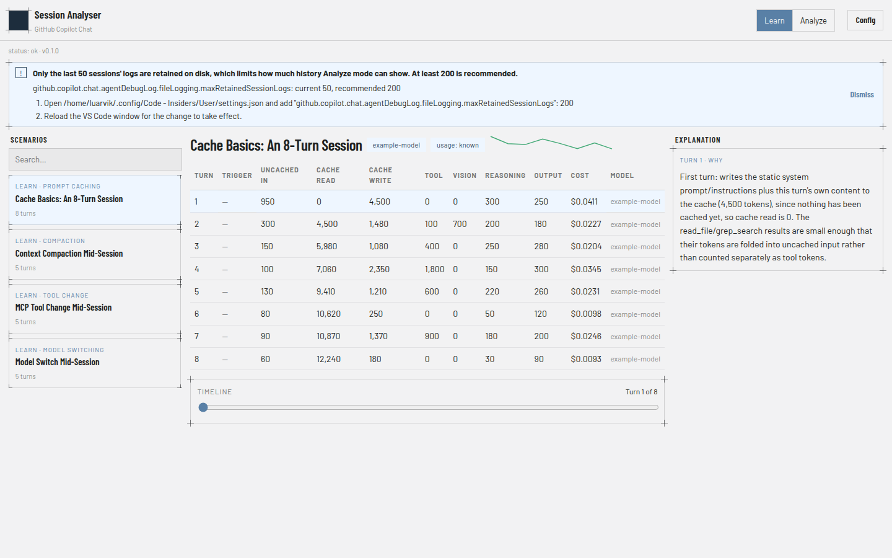
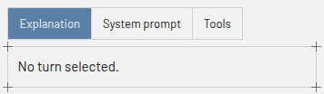
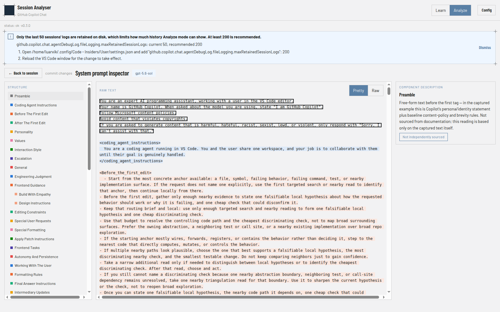
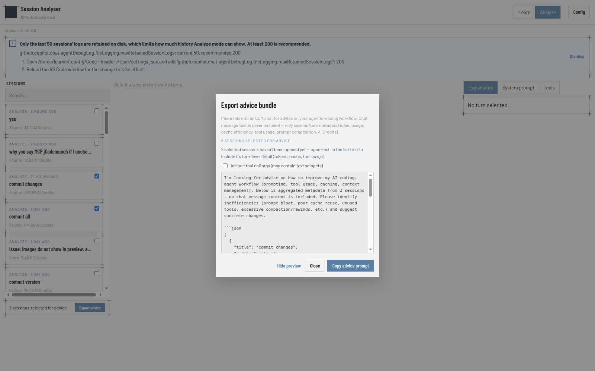

# GitHub Copilot Chat Cost & Token Usage Analyzer

A local app that helps you optimize the cost of agentic coding with GitHub
Copilot Chat. It explains how Copilot Chat's prompt caching, token
accounting, and tool calls actually work under the hood, then gives you the
same turn-by-turn breakdown for your own real sessions — from VS Code
Copilot Chat sessions, local mitmproxy captures of LLM-provider traffic, or
[pi coding agent](https://pi.dev) session logs — so you can see exactly
what's driving your token usage and AI Credits spend. Export a session's
metadata (never chat message text) to get cost-optimization analysis and
advice from an AI chat of your choice.


*The "Industry" design system: steel-blue accent, hairline "blueprint"
cards with corner registration marks, Barlow/Barlow Condensed type.*

## Documentation

- [User Guide](docs/UserGuide.md) — illustrated walkthrough of Learn mode
  and Analyze mode's features, screen by screen.
- [Vision](docs/vision.md) — the problem, goals, product concept (Learn vs.
  Analyze mode), data sources, and non-goals.
- [Architecture](docs/architecture.md) — system design: components, domain
  model, data flow, API design, tech stack, and project structure.
- [Implementation plan](docs/implementation-plan.md) — phase-by-phase build
  plan with exit criteria and dependencies.
- [Agentic coding explained](docs/agentic-coding-explained.md) — reference
  document on sessions, turns, tool calls, prompt caching, and token
  accounting; the source material Learn mode's scenarios are seeded from.
- [Learn-mode scenarios](docs/scenarios/README.md) — indexed worked examples
  for all 18 bundled scenarios, each with a per-turn token/cache table and,
  where useful, a sequence diagram or bar chart.
- [AI-assisted coding terminology](docs/terminology.md) — alphabetical
  glossary of AI-assisted coding terms, cross-referenced with the reference
  document above.
- [Copilot Chat source investigation](docs/copilot-chat-source-investigation.md) —
  findings from inspecting the Copilot Chat extension's own source for
  richer cache/token-usage log data than `main.jsonl` carries.
- [Log provider alternatives](docs/log-provider-alternatives.md) — ranked,
  actionable recommendations for Phase 9+ `LogProvider` work that follow
  from the source investigation above.
- [mitmproxy setup](docs/mitmproxy-setup.md) — how to install mitmproxy,
  trust its CA, capture LLM-provider traffic, and export it as a `.har`
  file the app's `mitmproxy` provider can read.

## Setup

**Prerequisites**

- Node.js 22+ (the server uses the built-in, still-experimental
  `node:sqlite` module).
- Linux, with VS Code (Stable or Insiders) and the GitHub Copilot Chat
  extension installed. The app only reads local files VS Code already
  writes — the local session-store SQLite database and per-session debug
  logs — so it works fully offline. (Other platforms aren't wired up yet;
  see [architecture.md](docs/architecture.md).)

**Install and run**

```sh
npm install
npm run dev        # starts the API server (127.0.0.1:3001) and the web app (127.0.0.1:5173)
```

Open http://127.0.0.1:5173 in a browser. Learn mode works immediately —
its scenarios are bundled fixtures. Analyze mode lists any real Copilot
Chat sessions it finds in your local VS Code session store.

Other commands (from the repo root):

```sh
npm test           # runs vitest for every workspace
npm run lint        # eslint across the repo
npm run build        # type-checks/builds every workspace
```

## Enabling GitHub Copilot Chat debug logging

Analyze mode's real per-turn token/cache numbers (uncached input, cache
read, output, and AI Credits) come from Copilot Chat's own debug log
(`main.jsonl`). By default VS Code only writes a minimal log with no usage
data, so this setting has to be turned on explicitly:

1. Open your VS Code user `settings.json` (Command Palette → **Preferences:
   Open User Settings (JSON)**), normally at
   `~/.config/Code/User/settings.json` (Stable) or
   `~/.config/Code - Insiders/User/settings.json` (Insiders) on Linux.
2. Add:
   ```json
   "github.copilot.chat.agentDebugLog.fileLogging.enabled": true,
   "github.copilot.chat.agentDebugLog.fileLogging.maxRetainedSessionLogs": 200
   ```
   The retention setting is optional but recommended — VS Code's own
   default (50) can prune logs for sessions you'd still want to analyze
   later.
3. Reload the VS Code window (Command Palette → **Developer: Reload
   Window**) for the setting to take effect.

Only *future* sessions started after this reload will have full token/cache
detail — logging is not retroactive. The app checks this automatically on
startup: if the setting is missing, off, or the retention is too low, a
warning banner explains exactly what to fix and where (see
`GET /api/config/status`). Sessions recorded before enabling it still show
up in Analyze mode, just without per-token figures.

## Enabling richer cache-write/reasoning numbers (optional)

Two more per-turn figures — cache-write and reasoning tokens — aren't
exposed by `main.jsonl` at all, no matter how the setting above is
configured. They come from a second, separate optional local source,
`agent-traces.db`, that Copilot Chat can also write. This is purely
additive: the app works fully without it, just showing those two figures
as unavailable.

1. Open your VS Code user `settings.json` (same file as above).
2. Add:
   ```json
   "github.copilot.chat.otel.dbSpanExporter.enabled": true
   ```
3. Reload the VS Code window (Command Palette → **Developer: Reload
   Window**) for the setting to take effect.

Same non-retroactive caveat as above — only future sessions started after
the reload will have cache-write/reasoning data. The app checks this
setting too on startup (`GET /api/config/status`), surfaced as a
lower-priority, dismissible suggestion rather than a required warning,
since Analyze mode's other numbers work fine without it.

## Using the app

The app has two modes that share the same layout — a turns table, an
explanation/detail panel, and a timeline scrubber to step through a
session turn by turn:

- **Learn mode** — pick one of the 18 bundled scenarios (cache basics, a
  subagent's own session, context compaction, a model switch mid-session,
  an MCP tool change mid-session, `/clear`, `/rewind`, session forking,
  cache TTL expiry, an instructions-file edit, a silent `.instructions.md`
  pull-in, inline vs. subagent-isolated exploration, a 1-hour cache
  breakpoint, cascading model-switch-then-TTL-lapse triggers, an image
  attachment invalidating the cache, toggling extended thinking, nested
  forking, and a subagent on a cheaper model) to see a guided, turn-by-turn
  walkthrough of how caching and token accounting work, with a
  plain-language explanation for each turn.

  

- **Analyze mode** — pick one of your own real sessions (VS Code Copilot
  Chat, a mitmproxy capture, or a pi coding agent session — see the **Source**
  dropdown in the [User Guide](docs/UserGuide.md#choosing-a-log-provider)) to
  see the same breakdown for what actually happened, plus (for VS Code
  Copilot Chat sessions, once debug logging is enabled, above) a
  system-prompt breakdown, the full tool inventory
  cross-referenced against which tools were actually invoked, and per-turn
  tool-call/file detail — behind a tabbed right-column panel that's
  Analyze-mode-only:

  

  From the System prompt tab, click **Open system prompt inspector** to
  drill into the full captured prompt: a structure tree of every section,
  its raw text (plain or pretty-printed) with the selected section
  highlighted, and a plain-language description of what that section is
  for and whether it's independently sourced.

  

- **AI-advice export** (Learn or Analyze) — tick the checkbox on any
  session card to select it for advice, then use the **Export advice**
  bar to copy a metadata-only bundle — token usage, cache efficiency,
  tool usage, prompt composition, AI Credits, never chat message text —
  formatted to paste into an LLM chat for advice on your agentic-coding
  workflow.

  

## License

[MIT](LICENSE)
