# User Guide

A walkthrough of the Session Analyser's two modes — **Learn** (guided,
bundled example sessions) and **Analyze** (your own real GitHub Copilot
Chat sessions) — with screenshots of every major feature. For install
steps, see the [README](../README.md); for the app's design/architecture,
see [architecture.md](architecture.md).

## Getting started

Run `npm install && npm run dev` from the repo root, then open
http://127.0.0.1:5173. Learn mode works immediately. Analyze mode lists
whatever real Copilot Chat sessions it finds in your local VS Code session
store — see [Analyze mode](#analyze-mode) below for what to expect there,
including turning on debug logging for full per-turn numbers.

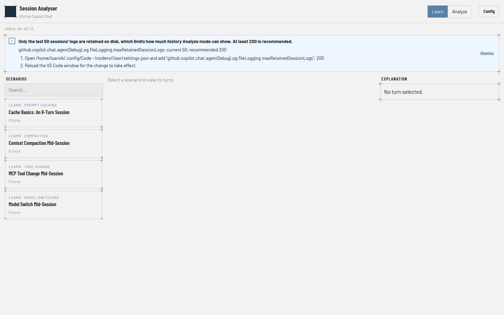

## The shared layout

Both modes use the same three-column layout:

- **Header** (top) — brand mark, the **Learn / Analyze** mode switch, and
  a **Config** button.
- **Left column** — a searchable list of scenarios (Learn) or sessions
  (Analyze). Click a card to load it.
- **Center column** — the selected session's **turns table** (one row per
  turn) with a **timeline scrubber** underneath it.
- **Right column** — an **Explanation** panel for the selected turn; in
  Analyze mode this becomes a three-tab panel (Explanation / System
  prompt / Tools).

Clicking a table row, dragging the scrubber, or pressing **Enter/Space**
on a focused row or card all drive the same "selected turn" state, so the
table, scrubber, and explanation panel always stay in sync.

## Learn mode

Learn mode ships with four bundled example sessions, each illustrating one
concept from [agentic-coding-explained.md](agentic-coding-explained.md):
prompt caching, context compaction, an MCP tool change mid-session, and a
model switch mid-session. No setup is required — this data is static and
doesn't depend on anything on your machine.

### Picking a scenario and reading the turns table

Click a card in the left column to load it. Each row in the turns table is
one turn, with the token/AI Credit breakdown for that turn:

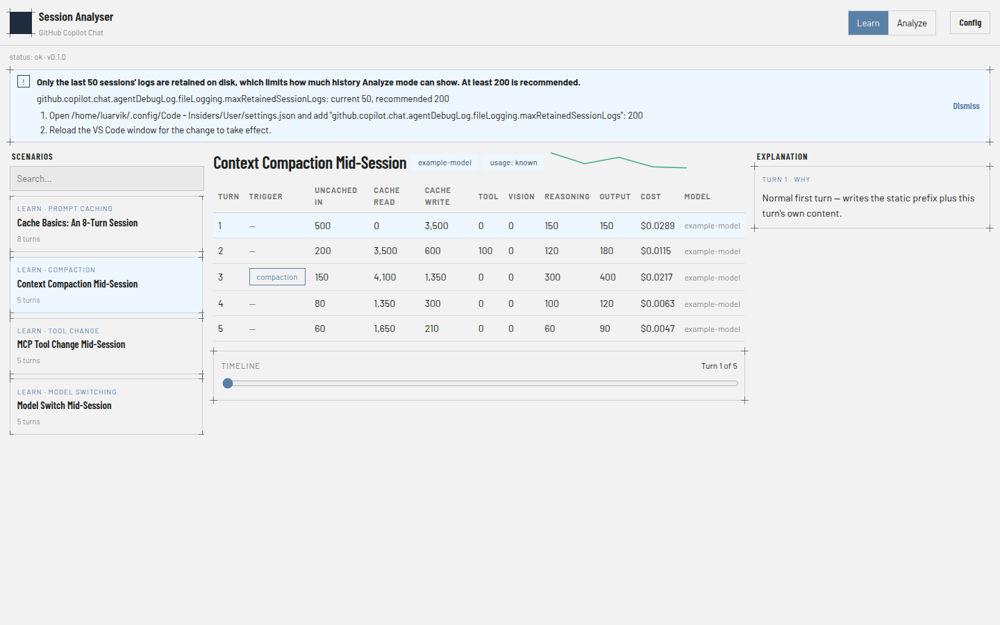

The columns are **Turn, Trigger, Uncached in, Cache read, Cache write,
Tool, Vision, Reasoning, Output, AI Credits, Model**. An em dash (**—**) in any
numeric cell means that figure is genuinely unknown for that turn — the
app never shows a fabricated `0` in its place. The small line chart next
to the session title (when visible) is an AI-Credits-per-turn sparkline; it
only appears when every turn in the session has a known AI Credits value.

The **Trigger** column flags turns where something out of the ordinary
happened mid-session — a `compaction` event (shown above), a `tool
change`, a `model switch`, `/clear`, `/rewind`, cache expiry, or a
session fork. Most turns have no trigger and show a muted em dash instead.

### Stepping through turns

Click any row, or drag the **Timeline** scrubber at the bottom of the
table, to select a turn. Both stay in sync — dragging the scrubber
highlights the matching row, and clicking a row moves the scrubber:

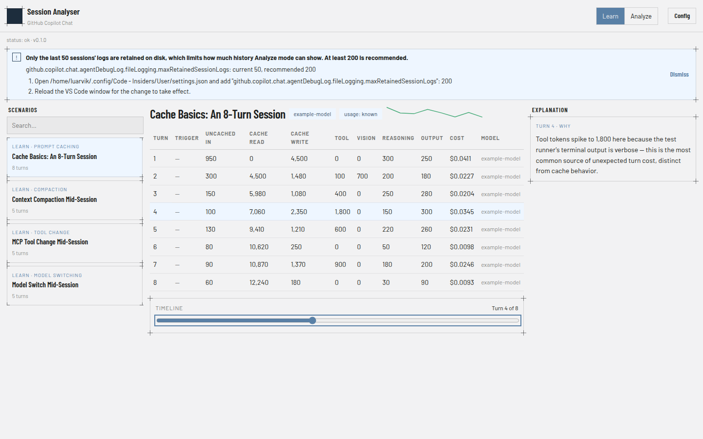

The right-column **Explanation** panel always shows a plain-language
explanation for the currently selected turn — what happened, and why,
based on that turn's real cache/token numbers.

### Searching the scenario list

The left column has a search box that filters by title as you type:

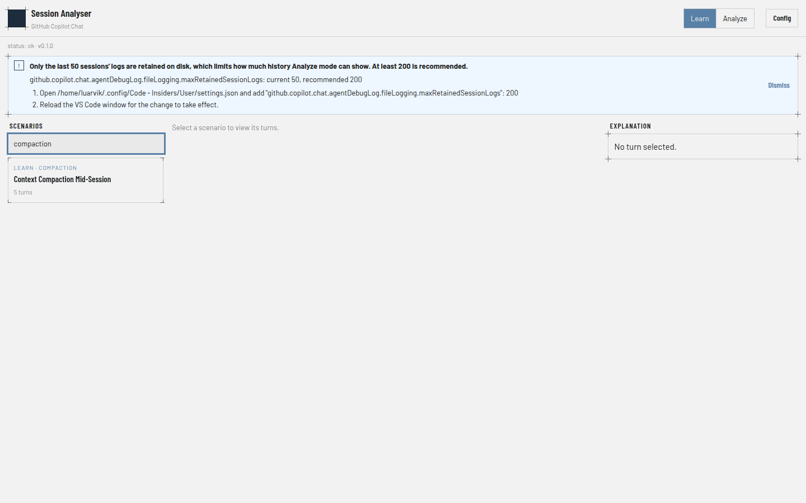

If nothing matches, the list shows a plain "No matches." message instead
of an empty box.

## Analyze mode

Switch to Analyze mode via the header's mode switch. This lists real
sessions read directly from your local VS Code Copilot Chat session
store — nothing is sent anywhere, the app only reads local files.

### Enabling full per-turn numbers

By default, VS Code's Copilot Chat debug log doesn't record token/cache
usage, so Analyze mode's numbers are limited until you turn on a setting.
The app checks this automatically and shows a banner explaining exactly
what's missing and how to fix it:

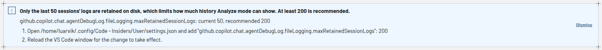

Click **Dismiss** to hide it for the session; the header's **Config**
button reopens it later. See the
[README's "Enabling GitHub Copilot Chat debug logging"](../README.md#enabling-github-copilot-chat-debug-logging)
section for the exact settings.json steps. Once every check passes, the
Config button becomes a static confirmation instead of something to click:

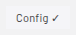

Sessions recorded *before* you enable logging still show up in Analyze
mode — they just show em dashes for the numeric columns, the same as any
other genuinely-unknown value.

Cache-write and reasoning tokens need a *separate*, optional setting on
top of the one above — see the README's
["Enabling richer cache-write/reasoning numbers"](../README.md#enabling-richer-cache-writereasoning-numbers-optional)
section for the steps. Skipping it doesn't limit anything else — every
other Analyze mode figure works the same either way — it just leaves
those two columns showing em dashes.

### The turns table in Analyze mode

Real sessions render with the identical 11-column table Learn mode
uses — this is a real (numbers-only) example, with em dashes for the
usage figures this particular log didn't capture:

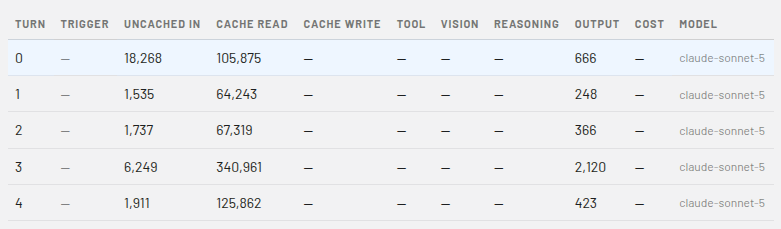

### The three-tab right panel

Analyze mode's right column adds two tabs beyond Explanation, since real
sessions carry more detail than Learn's curated examples:

**Explanation** — same plain-language summary as Learn mode, plus a "Tool
calls this turn" section listing which tools the assistant invoked during
that specific turn:

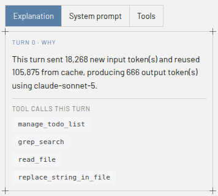

**System prompt** — a breakdown of what made up the system prompt for
this session (base instructions, `CLAUDE.md`/repo instructions, loaded
skills, tool definitions, …), each as a labeled bar sized to its share of
the total:

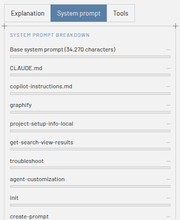

**Tools** — every tool that was loaded for the session, cross-referenced
against whether it was actually invoked and how many turns used it:

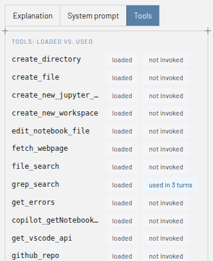

If a session has no captured system-prompt or tool-inventory data (for
example, it predates enabling debug logging), each tab shows a short
explanation instead of an empty table.

### Searching sessions and empty states

The left column's search box works the same way in Analyze mode — filter
by title as you type. If the app can't find *any* bundled Learn scenarios
or *any* Copilot Chat sessions at all, the whole three-column layout is
replaced with a single centered message explaining what's missing:

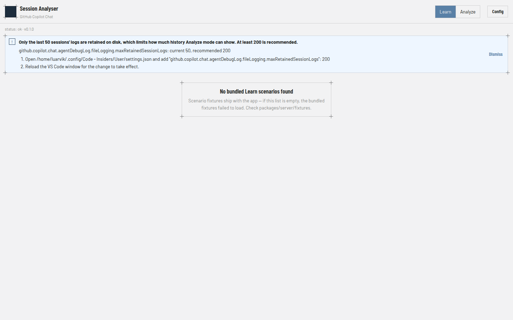

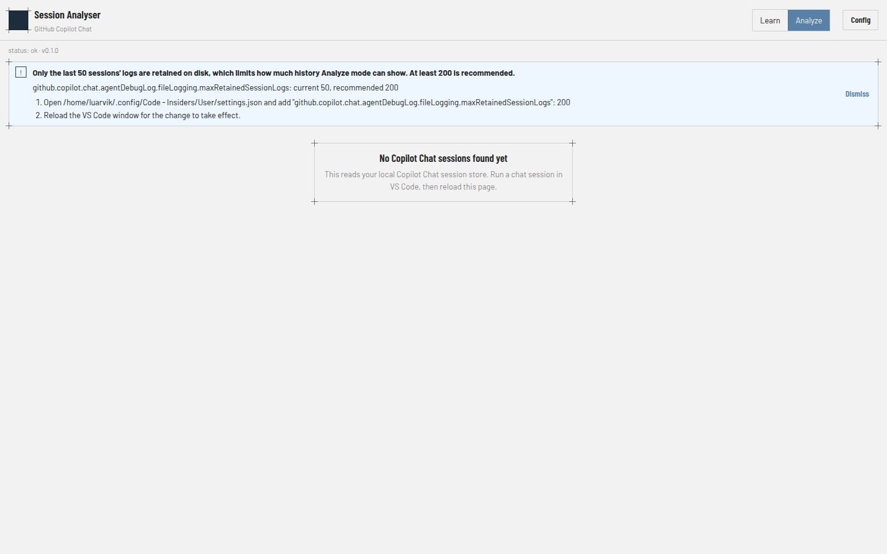

For Analyze mode, this normally means you haven't run a Copilot Chat
session yet, or the app can't find your VS Code session store — reload
the page after starting a chat session in VS Code.

## License

[MIT](../LICENSE)
