# Agentic Coding in VS Code GitHub Copilot

This document explains the core concepts behind agentic coding sessions in VS Code
GitHub Copilot: sessions, turns, tool calls, caching, and token accounting.

## Introduction

When you work with GitHub Copilot (or similar tools like Claude Code) in "agent
mode," you're not just sending one prompt and getting one reply — you're driving
an **agentic session**: a multi-step, tool-using conversation where the model can
read files, run commands, search code, and edit your project across many
back-and-forth exchanges before handing control back to you.

Understanding how that session is structured — **sessions**, **turns**, **tool
calls**, and the **caching** that ties them together — is the key to
understanding *why* a long-running session costs what it does. Prompt caching
means the same instructions, tools, and prior conversation don't have to be
reprocessed at full price every turn, but changes to the model, the toolset, the
instructions, or the conversation's shape (compaction, `/clear`, `/rewind`,
forking) can all reset or reshape that cache in different ways — some cheap,
some expensive.

This document walks through each concept from the ground up, then works through
a single running example (Section 9) across every subsequent section, so the
token/cache/cost impact of each event is easy to compare side by side.

## Table of contents

1. [What is an agentic coding session?](#1-what-is-an-agentic-coding-session)
2. [What is a turn?](#2-what-is-a-turn)
3. [What is a tool call and a tool response?](#3-what-is-a-tool-call-and-a-tool-response)
4. [Prompt / file caching and how it saves token cost](#4-prompt--file-caching-and-how-it-saves-token-cost)
5. [Request tokens, response tokens, and how they accumulate](#5-request-tokens-response-tokens-and-how-they-accumulate)
6. [Other token types](#6-other-token-types)
7. [How subagents work, and how they reduce cost](#7-how-subagents-work-and-how-they-reduce-cost)
8. [Full tree view: Session → Turns → Tool Calls → Content](#8-full-tree-view-session--turns--tool-calls--content)
9. [Worked example: a multi-turn session showing every token type](#9-worked-example-a-multi-turn-session-showing-every-token-type)
10. [How context compaction/summarization affects tokens, cache, and cost](#10-how-context-compactionsummarization-affects-tokens-cache-and-cost)
11. [How changing the model mid-session affects tokens, cache, and cost](#11-how-changing-the-model-mid-session-affects-tokens-cache-and-cost)
12. [How changing MCP tools mid-session affects tokens, cache, and cost](#12-how-changing-mcp-tools-mid-session-affects-tokens-cache-and-cost)
13. [How asking for a git commit affects tokens, cache, and cost](#13-how-asking-for-a-git-commit-affects-tokens-cache-and-cost)
14. [How Claude Code's `/clear` affects tokens and cache](#14-how-claude-codes-clear-affects-tokens-and-cache)
15. [How `/rewind` (or editing a previous turn in VS Code) affects tokens and cache](#15-how-rewind-or-editing-a-previous-turn-in-vs-code-affects-tokens-and-cache)
16. [How session forking affects tokens, cache, and cost](#16-how-session-forking-affects-tokens-cache-and-cost)
17. [Cache optimal usage: TTLs, invalidation, and best practices](#17-cache-optimal-usage-ttls-invalidation-and-best-practices)
18. [Where to find the logs: data sources for token, cache, and cost analysis](#18-where-to-find-the-logs-data-sources-for-token-cache-and-cost-analysis)
19. [Summary](#summary)

---

## 1. What is an agentic coding session?

An **agentic session** is the full lifecycle of a Copilot Chat conversation in agent
mode, from the moment a user opens a chat panel (or resumes one) until it ends or is
closed. Unlike a single question/answer exchange, an agentic session allows the model
to autonomously plan multi-step work, call tools (read files, run terminal commands,
search code, edit files), observe results, and continue reasoning — across many
back-and-forth **turns** — until the user's goal is satisfied.

A session contains:

- **Session metadata** — session id, workspace/folder(s), start/end timestamps, the
  active model, and the agent/mode configuration (e.g. custom agent, tool set).
- **System/instructions context** — `copilot-instructions.md`, custom agent
  definitions, applicable `.instructions.md` files, and skill files loaded for the
  conversation.
- **An ordered list of turns** — each turn is one user message plus everything the
  model does in response to it.
- **Session-level state** — checkpoints/undo points, files touched, and (optionally)
  persisted session memory notes.
- **Aggregated usage** — token counts and cost rolled up across every turn in the
  session.

> **What's actually in "the system prompt"?** It's layered: (1) built-in agent
> instructions (identity, tool-use protocol, formatting/safety rules) — fixed; (2)
> repo-wide custom instructions (`copilot-instructions.md`, `AGENTS.md`-style
> files) — folded in as part of the effective system context for the whole
> session; (3) path-scoped `.instructions.md` files (`applyTo` globs) — included
> **conditionally**, only when a turn actually touches matching files, so this
> layer can vary turn to turn rather than staying perfectly static; (4)
> **skills** — only a lightweight manifest (name, description, file path) is
> preloaded here. The full `SKILL.md` content is **not** part of the system
> prompt; it's fetched mid-turn via a `read_file` tool call when the model
> decides a skill applies, so it counts as that turn's tool tokens, not upfront
> system-prompt tokens.

> **Does a path-scoped `.instructions.md` invalidate the cache when it first
> becomes relevant?** Often yes — it's the same mechanism as Section 12's
> MCP-tool-change case, just triggered by touching a new file type instead of a
> settings change. If turn 1-2 never touch a matching file, that block isn't in
> the prompt at all; the first turn that *does* touch one (say, turn 3) inserts
> it. If the client groups this with the other stable instructions near the top
> of the prompt (the common pattern), that insertion breaks the prefix match at
> that position, invalidating everything cached after it — all prior
> conversation included — even though none of that conversation actually
> changed. If instead it's appended later, closer to where the file is used,
> only that turn's own new content grows and earlier cached history is
> unaffected. Either way, this is a **silent** trigger: nothing about it looks
> like a deliberate change (no explicit model/tool switch), so a cost spike from
> simply opening a new kind of file can be surprising.

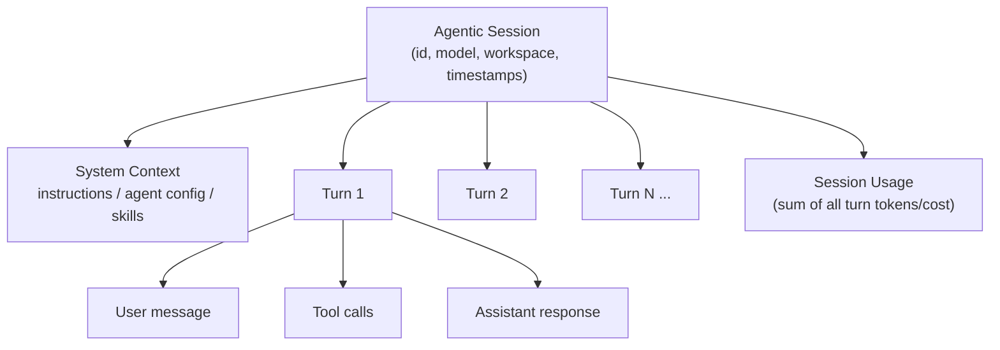

---

## 2. What is a turn?

A **turn** is one complete round of the conversation: it starts with a user message
(or an automatic continuation) and ends when the assistant produces a final response
back to the user (with no more pending tool calls). A turn is the unit the session is
built from — a session is simply an ordered sequence of turns sharing the same
context window history.

A turn typically contains:

- The **user's input** (text, plus any attached files/images/selections).
- The **request** sent to the model — the user message *plus* the accumulated
  conversation history from prior turns (subject to context-window/caching rules).
- Zero or more **tool call / tool response** pairs the model issues while working
  through the task.
- The final **assistant message** (natural-language explanation, code edits summary,
  etc.).
- **Per-turn token usage** (request tokens, response tokens, cache tokens — see
  below).

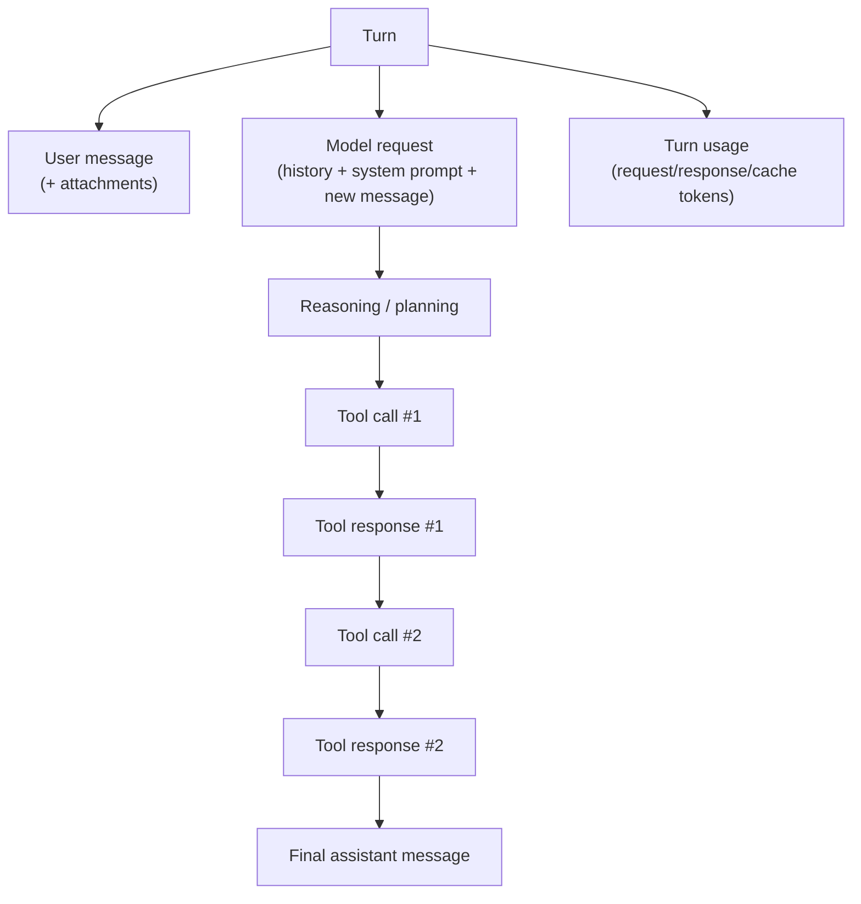

Turns are **cumulative**: turn *N*'s request includes the visible history of turns
`1..N-1` (messages, and often tool calls/results), which is why token usage tends to
grow as a session progresses.

---

## 3. What is a tool call and a tool response?

A **tool call** is a structured action the model requests instead of just returning
text — e.g. "read this file", "run this terminal command", "search the codebase for
X". The client (VS Code) executes the tool and returns a **tool response** (the
tool's output, truncated/formatted as needed) back to the model as part of the same
turn's context.

Relationship to turn/session:

- A turn can contain **any number of tool call → tool response pairs** (including
  zero, for a purely conversational turn).
- Each tool call/response pair adds messages to the model's context, so it consumes
  additional request tokens on the *next* model invocation within that same turn (the
  model re-reads the whole trajectory so far to decide the next step).
- Tool calls do not span sessions — they exist only within the turn that issued them,
  but their *effects* (edited files, terminal state) persist for the rest of the
  session.

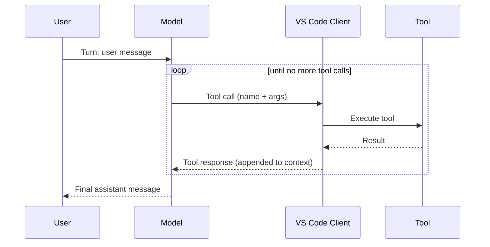

---

## 4. Prompt / file caching and how it saves token cost

Most model providers support **prompt caching**: if a prefix of the input tokens sent
to the model is identical to a prefix sent in a previous request (same system
prompt, same instructions, same earlier turns, same unmodified file contents), the
provider can reuse its internal computation for that prefix instead of reprocessing
it from scratch.

How it works in practice:

- Copilot structures requests so that **stable content comes first** — system
  instructions, agent/tool definitions, and earlier conversation turns — followed by
  the newest user message and latest tool results at the end.
- On each new turn, everything *before* the new content is byte-for-byte identical to
  the previous request, so it matches the cache **as long as nothing upstream
  changed** (e.g. no edited instructions file, no different tool set).
- The provider returns which tokens were served from cache — these are billed at a
  much lower rate ("cache read") than fresh ("uncached") input tokens. The first
  time a prefix is seen, it may be billed as a slightly more expensive "cache write"
  so it can be reused later.
- Anything that changes the prefix (editing `copilot-instructions.md`, changing
  active files/tools, switching agents) **invalidates the cache** from that point
  onward, forcing full reprocessing of everything after the change.

> **Does editing the instructions file invalidate the whole cache?** Yes, and
> more totally than most other changes. Cache matching works on a **contiguous
> prefix starting at byte 0**, and the system prompt/instructions sit at the very
> front of it. Changing that content means the match breaks **right at the
> start** — so, even though the tool definitions and every prior conversation
> turn are unchanged, none of them can match anymore either, since prefix
> matching can't "skip over" the changed part and resume later. The result is a
> **full cache miss**: the next turn resends everything (new instructions + all
> prior history) uncached, then a brand-new cache builds from scratch. This is
> the same *mechanism* as Section 12's MCP-tool-change example, just triggered
> even earlier in the prefix — so in practice it's total invalidation every time,
> not just a partial one.

> **Are instructions/tool definitions duplicated once per turn?** No. Any single
> request's context window contains exactly **one copy** of the system prompt and
> tool/MCP definitions, sitting once at a fixed position at the top — followed by
> the conversation history (`messages`), which is the part that actually grows
> turn by turn. What *does* happen is that, because the API is stateless per call,
> that same one copy has to be **re-transmitted on every request** (every turn,
> and every internal tool-calling step within a turn) — there's no server-side
> memory between calls. Caching is what makes re-sending that unchanged block
> cheap: the provider recognizes the identical bytes and charges the low
> cache-read rate instead of reprocessing (or billing) it as if it were new,
> duplicate content each time.

This is why long, stable sessions are cheaper per-turn than the first turn: the bulk
of history is a cache hit, and only the new user message + new tool results are
"fresh" tokens.

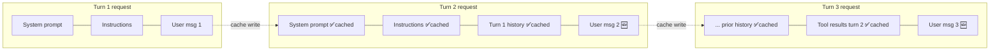

---

## 5. Request tokens, response tokens, and how they accumulate

- **Request (input) tokens**: everything sent *to* the model for a given call —
  system prompt, instructions, prior conversation, file contents, tool
  definitions/results, and the new user message.
- **Response (output) tokens**: everything the model *generates* — its reasoning,
  the text reply, and any tool-call payloads it emits.

Accumulation:

- **Within a turn**: if the model makes several tool calls before its final answer,
  each subsequent model invocation re-sends the growing trajectory, so request
  tokens for that turn are effectively the sum across each internal step, and
  response tokens accumulate across each intermediate "next action" the model
  produces plus the final message.
- **Across a session**: each new turn's request tokens include (a cached copy of)
  all prior turns' messages and tool exchanges, so the *nominal* request size grows
  turn over turn — though the **billed, uncached** portion is usually just the new
  content thanks to prompt caching. Response tokens simply sum turn-by-turn since
  each turn's output is new. A session's total cost is the sum of every turn's
  (uncached request + cache-read request + response) tokens, priced according to the
  model's rate for each token type.

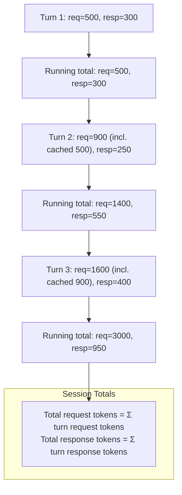

---

## 6. Other token types

Beyond plain request/response tokens, providers commonly expose:

| Token type | When it's used | Cost impact |
|---|---|---|
| **Cache write tokens** | First time a prefix (system prompt, instructions, early turns) is sent | Usually priced slightly *above* normal input rate, but only paid once per unique prefix |
| **Cache read (cached input) tokens** | Any subsequent request whose prefix matches a previous cache write | Priced far *below* normal input rate (often 5–10x cheaper) — this is the main saving mechanism |
| **Reasoning / "thinking" tokens** | Models with extended/chain-of-thought reasoning (e.g. deliberate planning before acting) | Billed as output tokens, sometimes at a distinct rate; can be a large share of response cost on hard tasks |
| **Tool-call tokens** | Tokens spent encoding tool call arguments and tool result payloads | Counted as part of input/output tokens of the turn that produced/consumed them; large tool outputs (e.g. big file reads, verbose terminal logs) are a common source of cost spikes |
| **Vision/image tokens** | Screenshots, pasted images, image attachments | Converted to a token count based on resolution; can be significant for image-heavy turns |

The overall bill for a session is effectively:

$$
\text{Cost} = \sum_{\text{turns}} \Big( r_{\text{uncached}} \cdot p_{\text{in}} + r_{\text{cache\_write}} \cdot p_{\text{write}} + r_{\text{cache\_read}} \cdot p_{\text{read}} + r_{\text{output}} \cdot p_{\text{out}} \Big)
$$

where $p_{\text{read}} \ll p_{\text{in}} \le p_{\text{write}} \le p_{\text{out}}$ for
most providers — which is exactly why caching and minimizing unnecessary
tool-output verbosity matter for cost.

---

## 7. How subagents work, and how they reduce cost

A **subagent** (invoked via a tool such as `runSubagent` or a dedicated
exploration/search agent) is a *separate*, short-lived agentic loop that the main
session spins up to perform a bounded piece of work — e.g. "search the codebase for
X and summarize the relevant files" — and then reports back a single, compact
result message.

Why this saves cost:

- The subagent runs its **own isolated context window**. All the exploratory
  back-and-forth it does (searches, file reads, false starts) stays inside the
  subagent's own turns and is **never added to the parent session's history**.
- The parent session only pays for: the (small) instruction it gave the subagent,
  and the (usually much smaller) final summary the subagent returns — instead of
  every intermediate tool call/result the subagent produced.
- This avoids **context bloat and cache invalidation** in the parent session:
  large/verbose intermediate tool outputs (e.g. dozens of file reads during
  exploration) would otherwise sit permanently in the parent's cached history,
  making every future turn in that session more expensive to reprocess.
- Subagents can also run with a **different, cheaper model** suited to the
  narrower task (e.g. a fast search-oriented model), while the parent session keeps
  using a more capable (and expensive) model only for the tasks that truly need it.

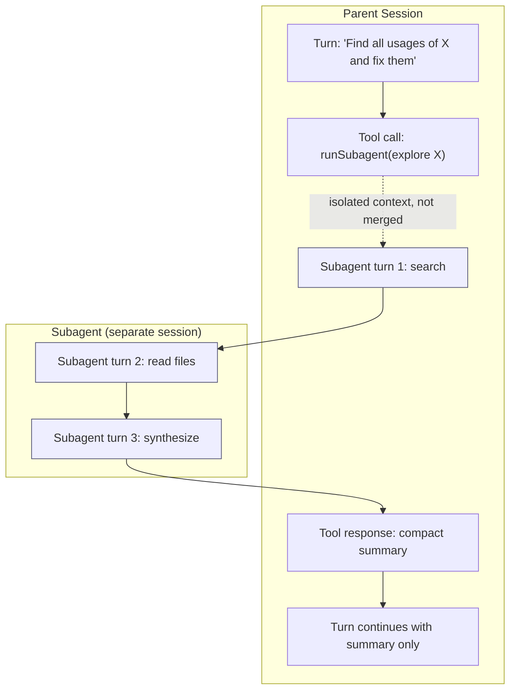

---

## 8. Full tree view: Session → Turns → Tool Calls → Content

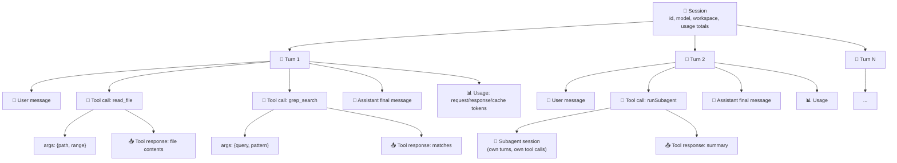

---

## 9. Worked example: a multi-turn session showing every token type

> Extracted as standalone docs: [scenarios/01-cache-basics-8-turn-session.md](scenarios/01-cache-basics-8-turn-session.md) and [scenarios/02-subagent-own-session.md](scenarios/02-subagent-own-session.md).

The example below is an illustrative (not literal) 8-turn session for the task
*"Add a caching layer to the API and write tests for it"*. It shows how each token
type from Section 6 shows up turn by turn, how cache reuse changes the mix as the
session grows, what a **subagent's own session** looks like when it's spawned
mid-way through (turn 2), and what happens when the user asks for a **git commit**
at the end (turns 7-8, see Section 13).

Each turn both **reads** everything cached by prior turns and **writes** its own
new content (the new user message, tool results, reasoning, and reply) to the cache
so the *next* turn can read it back cheaply. That's why cache read isn't capped by
a single write — it's capped by the running **cache size**, i.e. the sum of every
write so far:

| Turn | What happens | Cache write (new) | Cache read (prior cache size) | Cache size after this turn | Uncached input | Tool | Vision | Reasoning | Output text |
|---|---|---:|---:|---:|---:|---:|---:|---:|---:|
| 1 | First message; explores repo with `read_file`/`grep_search`. Writes the static system prompt/instructions **and** this turn's own content (nothing to read yet) | 4500 | 0 | 4500 | 950 | 0 | 0 | 300 | 250 |
| 2 | User pastes a screenshot of a bug; a **subagent** is spawned to search for the root cause and returns one compact summary (subagent's own turns are in its own table below) | 1480 | 4500 | 5980 | 300 | 100 | 700 | 200 | 180 |
| 3 | Using the subagent's summary, model edits files to implement the fix | 1080 | 5980 | 7060 | 150 | 400 | 0 | 250 | 280 |
| 4 | Model runs the test suite; terminal output is large | 2350 | 7060 | 9410 | 100 | 1800 | 0 | 150 | 300 |
| 5 | A test fails; model re-runs tests and greps logs to debug | 1210 | 9410 | 10620 | 130 | 600 | 0 | 220 | 260 |
| 6 | User confirms the tests now pass, no new tool calls | 250 | 10620 | 10870 | 80 | 0 | 0 | 50 | 120 |
| 7 | User asks to commit the changes; model runs `git status`/`git diff` then `git commit` | 1370 | 10870 | 12240 | 90 | 900 | 0 | 180 | 200 |
| 8 | Final "thanks" message, no new tool calls | 180 | 12240 | 12420 | 60 | 0 | 0 | 30 | 90 |

Notes on this example:

- **Cache read on turn *N*** equals the **cache size after turn *N*-1** — i.e. the
  total of every write made by all earlier turns. That's why read can (and
  normally will) be far larger than any single turn's write: it's cumulative,
  writes are incremental.
- **Cache write on turn *N*** is only that turn's *own new* content (its new user
  message, tool results, reasoning, and reply — plus, on turn 1 only, the one-time
  static system prompt/instructions). It never includes what was already cached.
- **Cache size** is the running total available for reuse (`cache size after N` =
  `cache size after N-1` + `cache write on N`). It only grows — nothing is evicted
  in this simplified example (real caches also expire after a TTL if a session goes
  idle too long).
- **Uncached input** is small and roughly constant: it's just the new user message
  each time.
- **Tool tokens** spike on turn 4 (verbose test-run output), again on turn 5
  (re-running tests/grepping logs while debugging), and moderately on turn 7
  (`git status`/`git diff`/`git commit` output) — this is the most common source
  of unexpected cost.
- **Vision tokens** only appear on turn 2, where an image was attached.
- **Turn 7's git commit** behaves like any other tool-using turn — no special
  token type — but it does read the session's largest cache so far (10870) and
  adds a meaningful tool-token bump from the git command output (see Section 13).
- The subagent's *own* internal turns/tool calls spawned in turn 2 are **not**
  included in this table at all — the parent session only pays for the call and
  the ~100-token compact summary (see the separate subagent table below and
  Section 7).

Whether providers bill the write step at a premium (Anthropic-style explicit
breakpoints) or fold it into normal first-time input price with no separate line
item (OpenAI-style automatic caching) varies — either way, the read-vs-write
*shape* above (small incremental writes, large and growing reads) is the same.

### Per-turn totals and running (cumulative) totals by token type

The same numbers, with rows as turns and columns as token types, plus a per-turn
total and the session's running (cumulative) total for each type. To turn token
counts into dollars, this example assumes illustrative per-1K-token rates:
cache write \$0.00625, cache read \$0.0005, uncached input/tool/vision \$0.005,
reasoning/output \$0.015 (real rates depend on the model and provider).

| Turn | What it does | Cache write | Cache read | Uncached input | Tool | Vision | Reasoning | Output text | **Turn total** | **Turn cost** |
|---|---|---:|---:|---:|---:|---:|---:|---:|---:|---:|
| 1 | Explores repo (`read_file`/`grep_search`); writes static prefix + own content | 4500 | 0 | 950 | 0 | 0 | 300 | 250 | **6000** | **$0.0411** |
| 2 | Screenshot of a bug; spawns subagent, gets back a compact summary | 1480 | 4500 | 300 | 100 | 700 | 200 | 180 | **7460** | **$0.0227** |
| 3 | Implements the fix using the subagent's summary | 1080 | 5980 | 150 | 400 | 0 | 250 | 280 | **8140** | **$0.0204** |
| 4 | Runs the test suite; verbose terminal output | 2350 | 7060 | 100 | 1800 | 0 | 150 | 300 | **11760** | **$0.0345** |
| 5 | A test fails; re-runs tests and greps logs to debug | 1210 | 9410 | 130 | 600 | 0 | 220 | 260 | **11830** | **$0.0231** |
| 6 | User confirms the tests now pass, no new tool calls | 250 | 10620 | 80 | 0 | 0 | 50 | 120 | **11120** | **$0.0098** |
| 7 | Commits the changes (`git status`/`git diff`/`git commit`) | 1370 | 10870 | 90 | 900 | 0 | 180 | 200 | **13610** | **$0.0246** |
| 8 | Final "thanks" message, no new tool calls | 180 | 12240 | 60 | 0 | 0 | 30 | 90 | **12600** | **$0.0093** |

| Cumulative through turn | What it does | Cache write | Cache read | Uncached input | Tool | Vision | Reasoning | Output text | **Session total** | **Running session cost** |
|---|---|---:|---:|---:|---:|---:|---:|---:|---:|---:|
| 1 | Explores repo (`read_file`/`grep_search`); writes static prefix + own content | 4500 | 0 | 950 | 0 | 0 | 300 | 250 | **6000** | **$0.0411** |
| 2 | Screenshot of a bug; spawns subagent, gets back a compact summary | 5980 | 4500 | 1250 | 100 | 700 | 500 | 430 | **13460** | **$0.0638** |
| 3 | Implements the fix using the subagent's summary | 7060 | 10480 | 1400 | 500 | 700 | 750 | 710 | **21600** | **$0.0843** |
| 4 | Runs the test suite; verbose terminal output | 9410 | 17540 | 1500 | 2300 | 700 | 900 | 1010 | **33360** | **$0.1187** |
| 5 | A test fails; re-runs tests and greps logs to debug | 10620 | 26950 | 1630 | 2900 | 700 | 1120 | 1270 | **45190** | **$0.1419** |
| 6 | User confirms the tests now pass, no new tool calls | 10870 | 37570 | 1710 | 2900 | 700 | 1170 | 1390 | **56310** | **$0.1517** |
| 7 | Commits the changes (`git status`/`git diff`/`git commit`) | 12240 | 48440 | 1800 | 3800 | 700 | 1350 | 1590 | **69920** | **$0.1763** |
| 8 | Final "thanks" message, no new tool calls | 12420 | 60680 | 1860 | 3800 | 700 | 1380 | 1680 | **82520** | **$0.1857** |

Note that **cumulative cache write** (12420) is exactly the final **cache size**
from the first table — every token ever written, still available for reuse. The
much larger **cumulative cache read** (60680) is how much reuse benefit that
cache actually delivered, since each turn re-reads the whole growing history.
That reuse — reading far more than was ever written — is precisely what keeps the
**running session cost** growing slower than the **session total** token count.

### The subagent's own session (separate table)

The subagent spawned in parent turn 2 runs in its **own isolated context** — it has
its own system prompt, its own turns, and its own token usage, none of which is
visible to (or paid for again by) the parent session. Only its final summary
crosses back over, counted as the ~100 "tool" tokens in the parent's turn 2 row
above.

| Subagent turn | What it does | Cache write (new) | Cache read | Cache size after | Uncached input | Tool | Reasoning | Output text | **Turn total** | **Turn cost** |
|---|---|---:|---:|---:|---:|---:|---:|---:|---:|---:|
| 1 | Searches the codebase (`grep_search`/`semantic_search`) for the bug's root cause | 1200 | 0 | 1200 | 250 | 600 | 180 | 120 | **2350** | **$0.0163** |
| 2 | Reads the matched files in full | 300 | 1200 | 1500 | 100 | 900 | 150 | 90 | **2740** | **$0.0111** |
| 3 | Synthesizes the compact summary returned to the parent | 150 | 1500 | 1650 | 50 | 0 | 100 | 200 | **2000** | **$0.0064** |
| **Subagent session total** | | **1650** | **2700** | — | **400** | **1500** | **430** | **410** | **7090** | **$0.0338** |

This subagent cost (**$0.0338**) is real and billed — isolation doesn't make the
exploration free. What it *does* avoid is dumping all 7090 of those tokens into
the **parent's** permanent cache. If that exploration had happened inline in
parent turn 2 instead, the parent's cache size would have jumped by ~7090 tokens
right there, and turns 3-6 would each re-read that extra history — roughly
4 × 7090 ≈ 28,400 extra cache-read tokens (~\$0.0142) plus a bigger one-time write
(~\$0.0443) — for a total of about \$0.0585, *more* than the \$0.0338 the isolated
subagent actually cost. Isolating exploratory work in a subagent keeps both the
parent's context window and its long-run cache-driven cost smaller.

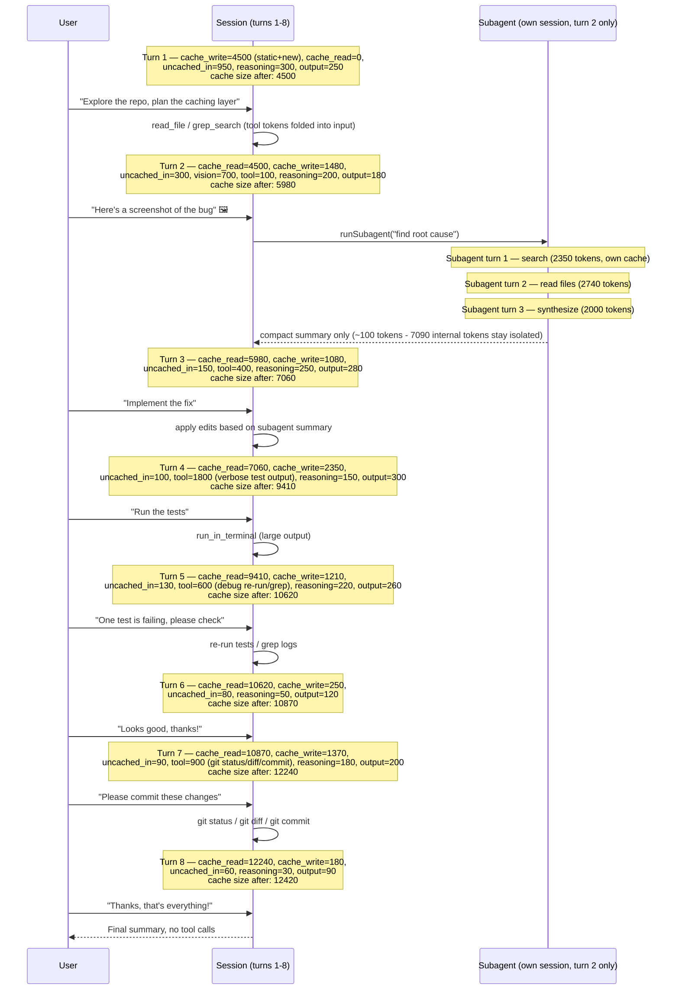

```mermaid
xychart-beta
    title "Parent session: token usage per turn by type (illustrative example)"
    x-axis [Turn1, Turn2, Turn3, Turn4, Turn5, Turn6, Turn7, Turn8]
    y-axis "Tokens" 0 --> 13000
    bar "Cache write" [4500, 1480, 1080, 2350, 1210, 250, 1370, 180]
    bar "Cache read" [0, 4500, 5980, 7060, 9410, 10620, 10870, 12240]
    bar "Uncached input" [950, 300, 150, 100, 130, 80, 90, 60]
    bar "Tool" [0, 100, 400, 1800, 600, 0, 900, 0]
    bar "Vision" [0, 700, 0, 0, 0, 0, 0, 0]
    bar "Reasoning" [300, 200, 250, 150, 220, 50, 180, 30]
    bar "Output text" [250, 180, 280, 300, 260, 120, 200, 90]
```

```mermaid
xychart-beta
    title "Subagent's own session: token usage per turn by type"
    x-axis [SubTurn1, SubTurn2, SubTurn3]
    y-axis "Tokens" 0 --> 1600
    bar "Cache write" [1200, 300, 150]
    bar "Cache read" [0, 1200, 1500]
    bar "Uncached input" [250, 100, 50]
    bar "Tool" [600, 900, 0]
    bar "Reasoning" [180, 150, 100]
    bar "Output text" [120, 90, 200]
```

Even though **cache read** keeps growing in both sessions (each re-reads its own
accumulated history every turn), each turn's own **cache write** stays small and
roughly proportional to just that turn's new content — and the subagent's entire
7090-token trajectory never touches the parent's cache at all.

---

## 10. How context compaction/summarization affects tokens, cache, and cost

> Extracted as a standalone doc: [scenarios/03-context-compaction.md](scenarios/03-context-compaction.md).

When a session's history grows close to the model's context-window limit, the
client (or the model itself) can **compact** it: instead of sending every raw past
message, it asks the model to produce a condensed summary of everything so far,
and that summary — not the original messages — becomes the new prefix for future
turns.

What this does to tokens/cache/cost:

- **One-time spike on the compaction turn**: producing the summary requires
  reading the *entire* prior history (still a cache hit, if it hasn't expired) and
  generating a new chunk of output (the summary itself) — so that turn's output
  tokens (and reasoning) are larger than usual.
- **Cache invalidation from that point on**: the summary text is *new*, different
  content from the raw history it replaces — it doesn't byte-match the old cached
  prefix. So the old cache entry becomes useless; a **new, smaller cache** starts
  from the summary instead of the full raw transcript.
- **Lower cost afterward**: because the new prefix (summary + new turns) is much
  smaller than the raw history it replaced, every subsequent turn reads (and
  eventually re-writes) far fewer cached tokens — cutting the steady per-turn cost
  growth at the price of losing verbatim detail from the compacted turns.

| Turn | What happens | Cache write | Cache read | Cache size after | Uncached input | Tool | Reasoning | Output text | **Turn total** | **Turn cost** |
|---|---|---:|---:|---:|---:|---:|---:|---:|---:|---:|
| 1 | Normal turn; writes static prefix + own content | 3500 | 0 | 3500 | 500 | 0 | 150 | 150 | **4300** | **$0.0289** |
| 2 | Normal turn; reads/extends the cache | 600 | 3500 | 4100 | 200 | 100 | 120 | 180 | **4700** | **$0.0115** |
| 3 | **Context compaction**: reads all prior history (4100) one last time, replaces it with a ~500-token summary as the new cache prefix | 1350 | 4100 | **1350** | 150 | 0 | 300 | 400 | **6300** | **$0.0217** |
| 4 | Normal turn; now builds on the much smaller post-compaction cache | 300 | 1350 | 1650 | 80 | 0 | 100 | 120 | **1950** | **$0.0063** |
| 5 | Normal turn; cache stays small relative to what it would have been | 210 | 1650 | 1860 | 60 | 0 | 60 | 90 | **2070** | **$0.0047** |

The key number is **cache size after turn 3**: it *drops* from 4100 to 1350 even
though the conversation keeps growing — instead of turn 4 reading 4100+ tokens
(and turn 5 reading even more), it reads only 1350, then 1650. Turn 3 itself costs
more than a normal turn (the compaction "tax"), but turns 4-5 are noticeably
cheaper than if the raw history had kept growing uncompacted — that trade-off is
the whole point of compaction.

---

## 11. How changing the model mid-session affects tokens, cache, and cost

> Extracted as a standalone doc: [scenarios/04-model-switch.md](scenarios/04-model-switch.md).

Prompt caches are scoped **per model** (and often per model *version*/tokenizer).
Switching models mid-session — e.g. from a cheaper model to a more capable one
starting at turn 3 — means the new model has never seen any of the previous
turns' cached prefix, no matter how well-cached it was under the old model.

What this does to tokens/cache/cost:

- **Full cache miss on the switch turn**: the entire prior conversation must be
  resent to the new model as plain (uncached) input — none of the old model's
  cache carries over, because caches aren't shared across models.
- **Token counts can shift**: different models use different tokenizers, so the
  same text can cost a different number of tokens under the new model.
- **New rates apply immediately**: if the new model is pricier (or cheaper), every
  token from the switch turn onward — including cache write/read — is billed at
  the *new* model's rates, not the old one's.
- **A fresh cache then builds up again** from the switch turn forward, under the
  new model, growing the same way as in Section 9 — just starting from zero.

This example switches from a cheaper Model A (turns 1-2) to a pricier Model B
(turns 3-5, illustrative rates: cache write \$0.01, cache read \$0.001, uncached
input \$0.01, reasoning/output \$0.03 per 1K tokens):

| Turn | Model | What happens | Cache write | Cache read | Cache size after | Uncached input | Reasoning | Output text | **Turn total** | **Turn cost** |
|---|---|---|---:|---:|---:|---:|---:|---:|---:|---:|
| 1 | A | Normal turn; writes static prefix + own content | 3500 | 0 | 3500 | 500 | 150 | 150 | **4300** | **$0.0289** |
| 2 | A | Normal turn; reads/extends the cache | 600 | 3500 | 4100 | 200 | 120 | 180 | **4600** | **$0.0110** |
| 3 | **B** | **Model switch**: A's 4100-token cache is worthless to B; the whole history + new message (4300) is resent as uncached input, and B writes its *own* first cache entry | 4850 | 0 | 4850 | 4300 | 250 | 300 | **9700** | **$0.1080** |
| 4 | B | Normal turn under B; reads/extends B's new cache | 470 | 4850 | 5320 | 120 | 150 | 200 | **5790** | **$0.0213** |
| 5 | B | Normal turn under B | 310 | 5320 | 5630 | 80 | 90 | 140 | **5940** | **$0.0161** |

Turn 3's cost (**$0.1080**) dwarfs every other turn — nearly 10x turn 2 — purely
because of the switch: a full cache miss forcing 4300 uncached tokens through,
*and* those tokens (plus every token after) now billed at Model B's higher rates.
Turns 4-5 behave like a normal, healthy cache-building session again, just under
the new, pricier rates.

---

## 12. How changing MCP tools mid-session affects tokens, cache, and cost

> Extracted as a standalone doc: [scenarios/05-mcp-tool-change.md](scenarios/05-mcp-tool-change.md).

The list of available tools (including MCP server tools) — their names,
descriptions, and JSON schemas — is sent to the model as part of the request on
every turn, usually near the top of the prompt (close to the system prompt). If
the enabled toolset changes mid-session (a user enables/disables an MCP server,
or a custom agent swaps its tools) starting at turn 3, that block of the prefix
changes.

What this does to tokens/cache/cost:

- **Partial-to-full cache invalidation**: because the tool-definitions block sits
  early in the prompt, changing it usually invalidates everything cached *after*
  it too — i.e. most or all of the prior conversation — even though the model and
  its rates stay exactly the same.
- **No rate change**: unlike a model switch, the per-token prices don't change —
  the extra cost comes purely from losing the cache, not from a pricier model.
- **A new cache rebuilds** from the tool-change turn forward, under the new
  toolset, the same way a fresh session would.

This example changes the enabled MCP tools starting at turn 3 (same model/rates
throughout as Section 9's Model A: cache write \$0.00625, cache read \$0.0005,
uncached input/tool \$0.005, reasoning/output \$0.015 per 1K tokens):

| Turn | What happens | Cache write | Cache read | Cache size after | Uncached input | Tool | Reasoning | Output text | **Turn total** | **Turn cost** |
|---|---|---:|---:|---:|---:|---:|---:|---:|---:|---:|
| 1 | Normal turn; writes static prefix (incl. old toolset) + own content | 3500 | 0 | 3500 | 500 | 0 | 150 | 150 | **4300** | **$0.0289** |
| 2 | Normal turn; reads/extends the cache | 600 | 3500 | 4100 | 200 | 100 | 120 | 180 | **4700** | **$0.0115** |
| 3 | **MCP toolset changes**: new tool schemas alter the early prefix; the prior 4100-token cache no longer matches and must be resent uncached; a new cache is written under the new toolset | 4770 | 0 | 4770 | 4350 | 0 | 200 | 220 | **9540** | **$0.0579** |
| 4 | Normal turn; uses one of the newly enabled tools | 800 | 4770 | 5570 | 110 | 400 | 130 | 160 | **6370** | **$0.0143** |
| 5 | Normal turn; cache continues building under the new toolset | 240 | 5570 | 5810 | 70 | 0 | 70 | 100 | **6050** | **$0.0072** |

Turn 3's cost (**$0.0579**) is about 5x a normal turn — a real spike, but far
smaller than the ~10x spike from a model switch (Section 11), because the model
and its rates didn't change, only the cache. This is the general pattern:
**model switches invalidate the cache *and* change the price per token**, while
**tool/instruction changes invalidate the cache but keep the same price per
token** — both cost more on the turn of the change, but a model switch usually
hurts more.

---

## 13. How asking for a git commit affects tokens, cache, and cost

Asking the model to "commit these changes" (turns 7-8 in Section 9's worked
example) doesn't introduce any new token *type* — it's an ordinary tool-using
turn, just like running tests or searching code:

- The model calls tools such as `run_in_terminal` for `git status`, `git diff`,
  and `git commit -m "..."`. Their combined output (diffs, status lines, the
  resulting commit hash) counts as **tool tokens**, same as any other terminal
  command.
- **The commit message itself is drafted in this same turn (turn 7)**: composing
  it is part of that turn's **reasoning** tokens (deciding what changed and how to
  phrase it), the message text embedded in the `git commit -m "..."` call is part
  of that turn's **tool** tokens (it's payload of the tool call), and the model's
  confirmation back to the user (often repeating the message/commit hash) is part
  of that turn's **output text** tokens. It isn't a separate token type — it's
  spread across the same categories every turn already has.
- It reads the **entire cache built up so far** (10870 tokens by turn 7 in the
  running example) — by this point in a session, the commit turn is reading the
  single largest prefix of the whole conversation, since it comes near the end.
- The size of the diff being committed directly drives the tool-token cost: a
  small, focused change might add only a couple hundred tool tokens; a large
  multi-file diff can add thousands — the same "verbose tool output" risk called
  out in Section 6.
- A short follow-up "thanks" turn (turn 8) afterward is cheap: mostly cache read,
  with only a small uncached input/output tail — the same shape as any other
  low-effort trailing turn.

In short: a git-commit turn is cost-wise unremarkable *except* that it tends to
happen late in a session, so it reads (and then extends) the largest cache the
session has accumulated — making the **cache read** column, not anything about
git itself, the dominant cost driver for that turn.

---

## 14. How Claude Code's `/clear` affects tokens and cache

> Extracted as a standalone doc: [scenarios/06-clear.md](scenarios/06-clear.md).

`/clear` tells the client to drop the visible conversation history and start the
next message with an empty transcript — but it does **not** delete anything from
disk.

**Does it clear all cache, or keep instructions/tool definitions?** It clears only
the **conversation-history** portion of the context. The system prompt,
`CLAUDE.md`/instructions, and tool/MCP definitions are not "cached files" that
get wiped — they're just reloaded from disk and resent fresh on the very next
turn, exactly like session start. If that static block's content hasn't changed
and the provider's cache entry for it hasn't expired (TTL), it's often **still a
cache hit** right after `/clear` — only the old turn-by-turn conversation on top
of it is gone (and simply never resent again, so there's nothing to invalidate).

Why use it:

- **Starting a genuinely new, unrelated task** in the same terminal/session
  without paying to keep resending (and without the model being anchored to) a
  long, no-longer-relevant conversation.
- **It's free to invoke** — unlike compaction (Section 10), there's no
  summarization step, so no extra reasoning/output tokens are spent condensing
  anything; the old turns are simply dropped.
- It trades away **all continuity** (nothing is retained, not even a summary),
  which is the key difference from compaction: `/clear` = full discard, no tax,
  no memory; compaction = partial discard, one-time tax, keeps the gist.

| Turn | What happens | Cache write | Cache read | Cache size after | Uncached input | Tool | Reasoning | Output text | **Turn total** | **Turn cost** |
|---|---|---:|---:|---:|---:|---:|---:|---:|---:|---:|
| 1 | Normal turn; writes static prefix + own content | 3500 | 0 | 3500 | 500 | 0 | 150 | 150 | **4300** | **$0.0289** |
| 2 | Normal turn; reads/extends the cache | 600 | 3500 | 4100 | 200 | 100 | 120 | 180 | **4700** | **$0.0115** |
| 3 | **`/clear`**: conversation history (the 1100 tokens turns 1-2 added) is dropped; only the still-valid static prefix (3000) is read; a new unrelated task starts | 600 | 3000 | 3600 | 300 | 0 | 130 | 170 | **4200** | **$0.0113** |
| 4 | Normal turn on the new task; cache builds up again from the post-`/clear` baseline | 320 | 3600 | 3920 | 120 | 0 | 90 | 110 | **4240** | **$0.0074** |
| 5 | Normal turn; still far smaller than the old conversation would have grown to | 220 | 3920 | 4140 | 70 | 0 | 60 | 90 | **4360** | **$0.0059** |

The tell is **turn 3's cache read (3000)**: instead of reading the full 4100-token
history a normal turn would have inherited (or a spike from a forced resend, as
in Sections 11-12), it drops straight back to just the static prefix. And unlike
a compaction or a model/tool switch, turn 3's cost (**$0.0113**) isn't a spike at
all — it's roughly in line with a normal turn, because nothing had to be
summarized or resent; the old turns were simply never sent again.

---

## 15. How `/rewind` (or editing a previous turn in VS Code) affects tokens and cache

> Extracted as a standalone doc: [scenarios/07-rewind.md](scenarios/07-rewind.md).

Claude Code's `/rewind`, and VS Code's equivalent — restoring a checkpoint or
editing an earlier user message and resubmitting — roll the conversation back to
an earlier turn and continue from there, discarding every turn after that point
(and often reverting the file edits those turns made).

What this does to tokens/cache/cost:

- **The discarded turns' cost is already spent** — rewinding doesn't refund the
  tokens/money already billed for the turns being thrown away. It's a sunk cost.
- **Going forward, those discarded turns are never resent again**: the next turn
  resumes from the cache size *at the rewind point*, not from the (larger) cache
  size the abandoned branch had reached. That's the actual saving — it stops a
  bad turn from being read-and-billed-again in every future turn.
- **The prefix up to the rewind point is usually still a warm cache hit** (same
  model, same tools, same instructions) — so, unlike a model/tool switch, resuming
  doesn't force a full uncached resend; it picks up cheaply right where the good
  history left off.
- If the resubmitted message is **edited**, it's new content from that point
  on — a fresh branch starts from the rewind point, but still on top of the
  still-valid earlier cache.

| Turn | What happens | Cache write | Cache read | Cache size after | Uncached input | Tool | Reasoning | Output text | **Turn total** | **Turn cost** |
|---|---|---:|---:|---:|---:|---:|---:|---:|---:|---:|
| 1 | Normal turn; writes static prefix + own content | 3500 | 0 | 3500 | 500 | 0 | 150 | 150 | **4300** | **$0.0289** |
| 2 | Normal turn; reads/extends the cache | 600 | 3500 | 4100 | 200 | 100 | 120 | 180 | **4700** | **$0.0115** |
| 3 | **Wrong path**: model edits the wrong files based on a misunderstanding (will be rewound away) | 1830 | 4100 | 5930 | 250 | 1200 | 200 | 180 | **7760** | **$0.0264** |
| 4 | **`/rewind`** back to end of turn 2 with a corrected instruction; turn 3's 1830 tokens are discarded and never read again | 820 | 4100 | 4920 | 220 | 300 | 140 | 160 | **5740** | **$0.0143** |
| 5 | Normal turn continuing on the corrected branch | 260 | 4920 | 5180 | 90 | 0 | 70 | 100 | **5440** | **$0.0071** |

Turn 3 (**$0.0264**) is money already spent and gone — `/rewind` can't undo that
charge. What it *does* do shows up in **turn 4's cache read (4100)**: it resumes
from turn 2's cache size, not turn 3's larger 5930, so the mistaken turn never
bloats any future turn's context or cost. Compare that to *not* rewinding and
instead just sending a correction on top — the model would keep re-reading (and
re-paying for) that wrong 1830-token detour in every subsequent turn forever.

---

## 16. How session forking affects tokens, cache, and cost

> Extracted as a standalone doc: [scenarios/08-session-forking.md](scenarios/08-session-forking.md).

**Forking** creates a *new*, independent session that shares the same history up
to a chosen turn — but, unlike `/rewind` (Section 15), the **original session
keeps existing and can keep going too**. Instead of choosing one path and
discarding the other, forking lets both continue in parallel from a common
checkpoint.

What this does to tokens/cache/cost:

- **No invalidation at the fork point**: forking doesn't change any content — it
  just starts a second, independent continuation from the exact same prefix. That
  shared prefix (the "trunk") is still a valid, warm cache hit for **every**
  branch that reads it, as long as the same model/tools/instructions and the
  provider's cache TTL are still in effect.
- **Each branch pays its own cache-read cost** to reuse the trunk — it isn't
  free, but it's the cheap cache-read rate, not a resend at full uncached price.
- **Branches diverge independently from the fork point on**: branch A's new
  turns build their own cache on top of the shared trunk; branch B does the same
  with its own turns. Neither branch's post-fork writes are visible to the other.
- **Versus `/rewind`**: rewind keeps one path and permanently throws away the
  other (its cost is sunk, and it's gone for good). Forking keeps *both* — nothing
  is discarded, so exploring an alternative never costs you the original.
- **Versus starting a second session from scratch**: an unrelated fresh session
  would have to rebuild the same trunk from zero (paying full uncached price all
  over again). Forking reuses the trunk as a cache hit instead — this is the main
  cost saving forking provides.

Why use it: to try **multiple alternative approaches from the same starting
point** and compare them (e.g. two different implementation strategies), to
**safely experiment** with a risky change while keeping the original session
intact as a live fallback (instead of `/rewind`'s all-or-nothing discard), or to
**parallelize** work — e.g. handing one branch to a teammate or a background
agent — from a context that's already warmed up.

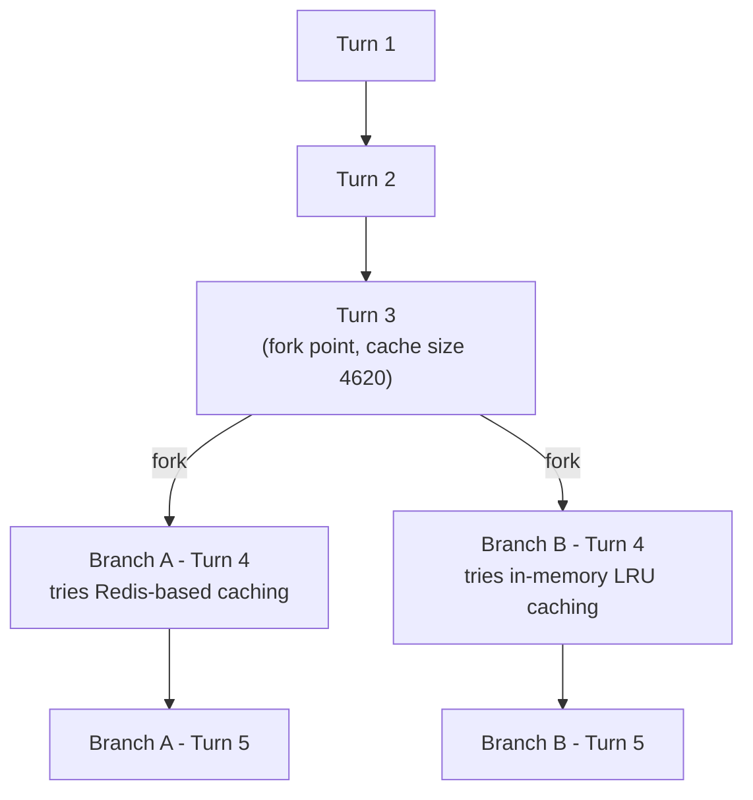

**Shared trunk** (both branches inherit this identically):

| Turn | What happens | Cache write | Cache read | Cache size after | Uncached input | Tool | Reasoning | Output text | **Turn total** | **Turn cost** |
|---|---|---:|---:|---:|---:|---:|---:|---:|---:|---:|
| 1 | Normal turn; writes static prefix + own content | 3500 | 0 | 3500 | 500 | 0 | 150 | 150 | **4300** | **$0.0289** |
| 2 | Normal turn; reads/extends the cache | 600 | 3500 | 4100 | 200 | 100 | 120 | 180 | **4700** | **$0.0115** |
| 3 | Decides to compare two caching strategies; **forks here** | 520 | 4100 | 4620 | 220 | 0 | 140 | 160 | **5140** | **$0.0109** |

Trunk cost so far: **$0.0513** (paid once).

**Post-fork branches** (each turn 4 reads the *same* trunk cache — 4620 — independently):

| Branch / Turn | What happens | Cache write | Cache read | Cache size after | Uncached input | Tool | Reasoning | Output text | **Turn total** | **Turn cost** |
|---|---|---:|---:|---:|---:|---:|---:|---:|---:|---:|
| A · 4 | Implements a Redis-based caching strategy | 1000 | 4620 | 5620 | 150 | 500 | 160 | 190 | **6620** | **$0.0171** |
| A · 5 | Normal follow-up turn in branch A | 290 | 5620 | 5910 | 80 | 0 | 90 | 120 | **6200** | **$0.0082** |
| B · 4 | Implements an in-memory LRU caching strategy | 1170 | 4620 | 5790 | 140 | 700 | 150 | 180 | **6960** | **$0.0188** |
| B · 5 | Normal follow-up turn in branch B | 250 | 5790 | 6040 | 70 | 0 | 80 | 100 | **6290** | **$0.0075** |

Branch A total: **$0.0253** on top of the trunk (session A total: $0.0513 + $0.0253
= **$0.0766**). Branch B total: **$0.0263** on top of the same trunk (session B
total: $0.0513 + $0.0263 = **$0.0776**). Exploring *both* strategies this way
costs **$0.0513 + $0.0253 + $0.0263 = $0.1029** in total — the trunk is paid for
**once**, then reused as a cache hit by both branches.

Compare that to running two entirely separate sessions from scratch instead of
forking: each would have to rebuild the same trunk independently (2 × $0.0513 =
$0.1026) on top of its own branch cost ($0.0253 + $0.0263), for a total of
**$0.1542** — about **$0.0513 more**, exactly one extra copy of the trunk. That
gap *is* the saving forking provides: shared setup gets paid for once and reused,
not re-purchased per branch.

---

## 17. Cache optimal usage: TTLs, invalidation, and best practices

Everything in Sections 4-16 assumed a cache that's already behaving well. This
section is about the practical side: how long a cache actually survives, what
resets it, and how to structure a session (and a codebase) so you get the most
mileage out of it.

> **Important framing:** VS Code Copilot doesn't implement its own prompt cache
> from scratch — it proxies requests to whichever provider is behind the
> selected model (Anthropic, OpenAI, Google, xAI, Moonshot AI, Microsoft's
> in-house models). Cache mechanics — TTL, write/read pricing, exactly what
> invalidates it — are defined by that underlying provider's API, not by VS
> Code or the Copilot product layer itself. Copilot doesn't publish a
> per-model cache-TTL table of its own, so the numbers below are the
> underlying providers' own documented behavior for their raw APIs; Copilot's
> routing/proxying layer sits on top and isn't guaranteed to behave
> identically, but there's no public evidence it materially extends these
> windows.

### 17.1 How long does the cache live, and is it the same for every model?

No. It depends on which provider is behind the model you've selected, and even
on the model generation:

| Provider (example models available in Copilot) | Default cache lifetime | Longer-TTL option | Notes |
|---|---|---|---|
| **Anthropic** (Claude Opus/Sonnet/Haiku families) | **5 minutes**, refreshed for free on every cache hit | 1-hour TTL available, at ~2x the normal cache-write cost | The clock starts at the **request** that reads/writes the entry, not the end of its response — a slow 4-minute response leaves only ~1 minute before the next call must land to keep the hit |
| **OpenAI** (GPT-5.x families) | Automatic, **in-memory** caching: typically evicted after **5-10 minutes of inactivity**, but can persist up to **~1 hour** off-peak (not a guarantee) | Extended/24-hour retention on some pre-GPT-5.6 model families; GPT-5.6+ uses explicit cache breakpoints with a fixed **30-minute** minimum TTL instead | Behavior isn't as tightly specified as Anthropic's — treat "5-10 minutes" as the safe assumption |
| **Google** (Gemini 3.x Flash/Pro) | **Implicit caching**, no published fixed TTL at all | None documented | Google's own guidance is just to send similar-prefix requests "in a short amount of time" — there's no stated number to target |
| **xAI (Grok), Moonshot AI (Kimi), Microsoft (MAI-Code)** | Not publicly documented | — | Treat as unknown/opaque; assume the same 5-10 minute ballpark unless you observe otherwise |

The practical takeaway is the same regardless of the exact number: **assume
your cache is fragile on the order of minutes, not hours**, no matter which
model you're using — a pause of roughly 5+ minutes is close to a universal
danger zone across every provider Copilot uses.

### 17.2 10-turn example: a 5+ minute smoke break between turns 7 and 8

> Extracted as a standalone doc: [scenarios/09-cache-ttl-smoke-break.md](scenarios/09-cache-ttl-smoke-break.md).

The example below extends Section 9's style to 10 turns, using the same
illustrative rates (cache write \$0.00625, cache read \$0.0005, uncached
input/tool \$0.005, reasoning/output \$0.015 per 1K tokens). Turns 1-7 happen
back-to-back and build a healthy, growing cache. Then the user steps away for
a **5+ minute smoke break** before turn 8 — long enough to exceed every
provider's default TTL from Section 17.1.

| Turn | What happens | Cache write | Cache read | Cache size after | Uncached input | Tool | Reasoning | Output text | **Turn total** | **Turn cost** |
|---|---|---:|---:|---:|---:|---:|---:|---:|---:|---:|
| 1 | Normal turn; writes static prefix + own content | 3000 | 0 | 3000 | 400 | 0 | 0 | 200 | **3600** | **$0.0238** |
| 2 | Normal turn; reads/extends the cache | 500 | 3000 | 3500 | 150 | 0 | 0 | 150 | **3800** | **$0.0076** |
| 3 | Explores code with a couple of tool calls | 450 | 3500 | 3950 | 140 | 300 | 0 | 180 | **4570** | **$0.0095** |
| 4 | Applies an edit, runs a quick check | 600 | 3950 | 4550 | 130 | 500 | 0 | 200 | **5380** | **$0.0119** |
| 5 | Normal follow-up turn | 400 | 4550 | 4950 | 120 | 0 | 0 | 160 | **5230** | **$0.0078** |
| 6 | Normal follow-up turn | 380 | 4950 | 5330 | 110 | 0 | 0 | 150 | **5590** | **$0.0077** |
| 7 | Normal follow-up turn — cache is healthy (5750 tokens) | 420 | 5330 | 5750 | 130 | 0 | 0 | 170 | **6050** | **$0.0085** |
| *(user steps away — smoke break, >5 minutes idle)* | | | | | | | | | | |
| 8 | **Cache miss**: every provider's TTL has lapsed; the full 5750-token history + new message must be resent as plain uncached input, and a brand-new cache entry is written from scratch | 6200 | 0 | 6200 | 5900 | 0 | 220 | 200 | **12520** | **$0.0746** |
| 9 | Normal turn; new cache rebuilds from the post-break baseline | 430 | 6200 | 6630 | 120 | 0 | 0 | 150 | **6900** | **$0.0086** |
| 10 | Normal turn | 300 | 6630 | 6930 | 90 | 0 | 0 | 120 | **7140** | **$0.0074** |

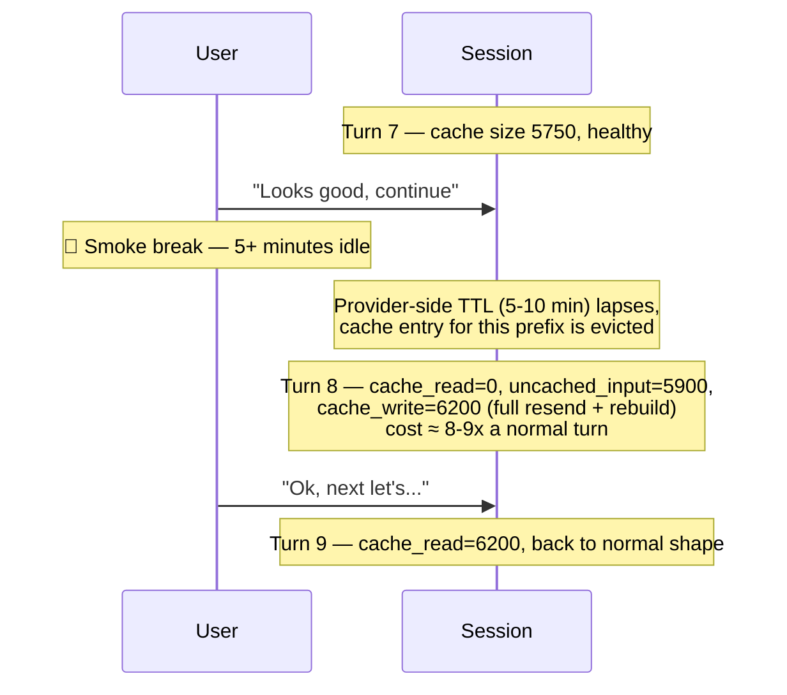

What the break actually costs: had the cache stayed warm, turn 8 would have
looked like turn 7 — roughly 430 write / 5750 read / 130 uncached / 170
output, about **$0.0088**. Instead it costs **$0.0746**, about **8.5x** more —
roughly **$0.066** in extra, avoidable spend for that one turn, purely because
the pause outlasted the TTL. Turns 9-10 recover completely normal cache-growth
behavior once the new cache has been (re-)written; the session total across
all 10 turns is about **$0.167**.

Critically, **nothing about your conversation is lost** — this is not a
`/clear` (Section 14) or a `/rewind` (Section 15). The full message history is
still sent and still visible to the model; only the *cache* for reusing that
history cheaply has expired, so that one turn pays full uncached-input price
to "rehydrate" it. Every turn after that goes back to normal cache-hit
pricing.

### 17.3 What to avoid: behaviors and technologies that invalidate the cache

- **Editing `copilot-instructions.md`, agent definitions, or `.instructions.md`
  files mid-session** (Section 4) — this content sits at/near the very front
  of the prefix, so a change here is close to a **full** cache miss for the
  rest of the conversation, no matter how small the edit.
- **Switching models mid-session** (Section 11) — caches are never shared
  across models (or often even across versions of the same model family), so
  this is always a full miss, plus a rate change.
- **Enabling/disabling MCP servers or tools mid-session** (Section 12) — tool
  schemas sit early in the prefix; changing the toolset invalidates everything
  cached after that point.
- **Touching a new file type that pulls in a different `.instructions.md`**
  (Section 4's callout) — a silent, easy-to-miss trigger: nothing about it
  looks like a deliberate config change, but it can invalidate the same way.
- **Idle time beyond the provider's TTL** — the subject of 17.1/17.2. Anthropic
  is explicit about 5 minutes by default; OpenAI's automatic in-memory caching
  is looser ("5-10 minutes, up to ~1 hour off-peak") but similarly short-lived
  unless the model/tier supports extended retention.
- **Toggling anything that gets rendered into the prompt itself** — reasoning
  effort/thinking-budget changes, web-search or citation toggles, `tool_choice`
  changes, and images appearing/disappearing anywhere in the conversation are
  all explicitly documented (by Anthropic) as invalidating triggers, even
  though none of them feel like "changing the setup."
- **Non-deterministic tool-call serialization** — Anthropic's own
  troubleshooting guidance flags that some languages (e.g. Swift, Go) randomize
  JSON key order when serializing tool-call arguments, which silently breaks
  prefix matching. Relevant if you're authoring your own MCP server/tool
  wrapper.
- **Dumping large, verbose tool output into the main session** (Section 6/9) —
  doesn't invalidate the cache, but permanently bloats it, so every future
  cache *read* (not just the one that produced it) is bigger and costs more
  from then on.

### 17.4 Best practices to get the most out of the cache

- **Keep related work in one continuous session** rather than starting a new
  session per small subtask — a fresh session means rebuilding the whole
  prefix from zero (no warm cache to reuse at all).
- **Batch dependent requests close together in time**, especially for anything
  automated/scheduled (e.g. a subagent or script hitting the same prefix
  repeatedly) — staying inside the TTL window is what makes repeated cache
  reads possible at all.
- **Decide on instructions/tools/model up front** rather than tweaking them
  mid-task; each change costs a one-time reset (Sections 4/11/12), so batch
  configuration changes at the *start* of a session, not scattered through it.
- **Isolate large exploratory work in subagents** (Section 7) instead of
  letting dozens of intermediate reads/greps sit permanently in the parent
  session's cache.
- **Compact deliberately** (Section 10) when history has grown large or before
  a planned long pause, rather than letting an ever-larger raw transcript
  either bloat every future cache read or get force-evicted by an idle-time
  cache miss.
- **Keep the stable prefix truly stable**: instructions and tool definitions
  first, then history, with anything that changes turn-to-turn (timestamps,
  per-request context) placed last — putting a varying block *before* the
  stable content (or letting an automatic breakpoint land on it) means the
  stable content behind it can never be found as a cache hit either.
- **Avoid unnecessary verbose tool output** (Section 6) — cheap to write once,
  but every subsequent turn re-reads it from cache for the rest of the
  session, so noisy output has a long tail of cost.

### 17.5 A file is read once, then edited across several later steps — what happens to the cache?

This works out more benignly than it might seem, because a tool call/response
is just an ordinary message appended to history at the moment it happened —
it's immutable, like anything else already in the transcript:

- The cache doesn't "watch" files on disk. When the model reads a file in turn
  3, that file's content is baked into turn 3's cached tool-response text
  forever — editing the file later doesn't reach back and rewrite or
  invalidate that earlier cached read.
- A later edit (and, if the model re-reads the file, a new tool-response with
  the updated content) is simply **appended as new messages at the end** of
  the growing conversation, exactly like Section 4 describes for ordinary
  turns. It does not touch the request *prefix*, so nothing about editing a
  file invalidates prior cached turns (contrast this with Sections
  4/11/12, where the prefix itself changes).
- **So: no, other files/turns are not invalidated.** Cache invalidation (per
  Section 4) only happens when the prefix changes — system prompt,
  instructions, tools, or model. A file edit is just new content tacked onto
  the end, the same as any other tool call.
- The real risk isn't invalidation, it's **staleness and bloat**: the
  now-outdated turn-3 read stays in cache and gets re-read (cheaply, but not
  for free) by every subsequent turn, and if the model needs the current
  content again it typically issues a whole new `read_file` call — adding
  *another* paid copy of similar content rather than "updating" the old one.

How to organize files/workflow to minimize this:

- Do one clean **read → edit → verify** pass per file per task instead of
  scattering many small reads/edits to the same file across many separate,
  unrelated turns — each extra read of the same file is a brand-new paid
  tool-response stacked into history.
- Keep files **small and single-purpose** (see 17.6) so a read pulls in less
  content that can go stale after an edit.
- Prefer tools/workflows that show **diffs or targeted ranges** over full-file
  dumps when you only need to confirm what changed.
- When a session's file-history has accumulated a lot of now-stale reads,
  that's exactly what **compaction** (Section 10) is for — summarizing away
  outdated content instead of paying to re-read it every turn.
- For heavy, iterative editing of one file across many steps, consider doing
  that work in a **subagent** (Section 7) so the parent session's permanent
  cache isn't carrying every intermediate stale read.

### 17.6 Do SOLID principles help avoid continuous refactoring/re-reads?

Yes, but indirectly — through file size and coupling, not because SOLID is an
AI-specific concept:

- **Single Responsibility** → smaller, focused files mean a `read_file` pulls
  in less content per file, and an edit to one responsibility doesn't force
  reads/edits of unrelated code living in the same file.
- **Open/Closed + Dependency Inversion** → changes tend to be made by adding
  new code rather than repeatedly modifying the same shared file, so there's
  less thrash of read→edit→read cycles on one "hot" file across a session.
- **Interface Segregation + Liskov** → shrinks the blast radius of a change,
  so the model needs to open fewer *other* files to safely make one edit —
  less exploratory tool-call spend per task (Section 6/7).

The net effect is **fewer tool calls and less stale content piling up** over a
long session, which lowers both token volume and cache-read cost over time.
But to be precise: this is **not** about avoiding cache invalidation — as
Section 17.5 explains, ordinary code edits never invalidate the prompt cache
in the first place, regardless of how well- or poorly-factored the code is.
The benefit is entirely about reducing *how much* gets read, re-read, and left
stale in history — a general software-engineering win that happens to compound
nicely with how agentic caching works, not a caching feature in itself.

### 17.7 Beyond SOLID: which other design patterns help (or hurt) context and cache usage?

The underlying predictor isn't a pattern's name — it's **how many files (or how
much indirection) an agent has to traverse to safely trace or make one
change**. Patterns that localize a change behind one stable seam are
cache-friendly; patterns that spread one logical operation across many thin,
indirect layers are not, even when they're textbook "good design."

**Tends to help:**

- **Facade** — one stable, narrow entry-point file to read to learn "how do I
  call this," instead of opening every file in the subsystem behind it.
- **Repository / Data-access object** — centralizes data access so a schema or
  query change touches one file instead of many scattered inline queries.
- **Strategy** — adding a new behavior means adding one small new file, not
  editing a large conditional block embedded in a bigger, already-cached file.
- **Adapter / anti-corruption layer** — isolates a third-party API's quirks
  behind one seam, so a change to that dependency touches one file instead of
  every caller.
- **Command** — encapsulates one action as its own small, self-contained
  object/file that can be read and understood without pulling in the rest of
  the system.
- **Ports and adapters (hexagonal architecture)** — the agent typically only
  needs to read the **port** (interface) to reason about callers; it doesn't
  need to open every adapter implementation to understand the contract.
- **Vertical-slice / feature-based structure** (organizing by feature rather
  than by technical layer, e.g. no shared `controllers/`, `services/`,
  `models/` folders spanning every feature) — one task's code usually lives in
  one folder, so exploring "the checkout feature" means fewer, more localized
  reads instead of hopping across parallel layer folders.
- **Composition over inheritance** — a flatter object graph means the model
  doesn't have to climb a multi-file inheritance/mixin chain (parent →
  grandparent → mixin) just to see what one method actually does.
- **Convention over configuration** — fewer separate mapping/config files the
  model has to cross-reference to understand what will happen at runtime.

**Tends to hurt** (more indirection, not less, even though each is a
legitimate pattern with real runtime benefits):

- **Deep inheritance hierarchies / heavy mixin use** — understanding one method
  can require opening several ancestor files; this is exactly why tools like
  `get_class_hierarchy` exist as a shortcut around it.
- **Excessive layering** (controller → service → repository → mapper → DTO,
  each its own file, for one logical operation) — a single change can require
  opening 4-5 files instead of 1-2, multiplying both tool calls and the stale
  content left behind afterward (Section 17.5).
- **Observer / pub-sub / event-driven wiring** — control flow isn't visible
  from one call site; tracing "who handles this event" often means a
  repo-wide search instead of following one function call, which is expensive
  for an agent doing static reasoning (versus a runtime that just dispatches).
- **Heavy DI-framework "magic" wiring** (reflection-based, config-driven
  binding) — the concrete class that actually runs isn't visible from the call
  site; the agent has to separately open wiring/config files to resolve it.
- **Barrel/re-export index files** that re-export an entire module from one
  file — convenient for imports, but tracing a single symbol back to its real
  definition can require expanding the whole barrel instead of one direct
  import.
- **God objects / widely-shared singletons** — the failure mode from the other
  direction of 17.5's "hot file" problem: because almost everything depends on
  one file, it gets read and re-read (and eventually edited) constantly,
  staying permanently "hot" and stale-prone for the rest of the session.
- **Speculative, YAGNI-violating abstractions** — an interface/implementation
  pair built for a second use case that doesn't exist yet is still a file the
  agent must open to understand what is, today, single-purpose code.

### 17.8 Documenting Dependency Injection (e.g. Autofac) so an agent can trace it

DI is worth its own subsection because it's the sharpest case of the "Heavy
DI-framework magic wiring" problem from 17.7: the concrete type behind an
interface is a **runtime** fact, decided by container registrations that live
in a different file (often a different assembly) from the class that consumes
it. An agent reading `ILogger logger` in a constructor has no static way to
know it's actually `SerilogAdapter` without separately finding and reading the
registration — and container conventions make that search open-ended rather
than a quick grep.

**Why Autofac in particular is hard to trace statically:**

- `Module` classes (`builder.RegisterType<T>().As<TInterface>()`) can be
  scattered across many files and assemblies, each contributing part of the
  final container — there's no single file to open.
- `RegisterAssemblyTypes()` plus convention-based rules (e.g.
  `AsImplementedInterfaces()`, "any class named `*Repository`") mean there may
  be **no explicit registration line at all** to grep for — the binding is
  implicit in a naming pattern and a scanning call.
- Decorators (`RegisterDecorator`), keyed/named services (`Named<T>`,
  `Keyed<T>`), and child lifetime scopes (multi-tenant `ILifetimeScope`,
  `MatchingScopeLifetimeTags`) add resolution-time behavior that changes what
  actually runs, none of which is visible at the call site.
- Property/method injection is a second, less-visible wiring path beyond the
  constructor injection an agent would normally check first.

**What to avoid, for agent- (and human-) traceability:**

- Prefer one explicit `RegisterType<T>().As<TInterface>()` line per binding
  over broad `RegisterAssemblyTypes()` + naming-convention scanning — an
  explicit line is greppable; a convention is not.
- Avoid convention-only registration with no comment anchor nearby — it's
  invisible both to `grep_search` and to a model reading any single file in
  isolation.
- Minimize decorators, keyed/named registrations, and interception (e.g.
  `Autofac.Extras.DynamicProxy`) — each one silently changes the resolved
  instance's behavior without a trace at the usage site.
- Prefer a small number of well-known composition roots/`Module` classes over
  registrations spread across dozens of small modules in many folders — fewer
  places an agent (or a human) has to search.
- Avoid multiple, overriding registrations for the same service ("last
  registration wins") — this is easy to lose track of even for a human
  reading the code, let alone an agent piecing it together from separate
  tool calls.

**How to document it when the complexity can't be removed:**

- Maintain a single **wiring map** (e.g. `docs/di-map.md`): a plain table of
  `Interface → Concrete type → Registered in (file) → Lifetime → Notes
  (decorator/keyed/tenant-scoped)`. This is the one file that answers "what
  does `IFoo` actually run as" without hunting through scanning/reflection
  code — for a human or an agent.
- Put that map behind a path-scoped `.instructions.md` (`applyTo` the DI/
  composition folder, or `**/*.cs` if DI touches most of the codebase) so it's
  automatically pulled into context whenever a turn touches DI-related files
  (see Section 4) — rather than something the agent has to remember to go
  looking for.
- Add a one-line comment directly above each `RegisterType<>()` call stating
  the resolved interface and lifetime in plain text. Even though the
  information is technically "in the code," this makes a plain-text search
  for the interface name land directly on its registration instead of on a
  generic `RegisterAssemblyTypes(...)` call that doesn't mention it.
- For convention-based/assembly-scanning registration, add one comment block
  at the scan call spelling out the convention in words (e.g. "registers every
  `*Repository` class in this assembly against its single interface,
  singleton lifetime") — since the convention itself isn't discoverable from
  reading any one file, a plain-English restatement next to the scan is the
  cheapest way to make it discoverable.
- Code-intelligence MCP servers (Section 17.11 below) can index call graphs and
  symbol references, but generally can't resolve runtime container bindings
  (they aren't executing the container or analyzing reflection) — the wiring
  map is a deliberate substitute for what static analysis can't give the
  agent, not a duplicate of it.
- Keep the wiring map in the same commit/PR as any registration change — a
  stale wiring doc actively misleads an agent (and a human), which is worse
  than having no doc at all.

**How to prompt around it, if no persistent doc exists yet:**

- State the concrete binding directly in the prompt when asking the agent to
  touch a DI-registered class (e.g. "`IFoo` resolves to `FooV2` here,
  registered in `CoreModule.cs`") instead of letting it search — this is a
  one-off, per-turn stand-in for the wiring map, and cheaper than several
  rounds of trial-and-error registration search.
- For any DI-related task, ask the agent to search for `RegisterType<`,
  `RegisterAssemblyTypes`, `.As<`, `Named<`, and `Keyed<` as a first step, and
  build its own scratch resolution notes for just the types the task touches,
  rather than trying to hold the whole container's resolution graph in
  context at once.

Tying this back to the document's theme: undocumented DI causes exactly the
costly exploratory tool-call spend called out in Sections 6/7/17.7 — grepping
across files and assemblies to resolve one binding. A wiring-map doc turns a
multi-tool-call search into a single, cheap read, and — per 17.4 — is exactly
the kind of stable content worth keeping in an always-loaded `.instructions.md`
rather than re-discovered from scratch every session.

> Everything above applies just as well if the project uses the **built-in**
> `Microsoft.Extensions.DependencyInjection` container instead of Autofac —
> only the vocabulary changes (`AddScoped`/`AddSingleton`/`AddTransient`
> instead of `RegisterType<>().As<>()`, `Scrutor`'s `Scan()` instead of
> `RegisterAssemblyTypes()`, native keyed services instead of `Keyed<T>`). See
> 17.9 for a full worked example using the native container.

### 17.9 Example: a cache-friendly `.instructions.md` for a .NET Core project using DI

Putting 17.4 and 17.8 together — the same reasoning applies to any container,
including the built-in one, not just Autofac — here's a concrete instructions
file for a .NET Core project using **native** `Microsoft.Extensions.DependencyInjection`
(no third-party container). Two design decisions in it are deliberate, not
cosmetic:

| Decision | Cache/cost reasoning |
|---|---|
| **Narrow `applyTo`** (composition-root files only, not `**/*.cs`) | Per Section 4, a path-scoped instructions file is only inserted into the prompt the first turn that touches a matching file — and that insertion can invalidate everything cached after it. Scoping tightly means most turns in a typical session never load it at all, and when it *is* loaded, it's because the task already needs it — the unavoidable one-time cost lands at a load-bearing moment instead of as a surprise deep into an unrelated session. |
| **Rules inline, bindings in a separate `docs/di-map.md`** | The instructions file itself should change rarely (it's part of the cached prefix once loaded). The actual interface→implementation bindings change often. Inlining the whole wiring map into the instructions file would mean every registration change edits cached prefix content — the same "editing instructions invalidates everything after it" cost from Section 4. Keeping bindings in a plain file the agent reads with `read_file` instead means updates are just new tool-response content appended at the end (Section 17.5) — cheap, and it never busts the instructions file's own cache entry. |

If DI/composition-root files come up in **most** sessions in this repo rather
than a minority, fold the same content into the always-loaded
`copilot-instructions.md` instead — a small constant per-turn cost from turn 1
beats repeatedly risking the mid-session insertion invalidation.

`.github/instructions/dotnet-di.instructions.md`:

```markdown
---
description: "Dependency injection reference for this project's composition root. Use when registering, resolving, or changing DI bindings; covers the built-in Microsoft.Extensions.DependencyInjection container, lifetimes, and where to find the wiring map."
applyTo: ["**/Program.cs", "**/*ServiceCollectionExtensions.cs", "docs/di-map.md"]
---

# Dependency injection wiring reference

This project uses the **built-in** `Microsoft.Extensions.DependencyInjection`
container — no third-party container (Autofac or otherwise). The full
interface → implementation map lives in `docs/di-map.md` — read that file
before guessing at a binding; don't grep across
`*ServiceCollectionExtensions.cs` files to reconstruct it.

## Composition roots (the only files that register services)

- `src/Api/Program.cs` — calls each area's `Add*` extension method on
  `builder.Services`, in order.
- `src/Api/DependencyInjection/CoreServiceCollectionExtensions.cs` —
  `AddCoreServices()`: shared/cross-cutting services (singleton lifetime).
- `src/Api/DependencyInjection/DataServiceCollectionExtensions.cs` —
  `AddDataAccess()`: repositories/`DbContext` (scoped lifetime).
- `src/Api/DependencyInjection/FeatureXServiceCollectionExtensions.cs` —
  `AddFeatureX()`: feature-specific bindings.

No other file registers services. If a binding isn't in one of the files
above or in `docs/di-map.md`, it doesn't exist yet — don't assume a convention.

## Rules for this codebase

1. One explicit `services.AddScoped<TInterface, TImplementation>()` (or
   `AddSingleton`/`AddTransient`) per binding. No `Scrutor`-style
   `services.Scan(...)` assembly scanning — this project deliberately avoids
   convention-based registration so bindings stay greppable.
2. Update `docs/di-map.md` in the same change whenever you add, remove, or
   retarget a registration. A stale map is worse than no map.
3. Default lifetime is `Scoped` (per-request). Only use `Singleton` for
   genuinely stateless/thread-safe services, and say so in a comment on the
   registration line. Use `Transient` only when a fresh instance per
   injection site is actually required.
4. Avoid keyed services (`AddKeyedScoped`/`AddKeyedSingleton` +
   `[FromKeyedServices]`) unless the task explicitly calls for them — like
   Autofac's `Keyed<T>` (17.8), they resolve differently depending on a
   string key that isn't visible at most call sites. If you add one, add a
   row to `docs/di-map.md` noting the key.
5. To resolve "what does `IFoo` actually run as," check `docs/di-map.md`
   first; only fall back to the extension-method files above if the map is
   missing an entry (and then fix the map).
```

`docs/di-map.md` (the volatile file the instructions above point to, updated
freely without ever touching the instructions file's own cached content):

```markdown
| Interface | Concrete type | Registered in | Lifetime | Notes |
|---|---|---|---|---|
| `IOrderRepository` | `SqlOrderRepository` | `DataServiceCollectionExtensions.cs` | Scoped | — |
| `IClock` | `SystemClock` | `CoreServiceCollectionExtensions.cs` | Singleton | Stateless |
| `INotifier` | `EmailNotifier` | `FeatureXServiceCollectionExtensions.cs` | Scoped | Manually wrapped in `RetryingNotifier` at registration |
```

The payoff: instead of the agent spending several tool calls grepping across
extension-method files and `Program.cs` to answer "what does `INotifier`
resolve to" (Section 6/17.7's exploratory-cost problem), it's one cheap
`read_file` on `docs/di-map.md` — and because that file is outside the
instructions file's own content, updating it never forces a new
cache-invalidating edit to the prefix your session already has cached.

### 17.10 Creating and keeping `docs/di-map.md` up to date

**Creating it the first time**

- **Brownfield/existing codebase**: don't hand-write it from memory. Search
  for every registration call site — `AddScoped<`, `AddSingleton<`,
  `AddTransient<`, `AddKeyed(Scoped|Singleton|Transient)<` (or
  `RegisterType<`/`.As<` for Autofac, 17.8) — pair each with its containing
  file, and draft the table from that. Run this as a **subagent** (Section
  7): it's a one-time, pure-exploration pass across many files, exactly the
  kind of work that would otherwise bloat the parent session's cache with
  dozens of intermediate reads for a bootstrap task.
- **Have a human spot-check the draft** before committing it — automated
  extraction can miss factory-lambda registrations
  (`services.AddScoped<IFoo>(sp => ...)`), conditional/environment-gated
  registrations, and multi-interface bindings (`.As<IFoo>().As<IBar>()` in
  Autofac). Treat the first version as a draft, not ground truth.
- **Greenfield project**: skip bulk extraction entirely — start the file
  with just a header row and add one row per binding as each registration is
  written. Far cheaper than reconstructing a large file later.

**Keeping it updated — the part that actually matters**

Relying on the agent to "remember" to update the map every time has the same
limitation as any instruction: it's guidance, not a guarantee. Layer it with
something deterministic:

1. **Instruction-level ask** (already in 17.9's rules) — tell the agent, in
   the instructions file itself, to update `docs/di-map.md` in the same
   change as any registration edit. Catches most cases for free, at zero
   extra tooling cost.
2. **A CI check or git pre-commit hook** as the real backstop — a small
   script that diffs touched `*ServiceCollectionExtensions.cs`/`Program.cs`
   files for new or changed `Add*<...>` calls and fails the build if
   `docs/di-map.md` wasn't touched in the same commit. This is authoritative
   because it runs on the final diff regardless of *how* the change was
   made (agent, human, or another tool), unlike anything scoped to one chat
   session.
3. **A `PostToolUse` hook** (a deterministic lifecycle script, distinct from
   instructions — see the agent-customization guidance on hooks) as an
   in-session nudge: after an edit to a composition-root file, check whether
   `docs/di-map.md` was also touched in the session so far, and if not,
   block and ask the agent to update it before continuing. This catches
   drift earlier than a CI check, but isn't a substitute for step 2 — it
   only guards edits made through that particular session.
4. **Periodic drift audit** — occasionally ask the agent (or a scheduled
   prompt/subagent) to "audit `docs/di-map.md` against the actual
   registration files and report any missing or stale rows." This is a
   bounded, read-only task — isolate it in a subagent (Section 7) so the
   audit's exploration doesn't grow the parent session's cache, and treat
   any findings as a sign that steps 1-3 slipped somewhere.

**Format habits that keep updates cheap**

- Keep it a **flat table**, one row per binding, not grouped/narrative prose
  — a single-row edit is a tiny diff; a narrative doc usually needs a whole
  paragraph rewritten to add one fact.
- **Order rows deterministically** (e.g. alphabetically by interface name)
  so adding a binding is a clean single-line insertion instead of a
  reshuffle — smaller diffs mean less new content re-entering the cache each
  time the file is subsequently read (Section 17.5).
- Resist adding columns "just in case" — stick to the essentials (interface,
  concrete type, registered-in file, lifetime, notes). An unused column is
  the same speculative-abstraction cost called out in 17.7, just applied to
  a doc instead of code.

### 17.11 How does the harness know a file changed, and is jCodeMunch context-aware?

This is a question about the **client/tool layer**, not the model's prompt
cache — the two are independent:

- Plain file tools (`read_file`, etc.) don't inherently dedupe reads across
  turns from the model's perspective — if the model calls `read_file` on the
  same range twice, that's two separate tool-response messages in history
  unless the client/tool layer does something deliberate to prevent it. Some
  harnesses nudge the model (via tool descriptions, reminders, or session
  state) not to re-read unchanged content, but that's a client-design choice,
  not something the model or the prompt cache does automatically.
- Purpose-built code-intelligence MCP servers — judging by the tool surface
  exposed by something like jCodeMunch (`index_file`, `get_file_content`,
  `get_file_outline`, `invalidate_cache`, `register_edit`, `check_edit_safe`,
  `check_embedding_drift`, `embed_repo`) — typically maintain their **own**
  index/cache keyed by file content hash or mtime, entirely separate from the
  model's prompt cache:
  - On first access, the file is indexed/embedded once and served from that
    index rather than re-read from disk every time.
  - On a later request for the same file, the server can check the current
    file hash/mtime against what's indexed — if unchanged, it can serve a
    smaller reference instead of the full text again; if changed, tools like
    `register_edit`/`invalidate_cache`/`check_edit_safe` exist specifically to
    re-index just that file (and check whether an edit is safe) without
    forcing a full repo re-embed.
  - This makes such a server **context-aware about the repository's current
    state** in a way plain file tools aren't — but it's a property of that
    MCP server's own design, not a universal guarantee of every tool.
- Crucially, this is **orthogonal to the model's prompt cache** (Section 4).
  Even a perfectly change-aware MCP server still returns a fresh tool-response
  message on every call, which gets appended to (and then cached as part of)
  the conversation — whether that response is small (because the server
  deduped/summarized) or large (full file text) is what actually controls how
  much *new* content enters the session, not whether the underlying model
  "remembers" seeing the file before.
- Practical takeaway: prefer tools that return **diffs, outlines, or
  symbol-level content** over full-file dumps when you only need to check
  whether something changed, and lean on a project-indexing MCP server's own
  hash/mtime-based change detection rather than assuming the model itself (or
  Copilot's prompt cache) recognizes "I already read this."

---

## 18. Where to find the logs: data sources for token, cache, and cost analysis

Everything in Sections 1-17 describes the *concepts*. This section is about
where that data actually lives on disk (or in the cloud) so you can inspect,
query, or build tooling around real token/cache/cost numbers instead of
estimates.

### 18.1 Local session store (SQLite) — always available, no token counts

VS Code indexes every Copilot Chat session into a local SQLite database when
`github.copilot.chat.localIndex.enabled` is on. It's queryable directly (the
**chronicle** skill/`copilot_sessionStoreSql` tool wraps this) and holds:

| Table | What it has | Token/cost data? |
|---|---|---|
| `sessions` | id, cwd, repository, branch, host_type, summary, agent_name, agent_description, created_at, updated_at | No |
| `turns` | session_id, turn_index, user_message, assistant_response (truncated), timestamp | No |
| `checkpoints` | session_id, checkpoint_number, title, overview, work_done, technical_details, important_files, next_steps, created_at — one row per compaction (Section 10) | No |
| `session_files` | session_id, file_path, tool_name, turn_index, first_seen_at | No |
| `session_refs` | session_id, ref_type (commit/pr/issue), ref_value, turn_index, created_at | No |
| `search_index` | FTS5 full-text index over turns/checkpoints/etc. | No |

This store is useful for **behavioral** cost proxies even without real token
numbers: turn counts, session duration, whether/when compaction happened
(rows in `checkpoints`), repeated reads of the same file in `session_files`
(Section 17.5's stale-read problem), and oversized pastes via
`LENGTH(user_message)`. It does **not** contain per-request token counts —
the local backend never persisted that field.

### 18.2 Cloud-synced store (DuckDB) — the only source with real token counts

Enabling `chat.sessionSync.enabled` uploads sessions to a cloud backend that
adds two tables not present locally:

- **`events`** — the raw per-request event stream (~90 columns). The billing
  rows are `type = 'assistant.usage'`, carrying `usage_input_tokens`,
  `usage_output_tokens`, and `usage_model` — this is the only place that maps
  directly onto Sections 5-6's request/response/cache token types. Other
  event types (`user.message`, `assistant.usage`, tool-call events) carry the
  message/tool content, so `LENGTH(user_content)` finds oversized pastes the
  same way `LENGTH(user_message)` does locally.
- **`tool_requests`** — session_id, tool_call_id, name, arguments_json, for
  reconstructing exactly which tool calls (Section 3) drove a turn's tool
  tokens.

Querying either backend goes through the same tool; it auto-routes to
whichever is active and the tool description tells you which SQL dialect
(SQLite vs DuckDB) applies. **Filter every cost query to
`sessions.agent_name = 'VS Code Chat'`** (cloud) or `'GitHub Copilot Chat'`
(local) to keep the analysis scoped to interactive chat and exclude other
surfaces (Copilot CLI, Copilot Coding Agent, subagents) that have very
different cost profiles.

### 18.3 Raw per-session debug logs (JSONL) — the source both stores are built from

Independent of either database, VS Code writes one debug-log folder per
session under:

```
<user-data-dir>/User/workspaceStorage/<workspace-hash>/GitHub.copilot-chat/debug-logs/<session-id>/
    main.jsonl     # append-only, one JSON object per line: {v, ts, dur, sid, spanId, type, name, status, attrs, ...}
    models.json     # model metadata for the session
```

Each line is a timestamped span/event (`session_start`, request spans, tool
spans, etc.) with a `type`, a duration (`dur`), and a free-form `attrs`
object whose shape depends on the event type. This is the **ground truth**
the local SQLite index (18.1) is derived from — running a reindex
(`/chronicle reindex`, or the tool's `reindex` action) re-parses these
`main.jsonl` files to rebuild `turns`/`session_files`/`session_refs` without
re-running any model calls. If the local index ever looks incomplete or
stale (a crashed session, a missed turn), these files are the first place to
check — and to recover from, since they persist even if the SQLite database
is deleted or corrupted.

### 18.4 VS Code's own log/output channels — qualitative, not tabular

For ad-hoc debugging rather than aggregate analysis: **View → Output**, then
select **GitHub Copilot Chat** (or **GitHub Copilot**) from the dropdown, or
run **Developer: Set Log Level…** and raise the extension's level to `Trace`
first for verbose request/response/tool-call logging. This surfaces the same
kind of request lifecycle events as the debug logs (18.3) in a live,
human-readable stream — handy for watching a single session in real time,
but not a practical source for historical token/cost aggregation across many
sessions (use 18.1/18.2 for that).

### 18.5 Which source to use for which question

| Question | Use |
|---|---|
| "What did I work on today/this week?" (standup) | Local or cloud session store (18.1/18.2) — `sessions`/`turns`/`session_refs` |
| "How many tokens/dollars did this session cost, broken down by cache write/read/model?" | Cloud store only (18.2) — `events` where `type = 'assistant.usage'` |
| "Is compaction happening, and late or early?" | Either store — `checkpoints` rows and their `checkpoint_number`/`created_at` vs. turn count |
| "Which files/tools get re-read the most?" (proxy for cache bloat, Section 17.5) | Either store — `session_files`, or `tool_requests` on cloud for exact arguments |
| "Something looks wrong with this one session right now" | Live Output channel at `Trace` level (18.4), or that session's raw `main.jsonl` (18.3) |
| "The local index is missing/incomplete for a session" | Reindex from the raw debug logs (18.3) via `/chronicle reindex` |

If cloud sync is off, real token-level cost analysis (Section 6's cache
write/read/reasoning/tool/vision breakdown) simply **isn't available** —
every number in Sections 9-17's worked examples is illustrative precisely
because the underlying provider usage isn't exposed anywhere locally.
Enabling `chat.sessionSync.enabled` is the only way to get real, queryable
per-turn token numbers instead of the behavioral proxies in 18.1.

---

## Summary

- A **session** is the whole conversation; it's made of **turns**.
- A **turn** = user message → (tool call/response)* → assistant message, plus its own token usage.
- **Tool calls/responses** live inside a turn and grow that turn's context, but their side effects persist for the whole session.
- **Prompt caching** reuses unchanged prefixes (system prompt, instructions, prior turns) so repeated context is billed cheaply instead of reprocessed at full price.
- **Request/response tokens** accumulate turn over turn; the session total is the sum across all turns, with caching keeping the *paid* growth much smaller than the *nominal* history growth.
- **Cache write/read, reasoning, tool, and vision tokens** are additional categories that affect price beyond plain input/output.
- **Subagents** isolate exploratory work into their own context, returning only a compact summary — keeping the parent session's history small, cache-friendly, and cheaper over time.
- **Context compaction** trades a one-time summarization cost for a much smaller cache going forward, cutting steady per-turn growth.
- **Switching models or MCP tools mid-session** both invalidate the cache from that point on; a model switch also changes the per-token price, which is usually the bigger cost hit of the two.
- **A git-commit turn** is cost-wise ordinary — its size is driven by the diff/output size and by reading whatever cache the session has built up by then, not by anything unique to git.
- **`/clear`** drops only the conversation history, not instructions/tool definitions — those reload and often stay cache-warm — making it a free, full discard with no continuity.
- **`/rewind`** (or editing a previous turn) can't refund the cost of the discarded turns, but it stops them from ever being re-read or rebuilt upon in future turns, resuming cheaply from the still-warm cache at the rewind point.
- **Session forking** lets multiple branches reuse the same cached trunk instead of each rebuilding it from scratch — cheaper than separate sessions, and unlike `/rewind` it keeps every branch alive instead of discarding one.
- **Cache TTLs vary by provider** (Anthropic: 5 min default, 1-hour option; OpenAI: ~5-10 min in-memory, longer off-peak or with extended retention; Google: no published fixed TTL) — a pause of roughly 5+ minutes is a near-universal risk of a cold-cache turn, though the conversation itself is never lost, only the cheap re-read of it.
- **Editing a file doesn't invalidate the cache** — a tool call/response is immutable history; later edits are just new messages appended at the end. The real cost of iterative file edits is stale, repeated reads piling up in the cache, not invalidation — something well-factored (e.g. SOLID) code and diff/outline-based tools both help reduce, while dedicated code-intelligence MCP servers can independently track file changes via their own hash/mtime-based cache, separate from the model's prompt cache.
- **Where the logs actually live**: the local SQLite session store has turns/files/checkpoints but no token counts; the cloud-synced store adds an `events` table with real per-request `usage_input_tokens`/`usage_output_tokens`/`usage_model`; raw per-session `main.jsonl` debug logs on disk are the ground truth both are built from; and the VS Code Output channel gives a live, qualitative view for one session at a time.
