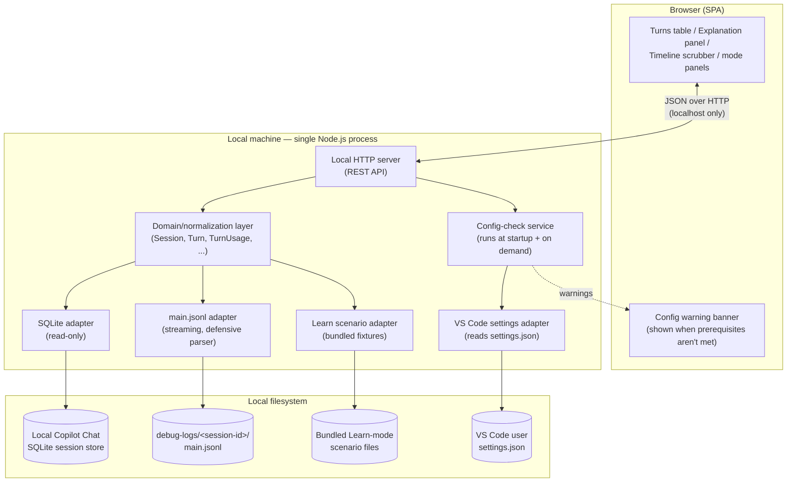
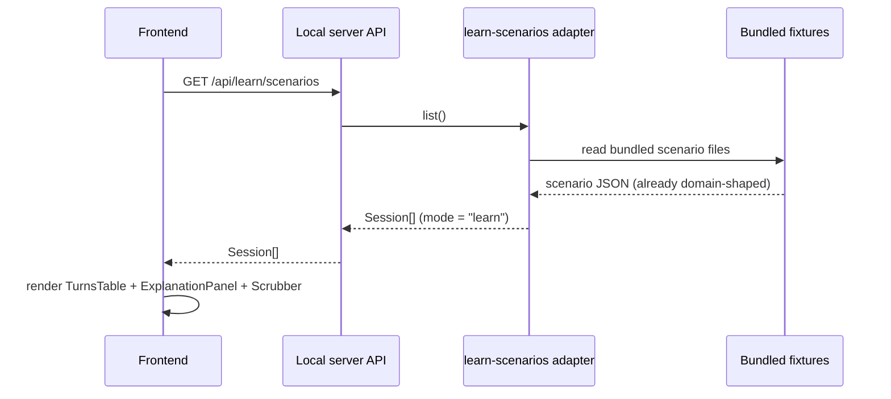
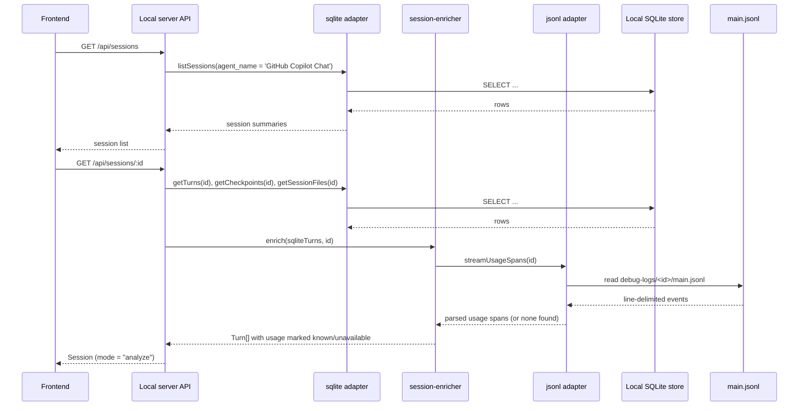
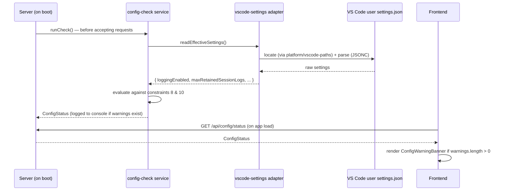

# Architecture: GitHub Copilot Chat Session Analyser

## 1. Purpose & scope

This document translates [vision.md](vision.md) into a concrete system design:
components, data flow, module boundaries, and technology choices. It exists so
implementation decisions (what talks to what, where a piece of logic lives)
are made once, deliberately, and can be revisited as a whole rather than
rediscovered file by file.

Nothing here changes the product scope in vision.md — this is the "how", not
the "what"/"why".

## 2. Guiding constraints (carried from the vision)

These constraints shape every decision below and should be checked against
before deviating from this document:

1. **Local-only, offline-first.** No dependency on the cloud-synced (DuckDB)
   store or any network service. Only the local SQLite session store and
   local `main.jsonl` debug-log files are read (vision §4, §6).
2. **A local server is required.** The browser cannot read arbitrary local
   files (SQLite DB, `.jsonl` logs) directly, so a small local process must
   read them and serve normalized data to the UI (vision §5).
3. **Decoupled visualization from data-loading.** The UI layer must not
   assume *how* data was sourced, so it can later be swapped into a VS Code
   webview without a rewrite (vision §5, §7).
4. **One shared visual language for Learn and Analyze modes.** Both modes
   render the same turns table / explanation panel / scrubber layout, so they
   must consume the same normalized data shape (vision §3.3).
5. **Defensive, version-tolerant parsing of `main.jsonl`.** Its `attrs` schema
   is undocumented and varies by event `type` and provider (vision §4, §7 open
   questions).
6. **Explicit "unavailable", never fabricated.** If a session's `attrs` lack
   usage data, the app must say per-token figures are unavailable and fall
   back to behavioral proxies (turn counts, duration, checkpoints) instead of
   showing zeros or estimates (vision §4).
7. **Single-developer, single-machine.** No multi-tenant concerns, no auth
   system — but still no unnecessary exposure of the local filesystem (see
   §11.2 Security).
8. **Rich `main.jsonl` content is opt-in, not default.** Verified directly:
   without the advanced, off-by-default VS Code setting
   `github.copilot.chat.agentDebugLog.fileLogging.enabled` (requires a
   window reload after toggling), `main.jsonl` contains only a
   `session_start` line — no usage data at all, for any session. The app
   must treat "no usage spans found" as the **expected default case**, not
   an edge case, and must guide the user to enable that setting for future
   sessions rather than silently falling back every time (vision §4).
9. **The app checks its own prerequisites at startup, not just per-session.**
   Rather than only reacting turn-by-turn (constraint 8), the server
   validates the relevant VS Code settings once at boot — and again on
   demand — and surfaces an actionable warning with concrete fix steps if
   they aren't met, instead of leaving the user to discover the gap only
   after loading a session that turns out to have no usage data (§6.3).
10. **A shallow retention window defeats the point of Analyze mode.**
    `github.copilot.chat.agentDebugLog.fileLogging.maxRetainedSessionLogs`
    defaults to 50, which only keeps the last 50 sessions' logs on disk. The
    app requires/recommends at least **200** so there's a meaningful pool of
    historical sessions to analyze, not just whatever ran most recently
    (§6.3).
11. **Development follows TDD; module design follows SOLID.** Tests are
    written before (or alongside, red-green-refactor) the implementation
    they verify, never retrofitted after the fact (§11.4). Every module
    boundary in §4/§10 is drawn along SOLID lines, not by convenience
    (§11.5).

## 3. High-level system overview



The browser never talks to SQLite or the filesystem directly — every read
goes through the local server's API, which normalizes both Learn-mode
scenarios and Analyze-mode real sessions into the **same domain shape**
(§5) before returning them. This is what lets the frontend stay ignorant of
where data came from, satisfying constraint 3.

## 4. Component breakdown

### 4.1 Local server (backend)

Responsibilities: own both data sources, normalize their output into the
shared domain model, and expose it over a small REST API. Never makes
outbound network calls.

| Module | Responsibility |
|---|---|
| `data-sources/sqlite` | Read-only queries against the local Copilot Chat session store (`sessions`, `turns`, `checkpoints`, `session_files`, `session_refs`) per vision §4/18.1 |
| `data-sources/jsonl` | Streams a session's `main.jsonl`, extracts request/response spans, and pulls out token/cache usage from each event's `attrs` — defensively, per §7 below |
| `data-sources/learn-scenarios` | Loads bundled scenario fixtures (seeded from [agentic-coding-explained.md](agentic-coding-explained.md)) that already conform to the domain model, so Learn mode needs no parsing/enrichment step |
| `services/session-enricher` | Joins SQLite turns with matching `main.jsonl` spans (by session id + turn index), producing one enriched `Turn` per row; marks `usage` fields explicitly `unavailable` when `attrs` don't carry them |
| `platform/vscode-paths` | Resolves the active VS Code variant's user-data directory across OSes (Linux/macOS/Windows, Stable/Insiders) so `sqlite`, `jsonl`, and `vscode-settings` all locate the right files without duplicating detection logic |
| `data-sources/vscode-settings` | Reads and merges the user (and workspace, if present) `settings.json` (JSONC) to read the prerequisite Copilot Chat debug-logging settings |
| `services/config-check` | Runs at server startup and on demand (§6.3): checks `agentDebugLog.fileLogging.enabled` and `maxRetainedSessionLogs` against constraints 8/10, producing actionable `ConfigWarning`s |
| `domain` | The shared normalized TypeScript types (§5), plus schema validation, used by every other module and re-exported to the frontend build |
| `api` | Thin REST layer (§8) that calls into `domain`/services and returns JSON; no business logic lives here |

### 4.2 Frontend (SPA)

Responsibilities: render the shared layout (vision §3.3) purely from the
normalized domain model returned by the API. It has **no knowledge** of
SQLite, `main.jsonl`, or scenario fixtures.

| Module | Responsibility |
|---|---|
| `components/TurnsTable` | Left panel: one row per turn (cache write/read, uncached, tool, vision, reasoning, output tokens, cost) |
| `components/ExplanationPanel` | Right panel: plain-language explanation for the selected turn |
| `components/TimelineScrubber` | Bottom slider driving the shared "selected turn" state |
| `components/SystemPromptBreakdown` | Analyze-mode-only: token contribution per system-prompt component |
| `components/ToolInventoryPanel` | Analyze-mode-only: tools loaded vs. tools actually invoked |
| `components/TurnDetail` | Analyze-mode-only: tools called and files touched for the selected turn, each with its own token count |
| `components/ConfigWarningBanner` | Persistent banner shown when `GET /api/config/status` reports unmet prerequisites; renders the exact setting name, current vs. recommended value, and step-by-step fix instructions (§6.3) |
| `state/session-store` | Holds the currently loaded `Session` (Learn scenario or Analyze session) and the selected turn index; the rest of the UI is a pure function of this state |
| `api-client` | Fetches from the local server's REST API; the only module that knows an HTTP boundary exists |
| `charts/*` | D3-based rendering used by the turns table and scrubber (token bars, cost sparkline, cache-hit ratio) |

### 4.3 Shared domain/schema package

The domain types in §5 are defined **once** and imported by both the server
(to shape its API responses) and the frontend (to type what it renders).
Keeping this in its own package (not duplicated ad hoc in each app) is what
makes constraint 3 (decoupling) actually enforceable rather than aspirational.

## 5. Domain model

Both modes normalize into the same shapes. Fields that only make sense for
real sessions (Analyze mode) are optional so Learn-mode scenarios can omit
them cleanly; fields that may be genuinely unknown (constraint 6) are typed
as an explicit union rather than defaulted to zero.

```ts
type TokenCount = { known: true; value: number } | { known: false; reason: string };

interface TurnUsage {
  uncachedInput: TokenCount;
  cacheWrite: TokenCount;
  cacheRead: TokenCount;
  tool: TokenCount;
  vision: TokenCount;
  reasoning: TokenCount;
  output: TokenCount;
  costUsd: TokenCount;
  model: string;
}

interface ToolCallRecord {
  name: string;
  argsSummary: string;
  filesTouched?: string[]; // Analyze mode only
  tokenCount?: TokenCount; // Analyze mode only
}

interface Turn {
  index: number;
  userMessage: string;
  assistantResponse: string;
  toolCalls: ToolCallRecord[];
  usage: TurnUsage;
  explanation: string; // "what happened this turn, and why" (both modes)
  triggeredEvent?: "model-switch" | "tool-change" | "compaction" | "clear" | "rewind" | "fork" | "cache-expiry";
}

interface SystemPromptComponent { // Analyze mode only
  kind: "built-in" | "repo-instructions" | "path-scoped-instructions" | "skill-manifest" | "tool-definitions";
  label: string;
  tokenCount: TokenCount;
}

interface ToolInventoryEntry { // Analyze mode only
  name: string;
  loaded: boolean;
  invokedInTurns: number[];
}

interface Session {
  id: string;
  mode: "learn" | "analyze";
  title: string;
  model: string;
  turns: Turn[];
  systemPrompt?: SystemPromptComponent[]; // Analyze mode only
  toolInventory?: ToolInventoryEntry[]; // Analyze mode only
  usageDataAvailable: boolean; // false ⇒ UI shows behavioral proxies, per constraint 6
}
```

Note this is the same reasoning as the "cost split" in vision §6 — each
`TokenCount` slot maps 1:1 onto a term in that section's cost formula.

`ConfigStatus` is a separate, session-independent shape — app health/
prerequisites, not session content — computed at startup and re-checked on
demand (§6.3):

```ts
interface ConfigWarning {
  code: "logging-disabled" | "retention-too-low" | "settings-not-found";
  settingId: string;
  currentValue: unknown;
  recommendedValue: unknown;
  message: string;
  helpSteps: string[]; // e.g. exact settings.json snippet + "reload VS Code"
}

interface ConfigStatus {
  checkedAt: string;
  vscodeUserSettingsPath: string | null; // null if no install/user-data-dir found
  loggingEnabled: boolean;
  maxRetainedSessionLogs: number | null; // null ⇒ VS Code default (50) applies
  warnings: ConfigWarning[];
}
```

## 6. Data flow

### 6.1 Learn mode



Learn-mode fixtures are authored directly in the domain shape (§5), so no
enrichment/parsing step is needed — they exist purely to seed realistic
`Turn`/`TurnUsage`/`explanation` data for teaching, per vision §3.1.

### 6.2 Analyze mode



If step "parsed usage spans" comes back empty, the enricher distinguishes
**why** rather than lumping every cause into one generic fallback, since one
cause is actionable and the others aren't:

- **`main.jsonl` has only a `session_start` line** (by far the most common
  case per constraint 8 — the user never had
  `github.copilot.chat.agentDebugLog.fileLogging.enabled` turned on while
  this session ran): `reason` is a specific, actionable message telling the
  user to enable that setting and reload VS Code for *future* sessions.
- **Older log format / missing `attrs` on an otherwise-populated log, or the
  log file was rotated away** (per `maxRetainedSessionLogs`/
  `maxSessionLogSizeMB`): `reason` is a generic "usage data unavailable for
  this session" message — nothing the user can retroactively fix.

Either way, every affected `TurnUsage` field is marked
`{ known: false, reason: ... }` and `usageDataAvailable: false` is set on
the `Session`, so the frontend renders the behavioral-proxy view (turn
counts/duration/checkpoints) instead of fake numbers — satisfying
constraint 6, with constraint 8's actionable case surfaced distinctly.

**Implementation note (Phase 3).** Phase 3 built `platform/vscode-paths`,
`data-sources/sqlite`, and a stubbed `services/session-enricher` (no `JL`
step yet — that's Phase 4). Facts and decisions discovered/made along the
way that weren't previously documented:

- The local session-store database (tables listed in vision/
  agentic-coding-explained §18.1) lives at
  `<user-data-dir>/User/globalStorage/github.copilot-chat/session-store.db`
  (WAL mode) — sibling to the `debug-logs/<session-id>/main.jsonl` path
  already noted in §7/§18.3, both under `globalStorage`, not
  `workspaceStorage`. `<user-data-dir>` resolution (§13's open question) is
  currently: prefer `~/.config/Code - Insiders`, fall back to
  `~/.config/Code`, Linux only — other platforms return "not found" until a
  later phase.
- `sessions` has no `title`/`model` column, but `Session` requires both:
  `title` falls back through `summary → repository → cwd → "Session <id>"`;
  `model` is the literal string `"unknown"` on both `Session.model` and
  every `Turn.usage.model` until Phase 4 recovers the real value from
  `main.jsonl`.
- `GET /api/sessions` returns summaries with `turns: []` (not full turn
  data) to avoid an unbounded join over every locally stored session;
  `GET /api/sessions/:id` returns the full session.
- Every `TurnUsage` field is stubbed with a single generic reason
  (`"main.jsonl parsing not yet implemented"`) — Phase 3 does not yet
  distinguish the two `reason` cases described above; that split is Phase
  4 work, once the `JL` step actually exists to tell them apart.
- `toolCalls` per turn ARE populated in Phase 3 (not left empty) by
  grouping `session_files` rows by `tool_name` for that turn — cheap to
  derive from data already being queried, and closer to "real turns" than
  omitting them.
- `data-sources/sqlite` exposes a tested `getCheckpointRows` query
  (checkpoint rows are real, structural data per §4.1), but `app.ts`/
  `session-enricher` don't call it yet — there's no `Turn.triggeredEvent`
  wiring for it in Phase 3. Mapping a checkpoint to the turn it interrupted
  needs timestamp-correlation heuristics that belong in a later phase, not
  "structural data only."

### 6.3 Startup configuration check



Two prerequisites are checked, each producing its own `ConfigWarning` when
unmet:

1. **`github.copilot.chat.agentDebugLog.fileLogging.enabled` must be
   `true`** (constraint 8) — otherwise every session's `main.jsonl` will
   only ever contain `session_start`. `helpSteps` walks the user through
   the resolved path to their `settings.json` (included in the warning),
   the exact key/value to add, and the reload-VS-Code-required note.
2. **`github.copilot.chat.agentDebugLog.fileLogging.maxRetainedSessionLogs`
   must be at least `200`** (constraint 10) — the VS Code default (50) only
   retains the last 50 session-log directories; Analyze mode needs a
   deep-enough pool of historical sessions to be useful, not just whatever
   happened to run most recently. `helpSteps` includes the exact key/value
   to add.

This check runs **once at server startup** — so a CLI user sees the warning
in the terminal immediately, before ever opening the browser — and again on
**every `GET /api/config/status` call**, so the frontend banner reflects
current state even if the user fixes settings and reloads VS Code without
restarting the analyser's own server. It never blocks startup or any other
endpoint: this is guidance, not a hard failure, applying constraint 6's
"explicit, not fabricated" philosophy to the app's own health rather than
to token data.

## 7. `main.jsonl` parsing strategy

This is the riskiest part of the system (vision §7 open question: the
`attrs` shape is undocumented and varies by event `type`/provider), so it's
isolated behind one seam:

- The `jsonl` adapter reads the file as a stream (never loads a whole
  session's log into memory at once — logs can be verbose per vision §18.3).
- Each line is parsed into a generic `{ v, ts, dur, sid, spanId, type, name, status, attrs }` envelope first; only `attrs` is type-specific.
- Extraction of usage fields from `attrs` is done through a small registry of
  **per-event-type extractors** (e.g. one for `assistant.usage`-shaped spans),
  each of which is defensive: unknown/missing fields are tolerated and
  reported as `unavailable` rather than throwing.
- Unknown `type` values are skipped, not treated as errors — new event types
  appearing in future VS Code versions must not break ingestion.
- Extractors are unit-tested against captured fixture lines (real, redacted
  `main.jsonl` samples covering each known event `type` and at least one
  "missing/older-shape" case) so a provider/version change is caught by a
  failing test rather than a silent wrong number.
- This registry is the intended extension point for the vision §7 open
  question ("most robust way to locate/parse token-usage fields... across
  model/provider versions") — new provider shapes get a new extractor, not a
  rewrite of the adapter.

**Confirmed gating setting (constraint 8).** Verified directly against this
machine's local logs: the tool-call/LLM-request/token-usage spans this
adapter looks for are only written when the advanced, off-by-default VS
Code setting `github.copilot.chat.agentDebugLog.fileLogging.enabled` is
turned on (its deprecated alias is `github.copilot.chat.agentDebugLog.enabled`;
toggling either requires a window reload to take effect). Without it, every
session's `main.jsonl` contains exactly one `session_start` event and
nothing else. The adapter's first job before running any extractor is
therefore a cheap check — *does this file contain more than one line/event?*
— so the enricher (§6.2) can immediately classify "logging was never
enabled" separately from "logging was enabled but this event's `attrs`
didn't parse". `github.copilot.chat.agentDebugLog.fileLogging.flushIntervalMs`
(default 4000ms) also means a session's very last few events may not be
flushed to disk yet if read immediately after the session ends — worth a
small retry/tolerance window rather than treating that as missing data.

## 8. API design

A minimal, read-only REST surface. No mutation endpoints exist — the app
never writes to the SQLite store or the log files (vision §6 non-goal:
read-only viewer).

| Method & path | Returns |
|---|---|
| `GET /api/learn/scenarios` | `Session[]` summaries (mode=`learn`) |
| `GET /api/learn/scenarios/:id` | Full `Session` for one scenario |
| `GET /api/sessions` | `Session[]` summaries from the local store, filtered to `agent_name = 'GitHub Copilot Chat'` (vision §18.2 scoping rule) |
| `GET /api/sessions/:id` | Full enriched `Session` (mode=`analyze`), including `usageDataAvailable` |
| `GET /api/sessions/:id/turns/:turnIndex` | Single `Turn` with full tool-call/file detail (used for on-demand deep dives, avoiding sending every turn's full detail up front) |
| `GET /api/config/status` | `ConfigStatus` — current prerequisite-setting check results and any `warnings[]` (§6.3) |

The server binds to `localhost` only (see §11.2).

## 9. Technology stack

| Layer | Choice | Rationale |
|---|---|---|
| Backend language/runtime | TypeScript on Node.js | Same language as frontend and shared domain package; good SQLite and streaming support |
| Local HTTP server | Express (or Fastify) | Minimal REST surface (§8); no need for anything heavier |
| SQLite access | `node:sqlite` (`DatabaseSync`, read-only connection) | Built into Node.js (experimental) — synchronous, well-suited to local read-only queries against the store described in vision §18.1, no native-addon dependency to install/audit |
| `main.jsonl` parsing | Node streams + `readline`, hand-rolled extractor registry (§7) | No fixed schema exists to codegen against; defensive parsing needs full control |
| Schema validation | `zod` (or equivalent) shared in the domain package | Runtime-validates data crossing the server/frontend boundary, and doubles as the TS type source |
| Frontend framework | React + TypeScript + Vite | Fast local dev loop; component model matches the panel breakdown in §4.2 |
| Visualization | D3.js | Explicitly suggested in vision §5; fine-grained control over the turns table's per-token-type bars and the scrubber |
| Settings parsing | `jsonc-parser` (same library VS Code itself uses) | `settings.json` allows comments/trailing commas; a strict `JSON.parse` would break on real-world files (§6.3) |
| Monorepo tooling | npm workspaces | Small project; avoids adding a build-orchestration tool (Turborepo/Nx) before it's needed |

These are default choices consistent with the constraints, not locked in —
see §13 for what's still open.

## 10. Proposed project structure

```
gh-cp-chat-analyser/
  docs/
    vision.md
    architecture.md
    agentic-coding-explained.md
  packages/
    domain/           # shared TS types + zod schemas (§5)
    server/
      src/
        data-sources/
          sqlite/
          jsonl/
          learn-scenarios/
          vscode-settings/
        services/
          session-enricher/
          config-check/
        platform/
          vscode-paths/
        api/
      fixtures/        # bundled Learn-mode scenario files + jsonl test fixtures (§7)
    web/
      src/
        components/
        state/
        api-client/
        charts/
  package.json          # workspaces root
```

`domain` has no dependency on `server` or `web`; both of those depend on
`domain`. This is the enforced version of constraint 3.

## 11. Non-functional concerns

### 11.1 Performance

- `main.jsonl` files are streamed line-by-line, never fully buffered.
- The turns table fetches full session detail once per session load; very
  long sessions may later need per-turn lazy loading via
  `GET /api/sessions/:id/turns/:turnIndex` instead of embedding full tool-call
  detail in the initial payload — start simple, add pagination if profiling
  shows it's needed.

### 11.2 Security

- The local server binds to `localhost`/loopback only — never `0.0.0.0` —
  since it exposes session contents (which may include file paths, code
  snippets, terminal output).
- `sessionId` (and any other path parameter used to build a filesystem path
  under `debug-logs/`) is validated against an allow-list pattern before use,
  to prevent path traversal into arbitrary files on disk.
- SQLite connections are opened **read-only**; the app has no write path into
  the user's real Copilot Chat store (defense in depth beyond just "we don't
  call INSERT/UPDATE").
- No outbound network calls anywhere in the server (constraint 1) — this is
  also a security property, not just a product one: nothing in a session log
  (which can contain sensitive repo content) ever leaves the machine.
- No secrets are logged; any credentials that happen to appear in captured
  terminal-output tool results are treated as opaque strings, never parsed or
  echoed into error messages.
- Only the latest stable, non-vulnerable version of each dependency may be
  added or upgraded to (see §11.6); a dependency with a known unpatched
  vulnerability is not introduced regardless of how minor its role is.

### 11.3 Graceful degradation

- Every stage that can fail partially (missing `main.jsonl`, malformed line,
  older schema without usage `attrs`, or
  `agentDebugLog.fileLogging.enabled` never having been turned on for that
  session) degrades to the explicit `unavailable` state described in
  §5/§6.2, never to a fabricated number — this is constraint 6 and is
  treated as a correctness requirement, not a UI nicety.
- The specific, actionable case (setting was off) is surfaced with guidance
  to fix it going forward, not just a generic "unavailable" label — this is
  constraint 8 and is the difference between a dead end and a useful next
  step for the user.

### 11.4 Testing (test-driven)

Every module in §4/§10 is built test-first (constraint 11): a failing test
is written against the module's public contract before its implementation
exists, then the minimum implementation is written to make it pass, then
refactored — red-green-refactor, not tests bolted on afterward.

- `jsonl` extractors: for each known event `type` (and one "old/missing
  shape" case), write the fixture + failing test first, then implement the
  extractor against it.
- `session-enricher`: write the test asserting SQLite-turn + jsonl-span
  joins produce the right `Turn[]` (and that a missing/empty jsonl file
  yields `usageDataAvailable: false` rather than an error) before wiring the
  join logic itself.
- `domain` schemas: write a sample object (Learn fixture shape and
  Analyze-mode shape) and its schema-validation test before finalizing the
  TypeScript type, so the schema and the type are pinned down together.
- `services/config-check`: write the test for each `ConfigWarning` case
  (logging disabled, retention too low, settings not found) before
  implementing the check that produces it.

### 11.5 Code quality: SOLID

The module boundaries chosen in §4/§10 map onto SOLID directly, and any new
module should be justified against these before being added:

- **Single Responsibility** — each `data-sources/*` adapter has exactly one
  reason to change: the shape of the one thing it reads (SQLite schema,
  `main.jsonl` envelope, `settings.json` format, scenario fixture format).
  Each `services/*` module owns exactly one piece of business logic
  (enrichment, config checking). Each frontend `components/*` renders
  exactly one panel.
- **Open/Closed** — the `jsonl` extractor registry (§7) is extended by
  adding a new per-event-type extractor, never by modifying the adapter's
  streaming/dispatch logic; new provider/version formats are additive.
- **Liskov Substitution** — any `data-sources/*` adapter can be replaced by
  an alternative implementation (e.g. a future cloud-store adapter) without
  changing `services/session-enricher` or the `api` layer, as long as it
  returns the `domain`-shaped data its callers expect.
- **Interface Segregation** — the frontend depends only on `api-client`'s
  narrow fetch surface, not on server internals; each panel component
  receives only the slice of `Session`/`Turn` it needs, not the full object
  graph.
- **Dependency Inversion** — `server` and `web` both depend on the `domain`
  package's types/schemas as the shared abstraction; neither depends on the
  other's implementation. This is the concrete mechanism behind constraint
  3's decoupling requirement.

### 11.6 Dependency management

- **Only the latest stable, non-vulnerable release of a dependency may be
  used**, at time of adding it and at time of any upgrade. "Stable" excludes
  pre-release/alpha/beta/RC tags and anything below `1.0.0` unless no stable
  release exists at all; "non-vulnerable" means no known unpatched advisory
  (e.g. from `npm audit` or GitHub Dependabot alerts) at that version.
- Before adding a new dependency, check its latest stable version and run
  `npm audit` (or check its advisory database entry) as part of the same
  change — don't pin to an older version "for safety" without recording why
  in the PR/commit.
- If a dependency's only non-vulnerable release is a major version bump with
  breaking changes, take the breaking upgrade rather than staying on a
  vulnerable older major — update the affected code in the same change.
- Applies to every `package.json` in the workspace (`domain`, `server`,
  `web`, and the workspace root), including dev dependencies.
- If a fix isn't yet available upstream for a reported vulnerability, this is
  the one allowed exception — pin to the latest available version and leave
  a comment in `package.json`/the PR noting the advisory being tracked and
  why it can't yet be resolved.

## 12. Future path: VS Code extension packaging

Per vision §5, the app may later be repackaged as a VS Code webview. Under
this architecture that means:

- `packages/web` (the SPA) is reused largely as-is inside the webview.
- `packages/server`'s HTTP layer is replaced by the extension host calling
  `data-sources/*` and `services/*` directly in-process (via message passing
  to the webview instead of `fetch`), but the `sqlite`/`jsonl` adapters and
  `session-enricher` logic do not need to change, since they already only
  depend on `domain` types and local file/DB paths.
- The `api-client` module in `packages/web` is the single seam that would be
  swapped (HTTP calls → `postMessage`/`acquireVsCodeApi` calls); no component
  or chart code should need to change.
- `services/config-check`'s warnings (§6.3) get strictly better in the
  extension form: instead of only text `helpSteps`, a warning's fix action
  can call `vscode.commands.executeCommand('workbench.action.openSettings',
  settingId)` to jump straight to the relevant setting — something the
  standalone web app has no way to do since it has no VS Code API access.

## 13. Open architecture decisions

Carried over from vision §7 plus new ones raised while designing this layer:

- Confirming the extractor registry (§7) against a real, multi-version corpus
  of `main.jsonl` files now that
  `github.copilot.chat.agentDebugLog.fileLogging.enabled` has been turned on
  on this machine (previously blocked: every local log only had
  `session_start`) — still need fixture captures across more event `type`s
  than have been observed so far.
- How `platform/vscode-paths` should behave when multiple VS Code
  variants/installs exist on one machine (Stable + Insiders, or several
  profiles) — Phase 3 resolved this minimally (Linux only: prefer Insiders,
  fall back to Stable, no per-workspace matching), not the deeper
  auto-detect-by-workspace or explicit-configuration approaches; still open
  for macOS/Windows and for multi-profile setups on any platform.
- Whether the 200-session retention minimum (constraint 10) should stay a
  hard-coded constant in `config-check`, or become an app-level
  configurable threshold.
- Whether large sessions need per-turn lazy loading (§11.1) or whole-session
  payloads stay acceptable in practice.
- Express vs. Fastify for the server (functionally interchangeable here;
  pick based on team familiarity).
- Whether Learn-mode scenarios ship as static JSON files or as TypeScript
  fixtures with computed fields (author ergonomics vs. easy schema
  validation) — leaning JSON validated by the `domain` zod schema so
  non-engineers could in principle contribute scenarios later.
- How aggressively to keep seeded Learn scenarios in sync with
  [agentic-coding-explained.md](agentic-coding-explained.md) as it evolves —
  the vision doc doesn't mandate automated drift-checking, but a periodic
  manual review is worth deciding on explicitly.
