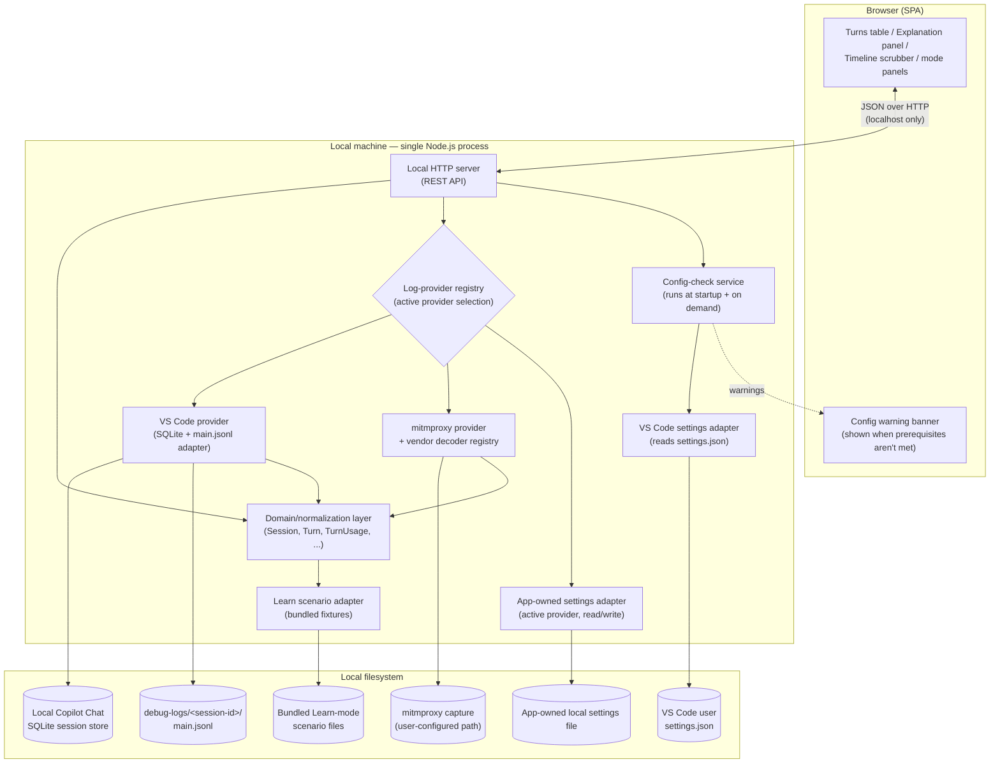
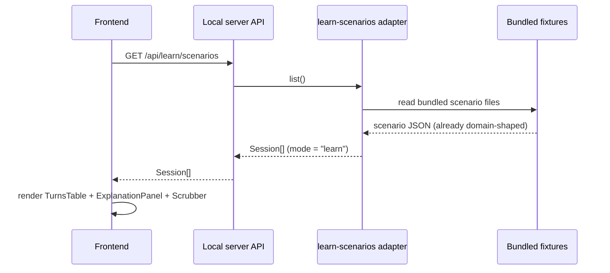
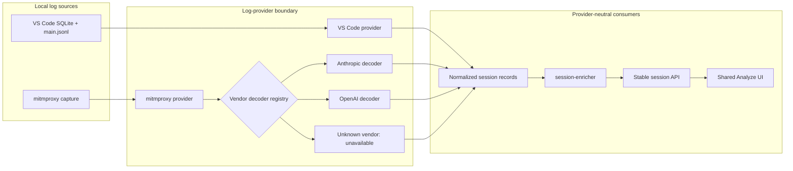
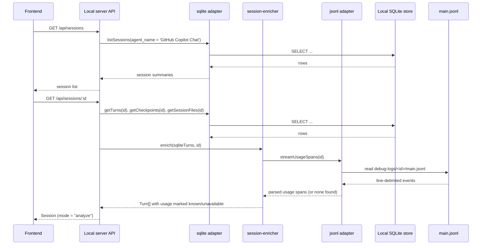
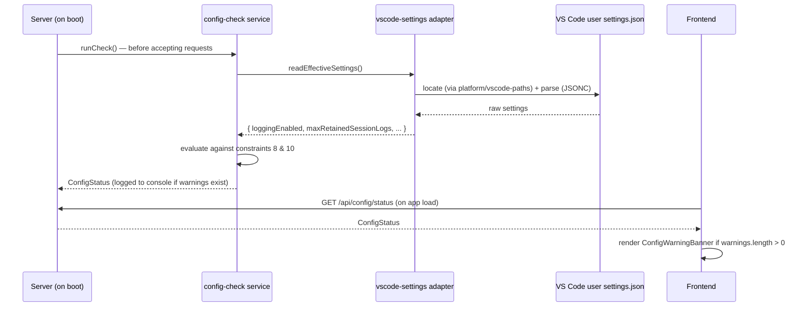

# Architecture: GitHub Copilot Chat Cost & Token Usage Analyzer

## 1. Purpose & scope

This document translates [vision.md](vision.md) into a concrete system design:
components, data flow, module boundaries, and technology choices. It exists so
implementation decisions (what talks to what, where a piece of logic lives)
are made once, deliberately, and can be revisited as a whole rather than
rediscovered file by file.

Nothing here changes the product scope in vision.md — this is the "how", not
the "what"/"why".

## 2. Guiding constraints (carried from the vision)

These constraints shape every decision below and should be checked against
before deviating from this document:

1. **Local-only, offline-first.** No dependency on the cloud-synced (DuckDB)
   store or any network service. Only local sources reachable through a
   configured log provider — the SQLite session store, local `main.jsonl`
   debug-log files, and local mitmproxy captures — are read (vision §4, §6).
2. **A local server is required.** The browser cannot read arbitrary local
   files (SQLite DB, `.jsonl` logs) directly, so a small local process must
   read them and serve normalized data to the UI (vision §5).
3. **Decoupled visualization from data-loading.** The UI layer must not
   assume *how* data was sourced, so it can later be swapped into a VS Code
   webview without a rewrite (vision §5, §7).
4. **One shared visual language for Learn and Analyze modes.** Both modes
   render the same turns table / explanation panel / scrubber layout, so they
   must consume the same normalized data shape (vision §3.3).
5. **Defensive, version-tolerant parsing of `main.jsonl`.** Its `attrs` schema
   is undocumented and varies by event `type` and provider (vision §4, §7 open
   questions).
6. **Explicit "unavailable", never fabricated.** If a session's `attrs` lack
   usage data, the app must say per-token figures are unavailable and fall
   back to behavioral proxies (turn counts, duration, checkpoints) instead of
   showing zeros or estimates (vision §4). One narrow, deliberate exception
   (§6.2.2 Phase 6 addendum): a `TokenCount` may carry `estimated: true` when
   it's a real local-tokenizer count run over real captured text — never a
   fabricated number or a char-count-divided-by-N guess — and every place
   that renders it labels it visibly as an estimate. Still forbidden
   wherever the underlying text itself isn't captured.
7. **Single-developer, single-machine.** No multi-tenant concerns, no auth
   system — but still no unnecessary exposure of the local filesystem (see
   §11.2 Security).
8. **Rich `main.jsonl` content is opt-in, not default.** Verified directly:
   without the advanced, off-by-default VS Code setting
   `github.copilot.chat.agentDebugLog.fileLogging.enabled` (requires a
   window reload after toggling), `main.jsonl` contains only a
   `session_start` line — no usage data at all, for any session. The app
   must treat "no usage spans found" as the **expected default case**, not
   an edge case, and must guide the user to enable that setting for future
   sessions rather than silently falling back every time (vision §4).
9. **The app checks its own prerequisites at startup, not just per-session.**
   Rather than only reacting turn-by-turn (constraint 8), the server
   validates the relevant VS Code settings once at boot — and again on
   demand — and surfaces an actionable warning with concrete fix steps if
   they aren't met, instead of leaving the user to discover the gap only
   after loading a session that turns out to have no usage data (§6.3).
10. **A shallow retention window defeats the point of Analyze mode.**
    `github.copilot.chat.agentDebugLog.fileLogging.maxRetainedSessionLogs`
    defaults to 50, which only keeps the last 50 sessions' logs on disk. The
    app requires/recommends at least **200** so there's a meaningful pool of
    historical sessions to analyze, not just whatever ran most recently
    (§6.3).
11. **Development follows TDD; module design follows SOLID.** Tests are
    written before (or alongside, red-green-refactor) the implementation
    they verify, never retrofitted after the fact (§11.4). Every module
    boundary in §4/§10 is drawn along SOLID lines, not by convenience
    (§11.5).
12. **Analyze ingestion is provider-extensible.** VS Code local logs and
  mitmproxy captures are both supported log providers. A provider converts
  its source into the normalized domain model through a provider-local
  decoder pipeline; adding one must not change the session API contract or
  frontend components. mitmproxy decoders are vendor-specific (at least
  Anthropic and OpenAI) because their SDK wire formats differ.

## 3. High-level system overview



The browser never talks to SQLite, mitmproxy captures, or the filesystem
directly — every read goes through the local server's API, which normalizes
Learn-mode scenarios and Analyze-mode sessions from whichever log provider is
active into the **same domain shape** (§5) before returning them. This is
what lets the frontend stay ignorant of where data came from, satisfying
constraint 3. See §6.2.1 for the provider boundary in detail.

## 4. Component breakdown

### 4.1 Local server (backend)

Responsibilities: own both data sources, normalize their output into the
shared domain model, and expose it over a small REST API. Never makes
outbound network calls.

| Module | Responsibility |
|---|---|
| `data-sources/sqlite` | Read-only queries against the local Copilot Chat session store (`sessions`, `turns`, `checkpoints`, `session_files`, `session_refs`) per vision §4/18.1 |
| `data-sources/jsonl` | Streams a session's `main.jsonl`, extracts request/response spans, and pulls out token/cache usage from each event's `attrs` — defensively, per §7 below. `turn-inspector-reader.ts` (Phase 9.5) is a second, on-demand, bounded read of the same file for one turn's wide-content `attrs` (§6.2.4) |
| `data-sources/log-providers` | Owns the `LogProvider` registry, exposes provider descriptors, persists the active provider in app-owned local settings, and presents one provider-neutral session-reading interface to the API/services layer. `build-content-parts.ts` (Phase 9.5) is a provider-neutral placeholder-detection helper shared by both concrete providers' `readTurnDetail` (§6.2.4) |
| `data-sources/log-providers/vscode` | Adapts the existing SQLite and `main.jsonl` readers into the `LogProvider` interface; VS Code-specific paths, settings, and event extraction stay here. Also owns the optional `agent-traces.db` cache-write/reasoning enrichment (Phase 8.5) — folded in here, not a separate provider id or a direct `app.ts` path (decided 2026-08-10, see `docs/log-provider-alternatives.md`) — and `turn-inspector-builder.ts` (Phase 9.5), which turns one turn's isolated envelopes into a `TurnInspectorDetail` (§6.2.4) |
| `data-sources/log-providers/mitmproxy` | Reads local mitmproxy capture files and dispatches each intercepted LLM request/response to the vendor decoder that recognizes its SDK/protocol shape |
| `data-sources/log-providers/mitmproxy/decoders` | Independent vendor decoders (initially Anthropic and OpenAI) that convert a matched exchange into provider-neutral intermediate records; an unrecognized exchange is reported as unavailable, never guessed |
| `data-sources/learn-scenarios` | Loads bundled scenario fixtures (seeded from [agentic-coding-explained.md](agentic-coding-explained.md)) that already conform to the domain model, so Learn mode needs no parsing/enrichment step |
| `services/session-enricher` | Converts a selected provider's normalized structural/usage records into `Session`/`Turn` values; it does not know whether they originated in VS Code, mitmproxy, Anthropic, or OpenAI |
| `platform/vscode-paths` | Resolves the active VS Code variant's user-data directory across OSes (Linux/macOS/Windows, Stable/Insiders) so `sqlite`, `jsonl`, and `vscode-settings` all locate the right files without duplicating detection logic |
| `data-sources/vscode-settings` | Reads and merges the user (and workspace, if present) `settings.json` (JSONC) to read the prerequisite Copilot Chat debug-logging settings |
| `services/config-check` | Runs at server startup and on demand (§6.3): checks `agentDebugLog.fileLogging.enabled` and `maxRetainedSessionLogs` against constraints 8/10, producing actionable `ConfigWarning`s |
| `domain` | The shared normalized TypeScript types (§5), plus schema validation, used by every other module and re-exported to the frontend build |
| `api` | Thin REST layer (§8) that calls into `domain`/services and returns JSON; no business logic lives here |

### 4.2 Frontend (SPA)

Responsibilities: render the shared layout (vision §3.3) purely from the
normalized domain model returned by the API. It has **no knowledge** of
SQLite, `main.jsonl`, or scenario fixtures.

| Module | Responsibility |
|---|---|
| `components/AppHeader` | Brand mark/wordmark, the Learn/Analyze mode `SegmentedControl`, a provider `Select` in Analyze mode, and the Config button (or a static "Config ✓" tag when there are no warnings) |
| `components/SessionList` | Left panel: searchable, scrollable list of `Session` cards (Learn scenarios or Analyze sessions, per mode) with a category/relative-time kicker and turn count |
| `components/TurnsTable` | Center panel: one row per turn — Turn, Trigger, Rounds, Uncached in, Cache read, Cache write, Tool, Vision, Reasoning, Output, AI Credits, Cumulative, Model |
| `components/ExplanationPanel` | Right panel: plain-language explanation for the selected turn, plus (Analyze mode only) a "Tool calls this turn" block listing that turn's tool calls and touched files, and an "Inspect request/response" button opening `TurnInspector` |
| `components/TurnInspector` | Analyze-mode-only, full-page view (replaces the 3-column layout, not a tab), structured like `SystemPromptInspector`: one Request/Response `Blueprint` card pair per LLM round-trip for the selected turn, reasoning shown inline under the response with no toggle, oversized/file/image content rendered as `Tag`-styled placeholder chips instead of raw text. No provider-specific branching — both `LogProvider`s implement `readTurnDetail` (§6.2.4) |
| `components/TimelineScrubber` | Bottom slider driving the shared "selected turn" state |
| `components/SystemPromptBreakdown` | Analyze-mode-only: token contribution per system-prompt component (real or, where labeled, tokenizer-estimated), rendered as a proportional bar-meter; opens `SystemPromptInspector` for the base prompt |
| `components/SystemPromptInspector` | Analyze-mode-only, full-page form (replaces the 3-column layout, not a tab): a three-pane view over the raw captured system-prompt text — a colored hierarchical tag/subtag menu (left), the byte-for-byte raw text with matching per-section background colors (center, scrolls to the clicked menu entry), and a description panel (right) explaining the selected tag, honestly labeled `Sourced` (with links) or `Not independently sourced` per constraint 6's spirit. Built entirely client-side from `lib/system-prompt-parser.ts` (defensive tag-tree parser), `lib/system-prompt-menu.ts` (labels + an 8-hue categorical palette), `lib/system-prompt-text.ts` (lossless colored-segment renderer), and `lib/system-prompt-descriptions.ts` (the tag glossary) — no new API surface, reuses `GET /api/sessions/:id/system-prompt` |
| `components/ToolInventoryPanel` | Analyze-mode-only: tools loaded vs. tools actually invoked |
| `components/ConfigWarningBanner` | Dismissible banner shown when `GET /api/config/status` reports unmet prerequisites; renders the exact setting name, current vs. recommended value, and step-by-step fix instructions (§6.3) |
| `components/ui/*` | Shared design-system primitives (`Blueprint`, `Tag`, `SegmentedControl`) used across the components above, per the "Industry" design tokens in `theme.css` |
| `state/session-store` | Holds the currently loaded `Session`, selected turn index, Learn/Analyze `mode`, selected Analyze log-provider id, and right-column `rightTab` (Analyze mode only); the rest of the UI is a pure function of this state |
| `api-client` | Fetches provider descriptors, selects the active provider, and fetches sessions through the stable REST API; it is the only frontend module that knows an HTTP boundary exists |
| `charts/*` | D3-based AI Credits sparkline rendered in the center column's header row |

### 4.3 Shared domain/schema package

The domain types in §5 are defined **once** and imported by both the server
(to shape its API responses) and the frontend (to type what it renders).
Keeping this in its own package (not duplicated ad hoc in each app) is what
makes constraint 3 (decoupling) actually enforceable rather than aspirational.

## 5. Domain model

Both modes normalize into the same shapes. Fields that only make sense for
real sessions (Analyze mode) are optional so Learn-mode scenarios can omit
them cleanly; fields that may be genuinely unknown (constraint 6) are typed
as an explicit union rather than defaulted to zero.

```ts
type TokenCount =
  | { known: true; value: number; estimated?: boolean } // estimated ⇒ real tokenizer count over real captured text, not a billed figure (constraint 6)
  | { known: false; reason: string };

interface TurnUsage {
  uncachedInput: TokenCount;
  cacheWrite: TokenCount;
  cacheRead: TokenCount;
  tool: TokenCount;
  vision: TokenCount;
  reasoning: TokenCount;
  output: TokenCount;
  costAiCredits: TokenCount;
  model: string;
  roundsCount?: number; // LLM request/response round-trips this turn made; absent when the source doesn't compute it
}

interface ToolCallRecord {
  name: string;
  argsSummary: string;
  filesTouched?: string[]; // Analyze mode only
  tokenCount?: TokenCount; // Analyze mode only
}

interface Turn {
  index: number;
  userMessage: string;
  assistantResponse: string;
  toolCalls: ToolCallRecord[];
  usage: TurnUsage;
  explanation: string; // "what happened this turn, and why" (both modes)
  triggeredEvent?: "model-switch" | "tool-change" | "compaction" | "clear" | "rewind" | "fork" | "cache-expiry";
}

interface SystemPromptComponent { // Analyze mode only
  kind: "built-in" | "repo-instructions" | "path-scoped-instructions" | "skill-manifest" | "tool-definitions";
  label: string;
  tokenCount: TokenCount;
}

interface ToolInventoryEntry { // Analyze mode only
  name: string;
  loaded: boolean;
  invokedInTurns: number[];
}

interface Session {
  id: string;
  mode: "learn" | "analyze";
  providerId?: string; // Analyze mode only; supplied by the selected log provider
  title: string;
  model: string;
  turns: Turn[];
  systemPrompt?: SystemPromptComponent[]; // Analyze mode only
  toolInventory?: ToolInventoryEntry[]; // Analyze mode only
  usageDataAvailable: boolean; // false ⇒ UI shows behavioral proxies, per constraint 6
  category?: string; // Learn mode only — authored once per fixture, e.g. "Prompt caching"
  startedAt?: string; // Analyze mode only — ISO date, sourced from sessions.created_at
}
```

Log-provider selection is a separate app-level contract, not a provider-
specific API or UI branch:

```ts
interface LogProviderDescriptor {
  id: string; // stable machine-readable id, e.g. "vscode" or "mitmproxy"
  label: string;
  available: boolean; // provider can currently read its configured local source
  unavailableReason?: string;
}

interface LogProviderStatus {
  providers: LogProviderDescriptor[];
  activeProviderId: string;
}
```

The API and UI use these generic shapes only. Provider configuration,
capture-file discovery, and vendor protocol details do not escape the
provider implementation. Changing the active provider clears the selected
Analyze session and reloads the same `GET /api/sessions` resource; Learn mode
is unaffected.

`TurnInspectorDetail` (Phase 9.5) is a per-turn analog of
`SystemPromptComponent`, deliberately **not** a field on `Turn` itself — it's
fetched on demand via `GET /api/sessions/:id/turns/:turnIndex` (§8) rather
than sent with every turn up front, since this content (the turn's actual
LLM request/response round-trip(s)) can be arbitrarily large:

```ts
type ContentPlaceholder = {
  placeholder: true;
  kind: "file" | "image";
  path?: string;
  sizeBytes?: number;
};

type MessageContentPart = { kind: "text"; text: string } | ContentPlaceholder;

interface TurnInspectorDetail {
  turnIndex: number;
  userMessage: MessageContentPart[];
  rounds: {
    request: { index: number; addedMessages: MessageContentPart[]; toolCalls: { name: string; args: MessageContentPart[]; result: MessageContentPart[] }[] };
    response: { index: number; response: MessageContentPart[]; reasoning?: MessageContentPart[] };
  }[];
}
```

`rounds: []` is a valid, non-error value (the turn genuinely made no model
request), distinct from `readTurnDetail` returning `null` (the session or
turn index doesn't exist at all) — see §6.2.4.

Note this is the same reasoning as the "AI Credits split" in vision §6 — each
`TokenCount` slot maps 1:1 onto a term in that section's AI Credits formula.

`ConfigStatus` is a separate, session-independent shape — app health/
prerequisites, not session content — computed at startup and re-checked on
demand (§6.3):

```ts
interface ConfigWarning {
  code: "logging-disabled" | "retention-too-low" | "settings-not-found";
  settingId: string;
  currentValue: unknown;
  recommendedValue: unknown;
  message: string;
  helpSteps: string[]; // e.g. exact settings.json snippet + "reload VS Code"
}

interface ConfigStatus {
  checkedAt: string;
  vscodeUserSettingsPath: string | null; // null if no install/user-data-dir found
  loggingEnabled: boolean;
  maxRetainedSessionLogs: number | null; // null ⇒ VS Code default (50) applies
  warnings: ConfigWarning[];
}
```

## 6. Data flow

### 6.1 Learn mode



Learn-mode fixtures are authored directly in the domain shape (§5), so no
enrichment/parsing step is needed — they exist purely to seed realistic
`Turn`/`TurnUsage`/`explanation` data for teaching, per vision §3.1.

### 6.2 Analyze mode

#### 6.2.1 Provider-neutral ingestion

`LogProvider` is the boundary between source-specific parsing and the rest of
Analyze mode. It lists session summaries and reads one session as normalized
structural records plus usage/tool/prompt artifacts. The API and
`session-enricher` depend only on that contract. Provider registration is
explicit at server composition time; a provider is not dynamically loaded
from arbitrary local code.

The VS Code provider adapts the existing SQLite and `main.jsonl` path. The
mitmproxy provider reads only a user-configured local capture path and uses a
second registry of `MitmExchangeDecoder`s. Each decoder declares whether it
recognizes an intercepted exchange and, when it does, converts that
vendor-SDK request/response pair into provider-neutral records. Initial
decoders cover Anthropic and OpenAI SDK traffic. A decoder must preserve
observed token/caching fields when present and mark fields unavailable when a
vendor omits them; it must never estimate or infer billing figures. Unknown
vendors and malformed exchanges remain visible as unavailable data without
preventing other sessions from loading.



The provider boundary is the architectural seam: source-specific file access
and vendor protocol decoding end at normalized session records. The enricher,
API, and UI consume only those records, so adding a provider or decoder does
not require API or UI changes.

#### 6.2.2 VS Code provider flow



If step "parsed usage spans" comes back empty, the enricher distinguishes
**why** rather than lumping every cause into one generic fallback, since one
cause is actionable and the others aren't:

- **`main.jsonl` has only a `session_start` line** (by far the most common
  case per constraint 8 — the user never had
  `github.copilot.chat.agentDebugLog.fileLogging.enabled` turned on while
  this session ran): `reason` is a specific, actionable message telling the
  user to enable that setting and reload VS Code for *future* sessions.
- **Older log format / missing `attrs` on an otherwise-populated log, or the
  log file was rotated away** (per `maxRetainedSessionLogs`/
  `maxSessionLogSizeMB`): `reason` is a generic "usage data unavailable for
  this session" message — nothing the user can retroactively fix.

Either way, every affected `TurnUsage` field is marked
`{ known: false, reason: ... }` and `usageDataAvailable: false` is set on
the `Session`, so the frontend renders the behavioral-proxy view (turn
counts/duration/checkpoints) instead of fake numbers — satisfying
constraint 6, with constraint 8's actionable case surfaced distinctly.

**Implementation note (Phase 3).** Phase 3 built `platform/vscode-paths`,
`data-sources/sqlite`, and a stubbed `services/session-enricher` (no `JL`
step yet — that's Phase 4). Facts and decisions discovered/made along the
way that weren't previously documented:

- The local session-store database (tables listed in vision/
  agentic-coding-explained §18.1) lives at
  `<user-data-dir>/User/globalStorage/github.copilot-chat/session-store.db`
  (WAL mode). **Correction (Phase 4):** this note originally claimed
  `debug-logs/<session-id>/main.jsonl` was a sibling under the same
  `globalStorage` path — verified wrong once real logs existed to check
  against. `main.jsonl` actually lives per-workspace, at
  `<user-data-dir>/User/workspaceStorage/<workspace-hash>/GitHub.copilot-chat/debug-logs/<session-id>/`
  (note the differing case, `GitHub.copilot-chat` vs. `github.copilot-chat`),
  matching what agentic-coding-explained.md §18.3 and vision.md §4 said all
  along. See the Phase 4 note below for how the adapter handles not knowing
  a session's workspace hash ahead of time. `<user-data-dir>` resolution
  (§13's open question) is currently: prefer `~/.config/Code - Insiders`,
  fall back to `~/.config/Code`, Linux only — other platforms return "not
  found" until a later phase.
- `sessions` has no `title`/`model` column, but `Session` requires both:
  `title` falls back through `summary → repository → cwd → "Session <id>"`;
  `model` is the literal string `"unknown"` on both `Session.model` and
  every `Turn.usage.model` until Phase 4 recovers the real value from
  `main.jsonl`.
- `GET /api/sessions` returns summaries with `turns: []` (not full turn
  data) to avoid an unbounded join over every locally stored session;
  `GET /api/sessions/:id` returns the full session.
- Every `TurnUsage` field is stubbed with a single generic reason
  (`"main.jsonl parsing not yet implemented"`) — Phase 3 does not yet
  distinguish the two `reason` cases described above; that split is Phase
  4 work, once the `JL` step actually exists to tell them apart.
- `toolCalls` per turn ARE populated in Phase 3 (not left empty) by
  grouping `session_files` rows by `tool_name` for that turn — cheap to
  derive from data already being queried, and closer to "real turns" than
  omitting them.
- `data-sources/sqlite` exposes a tested `getCheckpointRows` query
  (checkpoint rows are real, structural data per §4.1), but `app.ts`/
  `session-enricher` don't call it yet — there's no `Turn.triggeredEvent`
  wiring for it in Phase 3. Mapping a checkpoint to the turn it interrupted
  needs timestamp-correlation heuristics that belong in a later phase, not
  "structural data only."

**Implementation note (Phase 4, complete).** `agentDebugLog.fileLogging`
was confirmed enabled and, once real sessions had run under it, real
`llm_request` spans were captured, redacted into fixtures, and used to
build the extractor registry per TDD (§11.4). Facts and decisions from
this slice:

- `data-sources/jsonl/main-jsonl-reader.ts` streams a file via `readline`
  and defensively parses each line into the generic envelope, skipping
  malformed/unrecognizable lines. `classifyEnvelopesAvailability` (pure,
  sync) applies the §7 gating check to an already-parsed envelope array;
  `classifyMainJsonlAvailability` is a thin file-reading wrapper around it
  for callers that don't need the envelopes themselves. Returns one of
  `"missing"` (file not found — e.g. rotated away per
  `maxRetainedSessionLogs`), `"logging-never-enabled"` (file has at most
  the one `session_start` line), or `"events-present"`.
- **Real event shape, captured from this machine's own logs once logging
  was on.** A session's `main.jsonl` (once populated) contains
  `session_start`, `user_message`, `turn_start`/`turn_end`, `discovery`,
  `generic`, `tool_call`, `llm_request`, and `agent_response` spans. Only
  `llm_request` carries usage numbers, in `attrs`: `model`, `inputTokens`
  (the request's total input, cached + uncached), `outputTokens`,
  `cachedTokens` (the subset of `inputTokens` served from cache),
  `responseId` (Phase 8.5's join key into the optional `agent-traces.db`
  enrichment below — otherwise unused by this adapter), and
  `copilotUsageNanoAiu` (request usage in nano-AIU), plus non-usage fields
  (`ttft`, `debugName`,
  `requestOptions`, `requestShape`, `systemPromptFile`, `toolsFile`, and the
  full prompt/message content in `userRequest`/`inputMessages`, which the
  adapter never reads). There is **no separate cache-write figure, and no
  tool/vision/reasoning token breakdown** in this event shape — those
  `TurnUsage` fields stay `{ known: false }` for every turn sourced from
  `main.jsonl` alone, not just when extraction fails. Phase 8.5 added a
  second, optional local source, `agent-traces.db`, that can populate
  `cacheWrite`/`reasoning` when available (see the Phase 8.5 implementation
  note below) — `tool`/`vision` remain unavailable from any known local
  source. `copilotUsageNanoAiu` converts directly to AI Credits:
  $1\ \text{AI Credit}=10^9\ \text{nano-AIU}$. The extractor normalizes each
  request with that conversion and `extractTurnUsages` sums every request in
  the turn into `costAiCredits`. If any request lacks a numeric value, the
  whole turn's AI Credits stay `{ known: false }` rather than understating
  a partial total. AI Credits are GitHub Copilot's own billing unit for
  premium requests (not USD) — see [GitHub Copilot models and
  pricing](https://docs.github.com/en/copilot/reference/copilot-billing/models-and-pricing)
  for how a given model's requests convert to AI Credits.
- **The join key is positional, not `turnId`.** `main.jsonl`'s own
  `turnId` (on `turn_start`/`turn_end`) is an internal per-agent-iteration
  counter that **resets to 0 at every `user_message`**, not a running
  SQLite `turn_index` — verified against this project's own session
  history (turn 0 and turn 1's `user_message` events both start their
  internal `turnId` back at 0). The correct join (confirmed against
  `turns` rows for real sessions) is: the Nth `user_message` event in
  `main.jsonl` corresponds to SQLite `turn_index` N, and everything up to
  (not including) the next `user_message` belongs to that turn —
  `data-sources/jsonl/session-usage-spans.ts`'s
  `groupEnvelopesByUserMessage` implements this. A single SQLite turn can
  contain more than one `llm_request` span this way (the agent looping
  through several tool-call round-trips before answering); `extractTurnUsages`
  sums every `llm_request` span's numbers within a turn's group rather than
  taking just the first/last one, and uses the last span's `model`.
- `data-sources/jsonl/llm-request-extractor.ts` is the single per-event-type
  extractor (§7's extension point) for `llm_request` spans: defensively
  requires numeric `inputTokens`/`outputTokens` (an older/unrecognized shape
  — e.g. missing those fields — yields `null`, not a fabricated number);
  missing `cachedTokens` defaults to `0` (a legitimate value already
  observed for uncached requests, not an assumption about hidden data).
- `data-sources/jsonl/session-log-path.ts`'s `listWorkspaceDebugLogsDirPaths`
  replaces the old single-`globalStorage`-dir resolution (see the corrected
  Phase 3 note above): it lists every `workspaceStorage/<hash>` directory
  and returns one candidate `.../GitHub.copilot-chat/debug-logs` path per
  workspace, since a session id's workspace hash isn't known ahead of time.
  `resolveMainJsonlPath` tries each candidate and returns whichever one's
  `<sessionId>/main.jsonl` actually exists — `app.ts` reads the envelopes
  once at that resolved path and reuses them for both the gating
  classification and extraction, rather than reading the file twice.
- `session-enricher.buildSession` now takes an optional `turnUsages`
  array (one `TurnUsage | null` per SQLite `turn_index`, `[]` by default so
  Phase 3 callers are unaffected). A turn with a known usage gets its real
  numbers, a plain-language explanation built from them (e.g. "This turn
  sent 21,370 new input token(s) and reused 42,559 from cache, producing
  1,146 output token(s) using claude-sonnet-5."), and contributes to
  `usageDataAvailable`/`Session.model` (last known turn's model); a turn
  with no extracted usage still falls back to Phase 3's per-availability
  reason (`LOGGING_NEVER_ENABLED_REASON`/`USAGE_UNAVAILABLE_REASON`) — a
  session can have some turns known and others not (e.g. the last turn's
  events not yet flushed per the `flushIntervalMs` note below).
- Verified end-to-end against this machine's own real, live local data
  (not just fixtures): this project's own session history and another
  project's longer session both return real per-turn numbers through
  `GET /api/sessions/:id` once resolved via the corrected workspace-based
  path.

**Implementation note (medium security-review fix, done alongside Phase
6).** `classifyEnvelopesAvailability` previously classified any file with
`<= 1` parsed envelopes as `"logging-never-enabled"`, which conflated two
different situations: a file that genuinely only has `session_start`, and a
file with several raw lines that all failed to parse (a parser regression
or corrupted file — a 2026-08-08 code/security review's medium finding).
`readMainJsonlFile` (renamed from the old
`readMainJsonlEnvelopes`, which is now a thin wrapper over it) now also
returns `rawLineCount` — non-blank lines seen, independent of parse success
— and `classifyEnvelopesAvailability`/`classifyMainJsonlAvailability` take
it as a second input, returning a new `"parse-failures"`
`MainJsonlAvailability` value when raw lines outnumber parsed envelopes.
`session-enricher`'s `reasonForAvailability` gives this case its own
message rather than the actionable "turn on logging" one, since the
setting was very likely already on. The other, high-severity finding
(full in-memory envelope array) was addressed after Phase 6: no extractor
in the codebase reads any `attrs` key beyond a small known allow-list
(`inputTokens`/`outputTokens`/`cachedTokens`/`model`/`systemPromptFile`/
`toolsFile`/`details`), so `main-jsonl-reader.ts`'s `parseEnvelopeLine` now
projects each envelope's `attrs` down to that allow-list at parse time,
discarding the rest of the undocumented, per-provider payload (raw
prompt/tool-call content) that no consumer reads. This bounds per-envelope
memory to what's actually used instead of the raw log's full per-line
payload, while keeping the existing whole-array contract the Phase 6
extractors were built against (still tracked as an open question below for
whether very long sessions eventually need per-turn lazy loading instead).

**Implementation note (Phase 6, complete).** The research spike (against
this machine's own real, unredacted debug-logs directory — not just
fixtures) found that `main.jsonl` and its sibling artifacts do **not**
expose a per-system-prompt-component or per-tool-call token count anywhere:
only the aggregate `inputTokens`/`outputTokens` per `llm_request` (already
captured in Phase 4) exists. Every `SystemPromptComponent.tokenCount` and
`ToolCallRecord.tokenCount` this phase adds is therefore
`{ known: false, reason: ... }` — computing one via a bundled tokenizer
would be an estimate under a *different* tokenizer than the one actually
billed the request (VS Code's own model catalog, `models.json`, names
`o200k_base` for Claude models — its own client-side prompt-budget
estimator, not the real Anthropic-side tokenizer), which constraint 6
treats the same as fabrication. What real, non-token data the spike did
confirm:

- An `llm_request` span's `attrs.systemPromptFile`/`toolsFile` name sibling
  JSON files in the session's own debug-logs directory (`system_prompt_N.json`/
  `tools_N.json`, not inline data) — each double-encoded on disk as
  `{ content: "<JSON-stringified array>" }`. The system-prompt artifact
  observed is a single-element `[{ type: "text", content: "<full prompt>" }]`;
  the tools artifact is an array of tool-definition objects
  (`type`/`name`/`description`/`parameters`) — the definitive list of tools
  loaded for the request, independent of which ones were actually invoked.
  `data-sources/jsonl/prompt-artifact-reader.ts` reads both, defensively
  (missing file or unrecognized shape → `null`, never a throw).
- `tool_call` events' `attrs` carry only `args`/`result` (both redacted in
  fixtures) — no token count, confirming `ToolCallRecord.tokenCount` must
  stay unavailable regardless of extraction success, the same permanent-gap
  pattern as `TurnUsage.tool`/`vision` (Phase 4). `cacheWrite`/`reasoning`
  were also a permanent gap from `main.jsonl` alone as of this phase, but
  Phase 8.5 later added a second, optional local source that can populate
  them — see that phase's implementation note below.
  `data-sources/jsonl/tool-inventory.ts`'s `extractInvokedToolNamesByTurn`
  reuses `groupEnvelopesByUserMessage`'s positional join to attribute each
  `tool_call` to a SQLite turn index; `buildToolInventory` unions that
  against the tools-artifact list — a tool invoked but absent from the
  artifact (schema drift) is still surfaced, marked `loaded: false`, rather
  than dropped; if the artifact itself couldn't be read, only tools with
  direct invocation evidence are reported (all `loaded: true`) rather than
  guessing at the full inventory either way.
- The "discovery"/"generic" events (`Skill Discovery`, `Custom
  Instructions`, etc.) carry human-readable but *fixed-template* details
  strings (Copilot Chat's own debug-log code generates them, not model/user
  content) — e.g. `"context included: [3] CLAUDE.md, copilot-instructions.md, ..."`
  and `"... | loaded: [graphify, ...] | ..."`. `system-prompt-breakdown.ts`
  parses these defensively (regex miss → empty, never a throw) to name real
  `repo-instructions`/`skill-manifest` components. No `path-scoped-instructions`
  component is produced: no real captured log on this machine has shown an
  `applyTo`-scoped instruction file actually applying (only "always added"
  or "skipped: no applyTo pattern" have been observed), so there's no
  confirmed template to parse — left as an architecture §13 open question
  rather than guessed at.
- `session-enricher.buildSession` gained three new optional parameters
  (`invokedToolNamesByTurn`, `systemPrompt`, `toolInventory`, all
  default-`[]` so Phase 3/4 callers are unaffected) and now merges
  jsonl-only tool invocations into a turn's `toolCalls` alongside the
  existing SQLite-`session_files`-based ones.
- Verified against this project's own real session history: a real
  `system_prompt_0.json`/`tools_0.json` pair (145 real tool definitions) and
  real `tool_call` events round-trip correctly through
  `GET /api/sessions/:id`.

**Implementation note (Phase 6 addendum, complete).** After the Phase 6 spike
above shipped every `SystemPromptComponent.tokenCount` as permanently
`unavailable`, a follow-up request asked specifically for a labeled estimate
wherever the underlying text is actually available, plus a way to inspect
that text directly instead of only a token count:

- `data-sources/jsonl/token-estimator.ts` wraps `gpt-tokenizer`'s
  `o200k_base` encoding — the same encoding VS Code's own model catalog
  (`models.json`) names for Claude models, i.e. the client-side
  prompt-budget estimator Copilot Chat itself relies on, not the real
  Anthropic-side tokenizer that actually bills the request. `TokenCount`
  gained an optional `estimated` flag (`domain/token-count.ts`'s
  `estimatedTokenCount`) precisely so this stays distinguishable from a real
  billed figure per constraint 6, rather than silently upgrading to
  `known: true` indistinguishable from measured usage.
- Only two of the five `SystemPromptComponent` kinds ever get an estimate:
  `built-in` (the full system-prompt text is already read in full by
  `prompt-artifact-reader.ts`) and `tool-definitions` (the full tool-def
  JSON array, via the new `readToolDefinitionsRaw`, stringified before
  tokenizing). `repo-instructions`/`skill-manifest` stay unavailable — only
  filenames are ever parsed out of the fixed-template log line (per the
  spike above), never the file/manifest content itself, so there is nothing
  to tokenize for those regardless of policy.
- `GET /api/sessions/:id/system-prompt` (§8) returns the captured base
  system prompt's raw text as `text/plain`, reusing the same
  artifact-source resolution as `buildAnalyzeModeExtras`
  (`analyze-mode-extras.ts`'s `resolveSystemPromptText`) — 404 when no
  artifact was captured for the session. `SystemPromptBreakdown.tsx` marks
  any estimated figure with a `~` prefix plus an explanatory tooltip so it
  never reads with the same confidence as a real measured count, and (per
  the addendum immediately below) opens `SystemPromptInspector` — rather
  than a bare new tab — whenever a `built-in` component is present.

**Implementation note (Phase 6 second addendum, complete).** A follow-up
request asked to present the raw system prompt as a dedicated three-pane
form — a colored hierarchical tag/subtag menu, the raw text itself with
matching colors, and a description panel — rather than a plain-text tab:

- The prompt is not valid XML (it's prose that happens to contain tags), so
  `lib/system-prompt-parser.ts` is a defensive, non-strict tag-tree parser
  rather than an XML parser: it tolerates and safely ignores stray
  angle-bracket text that isn't real markup (confirmed against this app's
  own real captured prompt, which contains both a literal
  `<your-model-id>` placeholder with no closing tag anywhere, and a prose
  aside — "the `<file>` element" — reusing a name, `file`, that *is* real
  markup elsewhere in the same document). Two signals, computed from the
  document itself rather than any hardcoded tag name, separate real markup
  from noise: an opening tag must sit at a tag boundary (start of text,
  after a newline, or immediately after another tag's `>`), and its name
  must have at least one matching close somewhere in the document. A
  genuine structural error (an unclosed or crossed real tag) degrades to a
  single unparsed section covering the whole text — never a guessed
  structure — verified by round-tripping the parser's output back to the
  exact original text, including against the real captured example.
- `lib/system-prompt-menu.ts` derives a label per tag (its own `<name>`/
  `<file>` child content or a `filePath` attribute where present — real
  captured content, never invented — otherwise the tag name formatted as
  Title Case) and a color, capped at menu/nesting depth 3 (tag → subtag →
  that subtag's own repeated entries, e.g. `skills` → `skill` → its
  `<name>`) using the dataviz skill's validated 8-hue categorical palette;
  a repeated tag name reuses its family's hue, and nested tags tint it
  lighter via `color-mix` rather than claiming an unrelated hue.
- `lib/system-prompt-descriptions.ts` is a glossary keyed by tag name,
  grounded in a source-level read of the public `microsoft/vscode-copilot-chat`
  repository (the captured prompt matches its `Claude46SonnetPrompt`/
  `Claude46OptimizedBasePrompt` templates almost verbatim) and VS Code's
  custom-instructions/Agent-Skills/subagents docs. Each entry is explicitly
  `sourced: true` (with the URL shown in the UI) or, for the small number
  of tags with no confirmed source (e.g. the two `<instructions>` tags are
  disambiguated by structure — the second one wraps `skills`/`agents`/
  `attachment` — and preamble/trailing-text sections), `sourced: false`
  with an honest "not independently sourced" label rather than a
  fabricated-sounding explanation. An unrecognized tag name gets a plain
  "no description available" fallback, the same never-fabricate posture as
  constraint 6, generalized from token counts to explanatory text.
- `SystemPromptInspector.tsx` composes these three modules client-side —
  fetching only the existing `GET /api/sessions/:id/system-prompt` text —
  and replaces the 3-column layout (not a tab within it) while open;
  clicking a menu entry calls `scrollIntoView` on that section's `<span>`
  in the text panel and outlines it.

**Implementation note (Phase 8.5, complete).** A source-level investigation
of the Copilot Chat extension itself
([docs/copilot-chat-source-investigation.md](copilot-chat-source-investigation.md))
found and empirically confirmed a second, optional local file, `agent-traces.db`
— a SQLite OTel span store the extension can write, gated behind VS Code
setting `github.copilot.chat.otel.dbSpanExporter.enabled` (default off,
same non-retroactive caveat as `agentDebugLog.fileLogging.enabled`). Unlike
`main.jsonl`, its spans carry real cache-write (`gen_ai.usage.cache_creation.input_tokens`,
in a generic `span_attributes` key/value table) and reasoning-token
(`reasoning_tokens`, a denormalized column) values — confirmed non-zero and
internally coherent against a real capture on the development machine.

- `data-sources/agent-traces/agent-traces-reader.ts` reads it read-only via
  `node:sqlite` (same pattern as `data-sources/sqlite/session-store.ts`),
  joining `main.jsonl`'s `llm_request.attrs.responseId` (added to
  `main-jsonl-reader.ts`'s `KNOWN_ATTRS_KEYS` allow-list this phase — it was
  previously stripped, silently, before any extractor could see it) against
  the span's `gen_ai.response.id` attribute — confirmed to hold the exact
  same value. `data-sources/agent-traces/agent-traces-db-path.ts` resolves
  the file's path via the same `globalStorage/github.copilot-chat/`
  directory construction `session-store-path.ts` already used, now shared
  through `data-sources/sqlite/copilot-chat-global-storage-path.ts`.
- This data source is explicitly optional and best-effort: a missing,
  locked, or corrupt `agent-traces.db` degrades to an empty result (never
  fabricated, never throws), and a `responseId` with no matching span
  degrades that turn's `cacheWrite`/`reasoning` to
  `{ known: false, reason: AGENT_TRACES_UNAVAILABLE_REASON }` — a distinct,
  actionable reason from `tool`/`vision`'s `USAGE_CATEGORY_NOT_EXPOSED_REASON`,
  since this gap (unlike that one) has something the user can do about it.
  `session-usage-spans.ts`'s `extractTurnUsages` sums both fields across
  every `llm_request` in a turn, all-or-nothing per turn — the same shape
  already used for `costAiCredits`.
- A new, optional-severity `ConfigWarning` (`config-warning.ts`'s `code:
  "agent-traces-unavailable"`) surfaces the setting via the existing
  `GET /api/config/status` check, gated the same way as the other three
  (`config-check.ts`). `severity: "required" | "optional"` was added to
  `ConfigWarning` (non-defaulted — every existing warning had to declare it
  explicitly) so the frontend (`ConfigWarningBanner.tsx`) can render this
  one with a visually muted tone (reusing the existing `--color-accent-2-*`
  token pair, not a new one) rather than the same urgency as a warning that
  blocks all usage data.

**Refactor complete (Phase 9, see §6.2.3's implementation note below).**
This section's `app.ts`-level wiring (`data-sources/agent-traces` read
directly by `app.ts`, alongside `data-sources/sqlite`/`data-sources/jsonl`)
has been moved: `data-sources/log-providers/vscode/vscode-log-provider.ts`
now owns this enrichment as an internal detail of the VS Code provider —
`app.ts` no longer imports `data-sources/agent-traces` or
`data-sources/sqlite`/`data-sources/jsonl` directly for session reads, only
through `VscodeLogProvider`. `agent-traces.db` is still not a separate
`LogProvider` id, per the 2026-08-10 decision.

#### 6.2.3 mitmproxy provider flow

```mermaid
sequenceDiagram
    participant UI as Frontend
    participant API as Local server API
    participant Mitm as mitmproxy adapter
    participant Reg as MitmExchangeDecoder registry
    participant Anth as Anthropic decoder
    participant OAI as OpenAI decoder
    participant Enr as session-enricher
    participant Cap as Local capture file (HAR)

    UI->>API: GET /api/sessions (active provider = mitmproxy)
    API->>Mitm: listSessions()
    Mitm->>Cap: read configured capture path
    Cap-->>Mitm: HAR entries
    Mitm->>Mitm: redact credential headers; group entries into sessions
    Mitm-->>API: session summaries
    API-->>UI: session list

    UI->>API: GET /api/sessions/:id
    API->>Mitm: readSession(id)
    loop each HAR entry in session
        Mitm->>Reg: recognizes(exchange)?
        alt Anthropic shape
            Reg->>Anth: decode(exchange)
            Anth-->>Reg: normalized record (SSE reassembled)
        else OpenAI shape
            Reg->>OAI: decode(exchange)
            OAI-->>Reg: normalized record (SSE reassembled)
        else no decoder recognizes it
            Reg-->>Mitm: unavailable ("unrecognized vendor")
        end
    end
    Mitm-->>API: normalized records (usage known/unavailable per exchange)
    API->>Enr: enrich(normalized records, id)
    Enr-->>API: Turn[] with usage marked known/unavailable
    API-->>UI: Session (mode = "analyze", providerId = "mitmproxy")
```

Credential headers (`authorization`, `x-api-key`, `api-key`,
`proxy-authorization`, `cookie`) are stripped at the `Mitm` boundary before
any record reaches a decoder, the enricher, or the API — never stored,
decoded, or forwarded to the frontend, per §11.2. A decoder that recognizes
an exchange but finds no usage field on it (e.g. a streamed OpenAI response
without `stream_options.include_usage`) marks that exchange's usage
`unavailable` with a specific reason, exactly like the jsonl path (§7) — it
never estimates. An exchange no registered decoder recognizes is surfaced the
same way, tagged with an "unrecognized vendor" reason, and does not prevent
the rest of the session from loading.

**Implementation note (Phase 9, complete).** Built TDD-first, module by
module. Facts and decisions from this slice, including a few deliberate
departures from the original design sketch's illustrative contracts where
implementation revealed a simpler shape:

- **`LogProvider` returns the actual `Session` domain type directly**,
  rather than the sub-plan §7's separate `ProviderSessionSummary`/
  `NormalizedSession` shapes: `listSessions(): Promise<Session[]>` (summaries,
  `turns: []`, matching the existing `GET /api/sessions` contract) and
  `readSession(id): Promise<Session | null>` (`null` ⇒ the API layer's
  existing 404 handling; a thrown/rejected error ⇒ its existing 500
  handling). Since `Session` is already the one normalized contract the
  API/UI consume (§5), inserting a second intermediate shape between a
  provider and it would be pure translation overhead with nothing left to
  normalize — `packages/server/src/data-sources/log-providers/log-provider.ts`
  records this reasoning inline. `RawMitmExchange`/`MitmExchangeDecoder`
  (mitmproxy-internal, never escaping `data-sources/log-providers/mitmproxy`)
  are implemented as specified.
- `VscodeLogProvider` (`data-sources/log-providers/vscode/`) is a direct
  refactor of the Phase 3-6/8.5 `app.ts` route bodies into a class — the
  underlying `sqlite`/`jsonl`/`session-enricher`/`agent-traces` modules and
  their existing tests are unchanged. `GET /api/sessions/:id/system-prompt`
  deliberately stays wired directly to the SQLite/`main.jsonl` path rather
  than going through `LogProvider` — a captured system-prompt artifact is a
  VS Code-specific concept mitmproxy sessions have no equivalent of, and this
  endpoint was already outside the Phase 9 requirements' scope.
- The provider registry (`data-sources/log-providers/registry.ts`) is
  constructed once per `createApp()` call with explicit provider instances
  (`[vscodeProvider, mitmproxyProvider, ...additionalLogProviders]`) — no
  dynamic loading, matching §6.2.1. `platform/app-settings-dir` resolves an
  OS-conventional per-user config directory (Linux: `$XDG_CONFIG_HOME` or
  `~/.config`; macOS: `~/Library/Application Support`; Windows: `%APPDATA%`)
  containing `settings.json` (`{ activeProviderId }`); a missing or corrupt
  file degrades to the `"vscode"` default rather than crashing startup.
- **mitmproxy capture configuration convention**: the app looks for `.har`
  files in `<app-settings-dir>/mitmproxy-captures/` (`resolve-mitmproxy-
  captures-dir.ts`) rather than a single user-supplied path setting — there
  is no capture-path configuration UI in this phase (only the provider
  *select*, per the requirements), so a fixed, documented directory the user
  drops HAR exports into avoids inventing a second app-settings value ahead
  of need (§13 still tracks whether the settings file should ever grow
  beyond `activeProviderId`). See
  [mitmproxy-setup.md](mitmproxy-setup.md) for how to actually install
  mitmproxy, trust its CA, capture traffic, and produce that HAR file. One
  `.har` file is split into one or more sessions by an idle-gap heuristic
  (§13, resolved): a gap between two consecutive HAR entries'
  `startedDateTime` greater than a threshold (default 30 minutes,
  `MitmproxyLogProviderOptions.idleGapThresholdMs`) starts a new session —
  `split-entries-by-idle-gap.ts`. A session's id is
  `<computeHarSessionId(filePath)>-<segmentIndex>` (`session-id.ts`) — the
  file-hash part is still the same stat-based path+mtime hash as before, so
  a re-exported/overwritten file at the same path still gets fresh ids
  rather than reusing stale content. A file whose entries never have a gap
  over the threshold still produces exactly one session, titled with the
  bare filename unchanged; N>1 sessions are titled `<filename> (session i
  of N)`.
- `MitmExchangeDecoder.recognizes()` works from `RawMitmExchange`'s headers/
  body alone — there is no request URL in the redacted-exchange shape
  (deliberately: mitmproxy hosts vary and the decoder boundary shouldn't
  need to special-case them), so Anthropic is recognized via the
  `anthropic-version` request header or a `"type":"message"`/
  `message_start` response shape, and OpenAI via the `openai-organization`/
  `openai-project` request headers or a `"chat.completion"`-prefixed
  `object` field.
- Every non-Copilot vendor exchange's `costAiCredits` is permanently
  `unavailable` (a distinct reason from the jsonl path's) — AI Credits are
  GitHub Copilot's own billing unit with no defined conversion for a direct
  Anthropic/OpenAI API call, so computing one would be constraint-6
  fabrication, not a gap to close later.
- Fixtures are hand-authored synthetic HAR files (never a real captured key
  or prompt) under `packages/server/fixtures/mitmproxy/`, covering every
  case §9 of the sub-plan lists: non-streamed and streamed Anthropic,
  OpenAI streamed with/without `stream_options.include_usage`, an
  unrecognized-vendor shape, malformed SSE, and a credentials-bearing
  exchange for the redaction test.
- Frontend: `AppHeader` gained an optional Analyze-mode-only provider
  `<select>` (native element, not a new `components/ui/*` primitive — used
  in exactly one place); `state/session-store.ts` gained `activeProviderId`/
  `setActiveProviderId` (clears the selected session the same way `setMode`
  does); `App.tsx` refetches `GET /api/sessions` whenever the active
  provider id changes. No session-list/table/panel/chart component branches
  on provider id, per the exit criterion.
- The OCP proof (sub-plan §8 step 9) is a registry-level test
  (`registry.test.ts`): a third, in-memory `LogProvider` is registered
  alongside `vscode`/`mitmproxy` and served correctly with zero changes to
  `LogProviderRegistry`, the `LogProvider` interface, or any other
  production file.

#### 6.2.4 Turn request/response inspector (Phase 9.5)

A per-turn analog of `SystemPromptInspector` (§4.2): drills into one turn's
actual LLM request/response round-trip(s) instead of the session-level
system prompt, scoped to only the content that turn added. `readTurnDetail`
(`sessionId, turnIndex): Promise<TurnInspectorDetail | null>`) joins
`checkAvailability`/`listSessions`/`readSession` as a fourth required
`LogProvider` method — both `VscodeLogProvider` and `MitmproxyLogProvider`
implement it. `null` means only "the session or turn index doesn't exist"
(matching `readSession`'s null-for-404 convention); a turn that exists but
made no model request is a valid, non-null `TurnInspectorDetail` with
`rounds: []`.

**`main.jsonl`'s memory/security constraint (VS Code provider).** The
existing whole-session `readMainJsonlFile` path trims every envelope's
`attrs` down to a small `KNOWN_ATTRS_KEYS` allow-list (§7) specifically
*because* the dropped fields (`user_message.attrs.content`,
`llm_request.attrs.userRequest`/`inputMessages`,
`agent_response.attrs.response`/`reasoning`, `tool_call.attrs.args`/
`result`) can carry arbitrarily large raw content — the 2026-08-08
security-review fix this phase deliberately doesn't reopen. Instead,
`turn-inspector-reader.ts`'s `readMainJsonlEnvelopesForTurn` is a **second,
separate, on-demand** stream of the same file, through its own
`WIDE_ATTRS_KEYS` projector, that isolates only the envelopes belonging to
one `user_message`-to-`user_message` span (the requested `turnIndex`) and
stops reading once that span ends — bounded to one turn's content in memory
regardless of session length, and only invoked when a user explicitly opens
the inspector for that turn.

**Per-round content diffing.** One SQLite turn can contain several
`llm_request`/`agent_response` round-trips (the agent looping through tool
calls before a final answer — already true of `session-usage-spans.ts`'s
positional turn grouping). Each round's `llm_request.attrs.inputMessages`
carries the *entire* accumulated conversation so far, so showing it verbatim
on a later round would re-dump every earlier round's content. The rule:
diff each round's message array against the previous round's (or, for a
turn's first round, the previous turn's last round) by array **length** —
`inputMessages.slice(prevLength)` — never by re-parsing message contents,
since the array only ever grows.

**Confirmed real shape (differs from this phase's initial investigation
notes).** Verified against this
machine's own real, unredacted `main.jsonl`: `llm_request.attrs.inputMessages`
and `agent_response.attrs.response` are not raw arrays but **JSON-encoded
strings** of a `[{ role, parts: [{ type, content? }, ...] }, ...]` array — a
second layer of stringification on top of the already-JSON log line (the
same pattern already known for `requestShape`, §6.2 note above). A "text" or
"reasoning" part carries its text in a `content` string field; a "tool_call"
or "tool_call_response" part has no single string field and is stringified
whole via `build-content-parts.ts`'s defensive fallback instead. Content
that isn't a JSON-encoded message array at all (an older/unrecognized shape,
or this repo's own privacy-redacted test fixture, which blanks these fields
to short placeholder strings) is surfaced best-effort as a single text part
rather than silently dropped.

**Placeholder detection** (`build-content-parts.ts`, provider-neutral,
shared by both providers): any string content part over
`PLACEHOLDER_THRESHOLD_CHARS` (2000, a named exported constant) becomes a
`{ kind: "file", sizeBytes }` placeholder regardless of source; a `tool_call`
whose name is a confirmed file-reading tool (`read_file`, the only one
observed in a real capture so far) gets `path` populated from its args even
under the size threshold; a `type: "image"`/data-URI content block becomes a
`{ kind: "image" }` placeholder, best-effort (no real image-bearing capture
has been found on this machine to confirm the shape against).

**mitmproxy provider**: a HAR entry is already one complete, self-contained
request/response pair with no cross-request `inputMessages`-growth
invariant to diff against, so `MitmproxyLogProvider.readTurnDetail` returns
exactly one round — the full raw `requestBody`/`responseBody` text
(already redacted, from the same `harEntryToRawExchange` the decoder
registry uses) run through `build-content-parts.ts` — bypassing the
`MitmExchangeDecoder` registry entirely, since decoders normalize usage by
discarding message content, which is exactly what this feature needs back.

**API/frontend**: `GET /api/sessions/:id/turns/:turnIndex` (§8) validates
`turnIndex` as a non-negative integer (400 otherwise), calls the active
provider's `readTurnDetail`, and maps `null` to 404. `components/TurnInspector`
(§4.2) renders it; the empty state picks between two distinct messages using
a signal the UI already has before the fetch — `Session.usageDataAvailable`
(known from the `GET /api/sessions/:id` call made before the inspector could
be opened) — rather than needing a second signal from this endpoint: `false`
⇒ the actionable "enable logging" copy shown immediately, without waiting on
the fetch; `true` but `rounds: []` ⇒ "This turn made no request to the
model."

### 6.3 Startup configuration check



Two prerequisites are checked, each producing its own `ConfigWarning` when
unmet:

1. **`github.copilot.chat.agentDebugLog.fileLogging.enabled` must be
   `true`** (constraint 8) — otherwise every session's `main.jsonl` will
   only ever contain `session_start`. `helpSteps` walks the user through
   the resolved path to their `settings.json` (included in the warning),
   the exact key/value to add, and the reload-VS-Code-required note.
2. **`github.copilot.chat.agentDebugLog.fileLogging.maxRetainedSessionLogs`
   must be at least `200`** (constraint 10) — the VS Code default (50) only
   retains the last 50 session-log directories; Analyze mode needs a
   deep-enough pool of historical sessions to be useful, not just whatever
   happened to run most recently. `helpSteps` includes the exact key/value
   to add.

This check runs **once at server startup** — so a CLI user sees the warning
in the terminal immediately, before ever opening the browser — and again on
**every `GET /api/config/status` call**, so the frontend banner reflects
current state even if the user fixes settings and reloads VS Code without
restarting the analyzer's own server. It never blocks startup or any other
endpoint: this is guidance, not a hard failure, applying constraint 6's
"explicit, not fabricated" philosophy to the app's own health rather than
to token data.

**Implementation note (Phase 5, complete).** Built TDD-first
(`data-sources/vscode-settings`, `services/config-check`) per architecture
§11.4, then wired into `GET /api/config/status` and a `server.ts` startup
console warning. Facts/decisions from this slice:

- Only the **user** `settings.json` is read (`resolveVscodeSettingsPath`
  reuses `platform/vscode-paths`' `resolveUserDataDir`, then
  `<userDataDir>/User/settings.json`) — the §4.1 table's "and workspace, if
  present" merge is not implemented; no workspace-level override exists on
  this single-developer machine to motivate it yet, so it's deferred (§13
  candidate) rather than built speculatively.
- The deprecated alias `github.copilot.chat.agentDebugLog.enabled` (§7) is
  also honored as "logging enabled", alongside the current
  `agentDebugLog.fileLogging.enabled` key.
- `ConfigStatus.maxRetainedSessionLogs: null` means "unset in
  `settings.json`"; `config-check` treats that as VS Code's own default of
  50 (below the 200 minimum) when deciding whether to emit
  `retention-too-low` — the null/default distinction lives in the domain
  type (§5), not duplicated ad hoc in the service.
- Verified against this machine's own real `settings.json`: logging is
  already enabled (from Phase 4), but retention was never explicitly
  raised, so `GET /api/config/status` returns exactly one
  `retention-too-low` warning with the real settings.json path in
  `helpSteps` — the exit criterion's default-retention case, confirmed
  directly rather than only via fixtures.

## 7. `main.jsonl` parsing strategy

This is the riskiest part of the system (vision §7 open question: the
`attrs` shape is undocumented and varies by event `type`/provider), so it's
isolated behind one seam:

- The `jsonl` adapter reads the file as a stream (never loads a whole
  session's log into memory at once — logs can be verbose per vision §18.3).
- Each line is parsed into a generic `{ v, ts, dur, sid, spanId, type, name, status, attrs }` envelope first; only `attrs` is type-specific.
- Extraction of usage fields from `attrs` is done through a small registry of
  **per-event-type extractors** (e.g. one for `assistant.usage`-shaped spans),
  each of which is defensive: unknown/missing fields are tolerated and
  reported as `unavailable` rather than throwing.
- Unknown `type` values are skipped, not treated as errors — new event types
  appearing in future VS Code versions must not break ingestion.
- Extractors are unit-tested against captured fixture lines (real, redacted
  `main.jsonl` samples covering each known event `type` and at least one
  "missing/older-shape" case) so a provider/version change is caught by a
  failing test rather than a silent wrong number.
- This registry is the intended extension point for the vision §7 open
  question ("most robust way to locate/parse token-usage fields... across
  model/provider versions") — new provider shapes get a new extractor, not a
  rewrite of the adapter.

**Confirmed gating setting (constraint 8).** Verified directly against this
machine's local logs: the tool-call/LLM-request/token-usage spans this
adapter looks for are only written when the advanced, off-by-default VS
Code setting `github.copilot.chat.agentDebugLog.fileLogging.enabled` is
turned on (its deprecated alias is `github.copilot.chat.agentDebugLog.enabled`;
toggling either requires a window reload to take effect). Without it, every
session's `main.jsonl` contains exactly one `session_start` event and
nothing else. The adapter's first job before running any extractor is
therefore a cheap check — *does this file contain more than one line/event?*
— so the enricher (§6.2) can immediately classify "logging was never
enabled" separately from "logging was enabled but this event's `attrs`
didn't parse". `github.copilot.chat.agentDebugLog.fileLogging.flushIntervalMs`
(default 4000ms) also means a session's very last few events may not be
flushed to disk yet if read immediately after the session ends — worth a
small retry/tolerance window rather than treating that as missing data.

## 8. API design

A minimal, read-only REST surface. No mutation endpoints exist — the app
never writes to the SQLite store or the log files (vision §6 non-goal:
read-only viewer).

| Method & path | Returns |
|---|---|
| `GET /api/learn/scenarios` | `Session[]` summaries (mode=`learn`) |
| `GET /api/learn/scenarios/:id` | Full `Session` for one scenario |
| `GET /api/log-providers` | `LogProviderStatus`: available provider descriptors plus the active provider id |
| `PUT /api/log-providers/active` | Selects an available provider by generic provider id; returns the updated `LogProviderStatus` |
| `GET /api/sessions` | `Session[]` summaries from the active log provider; the endpoint and response shape do not vary by provider |
| `GET /api/sessions/:id` | Full enriched `Session` from the active provider (mode=`analyze`), including `usageDataAvailable` |
| `GET /api/sessions/:id/system-prompt` | Raw `text/plain` of the session's captured base system prompt (Phase 6 addendum); 404 if no system-prompt artifact was captured |
| `GET /api/sessions/:id/turns/:turnIndex` | `TurnInspectorDetail` — one turn's actual LLM request/response round-trip(s), scoped to only the content that turn added (Phase 9.5, §6.2.4); used for on-demand deep dives, avoiding sending every turn's full detail up front. 404 if the session or turn index doesn't exist; 400 for a non-numeric/negative `turnIndex` |
| `GET /api/config/status` | `ConfigStatus` — current prerequisite-setting check results and any `warnings[]` (§6.3) |

The server binds to `localhost` only (see §11.2).

## 9. Technology stack

| Layer | Choice | Rationale |
|---|---|---|
| Backend language/runtime | TypeScript on Node.js | Same language as frontend and shared domain package; good SQLite and streaming support |
| Local HTTP server | Express (or Fastify) | Minimal REST surface (§8); no need for anything heavier |
| SQLite access | `node:sqlite` (`DatabaseSync`, read-only connection) | Built into Node.js (experimental) — synchronous, well-suited to local read-only queries against the store described in vision §18.1, no native-addon dependency to install/audit |
| `main.jsonl` parsing | Node streams + `readline`, hand-rolled extractor registry (§7) | No fixed schema exists to codegen against; defensive parsing needs full control |
| Schema validation | `zod` (or equivalent) shared in the domain package | Runtime-validates data crossing the server/frontend boundary, and doubles as the TS type source |
| Frontend framework | React + TypeScript + Vite | Fast local dev loop; component model matches the panel breakdown in §4.2 |
| Visualization | D3.js | Explicitly suggested in vision §5; fine-grained control over the turns table's per-token-type bars and the scrubber |
| Settings parsing | `jsonc-parser` (same library VS Code itself uses) | `settings.json` allows comments/trailing commas; a strict `JSON.parse` would break on real-world files (§6.3) |
| Token estimation | `gpt-tokenizer` (`o200k_base` encoding), pure JS/no native build step | Matches VS Code's own model-catalog encoding for Claude models (§6.2.2 Phase 6 addendum); only ever used to produce an explicitly `estimated: true` `TokenCount`, never a substitute for real usage data |
| Monorepo tooling | npm workspaces | Small project; avoids adding a build-orchestration tool (Turborepo/Nx) before it's needed |

These are default choices consistent with the constraints, not locked in —
see §13 for what's still open.

## 10. Proposed project structure

```
gh-cp-chat-analyser/
  docs/
    vision.md
    architecture.md
    agentic-coding-explained.md
  packages/
    domain/           # shared TS types + zod schemas (§5)
    server/
      src/
        data-sources/
          log-providers/
            vscode/
            mitmproxy/
              decoders/
          sqlite/
          jsonl/
          learn-scenarios/
          vscode-settings/
        services/
          session-enricher/
          config-check/
        platform/
          vscode-paths/
        api/
      fixtures/        # bundled Learn-mode scenario files + jsonl test fixtures (§7)
    web/
      src/
        components/
        state/
        api-client/
        charts/
  package.json          # workspaces root
```

`domain` has no dependency on `server` or `web`; both of those depend on
`domain`. This is the enforced version of constraint 3.

## 11. Non-functional concerns

### 11.1 Performance

- `main.jsonl` files are streamed line-by-line, never fully buffered.
- The turns table fetches full session detail once per session load; very
  long sessions may later need per-turn lazy loading via
  `GET /api/sessions/:id/turns/:turnIndex` instead of embedding full tool-call
  detail in the initial payload — start simple, add pagination if profiling
  shows it's needed.

### 11.2 Security

- The local server binds to `localhost`/loopback only — never `0.0.0.0` —
  since it exposes session contents (which may include file paths, code
  snippets, terminal output).
- `sessionId` (and any other path parameter used to build a filesystem path
  under `debug-logs/`) is validated against an allow-list pattern before use,
  to prevent path traversal into arbitrary files on disk.
- SQLite connections are opened **read-only**; the app has no write path into
  the user's real Copilot Chat store (defense in depth beyond just "we don't
  call INSERT/UPDATE").
- No outbound network calls anywhere in the server (constraint 1) — this is
  also a security property, not just a product one: nothing in a session log
  (which can contain sensitive repo content) ever leaves the machine.
- No secrets are logged; any credentials that happen to appear in captured
  terminal-output tool results are treated as opaque strings, never parsed or
  echoed into error messages.
- The mitmproxy provider strips known credential-bearing headers
  (`authorization`, `x-api-key`, `api-key`, `proxy-authorization`, `cookie`)
  from every captured exchange before it reaches a decoder, the enricher, or
  the API response — these never reach the frontend (§6.2.3).
- The mitmproxy capture path is user-configured, so it is resolved to an
  absolute path and validated the same way `sessionId` is (allow-list/no
  traversal); a path that doesn't resolve to a readable file marks that
  provider `unavailable` with a reason, never a server crash.
- The app's own settings (currently only the active log-provider id) are the
  one thing this app ever writes to local disk — stored in an app-owned
  config directory, never inside VS Code's `settings.json`, session store, or
  a captured-log directory.
- Only the latest stable, non-vulnerable version of each dependency may be
  added or upgraded to (see §11.6); a dependency with a known unpatched
  vulnerability is not introduced regardless of how minor its role is.

### 11.3 Graceful degradation

- Every stage that can fail partially (missing `main.jsonl`, malformed line,
  older schema without usage `attrs`, or
  `agentDebugLog.fileLogging.enabled` never having been turned on for that
  session) degrades to the explicit `unavailable` state described in
  §5/§6.2, never to a fabricated number — this is constraint 6 and is
  treated as a correctness requirement, not a UI nicety.
- The specific, actionable case (setting was off) is surfaced with guidance
  to fix it going forward, not just a generic "unavailable" label — this is
  constraint 8 and is the difference between a dead end and a useful next
  step for the user.

### 11.4 Testing (test-driven)

Every module in §4/§10 is built test-first (constraint 11): a failing test
is written against the module's public contract before its implementation
exists, then the minimum implementation is written to make it pass, then
refactored — red-green-refactor, not tests bolted on afterward.

- `jsonl` extractors: for each known event `type` (and one "old/missing
  shape" case), write the fixture + failing test first, then implement the
  extractor against it.
- `session-enricher`: write the test asserting SQLite-turn + jsonl-span
  joins produce the right `Turn[]` (and that a missing/empty jsonl file
  yields `usageDataAvailable: false` rather than an error) before wiring the
  join logic itself.
- `domain` schemas: write a sample object (Learn fixture shape and
  Analyze-mode shape) and its schema-validation test before finalizing the
  TypeScript type, so the schema and the type are pinned down together.
- `services/config-check`: write the test for each `ConfigWarning` case
  (logging disabled, retention too low, settings not found) before
  implementing the check that produces it.
- Log providers: write contract tests that run the same list/read assertions
  against VS Code and mitmproxy fixtures before wiring either provider into
  the registry. Write each vendor decoder's failing captured-exchange test
  before implementing it, including unknown-vendor and missing-usage cases.

### 11.5 Code quality: SOLID

The module boundaries chosen in §4/§10 map onto SOLID directly, and any new
module should be justified against these before being added:

- **Single Responsibility** — each `data-sources/*` adapter has exactly one
  reason to change: the shape of the one thing it reads (SQLite schema,
  `main.jsonl` envelope, `settings.json` format, scenario fixture format).
  Each `services/*` module owns exactly one piece of business logic
  (enrichment, config checking). Each frontend `components/*` renders
  exactly one panel.
- **Open/Closed** — the provider registry (§6.2.1), mitmproxy decoder
  registry, and `jsonl` extractor registry (§7) are extended by adding a
  provider or decoder/extractor, never by changing API/UI control flow;
  new source, vendor, and version formats are additive.
- **Liskov Substitution** — any `LogProvider` can replace another without
  changing `services/session-enricher`, the API layer, or frontend
  components, as long as it returns the provider-neutral records its callers
  expect.
- **Interface Segregation** — the frontend depends only on `api-client`'s
  narrow fetch surface, not on server internals; each panel component
  receives only the slice of `Session`/`Turn` it needs, not the full object
  graph.
- **Dependency Inversion** — `server` and `web` both depend on the `domain`
  package's types/schemas as the shared abstraction; neither depends on the
  other's implementation. This is the concrete mechanism behind constraint
  3's decoupling requirement.

### 11.6 Dependency management

- **Only the latest stable, non-vulnerable release of a dependency may be
  used**, at time of adding it and at time of any upgrade. "Stable" excludes
  pre-release/alpha/beta/RC tags and anything below `1.0.0` unless no stable
  release exists at all; "non-vulnerable" means no known unpatched advisory
  (e.g. from `npm audit` or GitHub Dependabot alerts) at that version.
- Before adding a new dependency, check its latest stable version and run
  `npm audit` (or check its advisory database entry) as part of the same
  change — don't pin to an older version "for safety" without recording why
  in the PR/commit.
- If a dependency's only non-vulnerable release is a major version bump with
  breaking changes, take the breaking upgrade rather than staying on a
  vulnerable older major — update the affected code in the same change.
- Applies to every `package.json` in the workspace (`domain`, `server`,
  `web`, and the workspace root), including dev dependencies.
- If a fix isn't yet available upstream for a reported vulnerability, this is
  the one allowed exception — pin to the latest available version and leave
  a comment in `package.json`/the PR noting the advisory being tracked and
  why it can't yet be resolved.

## 12. Future path: VS Code extension packaging

Per vision §5, the app may later be repackaged as a VS Code webview. Under
this architecture that means:

- `packages/web` (the SPA) is reused largely as-is inside the webview.
- `packages/server`'s HTTP layer is replaced by the extension host calling
  `data-sources/*` and `services/*` directly in-process (via message passing
  to the webview instead of `fetch`), but the `sqlite`/`jsonl` adapters and
  `session-enricher` logic do not need to change, since they already only
  depend on `domain` types and local file/DB paths.
- The `api-client` module in `packages/web` is the single seam that would be
  swapped (HTTP calls → `postMessage`/`acquireVsCodeApi` calls); no component
  or chart code should need to change.
- `services/config-check`'s warnings (§6.3) get strictly better in the
  extension form: instead of only text `helpSteps`, a warning's fix action
  can call `vscode.commands.executeCommand('workbench.action.openSettings',
  settingId)` to jump straight to the relevant setting — something the
  standalone web app has no way to do since it has no VS Code API access.

## 13. Open architecture decisions

Carried over from vision §7 plus new ones raised while designing this layer:

- The extractor registry has one usage extractor (`llm_request`) and one
  real provider (`claude-sonnet-5`, plus one `gpt-4o-mini` sample) to test
  against so far — still open whether other providers/older VS Code
  versions use a differently-shaped `llm_request.attrs`. Phase 6 answered
  the `tool_call`/`agent_response` half of this question: `tool_call.attrs`
  carries no token data (confirmed real, unredacted), so it's only useful
  for tool-name/invocation detail, never token detail; `agent_response` was
  not found useful for anything this app currently models.
- No `path-scoped-instructions` `SystemPromptComponent` has ever been
  produced (Phase 6): no real captured log on the development machine has
  shown an `applyTo`-scoped instruction file actually applying (only
  "always added" or "skipped: no applyTo pattern" observed in the "Resolve
  Customizations" generic event). Whoever hits this next should capture a
  real example of that log line before writing the parser, rather than
  guessing at its shape.
- How `platform/vscode-paths` should behave when multiple VS Code
  variants/installs exist on one machine (Stable + Insiders, or several
  profiles) — Phase 3 resolved this minimally (Linux only: prefer Insiders,
  fall back to Stable, no per-workspace matching), not the deeper
  auto-detect-by-workspace or explicit-configuration approaches; still open
  for macOS/Windows and for multi-profile setups on any platform.
- Whether the 200-session retention minimum (constraint 10) should stay a
  hard-coded constant in `config-check`, or become an app-level
  configurable threshold.
- Whether large sessions need per-turn lazy loading (§11.1) or whole-session
  payloads stay acceptable in practice.
- Express vs. Fastify for the server (functionally interchangeable here;
  pick based on team familiarity).
- Whether Learn-mode scenarios ship as static JSON files or as TypeScript
  fixtures with computed fields (author ergonomics vs. easy schema
  validation) — leaning JSON validated by the `domain` zod schema so
  non-engineers could in principle contribute scenarios later.
- How aggressively to keep seeded Learn scenarios in sync with
  [agentic-coding-explained.md](agentic-coding-explained.md) as it evolves —
  the vision doc doesn't mandate automated drift-checking, but a periodic
  manual review is worth deciding on explicitly.
- Whether the app-owned settings file should ever hold more than the active
  provider id (e.g. per-provider capture paths) once a provider needs
  user-supplied configuration beyond a single path.

**Resolved:** whether one mitmproxy capture file should always equal one
session — no. A file is now split into one or more sessions by an idle-gap
heuristic: a gap between consecutive HAR entries greater than 30 minutes
(default, configurable via `MitmproxyLogProviderOptions.idleGapThresholdMs`)
starts a new session (`split-entries-by-idle-gap.ts`). 30 minutes was
chosen as comfortably above the ~5-minute in-session pauses this app's own
Learn-mode cache-TTL scenarios already treat as normal, while still
separating genuinely distinct, manually-started captures. See §6.2.3's
mitmproxy capture configuration convention note above for the resulting id
scheme and title convention.

**Raised by the Phase 8 design handoff, resolved in the v2 handoff
(`Design/GitHub chat analyser design 2.zip`) and implemented as designed**
— kept here as a record of what was asked and how it was answered, not as
open questions:

- `AiCreditsSparkline`'s home → kept, relocated to the center column's header
  row next to the title/model tag/usage tag.
- `TurnDetail`'s home → folded into the Explanation panel as a "Tool calls
  this turn" block (Analyze mode only), not the Tools tab and not a 4th
  tab.
- Zero-data state → a centered `.blueprint` card with mode-specific copy,
  replacing the whole three-column grid, gated on that mode's list fetch
  having resolved.
- Config button with no warnings → a static `.tag.tag-neutral` "Config ✓"
  label, no click handler.
- Session list at scale → a `.input` search box (title filter) above a
  `max-height: 520px; overflow-y: auto` card list.
- Truncation → a shared `.truncate` class plus a native `title` attribute
  on card titles, table `Trigger`/`Model` cells, tool names, and file
  paths.
- Card kicker fields → `sessionSchema` gained optional `category` (Learn,
  authored per fixture) and `startedAt` (Analyze, from
  `sessions.created_at`); Analyze's kicker uses relative time ("2 days
  ago"), not an absolute date.
- Keyboard accessibility → in scope: session cards and table rows are
  `tabIndex="0"` with an Enter/Space `onKeyDown` mirroring their `onClick`.
- Dark theme → stayed out of scope, per the v2 handoff's explicit call.
- App icon/favicon → stayed out of scope, deferred to Phase 10.
- AI Credit formatting precision → up to 6 decimals with trailing zeros
  removed (`2.79598`), matching the nano-AIU source precision without a
  misleading currency symbol.
