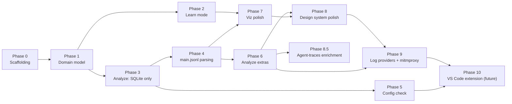

# Implementation Plan: GitHub Copilot Chat Session Analyser

This plan sequences [architecture.md](architecture.md) into buildable phases.
Each phase has a goal, concrete deliverables, an exit criterion (how you know
it's done), and its dependencies. Phases are ordered so the riskiest/least
certain work (real `main.jsonl` parsing) happens after there's already a
working, demoable app — not before.

Default calls on architecture.md §13's still-open choices, made here so the
plan can proceed (revisit anytime, they're not load-bearing for sequencing):
- Server framework: **Express**.
- Learn-mode scenario fixtures: **JSON files**, validated by the `domain`
  zod schema.

**Engineering practices (every phase, no exceptions):** development is
test-driven (architecture §11.4) — for each deliverable below, the test is
written first, watched to fail, then the minimum code to pass it is written,
then refactored. Module boundaries follow SOLID (architecture §11.5); a new
module that doesn't map to a single responsibility in §4/§10 is a signal to
revisit the design before writing it, not to add it anyway.

## Phase 0 — Repo scaffolding

**Goal**: an empty-but-wired monorepo skeleton, so every later phase adds
features instead of setting up plumbing.

- npm workspaces root (`packages/domain`, `packages/server`, `packages/web`),
  shared TypeScript config, lint/format config.
- `domain` package: empty placeholder export, consumed by both `server` and
  `web` via workspace dependency — proves constraint 3's dependency
  direction (`domain` has no dependency on the other two) before any real
  types exist.
- `server`: Express app with a single `GET /api/health` route, binds to
  `localhost` only (§11.2).
- `web`: Vite + React app that fetches `/api/health` and renders the result.
- Test runner wired (e.g. Vitest). Following TDD, the smoke test for each
  package ("health check returns ok", "web renders health status") is
  written and failing *before* the route/component it verifies exists.

**Exit criterion**: `npm install && npm run dev` starts both server and web,
and the web app displays a successful health check from the server.

**Dependencies**: none.

**Parallel task (not blocking, do it now)**: reload the VS Code window to
activate `github.copilot.chat.agentDebugLog.fileLogging.enabled` (already
set in user settings, per prior session). Real, multi-turn sessions started
from this point on begin accumulating genuine `main.jsonl` usage spans,
which Phase 4 needs as fixture material — the earlier this starts, the more
real fixture data exists by the time Phase 4 begins.

## Phase 1 — Domain model & schema package

**Goal**: the one shared contract (architecture §5) that every later phase
builds against.

- Implement `TokenCount`, `TurnUsage`, `ToolCallRecord`, `Turn`,
  `SystemPromptComponent`, `ToolInventoryEntry`, `Session`, `ConfigWarning`,
  `ConfigStatus` as TypeScript types in `packages/domain`.
- TDD order: for each type, write the `zod` schema-validation test against a
  hand-written sample object first (including a `TokenCount` in both the
  `known: true` and `known: false` shapes) — it will fail with no schema to
  import — then write the schema and type together to make it pass.
- Export both types and schemas from the package's public entry point.

**Exit criterion**: `domain` has 100% of the types from architecture §5,
each with a passing schema-validation test, and zero dependencies on
`server`/`web`.

**Dependencies**: Phase 0.

## Phase 2 — Learn mode (end-to-end, no real-log parsing required)

**Goal**: a fully working, demoable mode that proves out the shared UI layer
(constraint 4) without depending on any of the risky local-file parsing.

- Author 4-6 bundled scenario JSON fixtures seeded from
  [agentic-coding-explained.md](agentic-coding-explained.md) (start with:
  basic cache write/read, a model switch, an MCP tool change, and a
  compaction event — the doc's own worked examples), each already shaped as
  a `Session`/`Turn[]` per the domain schema.
- `data-sources/learn-scenarios` adapter (`server`): loads + validates the
  fixtures against the `domain` zod schema at startup (fail fast on a bad
  fixture rather than serving invalid data).
- API: `GET /api/learn/scenarios`, `GET /api/learn/scenarios/:id`.
- Frontend: `components/TurnsTable`, `components/ExplanationPanel`,
  `components/TimelineScrubber`, `state/session-store`, `api-client` — built
  and wired against Learn-mode data first.
- TDD order: write a failing API test asserting `GET /api/learn/scenarios`
  returns `domain`-schema-valid `Session[]` before implementing the adapter;
  write a failing component test asserting moving the scrubber updates the
  selected turn in both panels before wiring `session-store`.

**Exit criterion**: selecting a Learn scenario in the browser renders the
full shared layout (turns table + explanation panel + scrubber), and moving
the scrubber updates both panels in sync, matching vision §3.1/§3.3.

**Dependencies**: Phase 1.

## Phase 3 — Analyze mode: structural data only (SQLite, no usage numbers yet)

**Goal**: real sessions rendering in the same shared layout as Learn mode,
using only the always-available SQLite store — before touching the riskier
`main.jsonl` parsing at all.

- `platform/vscode-paths`: resolve the local VS Code user-data directory.
  Implement for this machine's platform (Linux) first; stub the
  interface so macOS/Windows paths are a follow-up, not a redesign
  (tracked in architecture §13).
- `data-sources/sqlite`: read-only queries against `sessions`/`turns`/
  `checkpoints`/`session_files`/`session_refs`, filtered to
  `agent_name = 'GitHub Copilot Chat'` (vision §18.2 scoping rule).
- `services/session-enricher`: for this phase, always sets
  `usageDataAvailable: false` and marks every `TurnUsage` field
  `{ known: false, reason: "main.jsonl parsing not yet implemented" }` —
  intentionally stubbed so the API contract (§8) is exercised end-to-end
  before Phase 4 fills it in for real.
- API: `GET /api/sessions`, `GET /api/sessions/:id`.
- Frontend: real sessions selectable and rendered through the same
  `TurnsTable`/`ExplanationPanel`/`TimelineScrubber` built in Phase 2 — no
  new components needed, proving constraint 3/4 in practice, not just in
  design.
- TDD order: write a failing test against a seeded fixture SQLite DB
  asserting `getTurns`/`getCheckpoints`/`getSessionFiles` return the
  expected shape before implementing the queries; write a failing test
  asserting the stubbed enricher always returns `usageDataAvailable: false`
  before wiring the stub in.

**Exit criterion**: a real local Copilot Chat session (this project's own
history is a ready-made test case) loads in Analyze mode and shows its
actual turns/user-messages/assistant-responses, with token figures
correctly shown as unavailable rather than zero.

**Dependencies**: Phase 1. (Independent of Phase 2, but reuses its
components, so do Phase 2 first in practice.)

## Phase 4 — `main.jsonl` parsing & enrichment

**Goal**: real per-turn token/cache numbers in Analyze mode — the core
value proposition of the whole app.

- `data-sources/jsonl`: streaming line reader + generic envelope parse
  (`{ v, ts, dur, sid, spanId, type, name, status, attrs }`).
- Cheap gating check (architecture §7): does this session's `main.jsonl`
  contain more than the single `session_start` line? If not, short-circuit
  straight to the constraint-8 "enable logging" reason — don't attempt
  extraction.
- Extractor registry: build the first extractor(s) against **real fixture
  lines** captured from this machine now that
  `agentDebugLog.fileLogging.enabled` is on (Phase 0's parallel task) —
  capture and redact a handful of real `main.jsonl` files spanning a full
  session as the initial fixture corpus.
- Unit tests per extractor against captured fixtures, plus one
  "missing/older-shape" synthetic fixture per constraint 6/8 — per TDD, each
  fixture's test is written (and confirmed failing, since no extractor
  exists yet) before that extractor is implemented.
- Wire `services/session-enricher` to use real extraction output instead of
  Phase 3's stub, populating `TurnUsage` for real when spans are found —
  extend Phase 3's enricher test suite first with the new "spans found"
  case before changing the implementation.

**Exit criterion**: loading a session recorded *after* the logging setting
was enabled shows real cache write/read/uncached/tool/vision/reasoning/
output/AI Credits numbers per turn; a session recorded *before* still degrades
cleanly to the Phase 3 behavior.

**Dependencies**: Phase 3. **Blocked on** having real fixture data, which
requires the Phase 0 window-reload step to have happened and some time to
pass generating real sessions — start capturing fixtures as early as
possible so this phase isn't blocked when it starts.

**Status (2026-08-08): done.** With `agentDebugLog.fileLogging.enabled` on
and real GitHub Copilot Chat sessions run since, real `llm_request` spans
were captured (redacted into `packages/server/fixtures/jsonl/`) and used to
build the `llm_request` extractor and per-turn aggregator (which sums the
possibly-multiple `llm_request` spans within one SQLite turn — see
architecture.md §6.2's Phase 4 note for why the join is positional by
`user_message`, not by the log's own `turnId`). This also uncovered and
fixed a real bug: the debug-logs path was resolved as a single
`globalStorage` directory, but real logs live per-workspace under
`workspaceStorage/<hash>/GitHub.copilot-chat/debug-logs/<session-id>/` —
without that fix the extractor would never have found any real file. The
`cacheWrite`/`tool`/`vision`/`reasoning` `TurnUsage` categories stay
permanently unavailable regardless of extraction success because this event
shape does not break them out. Usage is available as `copilotUsageNanoAiu`:
the extractor converts it to `costAiCredits` using
$1\ \text{AI Credit}=10^9\ \text{nano-AIU}$ and sums every request in a turn.
Missing credit data keeps that turn explicitly unavailable rather than
producing a partial total, per constraint 6. Verified against this
machine's own real, live session data (this project's own history, and a
longer session from another project), not just fixtures — exit criterion
met.

## Phase 5 — Startup configuration check

**Goal**: the app tells the user proactively when its core prerequisite
isn't met, instead of only showing symptoms per-session (architecture §6.3,
constraints 9/10).

- `data-sources/vscode-settings`: locate + parse (via `jsonc-parser`) the
  user's `settings.json` using `platform/vscode-paths`.
- `services/config-check`: evaluate `agentDebugLog.fileLogging.enabled`
  (constraint 8) and `maxRetainedSessionLogs >= 200` (constraint 10);
  produce `ConfigWarning[]`.
- Run the check once at server boot (console warning if unmet) and expose
  `GET /api/config/status`.
- Frontend: `components/ConfigWarningBanner`, rendered whenever
  `warnings.length > 0`, showing the exact setting, current vs. recommended
  value, and step-by-step fix instructions.
- TDD order: write a failing test per `ConfigWarning` case (logging
  disabled, retention too low, settings not found — architecture §11.4)
  before implementing the check in `config-check` that produces it.

**Exit criterion**: with the retention setting still at its VS Code default
(50), the banner correctly warns and shows the fix steps; after raising it
to 200+ and reloading VS Code, the warning for that check clears on the
next `GET /api/config/status`.

**Dependencies**: Phase 3 (reuses `platform/vscode-paths`). Independent of
Phase 4 — can be built in parallel with it.

**Status (2026-08-08): done.** `data-sources/vscode-settings` (a new
`resolveVscodeSettingsPath` alongside the existing `platform/vscode-paths`,
plus `readVscodeSettings` parsing via `jsonc-parser`) and
`services/config-check` (`checkConfig`) were built TDD-first per
architecture §11.4, then wired into `GET /api/config/status` and a
startup console warning in `server.ts`. Decisions/facts from this slice:

- Scope matches this phase's bullet list exactly: only the **user**
  `settings.json` is read, not a workspace-level merge — architecture§4.1's
  "and workspace, if present" is not yet implemented (this is a
  single-developer machine with no workspace-level override observed; a
  workspace merge is a candidate for later per architecture §13, not
  required for this phase's exit criterion).
- The deprecated alias `github.copilot.chat.agentDebugLog.enabled` (noted
  in architecture §7) is also honored as satisfying "logging enabled", in
  addition to the current `agentDebugLog.fileLogging.enabled` key.
- `maxRetainedSessionLogs: null` in `ConfigStatus` means "the setting is
  unset in `settings.json`", which `config-check` treats as VS Code's own
  default of 50 (below the 200 minimum) when deciding whether to warn —
  matching the domain schema's documented meaning for that field (§5).
- Verified against this machine's own real `settings.json`
  (`~/.config/Code - Insiders/User/settings.json`, where logging is
  already enabled from Phase 4 but retention was never explicitly raised):
  `GET /api/config/status` correctly returns exactly one
  `retention-too-low` warning with the real settings.json path in its
  `helpSteps` — the exit criterion's "default retention" case, observed
  directly rather than only via fixtures.

## Phase 6 — Analyze-mode-only extras

**Goal**: the remaining vision §3.2 features that go beyond the shared
layout.

- `components/SystemPromptBreakdown`, `components/ToolInventoryPanel`,
  `components/TurnDetail`.
- Requires extending the Phase 4 extractor registry to also surface
  system-prompt-component and tool-definition/tool-call token detail from
  `attrs` — treat this as a research spike first (confirm the relevant
  event `type`s exist and what shape they're in) before committing to an
  implementation approach.
- TDD order: once the spike confirms the `attrs` shape, write the failing
  extractor/component tests against captured samples before extending the
  registry or building the panels.

**Exit criterion**: selecting a turn in Analyze mode shows which tools were
called and which files were touched with their token counts, and the
session-level view shows system-prompt breakdown and tool
loaded-vs-invoked status.

**Dependencies**: Phase 4.

**In parallel with this phase**: address a 2026-08-08 code/security
review's medium finding (availability classification masking parse failures in
`classifyEnvelopesAvailability`) — isolated to `main-jsonl-reader.ts`'s
classification path and its one `session-enricher` consumer, no overlap
with this phase's extractors. Its high finding (full in-memory envelope
array in `readMainJsonlEnvelopes`) is deferred until after this phase
exits: this phase is adding new consumers
(`tool-inventory.ts`, `prompt-artifact-reader.ts`, the system-prompt
extractor) built against the current whole-array contract of
`readMainJsonlEnvelopes`/`groupEnvelopesByUserMessage`, so reworking that
contract now would mean redoing each extractor as it lands — tracked
alongside architecture.md §13's existing "per-turn lazy loading vs.
whole-session payloads" open question instead.

**Status (2026-08-08): done.** The research spike (against this machine's
own real, unredacted debug-logs directory) found that per-component/
per-tool-call **token counts are not available anywhere** in `main.jsonl`
or its sibling artifacts — see architecture.md §6.2's Phase 6 note for the
full finding and why estimating them would be constraint-6 fabrication.
What Phase 6 *does* deliver, all real (not estimated) data:

- `data-sources/jsonl/prompt-artifact-reader.ts` reads the
  `systemPromptFile`/`toolsFile` artifacts an `llm_request` span's `attrs`
  point to (`system_prompt_N.json`/`tools_N.json`, siblings of `main.jsonl`
  in the session's debug-logs directory) — the definitive system-prompt
  text and loaded-tool-definitions list, previously unused by this app.
- `data-sources/jsonl/tool-inventory.ts` builds `ToolInventoryEntry[]`
  (loaded vs. invoked-per-turn) from that tools artifact plus `tool_call`
  events, joined positionally the same way `session-usage-spans.ts` already
  joins `llm_request` spans to SQLite turns.
- `data-sources/jsonl/system-prompt-breakdown.ts` builds
  `SystemPromptComponent[]` by defensively parsing the "Custom
  Instructions"/"Skill Discovery" log templates (Copilot Chat's own fixed
  debug strings, not model/user content) for repo-instructions/skill names,
  plus one component each for the base prompt blob and the tool-definitions
  list. No `path-scoped-instructions` component is produced yet — no real
  captured log has shown an `applyTo`-scoped instruction actually applying,
  so there's no confirmed template to parse (tracked as an architecture.md
  §13 open question, not implemented speculatively).
- `services/session-enricher` now also merges `tool_call`-only invocations
  (tools with no touched files, e.g. `manage_todo_list`) into a turn's
  `toolCalls`, and populates `Session.systemPrompt`/`toolInventory`.
- `components/SystemPromptBreakdown`, `ToolInventoryPanel`, `TurnDetail`
  render the above; `App.tsx` shows all three only when `session.mode ===
  "analyze"`.

Verified against this project's own real session history (the same
workspace this repo lives in) — a real `system_prompt_0.json`/`tools_0.json`
pair, 145 real tool definitions, and real `tool_call` events all round-trip
through `GET /api/sessions/:id` correctly.

**Post-Phase-6 addendum (2026-08-08): high finding resolved.** The
2026-08-08 code/security review's high finding (full in-memory envelope
array) is now addressed — see architecture.md §6.2's implementation note.
The review doc has been removed now that both its findings are closed.

## Phase 7 — Visualization polish

**Goal**: replace plain numbers/tables with the D3-based visual language
vision §5 calls for.

- `charts/*`: per-token-type bars in the turns table, an AI Credits sparkline,
  a cache-hit ratio indicator — reused by both Learn and Analyze modes
  (constraint 4).
- TDD order: write a failing test asserting each chart renders the correct
  bars/values for a fixed `TurnUsage` fixture before implementing the D3
  rendering code.

**Exit criterion**: both modes render the same chart components from the
same `Turn`/`TurnUsage` data, with no mode-specific chart code.

**Dependencies**: Phases 2 and 4 (needs real usage numbers to be meaningful,
though it can be prototyped against Learn-mode data earlier if useful).

**Status (2026-08-08): done.** Built TDD-first per architecture §11.4: each
of `packages/web/src/charts/TokenTypeBars.tsx`, `CacheHitRatio.tsx`, and
`AiCreditsSparkline.tsx` got a failing test against a fixed `TurnUsage`/`Turn[]`
fixture before its D3-based rendering existed. `d3-scale`/`d3-shape` (the
specific submodules actually used — linear scales and the line-path
generator, not the full `d3` bundle) were added to `packages/web` at their
latest stable versions, `npm audit` clean. Facts/decisions from this slice:

- `TokenTypeBars` renders one SVG bar per token type (cache write/read,
  uncached, tool, vision, reasoning, output), scaled via `d3-scale`'s
  `scaleLinear` against the turn's own largest known value; an unavailable
  `TokenCount` renders as a visually distinct short gray bar with an
  `aria-label` ending in "unavailable" rather than a misleading zero-width
  bar — constraint 6 applied to the chart layer, not just the numeric one.
- `CacheHitRatio` renders `cacheRead / (cacheRead + uncachedInput)` as a
  two-segment bar with a percentage `aria-label`; unavailable when either
  input is unknown.
- `AiCreditsSparkline` draws a `d3-shape` line path across a session's turns'
  known `costAiCredits` points (skipping unknown ones); falls back to a "not
  enough credit data" message when fewer than two turns have a known AI
  Credits value, rather than drawing a misleading single-point or zero-value
  line.
- All three consume only `Turn`/`TurnUsage` (no mode field), and are wired
  once into the already-shared `components/TurnsTable.tsx` (`TokenTypeBars`/
  `CacheHitRatio` per row, `AiCreditsSparkline` once above the table) — since
  `TurnsTable` itself has no `session.mode` branching and is the same
  component instance `App.tsx` renders for both modes, the exit criterion
  ("no mode-specific chart code") holds by construction rather than needing
  a separate check.
- Chart "unavailable"/empty states use `aria-label`s rather than visible
  text nodes, so they don't collide with `TurnsTable`'s existing plain-text
  "unavailable" cells when asserting via `getByText` in tests (a real
  session can have every `TurnUsage` field unavailable at once — Phase 3/4's
  stubbed-enricher case).
- Verified against this project's own real session history in a live
  browser (Playwright + this machine's Chrome, `npm run dev`): the AI Credits
  sparkline, per-turn usage bars, and cache-hit bars all render correctly
  from real turn data, not just fixtures.

**Superseded by Phase 8 (2026-08-08):** `TokenTypeBars`/`CacheHitRatio`
(and their tests) were deleted — the Industry design handoff's 11-column
`TurnsTable` spec doesn't include per-row charts. `AiCreditsSparkline` is the
only chart that survived; it relocated out of `TurnsTable` into the center
column's header row. See Phase 8 below.

## Phase 8 — Apply the "Industry" design system (visual UI polish)

**Goal**: replace the unstyled semantic-HTML frontend with the high-fidelity
visual design handed off in `Design/GitHub chat analyser design 2.zip`
(`design_handoff_session_analyser_ui/README.md`, `styles.css`, and the
`Session Analyser.dc.html` interactive prototype) — the "Industry" system:
steel-blue mono-accent palette, Barlow/Barlow Condensed type, flat
hairline-bordered "blueprint" cards with corner registration marks, square
corners throughout. The prototype is a design reference only (its own
`README.md` §"About the Design Files" says so explicitly) — this phase
recreates its layout/markup/behavior natively in `packages/web` (Vite +
React + TS per architecture.md §4.2/§10), wired to the real `GET /api/*`
endpoints, not the prototype's mock data.

This is a **visual/structural** phase, not a data phase: no new usage
numbers are computed and constraint 6 (never fabricate a token count) still
applies — every formatting change below only changes how an already-real
`TokenCount`/`ConfigWarning`/`Session` value is displayed.

**Decisions this phase makes** (the handoff doc leaves some gaps between
the mock and this repo's actual domain model/shipped features — resolved
here so the phase isn't blocked; each is revisitable):

- **Card kickers need two small, real domain fields, not fabricated ones.**
  The mock's session/scenario cards show a kicker like "Learn · Prompt
  caching" or "Analyze · 2026-08-06". Neither a topic label nor a date
  exists on `Session` today. Add two **optional** fields to
  `sessionSchema`: `category?: string` (Learn mode — authored once per
  fixture file, e.g. `"Prompt caching"`, `"Model switching"`; not derived
  at render time) and `startedAt?: string` (Analyze mode — ISO date,
  sourced from the real `sessions.created_at` column already read in
  `data-sources/sqlite/session-store.ts:14` but not yet surfaced through
  `session-enricher`/the API). Card kicker renders `Learn · {category}` /
  `Analyze · {formatted startedAt}` when present, or falls back to just
  `Learn` / `Analyze` (never a fabricated date) when not.
- **TurnsTable adopts the mock's exact 11-column spec**, which differs from
  what's currently shipped: `Turn, Trigger, Uncached in, Cache read, Cache
  write, Tool, Vision, Reasoning, Output, AI Credits, Model` — adding the missing
  **Trigger** (`Turn.triggeredEvent`, pill or em dash) and **Model**
  (`TurnUsage.model`, muted 12px) columns, and reordering the token columns
  to match.
- **Phase 7's per-row `TokenTypeBars`/`CacheHitRatio` chart columns are
  retired from the table.** The handoff's column list and prototype markup
  are exact and deliberate (the "Industry" system is explicitly flat/
  wireframe, no embellishment) and don't include them; keeping them would
  mean 13 columns duplicating numbers the 11 spec'd columns already show.
  Delete `charts/TokenTypeBars.tsx`/`CacheHitRatio.tsx` and their tests,
  and update Phase 7's status note above to record the supersession rather
  than leaving it to drift. `AiCreditsSparkline` is **kept** (it shows a trend
  the plain table can't) but relocates to the center column's header row,
  next to the title/model tag/usage tag — a placement the mock doesn't
  show but doesn't conflict with either, since a session-level trend line
  fits there better than duplicated per-row bars.
- **`TurnDetail`'s per-turn tool-call content folds into the Explanation
  panel** instead of becoming a 4th tab — per the handoff's v2 "resolved
  open questions" §2. The mock specs exactly three right-panel tabs
  (Explanation / System prompt / Tools); `TurnDetail`'s content (tool names
  + files touched for the *selected* turn) renders as a "Tool calls this
  turn" block underneath the explanation body, inside the same `.blueprint`
  card, Analyze mode only — not as a separate table underneath
  `ToolInventoryPanel`. `TurnDetail.tsx` as a standalone component is
  retired; its rendering logic moves into `ExplanationPanel.tsx` as an
  internal, non-exported subcomponent, since it's no longer reused
  elsewhere and SOLID's single-responsibility principle doesn't require a
  separate file for a private implementation detail of one component.
- **`ConfigWarningBanner` keeps its full structured content**
  (architecture.md §6.3 requires the exact setting name, current vs.
  recommended value, and step-by-step fix instructions — more than the
  mock's single illustrative sentence) but adopts the mock's visual chrome
  exactly: `.blueprint` accent-100 frame, "!" badge, bold lead line, and a
  `showConfigBanner` boolean (default true) toggled by the new header
  "Config" button and the banner's own "Dismiss" button — independent of
  whether `warnings[]` is non-empty, matching the mock's decoupled state.
- **Numeric table cells switch from the literal string `"unavailable"` to
  a muted em dash "—"** for an unknown `TokenCount`, per the handoff's
  explicit convention (§3b) — prose contexts (explanation panel body text,
  the two panels' "no artifacts captured" empty states) keep full
  sentences, including surfacing `TokenCount`'s `reason` where one exists.
- **Remaining v2 "resolved open questions" carried through as designed**,
  with no further gap-filling needed: `SessionList` gets a `.input` search
  box (filters by title client-side) above a `max-height: 520px;
  overflow-y: auto` card list, with a muted "No matches." fallback; a
  session/scenario card and a `TurnsTable` row are both `tabIndex="0"` with
  an Enter/Space `onKeyDown` mirroring their `onClick` (`lib/on-key-
  activate.ts`, one shared helper rather than duplicated per component);
  card titles, table `Trigger`/`Model` cells, tool names, and file paths
  get a shared `.truncate` class plus a native `title` attribute where the
  full value matters; the header's Config button becomes a static
  `.tag.tag-neutral` "Config ✓" label (no click handler) when
  `ConfigStatus.warnings` is empty; and a zero-session/zero-scenario
  response renders a centered `.blueprint` empty-state card (mode-specific
  copy) in place of the whole three-column grid, gated on that mode's list
  fetch having resolved (so it doesn't flash before the real data loads).

**Deliverables**:

- **Tokens**: port `styles.css`'s custom properties and base component
  classes (`.blueprint`/`.corner`, `.btn`, `.tag`, `.seg`/`.seg-opt`,
  `.table`, `.card*`, spacing/type scale) into `packages/web/src/theme.css`,
  imported once in `main.tsx`. Keep the Google Fonts `@import` — both font
  stacks already fall back to `system-ui` so it degrades gracefully
  offline; revisit if this tool needs to run fully air-gapped.
- **Primitives** (new, small, composable — SOLID/CUPID per
  architecture.md §11.5, and shared rather than duplicating the four-`<i>`
  corner-mark markup at every call site): `components/ui/Blueprint.tsx`
  (wraps children + the four corner marks), `components/ui/Tag.tsx`
  (`variant: "accent" | "accent-2" | "neutral" | "outline"`),
  `components/ui/SegmentedControl.tsx` (generic radio/button group — reused
  for both the header's Learn/Analyze mode switch and the right column's
  three-tab switcher, so there's exactly one segmented-control
  implementation, not two).
- **New layout components**: `components/AppHeader.tsx` (brand mark,
  wordmark + caption, mode `SegmentedControl`, Config button — new; not in
  today's component table) and `components/SessionList.tsx` (left-column
  scenario/session cards; replaces the current inline `<ul><li><button>`
  lists in `App.tsx`).
- **State**: extend `state/session-store.ts` with `mode: 'learn' |
  'analyze'` and `rightTab: 'explanation' | 'system-prompt' | 'tools'` —
  both are tightly coupled to "what's selected," matching the store's
  existing responsibility, and `setMode`/session-select reset turn index +
  `rightTab` together exactly as the prototype's `setMode`/card `select`
  do. `showConfigBanner` stays local `useState` in `App.tsx` — page chrome,
  not session state.
- **Restyle existing components** against the ported tokens/primitives,
  each getting its markup/classes updated to match the mock 1:1 (colors,
  spacing, blueprint frames) while keeping each component's existing
  props/data contract: `TurnsTable`, `ExplanationPanel` (gains a `mode` and
  `toolCallsAvailable` prop for the folded-in tool-call block),
  `TimelineScrubber`, `SystemPromptBreakdown`, `ToolInventoryPanel`,
  `ConfigWarningBanner` (gains an `onDismiss` prop).
- **Docs**: update architecture.md §4.2's component table (add
  `AppHeader`, `SessionList`, `components/ui/*`, the `mode`/`rightTab`
  additions to `session-store`) and vision.md §3.3's shared-layout diagram
  (header + mode switch + session list + tabbed right column, not just the
  two-panel sketch) in the same change that lands the code — per this
  repo's "treat docs as source of truth, update rather than let drift"
  rule — plus `sessionSchema`'s new `category`/`startedAt` fields in
  architecture.md §5.
- TDD order: for each restyled/new component, write the failing test for
  its new markup/behavior first (e.g. em-dash formatting, `Trigger`/`Model`
  cell rendering, `SegmentedControl`'s selection callback, `AppHeader`'s
  mode toggle, `SessionList`'s card click resetting turn index + tab) —
  then the minimum implementation to pass it. Chart-column removal is a
  delete-and-update-the-test-file change, not new TDD. The `category`/
  `startedAt` schema additions get their own schema test (optional fields,
  existing fixtures/API responses still validate unchanged) before
  `session-enricher`/the learn-scenario fixtures are touched.

**Exit criterion**: the app visually matches the "Industry" design
handoff — header with brand mark/wordmark/mode switch/Config button,
dismissible config banner, three-column layout (session list / turns table
+ scrubber / tabbed explanation-system-prompt-tools panel), all using the
ported design tokens and `.blueprint` treatment pixel-for-pixel per
`styles.css` — while every numeric cell still correctly distinguishes a
known value from `{known: false}` (em dash, never a fabricated 0), and all
existing tests (updated for the new markup) plus new tests for the added
components/behavior pass.

**Dependencies**: Phases 2, 4, 6, 7 (needs both modes' real data end-to-end
and the Analyze-only panels this phase restyles).

**Status (2026-08-08): done.** Built TDD-first per architecture §11.4/§11.5:
`packages/web/src/theme.css` ports every token/base class from the v2
handoff's `styles.css`; `components/ui/{Blueprint,Tag,SegmentedControl}.tsx`
each got a failing test before implementation; `state/session-store.ts`
gained `mode`/`rightTab`/`setMode` (with its own tests, including that
`setMode` clears the loaded session so a stale cross-mode session isn't
shown — a gap the mock's own `setMode` closes by auto-selecting the new
mode's first item, addressed here by clearing to the empty-selection state
instead, which is simpler and equally non-stale); `AppHeader`/`SessionList`
are new; `TurnsTable`/`ExplanationPanel`/`SystemPromptBreakdown`/
`ToolInventoryPanel`/`TimelineScrubber`/`ConfigWarningBanner` were restyled
in place; `TurnDetail.tsx` and `charts/{TokenTypeBars,CacheHitRatio}.tsx`
(plus their tests) were deleted per the retirement decisions above.
`sessionSchema` gained optional `category`/`startedAt`; all four Learn
fixtures got an authored `category`; `session-enricher.ts` now surfaces
`SessionRow.created_at` as `Session.startedAt`. 93 web tests, 240 server
tests, 49 domain tests pass; `tsc --noEmit` clean. Verified against this
machine's real Copilot Chat/Claude Code session history in a live browser
(Playwright + system Chrome, `npm run dev` for both `packages/server` and
`packages/web`): Learn mode, Analyze mode (including a real session's
non-trivial usage numbers, trigger em dashes, and the Tools tab's
loaded/invoked tags), and the mode-switch empty-selection state all render
correctly.

## Phase 8.5 — Agent-traces cache-write/reasoning enrichment

**Goal**: populate `TurnUsage.cacheWrite`/`.reasoning` — always `{known:
false}` from `main.jsonl` alone (Phase 4/6) — from a second, optional local
source, `agent-traces.db`, when the user has it enabled. Purely additive to
the existing direct-wired Analyze mode pipeline (`app.ts` →
`data-sources/sqlite` + `data-sources/jsonl` + `session-enricher`) — not
part of Phase 9's `LogProvider` abstraction, which this phase doesn't
depend on and isn't depended on by.

- Add `responseId` to `main-jsonl-reader.ts`'s `KNOWN_ATTRS_KEYS` allow-list
  and `llm-request-extractor.ts`'s `LlmRequestUsage` — the join key into
  `agent-traces.db`, previously stripped before any extractor saw it.
- New `data-sources/agent-traces/`: path resolution (sharing
  `data-sources/sqlite/copilot-chat-global-storage-path.ts` with
  `session-store-path.ts`) and a read-only `node:sqlite` reader joining
  `agent-traces.db`'s `spans`/`span_attributes` tables by
  `gen_ai.response.id`, returning cache-write/reasoning per `responseId`.
  Missing/locked/corrupt db degrades to an empty result, never a throw —
  this source is explicitly optional.
- `session-usage-spans.ts`: `collectResponseIds` (for `app.ts` to look up
  before grouping into turns) and `extractTurnUsages`'s new, defaulted
  `agentTraceUsageByResponseId` param — sums both fields across a turn's
  requests, all-or-nothing (mirroring `costAiCredits`'s aggregation), with
  a new actionable `AGENT_TRACES_UNAVAILABLE_REASON` distinct from
  `tool`/`vision`'s permanent-gap reason.
- New optional-severity `ConfigWarning` (`code: "agent-traces-unavailable"`)
  surfaced via the existing `GET /api/config/status` check, gated on the VS
  Code setting `github.copilot.chat.otel.dbSpanExporter.enabled`. Adds
  `severity: "required" | "optional"` to `ConfigWarning` (non-defaulted);
  `ConfigWarningBanner.tsx` renders optional warnings in a visually muted
  tone (reusing the existing `--color-accent-2-*` tokens) distinct from
  required ones.
- TDD order: `responseId` allow-list/extractor fix first (everything else
  silently no-ops without it) → path resolution → reader → enrichment
  wiring in `session-usage-spans.ts` → `app.ts` integration → settings
  field → config-check warning/severity → banner styling → documentation.

**Exit criterion**: with `otel.dbSpanExporter.enabled` on and a real
session recorded, `GET /api/sessions/:id` returns real
`{known:true,value}` `cacheWrite`/`reasoning` figures for that session's
turns, matching `agent-traces.db` directly; with it off (the default),
existing behavior is unchanged except for a more actionable `reason`
string, and `GET /api/config/status` surfaces the new optional warning.

**Dependencies**: Phase 6 (`session-usage-spans.ts`/`session-enricher.ts`
exist to extend). No dependency on, or from, Phase 9.

## Phase 9 — Extensible log providers and mitmproxy ingestion

**Goal**: make Analyze mode source-extensible without changing its session
endpoints or shared UI, then add mitmproxy as the first non-VS-Code provider.

- Define and test the provider-neutral `LogProvider` contract in the domain/
  server boundary: list session summaries and read one normalized session's
  structural, usage, tool, and prompt records. Adapt the existing VS Code
  SQLite/`main.jsonl` path to this contract before adding a second provider.
- Implement a server-owned provider registry with stable descriptors
  (`id`, label, availability, unavailable reason), a persisted active-provider
  setting, `GET /api/log-providers`, and `PUT /api/log-providers/active`.
  `GET /api/sessions` and its detail endpoints retain their existing paths and
  domain response shapes, reading from the active provider.
- Implement `data-sources/log-providers/mitmproxy` for a documented local
  capture-file format. It reads only the configured local capture path and
  feeds exchanges through a `MitmExchangeDecoder` registry.
- Implement separate Anthropic and OpenAI decoders. Each recognizes only its
  own protocol shape and converts observed request/response usage into the
  common records; missing, malformed, or unknown-vendor data remains
  explicitly unavailable, never estimated.
- Frontend: fetch generic provider descriptors, render an Analyze-mode
  provider select control, set the active provider through the generic API,
  clear the selected Analyze session, and reload the existing session list.
  No session-list, table, panel, or chart component may branch on provider id.
- TDD order: first write shared provider contract tests and a failing
  active-provider API test. Then write a failing captured-exchange test for
  each Anthropic/OpenAI decoder before its implementation, plus unknown vendor
  and missing-usage fixtures. Finally write the provider-select interaction
  test before wiring the control.

**Exit criterion**: the user can list and select VS Code or mitmproxy in the
Analyze UI. Both providers load sessions through the unchanged `/api/sessions`
contract and shared UI. Anthropic and OpenAI fixture captures normalize to the
same domain schema, and adding a test-only third provider proves no API or
frontend component changes are required.

**Dependencies**: Phase 8 (the Analyze header/state exists) and Phases 3-6
(the VS Code reading/enrichment path exists to adapt).

## Phase 10 — VS Code extension packaging (future, out of MVP scope)

Not part of the initial build (vision §5 "future path"); tracked here only
so the seam stays intentional:

- Swap `api-client`'s HTTP calls for `postMessage`/`acquireVsCodeApi`.
- Move `data-sources/*`/`services/*` calls in-process into the extension
  host instead of behind Express.
- Upgrade `config-check` warnings to one-click fixes via
  `vscode.commands.executeCommand('workbench.action.openSettings', ...)`.

**Dependencies**: everything above; deliberately deferred.

## Summary dependency graph

