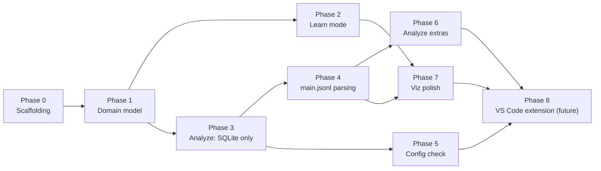

# Implementation Plan: GitHub Copilot Chat Session Analyser

This plan sequences [architecture.md](architecture.md) into buildable phases.
Each phase has a goal, concrete deliverables, an exit criterion (how you know
it's done), and its dependencies. Phases are ordered so the riskiest/least
certain work (real `main.jsonl` parsing) happens after there's already a
working, demoable app — not before.

Default calls on architecture.md §13's still-open choices, made here so the
plan can proceed (revisit anytime, they're not load-bearing for sequencing):
- Server framework: **Express**.
- Learn-mode scenario fixtures: **JSON files**, validated by the `domain`
  zod schema.

**Engineering practices (every phase, no exceptions):** development is
test-driven (architecture §11.4) — for each deliverable below, the test is
written first, watched to fail, then the minimum code to pass it is written,
then refactored. Module boundaries follow SOLID (architecture §11.5); a new
module that doesn't map to a single responsibility in §4/§10 is a signal to
revisit the design before writing it, not to add it anyway.

## Phase 0 — Repo scaffolding

**Goal**: an empty-but-wired monorepo skeleton, so every later phase adds
features instead of setting up plumbing.

- npm workspaces root (`packages/domain`, `packages/server`, `packages/web`),
  shared TypeScript config, lint/format config.
- `domain` package: empty placeholder export, consumed by both `server` and
  `web` via workspace dependency — proves constraint 3's dependency
  direction (`domain` has no dependency on the other two) before any real
  types exist.
- `server`: Express app with a single `GET /api/health` route, binds to
  `localhost` only (§11.2).
- `web`: Vite + React app that fetches `/api/health` and renders the result.
- Test runner wired (e.g. Vitest). Following TDD, the smoke test for each
  package ("health check returns ok", "web renders health status") is
  written and failing *before* the route/component it verifies exists.

**Exit criterion**: `npm install && npm run dev` starts both server and web,
and the web app displays a successful health check from the server.

**Dependencies**: none.

**Parallel task (not blocking, do it now)**: reload the VS Code window to
activate `github.copilot.chat.agentDebugLog.fileLogging.enabled` (already
set in user settings, per prior session). Real, multi-turn sessions started
from this point on begin accumulating genuine `main.jsonl` usage spans,
which Phase 4 needs as fixture material — the earlier this starts, the more
real fixture data exists by the time Phase 4 begins.

## Phase 1 — Domain model & schema package

**Goal**: the one shared contract (architecture §5) that every later phase
builds against.

- Implement `TokenCount`, `TurnUsage`, `ToolCallRecord`, `Turn`,
  `SystemPromptComponent`, `ToolInventoryEntry`, `Session`, `ConfigWarning`,
  `ConfigStatus` as TypeScript types in `packages/domain`.
- TDD order: for each type, write the `zod` schema-validation test against a
  hand-written sample object first (including a `TokenCount` in both the
  `known: true` and `known: false` shapes) — it will fail with no schema to
  import — then write the schema and type together to make it pass.
- Export both types and schemas from the package's public entry point.

**Exit criterion**: `domain` has 100% of the types from architecture §5,
each with a passing schema-validation test, and zero dependencies on
`server`/`web`.

**Dependencies**: Phase 0.

## Phase 2 — Learn mode (end-to-end, no real-log parsing required)

**Goal**: a fully working, demoable mode that proves out the shared UI layer
(constraint 4) without depending on any of the risky local-file parsing.

- Author 4-6 bundled scenario JSON fixtures seeded from
  [agentic-coding-explained.md](agentic-coding-explained.md) (start with:
  basic cache write/read, a model switch, an MCP tool change, and a
  compaction event — the doc's own worked examples), each already shaped as
  a `Session`/`Turn[]` per the domain schema.
- `data-sources/learn-scenarios` adapter (`server`): loads + validates the
  fixtures against the `domain` zod schema at startup (fail fast on a bad
  fixture rather than serving invalid data).
- API: `GET /api/learn/scenarios`, `GET /api/learn/scenarios/:id`.
- Frontend: `components/TurnsTable`, `components/ExplanationPanel`,
  `components/TimelineScrubber`, `state/session-store`, `api-client` — built
  and wired against Learn-mode data first.
- TDD order: write a failing API test asserting `GET /api/learn/scenarios`
  returns `domain`-schema-valid `Session[]` before implementing the adapter;
  write a failing component test asserting moving the scrubber updates the
  selected turn in both panels before wiring `session-store`.

**Exit criterion**: selecting a Learn scenario in the browser renders the
full shared layout (turns table + explanation panel + scrubber), and moving
the scrubber updates both panels in sync, matching vision §3.1/§3.3.

**Dependencies**: Phase 1.

## Phase 3 — Analyze mode: structural data only (SQLite, no usage numbers yet)

**Goal**: real sessions rendering in the same shared layout as Learn mode,
using only the always-available SQLite store — before touching the riskier
`main.jsonl` parsing at all.

- `platform/vscode-paths`: resolve the local VS Code user-data directory.
  Implement for this machine's platform (Linux) first; stub the
  interface so macOS/Windows paths are a follow-up, not a redesign
  (tracked in architecture §13).
- `data-sources/sqlite`: read-only queries against `sessions`/`turns`/
  `checkpoints`/`session_files`/`session_refs`, filtered to
  `agent_name = 'GitHub Copilot Chat'` (vision §18.2 scoping rule).
- `services/session-enricher`: for this phase, always sets
  `usageDataAvailable: false` and marks every `TurnUsage` field
  `{ known: false, reason: "main.jsonl parsing not yet implemented" }` —
  intentionally stubbed so the API contract (§8) is exercised end-to-end
  before Phase 4 fills it in for real.
- API: `GET /api/sessions`, `GET /api/sessions/:id`.
- Frontend: real sessions selectable and rendered through the same
  `TurnsTable`/`ExplanationPanel`/`TimelineScrubber` built in Phase 2 — no
  new components needed, proving constraint 3/4 in practice, not just in
  design.
- TDD order: write a failing test against a seeded fixture SQLite DB
  asserting `getTurns`/`getCheckpoints`/`getSessionFiles` return the
  expected shape before implementing the queries; write a failing test
  asserting the stubbed enricher always returns `usageDataAvailable: false`
  before wiring the stub in.

**Exit criterion**: a real local Copilot Chat session (this project's own
history is a ready-made test case) loads in Analyze mode and shows its
actual turns/user-messages/assistant-responses, with token figures
correctly shown as unavailable rather than zero.

**Dependencies**: Phase 1. (Independent of Phase 2, but reuses its
components, so do Phase 2 first in practice.)

## Phase 4 — `main.jsonl` parsing & enrichment

**Goal**: real per-turn token/cache numbers in Analyze mode — the core
value proposition of the whole app.

- `data-sources/jsonl`: streaming line reader + generic envelope parse
  (`{ v, ts, dur, sid, spanId, type, name, status, attrs }`).
- Cheap gating check (architecture §7): does this session's `main.jsonl`
  contain more than the single `session_start` line? If not, short-circuit
  straight to the constraint-8 "enable logging" reason — don't attempt
  extraction.
- Extractor registry: build the first extractor(s) against **real fixture
  lines** captured from this machine now that
  `agentDebugLog.fileLogging.enabled` is on (Phase 0's parallel task) —
  capture and redact a handful of real `main.jsonl` files spanning a full
  session as the initial fixture corpus.
- Unit tests per extractor against captured fixtures, plus one
  "missing/older-shape" synthetic fixture per constraint 6/8 — per TDD, each
  fixture's test is written (and confirmed failing, since no extractor
  exists yet) before that extractor is implemented.
- Wire `services/session-enricher` to use real extraction output instead of
  Phase 3's stub, populating `TurnUsage` for real when spans are found —
  extend Phase 3's enricher test suite first with the new "spans found"
  case before changing the implementation.

**Exit criterion**: loading a session recorded *after* the logging setting
was enabled shows real cache write/read/uncached/tool/vision/reasoning/
output/cost numbers per turn; a session recorded *before* still degrades
cleanly to the Phase 3 behavior.

**Dependencies**: Phase 3. **Blocked on** having real fixture data, which
requires the Phase 0 window-reload step to have happened and some time to
pass generating real sessions — start capturing fixtures as early as
possible so this phase isn't blocked when it starts.

**Status (2026-08-08): done.** With `agentDebugLog.fileLogging.enabled` on
and real GitHub Copilot Chat sessions run since, real `llm_request` spans
were captured (redacted into `packages/server/fixtures/jsonl/`) and used to
build the `llm_request` extractor and per-turn aggregator (which sums the
possibly-multiple `llm_request` spans within one SQLite turn — see
architecture.md §6.2's Phase 4 note for why the join is positional by
`user_message`, not by the log's own `turnId`). This also uncovered and
fixed a real bug: the debug-logs path was resolved as a single
`globalStorage` directory, but real logs live per-workspace under
`workspaceStorage/<hash>/GitHub.copilot-chat/debug-logs/<session-id>/` —
without that fix the extractor would never have found any real file. Two
`TurnUsage` categories stay permanently unavailable regardless of extraction
success: `cacheWrite`/`tool`/`vision`/`reasoning` (not broken out by this
event shape) and `costUsd` (no documented USD conversion for the log's
internal usage unit) — both marked `known: false` with a specific reason
rather than a fabricated number, per constraint 6. Verified against this
machine's own real, live session data (this project's own history, and a
longer session from another project), not just fixtures — exit criterion
met.

## Phase 5 — Startup configuration check

**Goal**: the app tells the user proactively when its core prerequisite
isn't met, instead of only showing symptoms per-session (architecture §6.3,
constraints 9/10).

- `data-sources/vscode-settings`: locate + parse (via `jsonc-parser`) the
  user's `settings.json` using `platform/vscode-paths`.
- `services/config-check`: evaluate `agentDebugLog.fileLogging.enabled`
  (constraint 8) and `maxRetainedSessionLogs >= 200` (constraint 10);
  produce `ConfigWarning[]`.
- Run the check once at server boot (console warning if unmet) and expose
  `GET /api/config/status`.
- Frontend: `components/ConfigWarningBanner`, rendered whenever
  `warnings.length > 0`, showing the exact setting, current vs. recommended
  value, and step-by-step fix instructions.
- TDD order: write a failing test per `ConfigWarning` case (logging
  disabled, retention too low, settings not found — architecture §11.4)
  before implementing the check in `config-check` that produces it.

**Exit criterion**: with the retention setting still at its VS Code default
(50), the banner correctly warns and shows the fix steps; after raising it
to 200+ and reloading VS Code, the warning for that check clears on the
next `GET /api/config/status`.

**Dependencies**: Phase 3 (reuses `platform/vscode-paths`). Independent of
Phase 4 — can be built in parallel with it.

**Status (2026-08-08): done.** `data-sources/vscode-settings` (a new
`resolveVscodeSettingsPath` alongside the existing `platform/vscode-paths`,
plus `readVscodeSettings` parsing via `jsonc-parser`) and
`services/config-check` (`checkConfig`) were built TDD-first per
architecture §11.4, then wired into `GET /api/config/status` and a
startup console warning in `server.ts`. Decisions/facts from this slice:

- Scope matches this phase's bullet list exactly: only the **user**
  `settings.json` is read, not a workspace-level merge — architecture§4.1's
  "and workspace, if present" is not yet implemented (this is a
  single-developer machine with no workspace-level override observed; a
  workspace merge is a candidate for later per architecture §13, not
  required for this phase's exit criterion).
- The deprecated alias `github.copilot.chat.agentDebugLog.enabled` (noted
  in architecture §7) is also honored as satisfying "logging enabled", in
  addition to the current `agentDebugLog.fileLogging.enabled` key.
- `maxRetainedSessionLogs: null` in `ConfigStatus` means "the setting is
  unset in `settings.json`", which `config-check` treats as VS Code's own
  default of 50 (below the 200 minimum) when deciding whether to warn —
  matching the domain schema's documented meaning for that field (§5).
- Verified against this machine's own real `settings.json`
  (`~/.config/Code - Insiders/User/settings.json`, where logging is
  already enabled from Phase 4 but retention was never explicitly raised):
  `GET /api/config/status` correctly returns exactly one
  `retention-too-low` warning with the real settings.json path in its
  `helpSteps` — the exit criterion's "default retention" case, observed
  directly rather than only via fixtures.

## Phase 6 — Analyze-mode-only extras

**Goal**: the remaining vision §3.2 features that go beyond the shared
layout.

- `components/SystemPromptBreakdown`, `components/ToolInventoryPanel`,
  `components/TurnDetail`.
- Requires extending the Phase 4 extractor registry to also surface
  system-prompt-component and tool-definition/tool-call token detail from
  `attrs` — treat this as a research spike first (confirm the relevant
  event `type`s exist and what shape they're in) before committing to an
  implementation approach.
- TDD order: once the spike confirms the `attrs` shape, write the failing
  extractor/component tests against captured samples before extending the
  registry or building the panels.

**Exit criterion**: selecting a turn in Analyze mode shows which tools were
called and which files were touched with their token counts, and the
session-level view shows system-prompt breakdown and tool
loaded-vs-invoked status.

**Dependencies**: Phase 4.

## Phase 7 — Visualization polish

**Goal**: replace plain numbers/tables with the D3-based visual language
vision §5 calls for.

- `charts/*`: per-token-type bars in the turns table, a cost sparkline, a
  cache-hit ratio indicator — reused by both Learn and Analyze modes
  (constraint 4).
- TDD order: write a failing test asserting each chart renders the correct
  bars/values for a fixed `TurnUsage` fixture before implementing the D3
  rendering code.

**Exit criterion**: both modes render the same chart components from the
same `Turn`/`TurnUsage` data, with no mode-specific chart code.

**Dependencies**: Phases 2 and 4 (needs real usage numbers to be meaningful,
though it can be prototyped against Learn-mode data earlier if useful).

## Phase 8 — VS Code extension packaging (future, out of MVP scope)

Not part of the initial build (vision §5 "future path"); tracked here only
so the seam stays intentional:

- Swap `api-client`'s HTTP calls for `postMessage`/`acquireVsCodeApi`.
- Move `data-sources/*`/`services/*` calls in-process into the extension
  host instead of behind Express.
- Upgrade `config-check` warnings to one-click fixes via
  `vscode.commands.executeCommand('workbench.action.openSettings', ...)`.

**Dependencies**: everything above; deliberately deferred.

## Summary dependency graph

