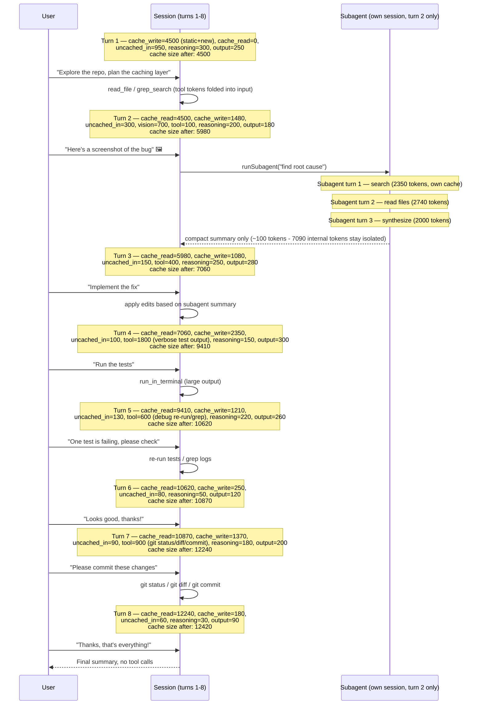

# Scenario 1: Cache Basics — An 8-Turn Session

> Extracted from [docs/agentic-coding-explained.md](../agentic-coding-explained.md#9-worked-example-a-multi-turn-session-showing-every-token-type), Section 9.

The example below is an illustrative (not literal) 8-turn session for the task
*"Add a caching layer to the API and write tests for it"*. It shows how each token
type shows up turn by turn, how cache reuse changes the mix as the session grows,
what a **subagent's own session** looks like when it's spawned mid-way through
(turn 2, see [Scenario 2](02-subagent-own-session.md)), and what happens when the
user asks for a **git commit** at the end (turns 7-8).

Each turn both **reads** everything cached by prior turns and **writes** its own
new content (the new user message, tool results, reasoning, and reply) to the cache
so the *next* turn can read it back cheaply. That's why cache read isn't capped by
a single write — it's capped by the running **cache size**, i.e. the sum of every
write so far:

| Turn | What happens | Cache write (new) | Cache read (prior cache size) | Cache size after this turn | Uncached input | Tool | Vision | Reasoning | Output text |
|---|---|---:|---:|---:|---:|---:|---:|---:|---:|
| 1 | First message; explores repo with `read_file`/`grep_search`. Writes the static system prompt/instructions **and** this turn's own content (nothing to read yet) | 4500 | 0 | 4500 | 950 | 0 | 0 | 300 | 250 |
| 2 | User pastes a screenshot of a bug; a **subagent** is spawned to search for the root cause and returns one compact summary (subagent's own turns are in Scenario 2) | 1480 | 4500 | 5980 | 300 | 100 | 700 | 200 | 180 |
| 3 | Using the subagent's summary, model edits files to implement the fix | 1080 | 5980 | 7060 | 150 | 400 | 0 | 250 | 280 |
| 4 | Model runs the test suite; terminal output is large | 2350 | 7060 | 9410 | 100 | 1800 | 0 | 150 | 300 |
| 5 | A test fails; model re-runs tests and greps logs to debug | 1210 | 9410 | 10620 | 130 | 600 | 0 | 220 | 260 |
| 6 | User confirms the tests now pass, no new tool calls | 250 | 10620 | 10870 | 80 | 0 | 0 | 50 | 120 |
| 7 | User asks to commit the changes; model runs `git status`/`git diff` then `git commit` | 1370 | 10870 | 12240 | 90 | 900 | 0 | 180 | 200 |
| 8 | Final "thanks" message, no new tool calls | 180 | 12240 | 12420 | 60 | 0 | 0 | 30 | 90 |

Notes on this example:

- **Cache read on turn *N*** equals the **cache size after turn *N*-1** — i.e. the
  total of every write made by all earlier turns. That's why read can (and
  normally will) be far larger than any single turn's write: it's cumulative,
  writes are incremental.
- **Cache write on turn *N*** is only that turn's *own new* content (its new user
  message, tool results, reasoning, and reply — plus, on turn 1 only, the one-time
  static system prompt/instructions). It never includes what was already cached.
- **Cache size** is the running total available for reuse (`cache size after N` =
  `cache size after N-1` + `cache write on N`). It only grows — nothing is evicted
  in this simplified example (real caches also expire after a TTL if a session goes
  idle too long).
- **Uncached input** is small and roughly constant: it's just the new user message
  each time.
- **Tool tokens** spike on turn 4 (verbose test-run output), again on turn 5
  (re-running tests/grepping logs while debugging), and moderately on turn 7
  (`git status`/`git diff`/`git commit` output) — this is the most common source
  of unexpected AI Credits spend.
- **Vision tokens** only appear on turn 2, where an image was attached.
- **Turn 7's git commit** behaves like any other tool-using turn — no special
  token type — but it does read the session's largest cache so far (10870) and
  adds a meaningful tool-token bump from the git command output.
- The subagent's *own* internal turns/tool calls spawned in turn 2 are **not**
  included in this table at all — the parent session only pays for the call and
  the ~100-token compact summary (see [Scenario 2](02-subagent-own-session.md)).

Whether providers bill the write step at a premium (Anthropic-style explicit
breakpoints) or fold it into normal first-time input price with no separate line
item (OpenAI-style automatic caching) varies — either way, the read-vs-write
*shape* above (small incremental writes, large and growing reads) is the same.

## Per-turn totals and running (cumulative) totals by token type

The same numbers, with rows as turns and columns as token types, plus a per-turn
total and the session's running (cumulative) total for each type. To turn token
counts into AI Credits, this example assumes illustrative per-1K-token rates:
cache write 0.00625 AI Credits, cache read 0.0005 AI Credits, uncached input/tool/vision 0.005 AI Credits,
reasoning/output 0.015 AI Credits (real rates depend on the model and provider).

| Turn | What it does | Cache write | Cache read | Uncached input | Tool | Vision | Reasoning | Output text | **Turn total** | **Turn AI Credits** |
|---|---|---:|---:|---:|---:|---:|---:|---:|---:|---:|
| 1 | Explores repo (`read_file`/`grep_search`); writes static prefix + own content | 4500 | 0 | 950 | 0 | 0 | 300 | 250 | **6000** | **0.0411 AI Credits** |
| 2 | Screenshot of a bug; spawns subagent, gets back a compact summary | 1480 | 4500 | 300 | 100 | 700 | 200 | 180 | **7460** | **0.0227 AI Credits** |
| 3 | Implements the fix using the subagent's summary | 1080 | 5980 | 150 | 400 | 0 | 250 | 280 | **8140** | **0.0204 AI Credits** |
| 4 | Runs the test suite; verbose terminal output | 2350 | 7060 | 100 | 1800 | 0 | 150 | 300 | **11760** | **0.0345 AI Credits** |
| 5 | A test fails; re-runs tests and greps logs to debug | 1210 | 9410 | 130 | 600 | 0 | 220 | 260 | **11830** | **0.0231 AI Credits** |
| 6 | User confirms the tests now pass, no new tool calls | 250 | 10620 | 80 | 0 | 0 | 50 | 120 | **11120** | **0.0098 AI Credits** |
| 7 | Commits the changes (`git status`/`git diff`/`git commit`) | 1370 | 10870 | 90 | 900 | 0 | 180 | 200 | **13610** | **0.0246 AI Credits** |
| 8 | Final "thanks" message, no new tool calls | 180 | 12240 | 60 | 0 | 0 | 30 | 90 | **12600** | **0.0093 AI Credits** |

| Cumulative through turn | What it does | Cache write | Cache read | Uncached input | Tool | Vision | Reasoning | Output text | **Session total** | **Running session AI Credits** |
|---|---|---:|---:|---:|---:|---:|---:|---:|---:|---:|
| 1 | Explores repo (`read_file`/`grep_search`); writes static prefix + own content | 4500 | 0 | 950 | 0 | 0 | 300 | 250 | **6000** | **0.0411 AI Credits** |
| 2 | Screenshot of a bug; spawns subagent, gets back a compact summary | 5980 | 4500 | 1250 | 100 | 700 | 500 | 430 | **13460** | **0.0638 AI Credits** |
| 3 | Implements the fix using the subagent's summary | 7060 | 10480 | 1400 | 500 | 700 | 750 | 710 | **21600** | **0.0843 AI Credits** |
| 4 | Runs the test suite; verbose terminal output | 9410 | 17540 | 1500 | 2300 | 700 | 900 | 1010 | **33360** | **0.1187 AI Credits** |
| 5 | A test fails; re-runs tests and greps logs to debug | 10620 | 26950 | 1630 | 2900 | 700 | 1120 | 1270 | **45190** | **0.1419 AI Credits** |
| 6 | User confirms the tests now pass, no new tool calls | 10870 | 37570 | 1710 | 2900 | 700 | 1170 | 1390 | **56310** | **0.1517 AI Credits** |
| 7 | Commits the changes (`git status`/`git diff`/`git commit`) | 12240 | 48440 | 1800 | 3800 | 700 | 1350 | 1590 | **69920** | **0.1763 AI Credits** |
| 8 | Final "thanks" message, no new tool calls | 12420 | 60680 | 1860 | 3800 | 700 | 1380 | 1680 | **82520** | **0.1857 AI Credits** |

Note that **cumulative cache write** (12420) is exactly the final **cache size**
from the first table — every token ever written, still available for reuse. The
much larger **cumulative cache read** (60680) is how much reuse benefit that
cache actually delivered, since each turn re-reads the whole growing history.
That reuse — reading far more than was ever written — is precisely what keeps the
**running session AI Credits** growing slower than the **session total** token count.

```mermaid
xychart-beta
    title "Parent session: token usage per turn by type (illustrative example)"
    x-axis [Turn1, Turn2, Turn3, Turn4, Turn5, Turn6, Turn7, Turn8]
    y-axis "Tokens" 0 --> 13000
    bar "Cache write" [4500, 1480, 1080, 2350, 1210, 250, 1370, 180]
    bar "Cache read" [0, 4500, 5980, 7060, 9410, 10620, 10870, 12240]
    bar "Uncached input" [950, 300, 150, 100, 130, 80, 90, 60]
    bar "Tool" [0, 100, 400, 1800, 600, 0, 900, 0]
    bar "Vision" [0, 700, 0, 0, 0, 0, 0, 0]
    bar "Reasoning" [300, 200, 250, 150, 220, 50, 180, 30]
    bar "Output text" [250, 180, 280, 300, 260, 120, 200, 90]
```

