# Scenario 2: The Subagent's Own Session

> Extracted from [docs/agentic-coding-explained.md](../agentic-coding-explained.md#9-worked-example-a-multi-turn-session-showing-every-token-type), Section 9 ("The subagent's own session" subsection). Companion to [Scenario 1](01-cache-basics-8-turn-session.md), where this subagent is spawned mid-way through parent turn 2.

The subagent spawned in parent turn 2 runs in its **own isolated context** — it has
its own system prompt, its own turns, and its own token usage, none of which is
visible to (or paid for again by) the parent session. Only its final summary
crosses back over, counted as the ~100 "tool" tokens in the parent's turn 2 row.

| Subagent turn | What it does | Cache write (new) | Cache read | Cache size after | Uncached input | Tool | Reasoning | Output text | **Turn total** | **Turn cost** |
|---|---|---:|---:|---:|---:|---:|---:|---:|---:|---:|
| 1 | Searches the codebase (`grep_search`/`semantic_search`) for the bug's root cause | 1200 | 0 | 1200 | 250 | 600 | 180 | 120 | **2350** | **$0.0163** |
| 2 | Reads the matched files in full | 300 | 1200 | 1500 | 100 | 900 | 150 | 90 | **2740** | **$0.0111** |
| 3 | Synthesizes the compact summary returned to the parent | 150 | 1500 | 1650 | 50 | 0 | 100 | 200 | **2000** | **$0.0064** |
| **Subagent session total** | | **1650** | **2700** | — | **400** | **1500** | **430** | **410** | **7090** | **$0.0338** |

This subagent cost (**$0.0338**) is real and billed — isolation doesn't make the
exploration free. What it *does* avoid is dumping all 7090 of those tokens into
the **parent's** permanent cache. If that exploration had happened inline in
parent turn 2 instead, the parent's cache size would have jumped by ~7090 tokens
right there, and turns 3-6 would each re-read that extra history — roughly
4 × 7090 ≈ 28,400 extra cache-read tokens (~\$0.0142) plus a bigger one-time write
(~\$0.0443) — for a total of about \$0.0585, *more* than the \$0.0338 the isolated
subagent actually cost. Isolating exploratory work in a subagent keeps both the
parent's context window and its long-run cache-driven cost smaller.

```mermaid
xychart-beta
    title "Subagent's own session: token usage per turn by type"
    x-axis [SubTurn1, SubTurn2, SubTurn3]
    y-axis "Tokens" 0 --> 1600
    bar "Cache write" [1200, 300, 150]
    bar "Cache read" [0, 1200, 1500]
    bar "Uncached input" [250, 100, 50]
    bar "Tool" [600, 900, 0]
    bar "Reasoning" [180, 150, 100]
    bar "Output text" [120, 90, 200]
```

Even though **cache read** keeps growing in both sessions (each re-reads its own
accumulated history every turn), each turn's own **cache write** stays small and
roughly proportional to just that turn's new content — and the subagent's entire
7090-token trajectory never touches the parent's cache at all.
