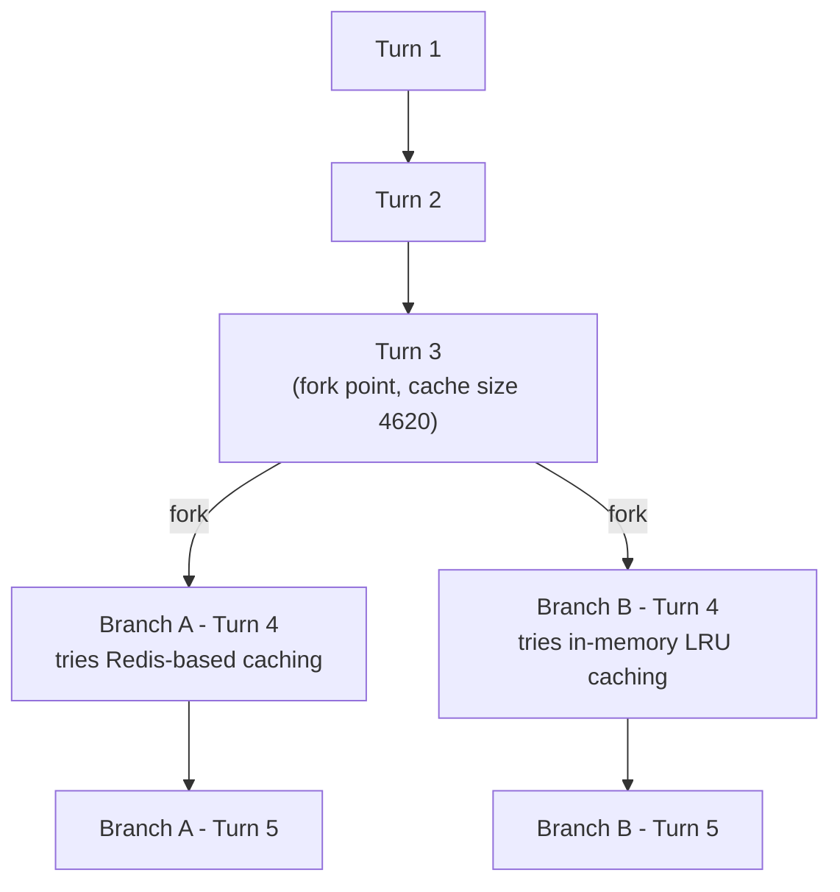

# Scenario 8: Session Forking

> Extracted from [docs/agentic-coding-explained.md](../agentic-coding-explained.md#16-how-session-forking-affects-tokens-cache-and-ai-credits), Section 16.

**Forking** creates a *new*, independent session that shares the same history up
to a chosen turn — but, unlike `/rewind` ([Scenario 7](07-rewind.md)), the
**original session keeps existing and can keep going too**. Instead of choosing
one path and discarding the other, forking lets both continue in parallel from a
common checkpoint.

What this does to tokens/cache/AI Credits:

- **No invalidation at the fork point**: forking doesn't change any content — it
  just starts a second, independent continuation from the exact same prefix. That
  shared prefix (the "trunk") is still a valid, warm cache hit for **every**
  branch that reads it, as long as the same model/tools/instructions and the
  provider's cache TTL are still in effect.
- **Each branch pays its own cache-read AI Credits** to reuse the trunk — it
  isn't free, but it's the cheap cache-read rate, not a resend at full uncached
  price.
- **Branches diverge independently from the fork point on**: branch A's new
  turns build their own cache on top of the shared trunk; branch B does the same
  with its own turns. Neither branch's post-fork writes are visible to the other.
- **Versus `/rewind`**: rewind keeps one path and permanently throws away the
  other (its AI Credits are sunk, and it's gone for good). Forking keeps *both* —
  nothing is discarded, so exploring an alternative never means losing the
  original.
- **Versus starting a second session from scratch**: an unrelated fresh session
  would have to rebuild the same trunk from zero (paying full uncached price all
  over again). Forking reuses the trunk as a cache hit instead — this is the main
  AI Credits saving forking provides.

Why use it: to try **multiple alternative approaches from the same starting
point** and compare them (e.g. two different implementation strategies), to
**safely experiment** with a risky change while keeping the original session
intact as a live fallback (instead of `/rewind`'s all-or-nothing discard), or to
**parallelize** work — e.g. handing one branch to a teammate or a background
agent — from a context that's already warmed up.

**Shared trunk** (both branches inherit this identically):

| Turn | What happens | Cache write | Cache read | Cache size after | Uncached input | Tool | Reasoning | Output text | **Turn total** | **Turn AI Credits** |
|---|---|---:|---:|---:|---:|---:|---:|---:|---:|---:|
| 1 | Normal turn; writes static prefix + own content | 3500 | 0 | 3500 | 500 | 0 | 150 | 150 | **4300** | **0.0289 AI Credits** |
| 2 | Normal turn; reads/extends the cache | 600 | 3500 | 4100 | 200 | 100 | 120 | 180 | **4700** | **0.0115 AI Credits** |
| 3 | Decides to compare two caching strategies; **forks here** | 520 | 4100 | 4620 | 220 | 0 | 140 | 160 | **5140** | **0.0109 AI Credits** |

AI Credits spent on the trunk so far: **0.0513** (paid once).

**Post-fork branches** (each turn 4 reads the *same* trunk cache — 4620 — independently):

| Branch / Turn | What happens | Cache write | Cache read | Cache size after | Uncached input | Tool | Reasoning | Output text | **Turn total** | **Turn AI Credits** |
|---|---|---:|---:|---:|---:|---:|---:|---:|---:|---:|
| A · 4 | Implements a Redis-based caching strategy | 1000 | 4620 | 5620 | 150 | 500 | 160 | 190 | **6620** | **0.0171 AI Credits** |
| A · 5 | Normal follow-up turn in branch A | 290 | 5620 | 5910 | 80 | 0 | 90 | 120 | **6200** | **0.0082 AI Credits** |
| B · 4 | Implements an in-memory LRU caching strategy | 1170 | 4620 | 5790 | 140 | 700 | 150 | 180 | **6960** | **0.0188 AI Credits** |
| B · 5 | Normal follow-up turn in branch B | 250 | 5790 | 6040 | 70 | 0 | 80 | 100 | **6290** | **0.0075 AI Credits** |

Branch A total: **0.0253 AI Credits** on top of the trunk (session A total: 0.0513 AI Credits + 0.0253 AI Credits
= **0.0766 AI Credits**). Branch B total: **0.0263 AI Credits** on top of the same trunk (session B
total: 0.0513 AI Credits + 0.0263 AI Credits = **0.0776 AI Credits**). Exploring *both* strategies this way
requires **0.0513 AI Credits + 0.0253 AI Credits + 0.0263 AI Credits = 0.1029 AI Credits** in total — the trunk is paid for
**once**, then reused as a cache hit by both branches.

Compare that to running two entirely separate sessions from scratch instead of
forking: each would have to rebuild the same trunk independently (2 × 0.0513 AI Credits =
0.1026 AI Credits) on top of its own branch spend (0.0253 AI Credits + 0.0263 AI Credits), for a total of
**0.1542 AI Credits** — about **0.0513 AI Credits more**, exactly one extra copy of the trunk. That
gap *is* the saving forking provides: shared setup gets paid for once and reused,
not re-purchased per branch.
