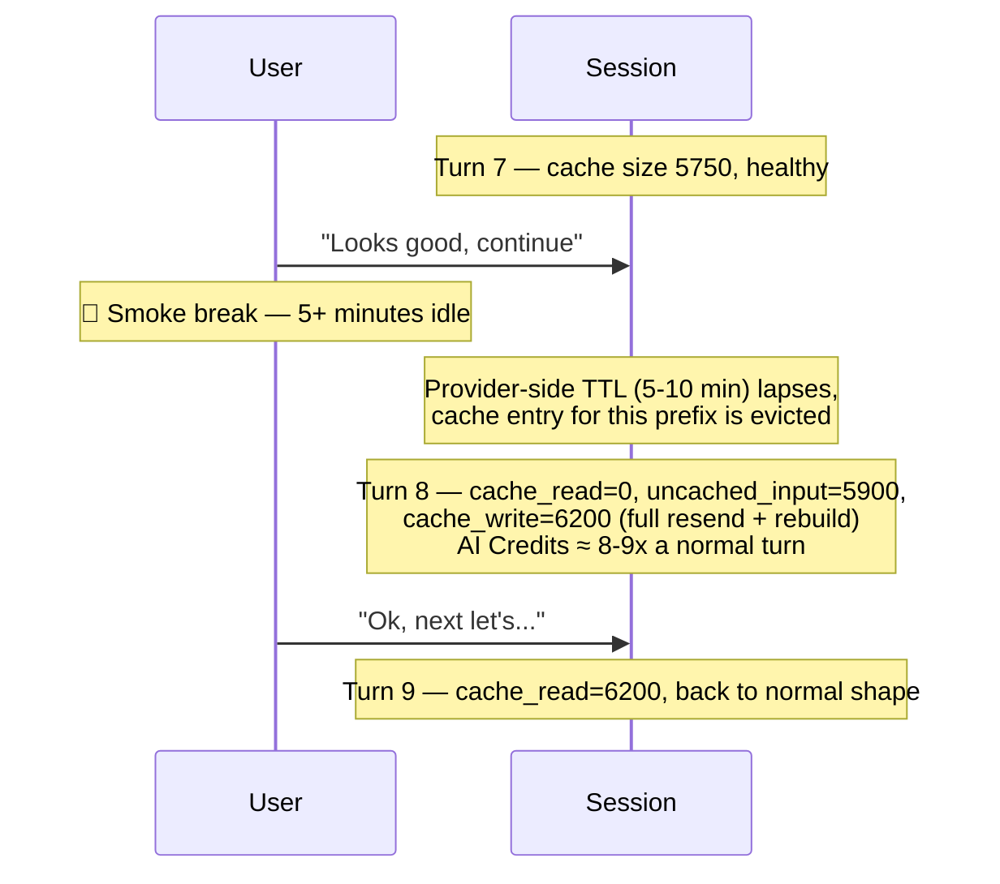

# Scenario 9: Cache TTL — A 5+ Minute Smoke Break

> Extracted from [docs/agentic-coding-explained.md](../agentic-coding-explained.md#172-10-turn-example-a-5-minute-smoke-break-between-turns-7-and-8), Section 17.2.

The example below extends [Scenario 1](01-cache-basics-8-turn-session.md)'s style
to 10 turns, using the same illustrative rates (cache write 0.00625 AI Credits, cache read
0.0005 AI Credits, uncached input/tool 0.005 AI Credits, reasoning/output 0.015 AI Credits per 1K tokens).
Turns 1-7 happen back-to-back and build a healthy, growing cache. Then the user
steps away for a **5+ minute smoke break** before turn 8 — long enough to exceed
every provider's default TTL (Anthropic: 5 minutes; OpenAI: ~5-10 minutes
in-memory; see Section 17.1 of the main doc).

| Turn | What happens | Cache write | Cache read | Cache size after | Uncached input | Tool | Reasoning | Output text | **Turn total** | **Turn AI Credits** |
|---|---|---:|---:|---:|---:|---:|---:|---:|---:|---:|
| 1 | Normal turn; writes static prefix + own content | 3000 | 0 | 3000 | 400 | 0 | 0 | 200 | **3600** | **0.0238 AI Credits** |
| 2 | Normal turn; reads/extends the cache | 500 | 3000 | 3500 | 150 | 0 | 0 | 150 | **3800** | **0.0076 AI Credits** |
| 3 | Explores code with a couple of tool calls | 450 | 3500 | 3950 | 140 | 300 | 0 | 180 | **4570** | **0.0095 AI Credits** |
| 4 | Applies an edit, runs a quick check | 600 | 3950 | 4550 | 130 | 500 | 0 | 200 | **5380** | **0.0119 AI Credits** |
| 5 | Normal follow-up turn | 400 | 4550 | 4950 | 120 | 0 | 0 | 160 | **5230** | **0.0078 AI Credits** |
| 6 | Normal follow-up turn | 380 | 4950 | 5330 | 110 | 0 | 0 | 150 | **5590** | **0.0077 AI Credits** |
| 7 | Normal follow-up turn — cache is healthy (5750 tokens) | 420 | 5330 | 5750 | 130 | 0 | 0 | 170 | **6050** | **0.0085 AI Credits** |
| *(user steps away — smoke break, >5 minutes idle)* | | | | | | | | | | |
| 8 | **Cache miss**: every provider's TTL has lapsed; the full 5750-token history + new message must be resent as plain uncached input, and a brand-new cache entry is written from scratch | 6200 | 0 | 6200 | 5900 | 0 | 220 | 200 | **12520** | **0.0746 AI Credits** |
| 9 | Normal turn; new cache rebuilds from the post-break baseline | 430 | 6200 | 6630 | 120 | 0 | 0 | 150 | **6900** | **0.0086 AI Credits** |
| 10 | Normal turn | 300 | 6630 | 6930 | 90 | 0 | 0 | 120 | **7140** | **0.0074 AI Credits** |

What the break actually costs in AI Credits: had the cache stayed warm, turn 8
would have looked like turn 7 — roughly 430 write / 5750 read / 130 uncached /
170 output, about **0.0088 AI Credits**. Instead it uses **0.0746 AI Credits**, about **8.5x** more —
roughly **0.066 AI Credits** in extra, avoidable spend for that one turn, purely because
the pause outlasted the TTL. Turns 9-10 recover completely normal cache-growth
behavior once the new cache has been (re-)written; the session total across
all 10 turns is about **0.167 AI Credits**.

Critically, **nothing about your conversation is lost** — this is not a
`/clear` ([Scenario 6](06-clear.md)) or a `/rewind` ([Scenario 7](07-rewind.md)).
The full message history is still sent and still visible to the model; only the
*cache* for reusing that history cheaply has expired, so that one turn pays
full uncached-input price to "rehydrate" it. Every turn after that goes back to
normal cache-hit pricing.
