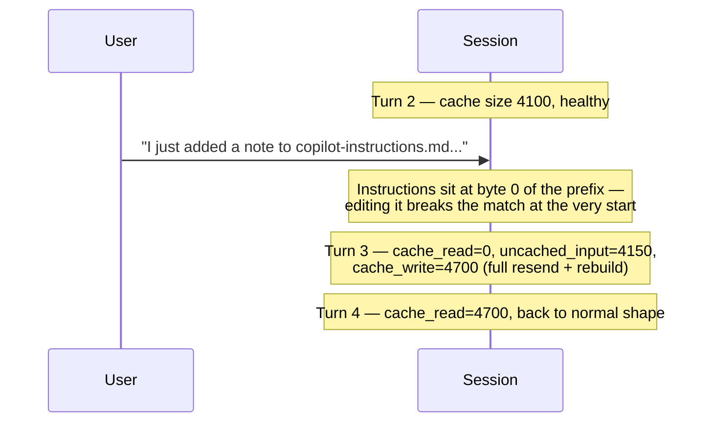

# Scenario 10: Editing Custom Instructions Mid-Session

> Extracted from [docs/agentic-coding-explained.md](../agentic-coding-explained.md#4-prompt--file-caching-and-how-it-saves-ai-credits), Section 4.

Cache matching works on a **contiguous prefix starting at byte 0**, and the
system prompt/instructions sit at the very front of it. Editing
`copilot-instructions.md` (or an `AGENTS.md`-style file) mid-session means the
match breaks **right at the start** — so, even though the tool definitions and
every prior conversation turn are unchanged, none of them can match anymore
either, since prefix matching can't "skip over" the changed part and resume
later. The result is a **full cache miss**: the next turn resends everything
(new instructions + all prior history) uncached, then a brand-new cache builds
from scratch. This is the same *mechanism* as [Scenario 5](05-mcp-tool-change.md)'s
MCP-tool-change example, just triggered even earlier in the prefix — so in
practice it's total invalidation every time, not just a partial one.

| Turn | What happens | Cache write | Cache read | Cache size after | Uncached input | Tool | Reasoning | Output text | **Turn total** | **Turn AI Credits** |
|---|---|---:|---:|---:|---:|---:|---:|---:|---:|---:|
| 1 | Normal turn; writes static prefix + own content | 3500 | 0 | 3500 | 500 | 0 | 150 | 150 | **4300** | **0.0289 AI Credits** |
| 2 | Normal turn; reads/extends the cache | 600 | 3500 | 4100 | 200 | 100 | 120 | 180 | **4700** | **0.0115 AI Credits** |
| 3 | **`copilot-instructions.md` is edited mid-session**: the change sits at byte 0 of the prefix, so nothing before it can match either — a full cache miss, not a partial one | 4700 | 0 | 4700 | 4150 | 0 | 200 | 220 | **9270** | **0.0562 AI Credits** |
| 4 | Normal turn on the post-edit baseline; cache rebuilds under the updated instructions | 600 | 4700 | 5300 | 130 | 300 | 140 | 170 | **6040** | **0.0129 AI Credits** |
| 5 | Normal turn; no further disruption | 220 | 5300 | 5520 | 70 | 0 | 60 | 90 | **5740** | **0.0066 AI Credits** |

Turn 3 (**0.0562 AI Credits**) is roughly 5x turn 2's cost — comparable in
scale to an MCP tool change ([Scenario 5](05-mcp-tool-change.md)), but for a
subtly different reason: a tool change invalidates everything *after* the
tool-definitions block, while an instructions edit invalidates *everything*,
because nothing before the very front of the prefix exists to survive the
change. Turns 4-5 recover completely normal cache-growth behavior once the new
cache — now including the updated instructions — has been (re-)written.
