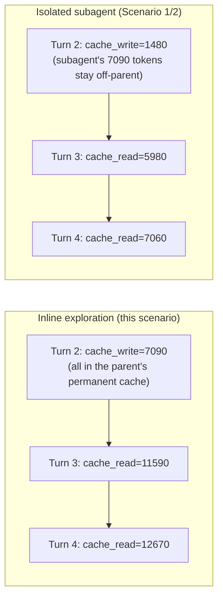

# Scenario 12: Exploring Inline vs. Isolating in a Subagent

> Extracted from [docs/agentic-coding-explained.md](../agentic-coding-explained.md#9-worked-example-a-multi-turn-session-showing-every-token-type), Section 9 (subagent note), and [Section 7](../agentic-coding-explained.md#7-how-subagents-work-and-how-they-reduce-ai-credits-spend).

[Scenario 1](01-cache-basics-8-turn-session.md) and [Scenario 2](02-subagent-own-session.md)
already show what happens when the turn-2 investigation runs in an isolated
subagent: the parent pays only a ~100-token summary, while the subagent's own
7,090-token trajectory (0.0338 AI Credits) stays off the parent's books
entirely. This scenario replays the same task, but has that same investigation
happen **inline** in the parent session instead — exactly the counterfactual
the main doc computes in its note on Section 9 ("If that exploration had
happened inline in parent turn 2 instead...").

| Turn | What happens | Cache write | Cache read | Cache size after | Uncached input | Vision | Tool | Reasoning | Output text | **Turn total** | **Turn AI Credits** |
|---|---|---:|---:|---:|---:|---:|---:|---:|---:|---:|---:|
| 1 | Explores repo (`read_file`/`grep_search`); writes static prefix + own content — identical to Scenario 1, turn 1 | 4500 | 0 | 4500 | 950 | 0 | 0 | 300 | 250 | **6000** | **0.0411 AI Credits** |
| 2 | **Investigates the bug inline** instead of spawning a subagent: the full ~7090-token search-and-read trajectory is written directly into the parent's own cache | 7090 | 4500 | 11590 | 300 | 700 | 0 | 200 | 180 | **13970** | **0.0573 AI Credits** |
| 3 | Implements the fix; cache read is now 11590, nearly double Scenario 1's 5980 at the same point | 1080 | 11590 | 12670 | 150 | 0 | 400 | 250 | 280 | **14350** | **0.0232 AI Credits** |
| 4 | Runs the (verbose) test suite; every turn from here on carries the extra ~5610 tokens turn 2 added | 2350 | 12670 | 15020 | 100 | 0 | 1800 | 150 | 300 | **17370** | **0.0373 AI Credits** |
| 5 | Final "thanks" message, no new tool calls | 180 | 15020 | 15200 | 60 | 0 | 0 | 30 | 90 | **15380** | **0.0105 AI Credits** |

Turn 2 alone costs **0.0573 AI Credits** inline, versus **0.0227 AI Credits**
(parent) **+ 0.0338 AI Credits** (subagent, isolated) in Scenario 1/2 — a real,
already-billed 0.0338 AI Credits either way, but the isolated version's spend
is *bounded to that one call* while the inline version's spend becomes a
**permanent** part of the parent's cache. Every later turn's cache-read column
in this scenario runs meaningfully higher than the equivalent turn in Scenario
1 (11,590 vs 5,980 at turn 3; 12,670 vs 7,060 at turn 4) — the gap doesn't
shrink, because nothing ever compacts it away. Isolating exploratory work in a
subagent (Section 7) doesn't just avoid one large turn; it avoids a long tail
of inflated cache reads for the rest of the session.
