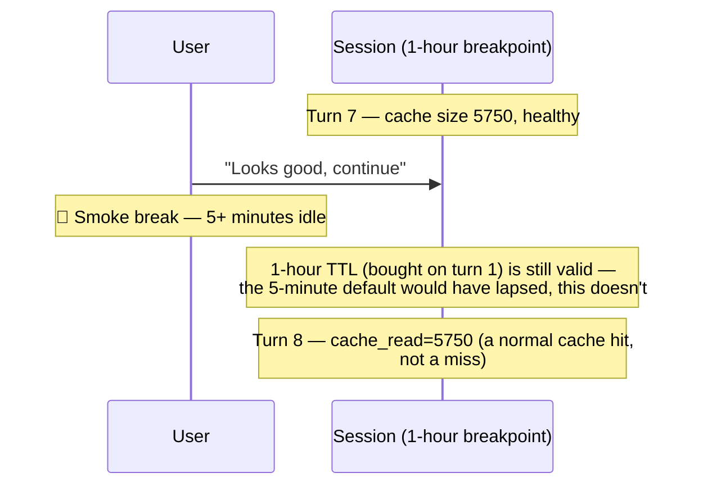

# Scenario 13: Cache TTL — Surviving a Break with the 1-Hour Breakpoint

> Extracted from [docs/agentic-coding-explained.md](../agentic-coding-explained.md#171-how-long-does-the-cache-live-and-is-it-the-same-for-every-model), Section 17.1.

Anthropic's default cache lifetime is **5 minutes**, refreshed for free on
every cache hit — but a **1-hour TTL** is available as an explicit
breakpoint, at roughly **2x** the normal cache-write price. This scenario
replays [Scenario 9](09-cache-ttl-smoke-break.md)'s exact 10-turn arc and the
same 5+ minute smoke break between turns 7 and 8 — but this session pays the
1-hour-breakpoint premium on every cache write instead of the default rate.

| Turn | What happens | Cache write | Cache read | Cache size after | Uncached input | Tool | Output text | **Turn total** | **Turn AI Credits** |
|---|---|---:|---:|---:|---:|---:|---:|---:|---:|
| 1 | Normal turn; writes static prefix + own content (2x cache-write rate) | 3000 | 0 | 3000 | 400 | 0 | 200 | **3600** | **0.0425 AI Credits** |
| 2 | Normal turn; reads/extends the cache | 500 | 3000 | 3500 | 150 | 0 | 150 | **3800** | **0.0108 AI Credits** |
| 3 | Explores code with a couple of tool calls | 450 | 3500 | 3950 | 140 | 300 | 180 | **4570** | **0.0122 AI Credits** |
| 4 | Applies an edit, runs a quick check | 600 | 3950 | 4550 | 130 | 500 | 200 | **5380** | **0.0156 AI Credits** |
| 5 | Normal follow-up turn | 400 | 4550 | 4950 | 120 | 0 | 160 | **5230** | **0.0103 AI Credits** |
| 6 | Normal follow-up turn | 380 | 4950 | 5330 | 110 | 0 | 150 | **5590** | **0.0100 AI Credits** |
| 7 | Normal follow-up turn — cache is healthy (5750 tokens) | 420 | 5330 | 5750 | 130 | 0 | 170 | **6050** | **0.0111 AI Credits** |
| *(user steps away — smoke break, >5 minutes idle)* | | | | | | | | | |
| 8 | **No cache miss**: the 1-hour breakpoint bought on turn 1 comfortably outlasts the break — this turn behaves like any normal turn | 430 | 5750 | 6180 | 130 | 0 | 170 | **6480** | **0.0115 AI Credits** |
| 9 | Normal turn; cache keeps growing uninterrupted | 430 | 6180 | 6610 | 120 | 0 | 150 | **6880** | **0.0113 AI Credits** |
| 10 | Normal turn | 300 | 6610 | 6910 | 90 | 0 | 120 | **7120** | **0.0093 AI Credits** |

Compare turn 8 directly against [Scenario 9](09-cache-ttl-smoke-break.md)'s
turn 8: same break, same prior cache size, but the default-TTL version pays
**0.0746 AI Credits** for a full cache miss (~8.5x a normal turn) while this
session pays **0.0115 AI Credits** — a normal turn, full stop. The trade-off
is paid up front instead: every cache write here costs roughly 2x the default
rate (visible in every turn's slightly higher AI Credits than Scenario 9's
equivalent turn), so the 1-hour breakpoint isn't free insurance — it's a bet
that idle gaps longer than 5 minutes will happen often enough in this session
to be worth paying for on every turn, not just the one that would otherwise
have missed.
