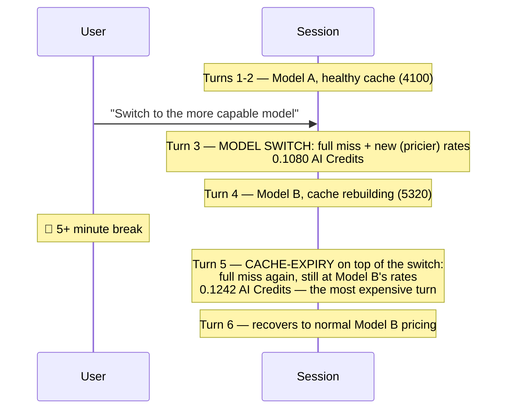

# Scenario 14: Cascading Triggers — A Model Switch Followed by a Cache-Expiry

> Extracted from [docs/agentic-coding-explained.md](../agentic-coding-explained.md#1712-combined-and-cascading-triggers-when-do-invalidations-stack), Section 17.12.

Sections 11-16 of the main doc each cover a single trigger in isolation — one
model switch, one TTL lapse, one fork. Real sessions don't always cooperate:
a model switch ([Scenario 4](04-model-switch.md)) can be followed, a couple of
turns later, by an idle gap that outlasts the *new* model's TTL
([Scenario 9](09-cache-ttl-smoke-break.md)'s trigger) — and the two don't just
add up, they compound, because the second miss re-pays the pricier post-switch
rates the first trigger already put in effect.

| Turn | Model | What happens | Cache write | Cache read | Cache size after | Uncached input | Tool | Reasoning | Output text | **Turn total** | **Turn AI Credits** |
|---|---|---|---:|---:|---:|---:|---:|---:|---:|---:|---:|
| 1 | A | Normal turn; writes static prefix + own content | 3500 | 0 | 3500 | 500 | 0 | 150 | 150 | **4300** | **0.0289 AI Credits** |
| 2 | A | Normal turn; reads/extends the cache | 600 | 3500 | 4100 | 200 | 0 | 120 | 180 | **4600** | **0.0110 AI Credits** |
| 3 | **B** | **Model switch**: A's 4100-token cache is worthless to B; the whole history + new message is resent uncached, and B writes its own first cache entry at its own, pricier rates | 4850 | 0 | 4850 | 4300 | 0 | 250 | 300 | **9700** | **0.1080 AI Credits** |
| 4 | B | Normal turn under B; the user then steps away for 5+ minutes | 470 | 4850 | 5320 | 120 | 300 | 150 | 200 | **6440** | **0.0243 AI Credits** |
| 5 | **B** | **Cache-expiry, cascading on the switch**: the idle gap exceeds B's TTL too; the entire post-switch history is evicted and resent uncached — at B's pricier rates, since the switch never reverted | 5900 | 0 | 5900 | 5380 | 0 | 200 | 180 | **11660** | **0.1242 AI Credits** |
| 6 | B | Cache finally recovers to normal healthy growth | 310 | 5900 | 6210 | 80 | 0 | 90 | 140 | **6520** | **0.0167 AI Credits** |

Turn 5 (**0.1242 AI Credits**) is the most expensive turn in the session —
more expensive even than the model-switch turn itself — because it pays both
the "no warm cache" tax *and* the "expensive model" tax at once. A
single-trigger session pays for exactly one of these; this session pays for
both, back to back, purely because the second trigger landed on top of state
the first one had already changed. The practical lesson (Section 17.4):
batching configuration decisions (model, tools, instructions) at the *start*
of a session and structuring long breaks around a single, deliberate
`/clear` or a fresh session avoids not just one invalidation, but the
compounding of several.
