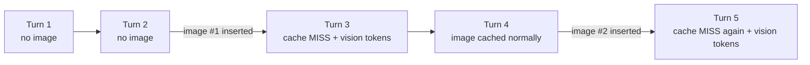

# Scenario 15: An Image Attachment Invalidates the Cache

> Extracted from [docs/agentic-coding-explained.md](../agentic-coding-explained.md#173-what-to-avoid-behaviors-and-technologies-that-invalidate-the-cache), Section 17.3.

Section 17.3 of the main doc flags "images appearing/disappearing anywhere in
the conversation" as one of several things "explicitly documented (by
Anthropic) as invalidating triggers, even though none of them feel like
'changing the setup.'" [Scenario 1](01-cache-basics-8-turn-session.md) already
shows a screenshot adding **vision tokens** to a turn — but that's only half
the story. Attaching (or removing) an image also changes the *shape* of the
message content at the point it's inserted, which breaks the prefix match
there, independent of how many vision tokens the image itself costs.

| Turn | What happens | Cache write | Cache read | Cache size after | Uncached input | Vision | Reasoning | Output text | **Turn total** | **Turn AI Credits** |
|---|---|---:|---:|---:|---:|---:|---:|---:|---:|---:|
| 1 | Normal turn; writes static prefix + own content. No image yet | 3500 | 0 | 3500 | 500 | 0 | 150 | 150 | **4300** | **0.0289 AI Credits** |
| 2 | Normal turn; reads/extends the cache | 600 | 3500 | 4100 | 200 | 0 | 120 | 180 | **4600** | **0.0110 AI Credits** |
| 3 | **First screenshot attached**: invalidates the prefix at the point of insertion, on top of its own 700 vision tokens | 4700 | 0 | 4700 | 4200 | 700 | 180 | 190 | **9970** | **0.0594 AI Credits** |
| 4 | Normal turn; the image is now baked into the cache like any other content | 220 | 4700 | 4920 | 70 | 0 | 60 | 90 | **5140** | **0.0063 AI Credits** |
| 5 | **Second screenshot attached, later in the session**: the same invalidation happens again — per-occurrence, not one-time | 5300 | 0 | 5300 | 5000 | 650 | 160 | 170 | **11280** | **0.0663 AI Credits** |

Both invalidating turns (3 and 5) cost roughly 5-6x a normal turn — not
because either screenshot is especially large, but because each one resets
the prefix match at the point it lands. A session that goes back and forth
attaching several screenshots over its lifetime (a common pattern when
iterating on UI bugs) pays this tax **every time**, not just on the first
attachment — worth knowing before assuming that only the first image in a
session is expensive.
