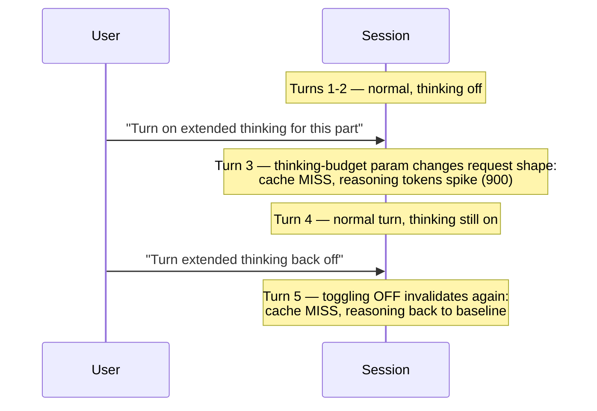

# Scenario 16: Toggling Extended Thinking Mid-Session

> Extracted from [docs/agentic-coding-explained.md](../agentic-coding-explained.md#173-what-to-avoid-behaviors-and-technologies-that-invalidate-the-cache), Section 17.3.

Alongside images, Section 17.3 of the main doc lists "reasoning
effort/thinking-budget changes, web-search or citation toggles, `tool_choice`
changes" as settings that invalidate the cache purely by being rendered into
the request shape — even though flipping one mid-task doesn't feel like
reconfiguring anything. This scenario shows the extended-thinking budget being
turned on, used, and turned back off within a single session.

| Turn | What happens | Cache write | Cache read | Cache size after | Uncached input | Tool | Reasoning | Output text | **Turn total** | **Turn AI Credits** |
|---|---|---:|---:|---:|---:|---:|---:|---:|---:|---:|
| 1 | Normal turn; extended thinking off, reasoning at baseline | 3500 | 0 | 3500 | 500 | 0 | 150 | 150 | **4300** | **0.0289 AI Credits** |
| 2 | Normal turn; reads/extends the cache | 600 | 3500 | 4100 | 200 | 0 | 120 | 180 | **4700** | **0.0110 AI Credits** |
| 3 | **Extended thinking turned on**: the thinking-budget parameter changes the request shape, invalidating the cache; reasoning tokens jump sharply | 4650 | 0 | 4650 | 4150 | 0 | 900 | 250 | **9950** | **0.0671 AI Credits** |
| 4 | Normal turn under the new (elevated) reasoning budget | 700 | 4650 | 5350 | 130 | 200 | 400 | 220 | **6200** | **0.0177 AI Credits** |
| 5 | **Extended thinking turned back off**: the same invalidation happens again, in the other direction | 5800 | 0 | 5800 | 5420 | 0 | 100 | 120 | **11440** | **0.0667 AI Credits** |

Both toggle turns (3 and 5) cost roughly 6x a normal turn — the setting
invalidates the cache in **either direction**, so switching it on and then off
again within one session pays the full-miss tax twice for what is, in terms
of net task complexity, a single "use more reasoning for the hard part" ask.
Per Section 17.4 of the main doc, this is squarely a "decide up front" setting
— enabling it before the session starts (or accepting the elevated reasoning
cost for the whole session) avoids paying the switch cost at all.
