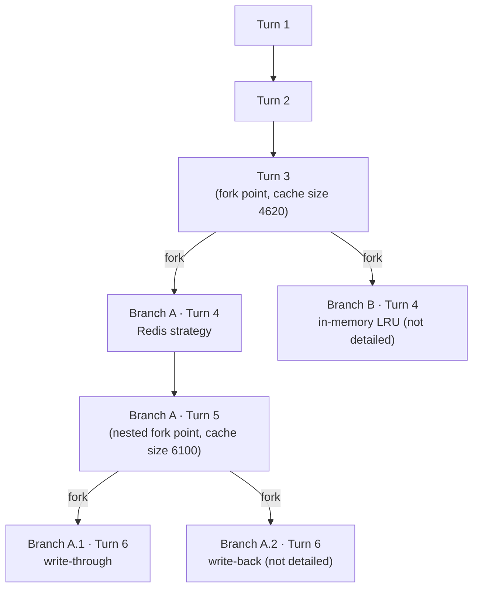

# Scenario 17: Forking Twice — A Nested Branch from Within a Branch

> Extracted from [docs/agentic-coding-explained.md](../agentic-coding-explained.md#16-how-session-forking-affects-tokens-cache-and-ai-credits), Section 16.

[Scenario 8](08-session-forking.md) shows a single fork producing two branches
from one trunk. Nothing about forking is limited to happening once, or to
happening only at the original trunk: **a branch can fork again**, and the
new fork point becomes its own shared trunk — the original trunk plus
everything that branch had already added — for a fresh pair of sub-branches.

| Turn | What happens | Cache write | Cache read | Cache size after | Uncached input | Tool | Reasoning | Output text | **Turn total** | **Turn AI Credits** |
|---|---|---:|---:|---:|---:|---:|---:|---:|---:|---:|
| 1 | Normal turn; writes static prefix + own content — the start of the shared trunk | 3500 | 0 | 3500 | 500 | 0 | 150 | 150 | **4300** | **0.0289 AI Credits** |
| 2 | Normal turn, still on the trunk | 600 | 3500 | 4100 | 200 | 100 | 120 | 180 | **4700** | **0.0115 AI Credits** |
| 3 | **First fork**: Branch A (Redis) and Branch B (in-memory LRU, not detailed here) both start from this 4620-token prefix | 520 | 4100 | 4620 | 220 | 0 | 140 | 160 | **5140** | **0.0109 AI Credits** |
| A · 4 | Branch A implements the Redis-based strategy, reading the shared trunk as a cache hit | 1000 | 4620 | 5620 | 150 | 500 | 160 | 190 | **6620** | **0.0171 AI Credits** |
| A · 5 | **Second fork, nested inside Branch A**: Branch A.1 (write-through) and A.2 (write-back, not detailed here) both start from this 6100-token prefix — the original trunk *plus* Branch A's own work | 480 | 5620 | 6100 | 140 | 0 | 130 | 150 | **6520** | **0.0107 AI Credits** |
| A.1 · 6 | Branch A.1 implements the write-through variant, reading the full nested trunk as a cache hit | 350 | 6100 | 6450 | 90 | 300 | 100 | 140 | **7080** | **0.0108 AI Credits** |

Branch A.1's full session cost through turn 6 is **0.0289 + 0.0115 + 0.0109 +
0.0171 + 0.0107 + 0.0108 = 0.0899 AI Credits** — it reuses the original trunk
once (paid at turns 1-3) *and* Branch A's own pre-fork work once (paid at turn
4), rather than paying for either a second time. Running three entirely
separate sessions from scratch for Branch B, Branch A.1, and Branch A.2 would
instead rebuild the original trunk three times and Branch A's own work twice.
Nesting a fork inside a fork compounds the saving [Scenario 8](08-session-forking.md)
already demonstrates at one level — it isn't a one-time discount, it's a
discount that applies again at every level a session chooses to branch
further.
