# Learning Scenarios: Complete Reference

A single document with every Learn-mode scenario in full: the per-turn
token/cache tables, the per-turn and cumulative AI Credits tables where a
scenario has them, and every Mermaid sequence diagram / bar chart. Each
section is extracted from [agentic-coding-explained.md](../agentic-coding-explained.md)
and expands one of its worked examples into a concrete, numbered session.

For a lighter-weight table linking out to the 18 separate per-scenario
docs instead, see [the scenario index](README.md). For how these scenarios
appear in the running app, see [User Guide § Learn mode](../UserGuide.md#learn-mode).

## Contents

1. [Scenario 1: Cache Basics — An 8-Turn Session](#scenario-1) — Baseline example: how every token type shows up turn by turn, and how the cache read/write shape emerges as a session grows.
2. [Scenario 2: The Subagent's Own Session](#scenario-2) — The subagent spawned in Scenario 1's turn 2, from the inside — its own isolated context/cache, invisible to and not repaid by the parent.
3. [Scenario 3: Context Compaction/Summarization](#scenario-3) — What happens to tokens, cache, and AI Credits when a session's history is compacted into a condensed summary partway through.
4. [Scenario 4: Changing the Model Mid-Session](#scenario-4) — Why switching models mid-session breaks the prompt cache — caches are scoped per model, so the new model starts cold.
5. [Scenario 5: Changing MCP Tools Mid-Session](#scenario-5) — How enabling/disabling an MCP server mid-session changes the tool-definitions block sent every turn, and its cache impact.
6. [Scenario 6: Claude Code's `/clear`](#scenario-6) — `/clear` drops the *visible* history for the next message but doesn't delete anything from disk — what that means for cache and tokens.
7. [Scenario 7: `/rewind` (or Editing a Previous Turn in VS Code)](#scenario-7) — Rolling a session back to an earlier turn and continuing from there, discarding (and often reverting) everything after that point.
8. [Scenario 8: Session Forking](#scenario-8) — Branching a new, independent session from a shared history point while the original session keeps going too.
9. [Scenario 9: Cache TTL — A 5+ Minute Smoke Break](#scenario-9) — Extends Scenario 1 to 10 turns to show a cache expiring mid-session after a 5+ minute idle gap, and the cost of rebuilding it.
10. [Scenario 10: Editing Custom Instructions Mid-Session](#scenario-10) — Editing `copilot-instructions.md`/`AGENTS.md` mid-session breaks the cache at byte 0, since instructions sit at the very front of the prefix.
11. [Scenario 11: A New File Type Silently Changes the Prompt](#scenario-11) — A path-scoped `.instructions.md` file (`applyTo` glob) silently entering or leaving the prompt as different files get touched turn to turn.
12. [Scenario 12: Exploring Inline vs. Isolating in a Subagent](#scenario-12) — Contrasts Scenario 1/2's isolated-subagent exploration against doing the same investigation inline in the parent session.
13. [Scenario 13: Cache TTL — Surviving a Break with the 1-Hour Breakpoint](#scenario-13) — Replays Scenario 9's exact idle gap, but with the optional 1-hour TTL breakpoint (~2x normal cache-write price) instead of the default 5-minute one.
14. [Scenario 14: Cascading Triggers — A Model Switch Followed by a Cache-Expiry](#scenario-14) — What happens when two invalidation triggers stack — a model switch (Scenario 4) followed a few turns later by that new model's own TTL lapsing.
15. [Scenario 15: An Image Attachment Invalidates the Cache](#scenario-15) — An image appearing in the conversation invalidates the cache purely by changing the request shape.
16. [Scenario 16: Toggling Extended Thinking Mid-Session](#scenario-16) — Flipping the reasoning/thinking-budget setting mid-task invalidates the cache the same way an image attachment does.
17. [Scenario 17: Forking Twice — A Nested Branch from Within a Branch](#scenario-17) — Extends Scenario 8: a forked branch can itself fork again, making its own fork point a shared trunk for the next branch.
18. [Scenario 18: A Subagent Running a Cheaper Model](#scenario-18) — Extends Scenario 2: a subagent doing narrow, well-scoped work on a cheaper model than its parent, and the AI Credits saved by that split.

---

## Scenario 1: Cache Basics — An 8-Turn Session

> Extracted from [docs/agentic-coding-explained.md](../agentic-coding-explained.md#9-worked-example-a-multi-turn-session-showing-every-token-type), Section 9.

The example below is an illustrative (not literal) 8-turn session for the task
*"Add a caching layer to the API and write tests for it"*. It shows how each token
type shows up turn by turn, how cache reuse changes the mix as the session grows,
what a **subagent's own session** looks like when it's spawned mid-way through
(turn 2, see [Scenario 2](#scenario-2)), and what happens when the
user asks for a **git commit** at the end (turns 7-8).

Each turn both **reads** everything cached by prior turns and **writes** its own
new content (the new user message, tool results, reasoning, and reply) to the cache
so the *next* turn can read it back cheaply. That's why cache read isn't capped by
a single write — it's capped by the running **cache size**, i.e. the sum of every
write so far:

| Turn | What happens | Cache write (new) | Cache read (prior cache size) | Cache size after this turn | Uncached input | Tool | Vision | Reasoning | Output text |
|---|---|---:|---:|---:|---:|---:|---:|---:|---:|
| 1 | First message; explores repo with `read_file`/`grep_search`. Writes the static system prompt/instructions **and** this turn's own content (nothing to read yet) | 4500 | 0 | 4500 | 950 | 0 | 0 | 300 | 250 |
| 2 | User pastes a screenshot of a bug; a **subagent** is spawned to search for the root cause and returns one compact summary (subagent's own turns are in Scenario 2) | 1480 | 4500 | 5980 | 300 | 100 | 700 | 200 | 180 |
| 3 | Using the subagent's summary, model edits files to implement the fix | 1080 | 5980 | 7060 | 150 | 400 | 0 | 250 | 280 |
| 4 | Model runs the test suite; terminal output is large | 2350 | 7060 | 9410 | 100 | 1800 | 0 | 150 | 300 |
| 5 | A test fails; model re-runs tests and greps logs to debug | 1210 | 9410 | 10620 | 130 | 600 | 0 | 220 | 260 |
| 6 | User confirms the tests now pass, no new tool calls | 250 | 10620 | 10870 | 80 | 0 | 0 | 50 | 120 |
| 7 | User asks to commit the changes; model runs `git status`/`git diff` then `git commit` | 1370 | 10870 | 12240 | 90 | 900 | 0 | 180 | 200 |
| 8 | Final "thanks" message, no new tool calls | 180 | 12240 | 12420 | 60 | 0 | 0 | 30 | 90 |

Notes on this example:

- **Cache read on turn *N*** equals the **cache size after turn *N*-1** — i.e. the
  total of every write made by all earlier turns. That's why read can (and
  normally will) be far larger than any single turn's write: it's cumulative,
  writes are incremental.
- **Cache write on turn *N*** is only that turn's *own new* content (its new user
  message, tool results, reasoning, and reply — plus, on turn 1 only, the one-time
  static system prompt/instructions). It never includes what was already cached.
- **Cache size** is the running total available for reuse (`cache size after N` =
  `cache size after N-1` + `cache write on N`). It only grows — nothing is evicted
  in this simplified example (real caches also expire after a TTL if a session goes
  idle too long).
- **Uncached input** is small and roughly constant: it's just the new user message
  each time.
- **Tool tokens** spike on turn 4 (verbose test-run output), again on turn 5
  (re-running tests/grepping logs while debugging), and moderately on turn 7
  (`git status`/`git diff`/`git commit` output) — this is the most common source
  of unexpected AI Credits spend.
- **Vision tokens** only appear on turn 2, where an image was attached.
- **Turn 7's git commit** behaves like any other tool-using turn — no special
  token type — but it does read the session's largest cache so far (10870) and
  adds a meaningful tool-token bump from the git command output.
- The subagent's *own* internal turns/tool calls spawned in turn 2 are **not**
  included in this table at all — the parent session only pays for the call and
  the ~100-token compact summary (see [Scenario 2](#scenario-2)).

Whether providers bill the write step at a premium (Anthropic-style explicit
breakpoints) or fold it into normal first-time input price with no separate line
item (OpenAI-style automatic caching) varies — either way, the read-vs-write
*shape* above (small incremental writes, large and growing reads) is the same.

### Per-turn totals and running (cumulative) totals by token type

The same numbers, with rows as turns and columns as token types, plus a per-turn
total and the session's running (cumulative) total for each type. To turn token
counts into AI Credits, this example assumes illustrative per-1K-token rates:
cache write 0.00625 AI Credits, cache read 0.0005 AI Credits, uncached input/tool/vision 0.005 AI Credits,
reasoning/output 0.015 AI Credits (real rates depend on the model and provider).

| Turn | What it does | Cache write | Cache read | Uncached input | Tool | Vision | Reasoning | Output text | **Turn total** | **Turn AI Credits** |
|---|---|---:|---:|---:|---:|---:|---:|---:|---:|---:|
| 1 | Explores repo (`read_file`/`grep_search`); writes static prefix + own content | 4500 | 0 | 950 | 0 | 0 | 300 | 250 | **6000** | **0.0411 AI Credits** |
| 2 | Screenshot of a bug; spawns subagent, gets back a compact summary | 1480 | 4500 | 300 | 100 | 700 | 200 | 180 | **7460** | **0.0227 AI Credits** |
| 3 | Implements the fix using the subagent's summary | 1080 | 5980 | 150 | 400 | 0 | 250 | 280 | **8140** | **0.0204 AI Credits** |
| 4 | Runs the test suite; verbose terminal output | 2350 | 7060 | 100 | 1800 | 0 | 150 | 300 | **11760** | **0.0345 AI Credits** |
| 5 | A test fails; re-runs tests and greps logs to debug | 1210 | 9410 | 130 | 600 | 0 | 220 | 260 | **11830** | **0.0231 AI Credits** |
| 6 | User confirms the tests now pass, no new tool calls | 250 | 10620 | 80 | 0 | 0 | 50 | 120 | **11120** | **0.0098 AI Credits** |
| 7 | Commits the changes (`git status`/`git diff`/`git commit`) | 1370 | 10870 | 90 | 900 | 0 | 180 | 200 | **13610** | **0.0246 AI Credits** |
| 8 | Final "thanks" message, no new tool calls | 180 | 12240 | 60 | 0 | 0 | 30 | 90 | **12600** | **0.0093 AI Credits** |

| Cumulative through turn | What it does | Cache write | Cache read | Uncached input | Tool | Vision | Reasoning | Output text | **Session total** | **Running session AI Credits** |
|---|---|---:|---:|---:|---:|---:|---:|---:|---:|---:|
| 1 | Explores repo (`read_file`/`grep_search`); writes static prefix + own content | 4500 | 0 | 950 | 0 | 0 | 300 | 250 | **6000** | **0.0411 AI Credits** |
| 2 | Screenshot of a bug; spawns subagent, gets back a compact summary | 5980 | 4500 | 1250 | 100 | 700 | 500 | 430 | **13460** | **0.0638 AI Credits** |
| 3 | Implements the fix using the subagent's summary | 7060 | 10480 | 1400 | 500 | 700 | 750 | 710 | **21600** | **0.0843 AI Credits** |
| 4 | Runs the test suite; verbose terminal output | 9410 | 17540 | 1500 | 2300 | 700 | 900 | 1010 | **33360** | **0.1187 AI Credits** |
| 5 | A test fails; re-runs tests and greps logs to debug | 10620 | 26950 | 1630 | 2900 | 700 | 1120 | 1270 | **45190** | **0.1419 AI Credits** |
| 6 | User confirms the tests now pass, no new tool calls | 10870 | 37570 | 1710 | 2900 | 700 | 1170 | 1390 | **56310** | **0.1517 AI Credits** |
| 7 | Commits the changes (`git status`/`git diff`/`git commit`) | 12240 | 48440 | 1800 | 3800 | 700 | 1350 | 1590 | **69920** | **0.1763 AI Credits** |
| 8 | Final "thanks" message, no new tool calls | 12420 | 60680 | 1860 | 3800 | 700 | 1380 | 1680 | **82520** | **0.1857 AI Credits** |

Note that **cumulative cache write** (12420) is exactly the final **cache size**
from the first table — every token ever written, still available for reuse. The
much larger **cumulative cache read** (60680) is how much reuse benefit that
cache actually delivered, since each turn re-reads the whole growing history.
That reuse — reading far more than was ever written — is precisely what keeps the
**running session AI Credits** growing slower than the **session total** token count.

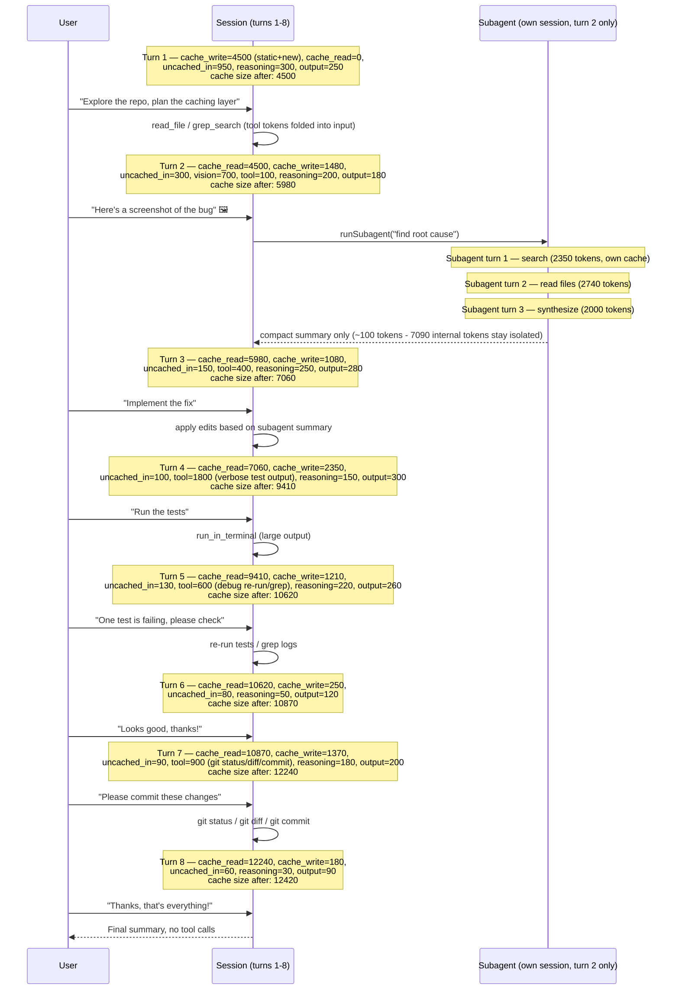

```mermaid
xychart-beta
    title "Parent session: token usage per turn by type (illustrative example)"
    x-axis [Turn1, Turn2, Turn3, Turn4, Turn5, Turn6, Turn7, Turn8]
    y-axis "Tokens" 0 --> 13000
    bar "Cache write" [4500, 1480, 1080, 2350, 1210, 250, 1370, 180]
    bar "Cache read" [0, 4500, 5980, 7060, 9410, 10620, 10870, 12240]
    bar "Uncached input" [950, 300, 150, 100, 130, 80, 90, 60]
    bar "Tool" [0, 100, 400, 1800, 600, 0, 900, 0]
    bar "Vision" [0, 700, 0, 0, 0, 0, 0, 0]
    bar "Reasoning" [300, 200, 250, 150, 220, 50, 180, 30]
    bar "Output text" [250, 180, 280, 300, 260, 120, 200, 90]
```

---

## Scenario 2: The Subagent's Own Session

> Extracted from [docs/agentic-coding-explained.md](../agentic-coding-explained.md#9-worked-example-a-multi-turn-session-showing-every-token-type), Section 9 ("The subagent's own session" subsection). Companion to [Scenario 1](#scenario-1), where this subagent is spawned mid-way through parent turn 2.

The subagent spawned in parent turn 2 runs in its **own isolated context** — it has
its own system prompt, its own turns, and its own token usage, none of which is
visible to (or paid for again by) the parent session. Only its final summary
crosses back over, counted as the ~100 "tool" tokens in the parent's turn 2 row.

| Subagent turn | What it does | Cache write (new) | Cache read | Cache size after | Uncached input | Tool | Reasoning | Output text | **Turn total** | **Turn AI Credits** |
|---|---|---:|---:|---:|---:|---:|---:|---:|---:|---:|
| 1 | Searches the codebase (`grep_search`/`semantic_search`) for the bug's root cause | 1200 | 0 | 1200 | 250 | 600 | 180 | 120 | **2350** | **0.0163 AI Credits** |
| 2 | Reads the matched files in full | 300 | 1200 | 1500 | 100 | 900 | 150 | 90 | **2740** | **0.0111 AI Credits** |
| 3 | Synthesizes the compact summary returned to the parent | 150 | 1500 | 1650 | 50 | 0 | 100 | 200 | **2000** | **0.0064 AI Credits** |
| **Subagent session total** | | **1650** | **2700** | — | **400** | **1500** | **430** | **410** | **7090** | **0.0338 AI Credits** |

This subagent's AI Credits spend (**0.0338 AI Credits**) is real and billed — isolation doesn't make the
exploration free. What it *does* avoid is dumping all 7090 of those tokens into
the **parent's** permanent cache. If that exploration had happened inline in
parent turn 2 instead, the parent's cache size would have jumped by ~7090 tokens
right there, and turns 3-6 would each re-read that extra history — roughly
4 × 7090 ≈ 28,400 extra cache-read tokens (~0.0142 AI Credits) plus a bigger one-time write
(~0.0443 AI Credits) — for a total of about 0.0585 AI Credits, *more* than the 0.0338 AI Credits the isolated
subagent actually spent. Isolating exploratory work in a subagent keeps both the
parent's context window and its long-run cache-driven AI Credits usage smaller.

```mermaid
xychart-beta
    title "Subagent's own session: token usage per turn by type"
    x-axis [SubTurn1, SubTurn2, SubTurn3]
    y-axis "Tokens" 0 --> 1600
    bar "Cache write" [1200, 300, 150]
    bar "Cache read" [0, 1200, 1500]
    bar "Uncached input" [250, 100, 50]
    bar "Tool" [600, 900, 0]
    bar "Reasoning" [180, 150, 100]
    bar "Output text" [120, 90, 200]
```

Even though **cache read** keeps growing in both sessions (each re-reads its own
accumulated history every turn), each turn's own **cache write** stays small and
roughly proportional to just that turn's new content — and the subagent's entire
7090-token trajectory never touches the parent's cache at all.

---

## Scenario 3: Context Compaction/Summarization

> Extracted from [docs/agentic-coding-explained.md](../agentic-coding-explained.md#10-how-context-compactionsummarization-affects-tokens-cache-and-ai-credits), Section 10.

When a session's history grows close to the model's context-window limit, the
client (or the model itself) can **compact** it: instead of sending every raw past
message, it asks the model to produce a condensed summary of everything so far,
and that summary — not the original messages — becomes the new prefix for future
turns.

What this does to tokens/cache/AI Credits:

- **One-time spike on the compaction turn**: producing the summary requires
  reading the *entire* prior history (still a cache hit, if it hasn't expired) and
  generating a new chunk of output (the summary itself) — so that turn's output
  tokens (and reasoning) are larger than usual.
- **Cache invalidation from that point on**: the summary text is *new*, different
  content from the raw history it replaces — it doesn't byte-match the old cached
  prefix. So the old cache entry becomes useless; a **new, smaller cache** starts
  from the summary instead of the full raw transcript.
- **Fewer AI Credits afterward**: because the new prefix (summary + new turns) is much
  smaller than the raw history it replaced, every subsequent turn reads (and
  eventually re-writes) far fewer cached tokens — cutting the steady per-turn AI Credits
  growth at the price of losing verbatim detail from the compacted turns.

| Turn | What happens | Cache write | Cache read | Cache size after | Uncached input | Tool | Reasoning | Output text | **Turn total** | **Turn AI Credits** |
|---|---|---:|---:|---:|---:|---:|---:|---:|---:|---:|
| 1 | Normal turn; writes static prefix + own content | 3500 | 0 | 3500 | 500 | 0 | 150 | 150 | **4300** | **0.0289 AI Credits** |
| 2 | Normal turn; reads/extends the cache | 600 | 3500 | 4100 | 200 | 100 | 120 | 180 | **4700** | **0.0115 AI Credits** |
| 3 | **Context compaction**: reads all prior history (4100) one last time, replaces it with a ~500-token summary as the new cache prefix | 1350 | 4100 | **1350** | 150 | 0 | 300 | 400 | **6300** | **0.0217 AI Credits** |
| 4 | Normal turn; now builds on the much smaller post-compaction cache | 300 | 1350 | 1650 | 80 | 0 | 100 | 120 | **1950** | **0.0063 AI Credits** |
| 5 | Normal turn; cache stays small relative to what it would have been | 210 | 1650 | 1860 | 60 | 0 | 60 | 90 | **2070** | **0.0047 AI Credits** |

The key number is **cache size after turn 3**: it *drops* from 4100 to 1350 even
though the conversation keeps growing — instead of turn 4 reading 4100+ tokens
(and turn 5 reading even more), it reads only 1350, then 1650. Turn 3 itself uses
more AI Credits than a normal turn (the compaction "tax"), but turns 4-5 are noticeably
cheaper than if the raw history had kept growing uncompacted — that trade-off is
the whole point of compaction.

---

## Scenario 4: Changing the Model Mid-Session

> Extracted from [docs/agentic-coding-explained.md](../agentic-coding-explained.md#11-how-changing-the-model-mid-session-affects-tokens-cache-and-ai-credits), Section 11.

Prompt caches are scoped **per model** (and often per model *version*/tokenizer).
Switching models mid-session — e.g. from a cheaper model to a more capable one
starting at turn 3 — means the new model has never seen any of the previous
turns' cached prefix, no matter how well-cached it was under the old model.

What this does to tokens/cache/AI Credits:

- **Full cache miss on the switch turn**: the entire prior conversation must be
  resent to the new model as plain (uncached) input — none of the old model's
  cache carries over, because caches aren't shared across models.
- **Token counts can shift**: different models use different tokenizers, so the
  same text can require a different number of tokens under the new model.
- **New rates apply immediately**: if the new model is pricier (or cheaper), every
  token from the switch turn onward — including cache write/read — is billed at
  the *new* model's rates, not the old one's.
- **A fresh cache then builds up again** from the switch turn forward, under the
  new model, growing the same way as in [Scenario 1](#scenario-1)
  — just starting from zero.

This example switches from a cheaper Model A (turns 1-2) to a pricier Model B
(turns 3-5, illustrative rates: cache write 0.01 AI Credits, cache read 0.001 AI Credits, uncached
input 0.01 AI Credits, reasoning/output 0.03 AI Credits per 1K tokens):

| Turn | Model | What happens | Cache write | Cache read | Cache size after | Uncached input | Reasoning | Output text | **Turn total** | **Turn AI Credits** |
|---|---|---|---:|---:|---:|---:|---:|---:|---:|---:|
| 1 | A | Normal turn; writes static prefix + own content | 3500 | 0 | 3500 | 500 | 150 | 150 | **4300** | **0.0289 AI Credits** |
| 2 | A | Normal turn; reads/extends the cache | 600 | 3500 | 4100 | 200 | 120 | 180 | **4600** | **0.0110 AI Credits** |
| 3 | **B** | **Model switch**: A's 4100-token cache is worthless to B; the whole history + new message (4300) is resent as uncached input, and B writes its *own* first cache entry | 4850 | 0 | 4850 | 4300 | 250 | 300 | **9700** | **0.1080 AI Credits** |
| 4 | B | Normal turn under B; reads/extends B's new cache | 470 | 4850 | 5320 | 120 | 150 | 200 | **5790** | **0.0213 AI Credits** |
| 5 | B | Normal turn under B | 310 | 5320 | 5630 | 80 | 90 | 140 | **5940** | **0.0161 AI Credits** |

Turn 3 (**0.1080 AI Credits**) dwarfs every other turn — nearly 10x turn 2 — purely
because of the switch: a full cache miss forcing 4300 uncached tokens through,
*and* those tokens (plus every token after) now billed at Model B's higher rates.
Turns 4-5 behave like a normal, healthy cache-building session again, just under
the new, pricier rates.

---

## Scenario 5: Changing MCP Tools Mid-Session

> Extracted from [docs/agentic-coding-explained.md](../agentic-coding-explained.md#12-how-changing-mcp-tools-mid-session-affects-tokens-cache-and-ai-credits), Section 12.

The list of available tools (including MCP server tools) — their names,
descriptions, and JSON schemas — is sent to the model as part of the request on
every turn, usually near the top of the prompt (close to the system prompt). If
the enabled toolset changes mid-session (a user enables/disables an MCP server,
or a custom agent swaps its tools) starting at turn 3, that block of the prefix
changes.

What this does to tokens/cache/AI Credits:

- **Partial-to-full cache invalidation**: because the tool-definitions block sits
  early in the prompt, changing it usually invalidates everything cached *after*
  it too — i.e. most or all of the prior conversation — even though the model and
  its rates stay exactly the same.
- **No rate change**: unlike a model switch, the per-token prices don't change —
  the extra AI Credits spend comes purely from losing the cache, not from a pricier model.
- **A new cache rebuilds** from the tool-change turn forward, under the new
  toolset, the same way a fresh session would.

This example changes the enabled MCP tools starting at turn 3 (same model/rates
throughout as [Scenario 1](#scenario-1)'s Model A: cache
write 0.00625 AI Credits, cache read 0.0005 AI Credits, uncached input/tool 0.005 AI Credits,
reasoning/output 0.015 AI Credits per 1K tokens):

| Turn | What happens | Cache write | Cache read | Cache size after | Uncached input | Tool | Reasoning | Output text | **Turn total** | **Turn AI Credits** |
|---|---|---:|---:|---:|---:|---:|---:|---:|---:|---:|
| 1 | Normal turn; writes static prefix (incl. old toolset) + own content | 3500 | 0 | 3500 | 500 | 0 | 150 | 150 | **4300** | **0.0289 AI Credits** |
| 2 | Normal turn; reads/extends the cache | 600 | 3500 | 4100 | 200 | 100 | 120 | 180 | **4700** | **0.0115 AI Credits** |
| 3 | **MCP toolset changes**: new tool schemas alter the early prefix; the prior 4100-token cache no longer matches and must be resent uncached; a new cache is written under the new toolset | 4770 | 0 | 4770 | 4350 | 0 | 200 | 220 | **9540** | **0.0579 AI Credits** |
| 4 | Normal turn; uses one of the newly enabled tools | 800 | 4770 | 5570 | 110 | 400 | 130 | 160 | **6370** | **0.0143 AI Credits** |
| 5 | Normal turn; cache continues building under the new toolset | 240 | 5570 | 5810 | 70 | 0 | 70 | 100 | **6050** | **0.0072 AI Credits** |

Turn 3 (**0.0579 AI Credits**) is about 5x a normal turn — a real spike, but far
smaller than the ~10x spike from a model switch ([Scenario 4](#scenario-4)),
because the model and its rates didn't change, only the cache. This is the general
pattern: **model switches invalidate the cache *and* change the price per token**,
while **tool/instruction changes invalidate the cache but keep the same price per
token** — both use more AI Credits on the turn of the change, but a model switch usually
hurts more.

---

## Scenario 6: Claude Code's `/clear`

> Extracted from [docs/agentic-coding-explained.md](../agentic-coding-explained.md#14-how-claude-codes-clear-affects-tokens-and-cache), Section 14.

`/clear` tells the client to drop the visible conversation history and start the
next message with an empty transcript — but it does **not** delete anything from
disk.

**Does it clear all cache, or keep instructions/tool definitions?** It clears only
the **conversation-history** portion of the context. The system prompt,
`CLAUDE.md`/instructions, and tool/MCP definitions are not "cached files" that
get wiped — they're just reloaded from disk and resent fresh on the very next
turn, exactly like session start. If that static block's content hasn't changed
and the provider's cache entry for it hasn't expired (TTL), it's often **still a
cache hit** right after `/clear` — only the old turn-by-turn conversation on top
of it is gone (and simply never resent again, so there's nothing to invalidate).

Why use it:

- **Starting a genuinely new, unrelated task** in the same terminal/session
  without paying to keep resending (and without the model being anchored to) a
  long, no-longer-relevant conversation.
- **It's free to invoke** — unlike compaction ([Scenario 3](#scenario-3)),
  there's no summarization step, so no extra reasoning/output tokens are spent
  condensing anything; the old turns are simply dropped.
- It trades away **all continuity** (nothing is retained, not even a summary),
  which is the key difference from compaction: `/clear` = full discard, no tax,
  no memory; compaction = partial discard, one-time tax, keeps the gist.

| Turn | What happens | Cache write | Cache read | Cache size after | Uncached input | Tool | Reasoning | Output text | **Turn total** | **Turn AI Credits** |
|---|---|---:|---:|---:|---:|---:|---:|---:|---:|---:|
| 1 | Normal turn; writes static prefix + own content | 3500 | 0 | 3500 | 500 | 0 | 150 | 150 | **4300** | **0.0289 AI Credits** |
| 2 | Normal turn; reads/extends the cache | 600 | 3500 | 4100 | 200 | 100 | 120 | 180 | **4700** | **0.0115 AI Credits** |
| 3 | **`/clear`**: conversation history (the 1100 tokens turns 1-2 added) is dropped; only the still-valid static prefix (3000) is read; a new unrelated task starts | 600 | 3000 | 3600 | 300 | 0 | 130 | 170 | **4200** | **0.0113 AI Credits** |
| 4 | Normal turn on the new task; cache builds up again from the post-`/clear` baseline | 320 | 3600 | 3920 | 120 | 0 | 90 | 110 | **4240** | **0.0074 AI Credits** |
| 5 | Normal turn; still far smaller than the old conversation would have grown to | 220 | 3920 | 4140 | 70 | 0 | 60 | 90 | **4360** | **0.0059 AI Credits** |

The tell is **turn 3's cache read (3000)**: instead of reading the full 4100-token
history a normal turn would have inherited (or a spike from a forced resend, as
in [Scenario 4](#scenario-4)/[Scenario 5](#scenario-5)), it drops
straight back to just the static prefix. And unlike a compaction or a model/tool
switch, turn 3 (**0.0113 AI Credits**) isn't a spike at all — it's roughly in line
with a normal turn, because nothing had to be summarized or resent; the old turns
were simply never sent again.

---

## Scenario 7: `/rewind` (or Editing a Previous Turn in VS Code)

> Extracted from [docs/agentic-coding-explained.md](../agentic-coding-explained.md#15-how-rewind-or-editing-a-previous-turn-in-vs-code-affects-tokens-and-cache), Section 15.

Claude Code's `/rewind`, and VS Code's equivalent — restoring a checkpoint or
editing an earlier user message and resubmitting — roll the conversation back to
an earlier turn and continue from there, discarding every turn after that point
(and often reverting the file edits those turns made).

What this does to tokens/cache/AI Credits:

- **The discarded turns' AI Credits are already spent** — rewinding doesn't
  refund the tokens/AI Credits already billed for the turns being thrown away.
  They're sunk.
- **Going forward, those discarded turns are never resent again**: the next turn
  resumes from the cache size *at the rewind point*, not from the (larger) cache
  size the abandoned branch had reached. That's the actual saving — it stops a
  bad turn from being read-and-billed-again in every future turn.
- **The prefix up to the rewind point is usually still a warm cache hit** (same
  model, same tools, same instructions) — so, unlike a model/tool switch, resuming
  doesn't force a full uncached resend; it picks up cheaply right where the good
  history left off.
- If the resubmitted message is **edited**, it's new content from that point
  on — a fresh branch starts from the rewind point, but still on top of the
  still-valid earlier cache.

| Turn | What happens | Cache write | Cache read | Cache size after | Uncached input | Tool | Reasoning | Output text | **Turn total** | **Turn AI Credits** |
|---|---|---:|---:|---:|---:|---:|---:|---:|---:|---:|
| 1 | Normal turn; writes static prefix + own content | 3500 | 0 | 3500 | 500 | 0 | 150 | 150 | **4300** | **0.0289 AI Credits** |
| 2 | Normal turn; reads/extends the cache | 600 | 3500 | 4100 | 200 | 100 | 120 | 180 | **4700** | **0.0115 AI Credits** |
| 3 | **Wrong path**: model edits the wrong files based on a misunderstanding (will be rewound away) | 1830 | 4100 | 5930 | 250 | 1200 | 200 | 180 | **7760** | **0.0264 AI Credits** |
| 4 | **`/rewind`** back to end of turn 2 with a corrected instruction; turn 3's 1830 tokens are discarded and never read again | 820 | 4100 | 4920 | 220 | 300 | 140 | 160 | **5740** | **0.0143 AI Credits** |
| 5 | Normal turn continuing on the corrected branch | 260 | 4920 | 5180 | 90 | 0 | 70 | 100 | **5440** | **0.0071 AI Credits** |

Turn 3 (**0.0264 AI Credits**) is money already spent and gone — `/rewind` can't undo that
charge. What it *does* do shows up in **turn 4's cache read (4100)**: it resumes
from turn 2's cache size, not turn 3's larger 5930, so the mistaken turn never
bloats any future turn's context or AI Credits. Compare that to *not* rewinding and
instead just sending a correction on top — the model would keep re-reading (and
re-paying for) that wrong 1830-token detour in every subsequent turn forever.

---

## Scenario 8: Session Forking

> Extracted from [docs/agentic-coding-explained.md](../agentic-coding-explained.md#16-how-session-forking-affects-tokens-cache-and-ai-credits), Section 16.

**Forking** creates a *new*, independent session that shares the same history up
to a chosen turn — but, unlike `/rewind` ([Scenario 7](#scenario-7)), the
**original session keeps existing and can keep going too**. Instead of choosing
one path and discarding the other, forking lets both continue in parallel from a
common checkpoint.

What this does to tokens/cache/AI Credits:

- **No invalidation at the fork point**: forking doesn't change any content — it
  just starts a second, independent continuation from the exact same prefix. That
  shared prefix (the "trunk") is still a valid, warm cache hit for **every**
  branch that reads it, as long as the same model/tools/instructions and the
  provider's cache TTL are still in effect.
- **Each branch pays its own cache-read AI Credits** to reuse the trunk — it
  isn't free, but it's the cheap cache-read rate, not a resend at full uncached
  price.
- **Branches diverge independently from the fork point on**: branch A's new
  turns build their own cache on top of the shared trunk; branch B does the same
  with its own turns. Neither branch's post-fork writes are visible to the other.
- **Versus `/rewind`**: rewind keeps one path and permanently throws away the
  other (its AI Credits are sunk, and it's gone for good). Forking keeps *both* —
  nothing is discarded, so exploring an alternative never means losing the
  original.
- **Versus starting a second session from scratch**: an unrelated fresh session
  would have to rebuild the same trunk from zero (paying full uncached price all
  over again). Forking reuses the trunk as a cache hit instead — this is the main
  AI Credits saving forking provides.

Why use it: to try **multiple alternative approaches from the same starting
point** and compare them (e.g. two different implementation strategies), to
**safely experiment** with a risky change while keeping the original session
intact as a live fallback (instead of `/rewind`'s all-or-nothing discard), or to
**parallelize** work — e.g. handing one branch to a teammate or a background
agent — from a context that's already warmed up.

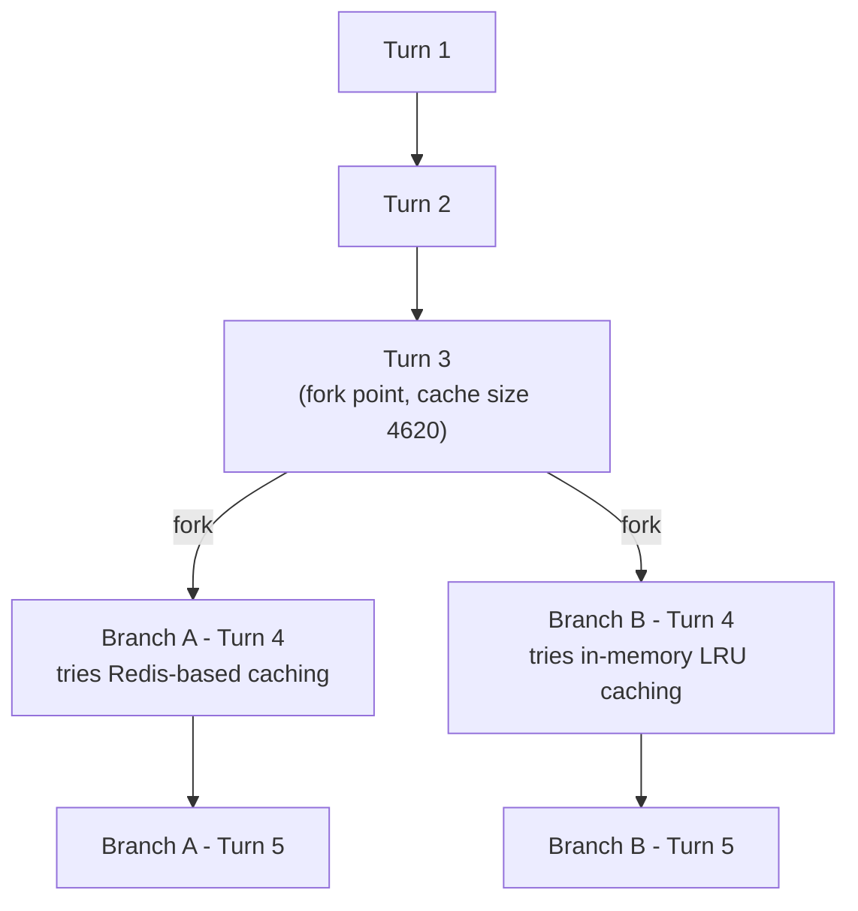

**Shared trunk** (both branches inherit this identically):

| Turn | What happens | Cache write | Cache read | Cache size after | Uncached input | Tool | Reasoning | Output text | **Turn total** | **Turn AI Credits** |
|---|---|---:|---:|---:|---:|---:|---:|---:|---:|---:|
| 1 | Normal turn; writes static prefix + own content | 3500 | 0 | 3500 | 500 | 0 | 150 | 150 | **4300** | **0.0289 AI Credits** |
| 2 | Normal turn; reads/extends the cache | 600 | 3500 | 4100 | 200 | 100 | 120 | 180 | **4700** | **0.0115 AI Credits** |
| 3 | Decides to compare two caching strategies; **forks here** | 520 | 4100 | 4620 | 220 | 0 | 140 | 160 | **5140** | **0.0109 AI Credits** |

AI Credits spent on the trunk so far: **0.0513** (paid once).

**Post-fork branches** (each turn 4 reads the *same* trunk cache — 4620 — independently):

| Branch / Turn | What happens | Cache write | Cache read | Cache size after | Uncached input | Tool | Reasoning | Output text | **Turn total** | **Turn AI Credits** |
|---|---|---:|---:|---:|---:|---:|---:|---:|---:|---:|
| A · 4 | Implements a Redis-based caching strategy | 1000 | 4620 | 5620 | 150 | 500 | 160 | 190 | **6620** | **0.0171 AI Credits** |
| A · 5 | Normal follow-up turn in branch A | 290 | 5620 | 5910 | 80 | 0 | 90 | 120 | **6200** | **0.0082 AI Credits** |
| B · 4 | Implements an in-memory LRU caching strategy | 1170 | 4620 | 5790 | 140 | 700 | 150 | 180 | **6960** | **0.0188 AI Credits** |
| B · 5 | Normal follow-up turn in branch B | 250 | 5790 | 6040 | 70 | 0 | 80 | 100 | **6290** | **0.0075 AI Credits** |

Branch A total: **0.0253 AI Credits** on top of the trunk (session A total: 0.0513 AI Credits + 0.0253 AI Credits
= **0.0766 AI Credits**). Branch B total: **0.0263 AI Credits** on top of the same trunk (session B
total: 0.0513 AI Credits + 0.0263 AI Credits = **0.0776 AI Credits**). Exploring *both* strategies this way
requires **0.0513 AI Credits + 0.0253 AI Credits + 0.0263 AI Credits = 0.1029 AI Credits** in total — the trunk is paid for
**once**, then reused as a cache hit by both branches.

Compare that to running two entirely separate sessions from scratch instead of
forking: each would have to rebuild the same trunk independently (2 × 0.0513 AI Credits =
0.1026 AI Credits) on top of its own branch spend (0.0253 AI Credits + 0.0263 AI Credits), for a total of
**0.1542 AI Credits** — about **0.0513 AI Credits more**, exactly one extra copy of the trunk. That
gap *is* the saving forking provides: shared setup gets paid for once and reused,
not re-purchased per branch.

---

## Scenario 9: Cache TTL — A 5+ Minute Smoke Break

> Extracted from [docs/agentic-coding-explained.md](../agentic-coding-explained.md#172-10-turn-example-a-5-minute-smoke-break-between-turns-7-and-8), Section 17.2.

The example below extends [Scenario 1](#scenario-1)'s style
to 10 turns, using the same illustrative rates (cache write 0.00625 AI Credits, cache read
0.0005 AI Credits, uncached input/tool 0.005 AI Credits, reasoning/output 0.015 AI Credits per 1K tokens).
Turns 1-7 happen back-to-back and build a healthy, growing cache. Then the user
steps away for a **5+ minute smoke break** before turn 8 — long enough to exceed
every provider's default TTL (Anthropic: 5 minutes; OpenAI: ~5-10 minutes
in-memory; see Section 17.1 of the main doc).

| Turn | What happens | Cache write | Cache read | Cache size after | Uncached input | Tool | Reasoning | Output text | **Turn total** | **Turn AI Credits** |
|---|---|---:|---:|---:|---:|---:|---:|---:|---:|---:|
| 1 | Normal turn; writes static prefix + own content | 3000 | 0 | 3000 | 400 | 0 | 0 | 200 | **3600** | **0.0238 AI Credits** |
| 2 | Normal turn; reads/extends the cache | 500 | 3000 | 3500 | 150 | 0 | 0 | 150 | **3800** | **0.0076 AI Credits** |
| 3 | Explores code with a couple of tool calls | 450 | 3500 | 3950 | 140 | 300 | 0 | 180 | **4570** | **0.0095 AI Credits** |
| 4 | Applies an edit, runs a quick check | 600 | 3950 | 4550 | 130 | 500 | 0 | 200 | **5380** | **0.0119 AI Credits** |
| 5 | Normal follow-up turn | 400 | 4550 | 4950 | 120 | 0 | 0 | 160 | **5230** | **0.0078 AI Credits** |
| 6 | Normal follow-up turn | 380 | 4950 | 5330 | 110 | 0 | 0 | 150 | **5590** | **0.0077 AI Credits** |
| 7 | Normal follow-up turn — cache is healthy (5750 tokens) | 420 | 5330 | 5750 | 130 | 0 | 0 | 170 | **6050** | **0.0085 AI Credits** |
| *(user steps away — smoke break, >5 minutes idle)* | | | | | | | | | | |
| 8 | **Cache miss**: every provider's TTL has lapsed; the full 5750-token history + new message must be resent as plain uncached input, and a brand-new cache entry is written from scratch | 6200 | 0 | 6200 | 5900 | 0 | 220 | 200 | **12520** | **0.0746 AI Credits** |
| 9 | Normal turn; new cache rebuilds from the post-break baseline | 430 | 6200 | 6630 | 120 | 0 | 0 | 150 | **6900** | **0.0086 AI Credits** |
| 10 | Normal turn | 300 | 6630 | 6930 | 90 | 0 | 0 | 120 | **7140** | **0.0074 AI Credits** |

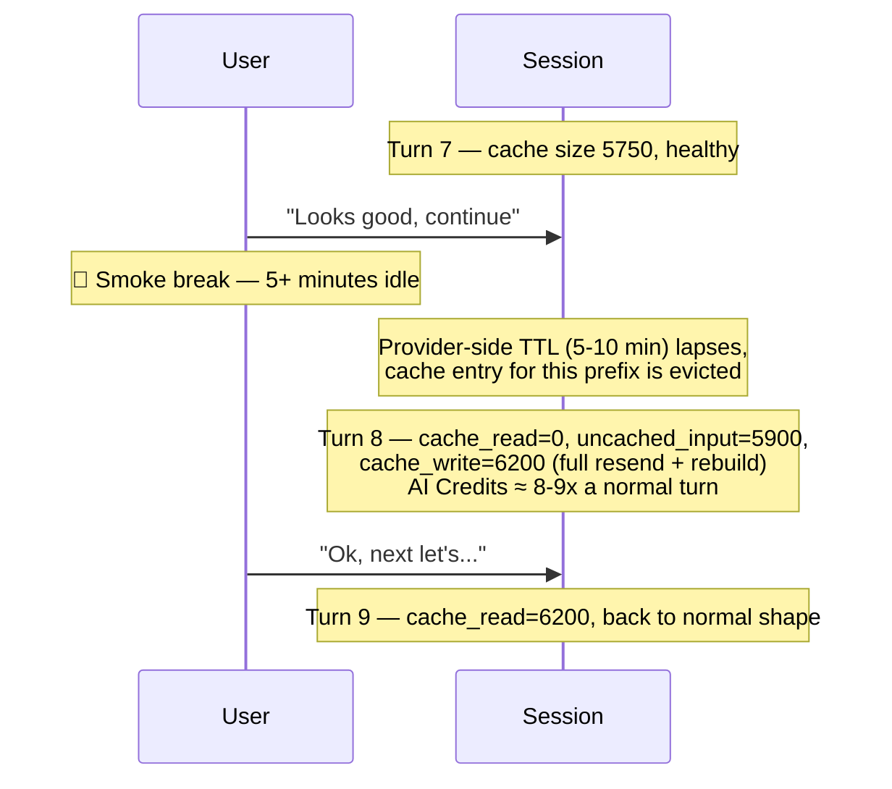

What the break actually costs in AI Credits: had the cache stayed warm, turn 8
would have looked like turn 7 — roughly 430 write / 5750 read / 130 uncached /
170 output, about **0.0088 AI Credits**. Instead it uses **0.0746 AI Credits**, about **8.5x** more —
roughly **0.066 AI Credits** in extra, avoidable spend for that one turn, purely because
the pause outlasted the TTL. Turns 9-10 recover completely normal cache-growth
behavior once the new cache has been (re-)written; the session total across
all 10 turns is about **0.167 AI Credits**.

Critically, **nothing about your conversation is lost** — this is not a
`/clear` ([Scenario 6](#scenario-6)) or a `/rewind` ([Scenario 7](#scenario-7)).
The full message history is still sent and still visible to the model; only the
*cache* for reusing that history cheaply has expired, so that one turn pays
full uncached-input price to "rehydrate" it. Every turn after that goes back to
normal cache-hit pricing.

---

## Scenario 10: Editing Custom Instructions Mid-Session

> Extracted from [docs/agentic-coding-explained.md](../agentic-coding-explained.md#4-prompt--file-caching-and-how-it-saves-ai-credits), Section 4.

Cache matching works on a **contiguous prefix starting at byte 0**, and the
system prompt/instructions sit at the very front of it. Editing
`copilot-instructions.md` (or an `AGENTS.md`-style file) mid-session means the
match breaks **right at the start** — so, even though the tool definitions and
every prior conversation turn are unchanged, none of them can match anymore
either, since prefix matching can't "skip over" the changed part and resume
later. The result is a **full cache miss**: the next turn resends everything
(new instructions + all prior history) uncached, then a brand-new cache builds
from scratch. This is the same *mechanism* as [Scenario 5](#scenario-5)'s
MCP-tool-change example, just triggered even earlier in the prefix — so in
practice it's total invalidation every time, not just a partial one.

| Turn | What happens | Cache write | Cache read | Cache size after | Uncached input | Tool | Reasoning | Output text | **Turn total** | **Turn AI Credits** |
|---|---|---:|---:|---:|---:|---:|---:|---:|---:|---:|
| 1 | Normal turn; writes static prefix + own content | 3500 | 0 | 3500 | 500 | 0 | 150 | 150 | **4300** | **0.0289 AI Credits** |
| 2 | Normal turn; reads/extends the cache | 600 | 3500 | 4100 | 200 | 100 | 120 | 180 | **4700** | **0.0115 AI Credits** |
| 3 | **`copilot-instructions.md` is edited mid-session**: the change sits at byte 0 of the prefix, so nothing before it can match either — a full cache miss, not a partial one | 4700 | 0 | 4700 | 4150 | 0 | 200 | 220 | **9270** | **0.0562 AI Credits** |
| 4 | Normal turn on the post-edit baseline; cache rebuilds under the updated instructions | 600 | 4700 | 5300 | 130 | 300 | 140 | 170 | **6040** | **0.0129 AI Credits** |
| 5 | Normal turn; no further disruption | 220 | 5300 | 5520 | 70 | 0 | 60 | 90 | **5740** | **0.0066 AI Credits** |

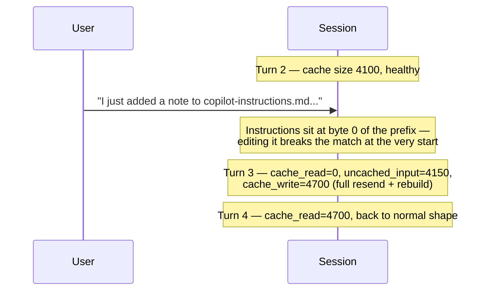

Turn 3 (**0.0562 AI Credits**) is roughly 5x turn 2's cost — comparable in
scale to an MCP tool change ([Scenario 5](#scenario-5)), but for a
subtly different reason: a tool change invalidates everything *after* the
tool-definitions block, while an instructions edit invalidates *everything*,
because nothing before the very front of the prefix exists to survive the
change. Turns 4-5 recover completely normal cache-growth behavior once the new
cache — now including the updated instructions — has been (re-)written.

---

## Scenario 11: A New File Type Silently Changes the Prompt

> Extracted from [docs/agentic-coding-explained.md](../agentic-coding-explained.md#4-prompt--file-caching-and-how-it-saves-ai-credits), Section 4.

Path-scoped `.instructions.md` files (`applyTo` globs) are included
**conditionally** — only when a turn actually touches a matching file — so
this layer can vary turn to turn rather than staying perfectly static. If
turns 1-2 never touch a matching file, that block isn't in the prompt at all;
the first turn that *does* touch one inserts it. If the client groups this
with the other stable instructions near the top of the prompt (the common
pattern), that insertion breaks the prefix match at that position, invalidating
everything cached after it — all prior conversation included — even though
none of that conversation actually changed.

This is a **silent** trigger: nothing about the user's message looks like a
deliberate config change (no explicit model/tool switch, no edited
instructions file), so an AI Credits spike from simply opening a new kind of
file can be genuinely surprising — and, unlike every other trigger in this
series, it carries **no trigger tag** in the turns table, since nothing about
the request itself was a recognized event.

| Turn | What happens | Cache write | Cache read | Cache size after | Uncached input | Tool | Reasoning | Output text | **Turn total** | **Turn AI Credits** |
|---|---|---:|---:|---:|---:|---:|---:|---:|---:|---:|
| 1 | Normal turn; writes static prefix + own content. No `.sql` files touched yet, so the path-scoped SQL instructions aren't loaded | 3500 | 0 | 3500 | 500 | 0 | 150 | 150 | **4300** | **0.0289 AI Credits** |
| 2 | Normal turn; reads/extends the cache. Still no `.sql` files touched | 600 | 3500 | 4100 | 200 | 100 | 120 | 180 | **4700** | **0.0115 AI Credits** |
| 3 | **First `.sql` file touched this session**: silently pulls in a path-scoped `applyTo: **/*.sql` instructions block grouped near the top of the prompt — invalidating everything cached after that position, with no visible trigger tag | 4700 | 0 | 4700 | 4200 | 150 | 210 | 200 | **9460** | **0.0573 AI Credits** |
| 4 | Normal turn under the newly-included SQL instructions block | 650 | 4700 | 5350 | 140 | 200 | 130 | 160 | **5980** | **0.0125 AI Credits** |
| 5 | Normal turn; no further disruption | 230 | 5350 | 5580 | 70 | 0 | 70 | 100 | **5820** | **0.0070 AI Credits** |

Turn 3's cost (**0.0573 AI Credits**, ~5x turn 2) is mechanically identical to
[Scenario 10](#scenario-10)'s deliberate instructions edit — same
prefix-insertion, same full-below invalidation — but nothing in the user's
message announced it. Compare this to [Scenario 5](#scenario-5)'s
explicit MCP tool change: that scenario at least *looks* like a config change
to the person reading the transcript. This one doesn't. The practical
takeaway (Section 17.4 of the main doc) is to keep an eye on which file types
pull in path-scoped instructions in a given project, since the first turn that
touches one will always pay this tax, whether or not anyone was expecting it.

---

## Scenario 12: Exploring Inline vs. Isolating in a Subagent

> Extracted from [docs/agentic-coding-explained.md](../agentic-coding-explained.md#9-worked-example-a-multi-turn-session-showing-every-token-type), Section 9 (subagent note), and [Section 7](../agentic-coding-explained.md#7-how-subagents-work-and-how-they-reduce-ai-credits-spend).

[Scenario 1](#scenario-1) and [Scenario 2](#scenario-2)
already show what happens when the turn-2 investigation runs in an isolated
subagent: the parent pays only a ~100-token summary, while the subagent's own
7,090-token trajectory (0.0338 AI Credits) stays off the parent's books
entirely. This scenario replays the same task, but has that same investigation
happen **inline** in the parent session instead — exactly the counterfactual
the main doc computes in its note on Section 9 ("If that exploration had
happened inline in parent turn 2 instead...").

| Turn | What happens | Cache write | Cache read | Cache size after | Uncached input | Vision | Tool | Reasoning | Output text | **Turn total** | **Turn AI Credits** |
|---|---|---:|---:|---:|---:|---:|---:|---:|---:|---:|---:|
| 1 | Explores repo (`read_file`/`grep_search`); writes static prefix + own content — identical to Scenario 1, turn 1 | 4500 | 0 | 4500 | 950 | 0 | 0 | 300 | 250 | **6000** | **0.0411 AI Credits** |
| 2 | **Investigates the bug inline** instead of spawning a subagent: the full ~7090-token search-and-read trajectory is written directly into the parent's own cache | 7090 | 4500 | 11590 | 300 | 700 | 0 | 200 | 180 | **12970** | **0.0573 AI Credits** |
| 3 | Implements the fix; cache read is now 11590, nearly double Scenario 1's 5980 at the same point | 1080 | 11590 | 12670 | 150 | 0 | 400 | 250 | 280 | **13750** | **0.0232 AI Credits** |
| 4 | Runs the (verbose) test suite; every turn from here on carries the extra ~5610 tokens turn 2 added | 2350 | 12670 | 15020 | 100 | 0 | 1800 | 150 | 300 | **17370** | **0.0373 AI Credits** |
| 5 | Final "thanks" message, no new tool calls | 180 | 15020 | 15200 | 60 | 0 | 0 | 30 | 90 | **15380** | **0.0105 AI Credits** |

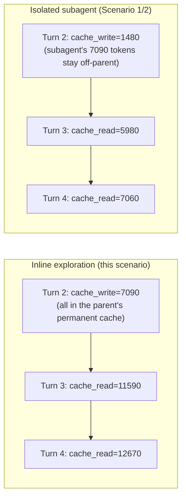

Turn 2 alone costs **0.0573 AI Credits** inline, versus **0.0227 AI Credits**
(parent) **+ 0.0338 AI Credits** (subagent, isolated) in Scenario 1/2 — a real,
already-billed 0.0338 AI Credits either way, but the isolated version's spend
is *bounded to that one call* while the inline version's spend becomes a
**permanent** part of the parent's cache. Every later turn's cache-read column
in this scenario runs meaningfully higher than the equivalent turn in Scenario
1 (11,590 vs 5,980 at turn 3; 12,670 vs 7,060 at turn 4) — the gap doesn't
shrink, because nothing ever compacts it away. Isolating exploratory work in a
subagent (Section 7) doesn't just avoid one large turn; it avoids a long tail
of inflated cache reads for the rest of the session.

---

## Scenario 13: Cache TTL — Surviving a Break with the 1-Hour Breakpoint

> Extracted from [docs/agentic-coding-explained.md](../agentic-coding-explained.md#171-how-long-does-the-cache-live-and-is-it-the-same-for-every-model), Section 17.1.

Anthropic's default cache lifetime is **5 minutes**, refreshed for free on
every cache hit — but a **1-hour TTL** is available as an explicit
breakpoint, at roughly **2x** the normal cache-write price. This scenario
replays [Scenario 9](#scenario-9)'s exact 10-turn arc and the
same 5+ minute smoke break between turns 7 and 8 — but this session pays the
1-hour-breakpoint premium on every cache write instead of the default rate.

| Turn | What happens | Cache write | Cache read | Cache size after | Uncached input | Tool | Output text | **Turn total** | **Turn AI Credits** |
|---|---|---:|---:|---:|---:|---:|---:|---:|---:|
| 1 | Normal turn; writes static prefix + own content (2x cache-write rate) | 3000 | 0 | 3000 | 400 | 0 | 200 | **3600** | **0.0425 AI Credits** |
| 2 | Normal turn; reads/extends the cache | 500 | 3000 | 3500 | 150 | 0 | 150 | **3800** | **0.0108 AI Credits** |
| 3 | Explores code with a couple of tool calls | 450 | 3500 | 3950 | 140 | 300 | 180 | **4570** | **0.0122 AI Credits** |
| 4 | Applies an edit, runs a quick check | 600 | 3950 | 4550 | 130 | 500 | 200 | **5380** | **0.0156 AI Credits** |
| 5 | Normal follow-up turn | 400 | 4550 | 4950 | 120 | 0 | 160 | **5230** | **0.0103 AI Credits** |
| 6 | Normal follow-up turn | 380 | 4950 | 5330 | 110 | 0 | 150 | **5590** | **0.0100 AI Credits** |
| 7 | Normal follow-up turn — cache is healthy (5750 tokens) | 420 | 5330 | 5750 | 130 | 0 | 170 | **6050** | **0.0111 AI Credits** |
| *(user steps away — smoke break, >5 minutes idle)* | | | | | | | | | |
| 8 | **No cache miss**: the 1-hour breakpoint bought on turn 1 comfortably outlasts the break — this turn behaves like any normal turn | 430 | 5750 | 6180 | 130 | 0 | 170 | **6480** | **0.0115 AI Credits** |
| 9 | Normal turn; cache keeps growing uninterrupted | 430 | 6180 | 6610 | 120 | 0 | 150 | **6880** | **0.0113 AI Credits** |
| 10 | Normal turn | 300 | 6610 | 6910 | 90 | 0 | 120 | **7120** | **0.0093 AI Credits** |

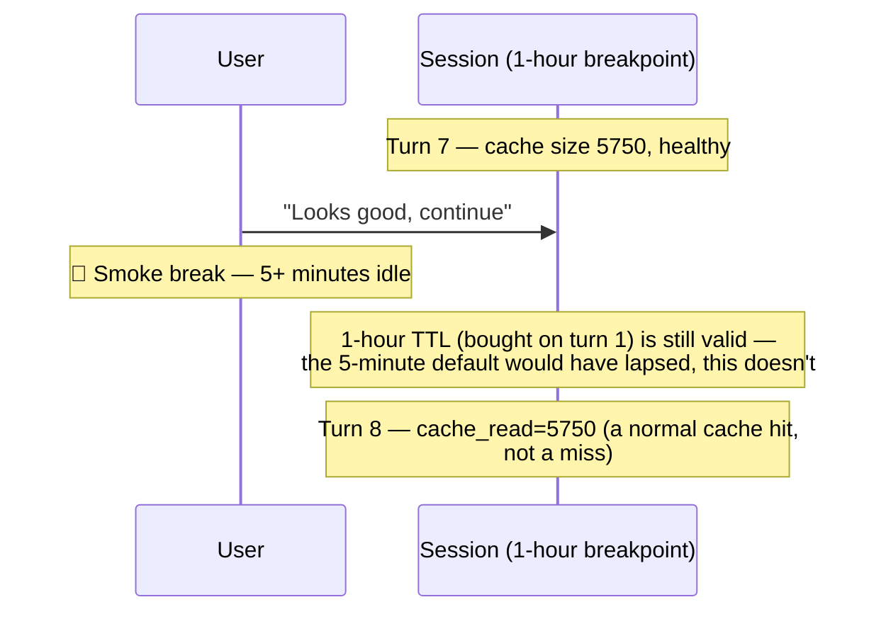

Compare turn 8 directly against [Scenario 9](#scenario-9)'s
turn 8: same break, same prior cache size, but the default-TTL version pays
**0.0746 AI Credits** for a full cache miss (~8.5x a normal turn) while this
session pays **0.0115 AI Credits** — a normal turn, full stop. The trade-off
is paid up front instead: every cache write here costs roughly 2x the default
rate (visible in every turn's slightly higher AI Credits than Scenario 9's
equivalent turn), so the 1-hour breakpoint isn't free insurance — it's a bet
that idle gaps longer than 5 minutes will happen often enough in this session
to be worth paying for on every turn, not just the one that would otherwise
have missed.

---

## Scenario 14: Cascading Triggers — A Model Switch Followed by a Cache-Expiry

> Extracted from [docs/agentic-coding-explained.md](../agentic-coding-explained.md#1712-combined-and-cascading-triggers-when-do-invalidations-stack), Section 17.12.

Sections 11-16 of the main doc each cover a single trigger in isolation — one
model switch, one TTL lapse, one fork. Real sessions don't always cooperate:
a model switch ([Scenario 4](#scenario-4)) can be followed, a couple of
turns later, by an idle gap that outlasts the *new* model's TTL
([Scenario 9](#scenario-9)'s trigger) — and the two don't just
add up, they compound, because the second miss re-pays the pricier post-switch
rates the first trigger already put in effect.

| Turn | Model | What happens | Cache write | Cache read | Cache size after | Uncached input | Tool | Reasoning | Output text | **Turn total** | **Turn AI Credits** |
|---|---|---|---:|---:|---:|---:|---:|---:|---:|---:|---:|
| 1 | A | Normal turn; writes static prefix + own content | 3500 | 0 | 3500 | 500 | 0 | 150 | 150 | **4300** | **0.0289 AI Credits** |
| 2 | A | Normal turn; reads/extends the cache | 600 | 3500 | 4100 | 200 | 0 | 120 | 180 | **4600** | **0.0110 AI Credits** |
| 3 | **B** | **Model switch**: A's 4100-token cache is worthless to B; the whole history + new message is resent uncached, and B writes its own first cache entry at its own, pricier rates | 4850 | 0 | 4850 | 4300 | 0 | 250 | 300 | **9700** | **0.1080 AI Credits** |
| 4 | B | Normal turn under B; the user then steps away for 5+ minutes | 470 | 4850 | 5320 | 120 | 300 | 150 | 200 | **6440** | **0.0243 AI Credits** |
| 5 | **B** | **Cache-expiry, cascading on the switch**: the idle gap exceeds B's TTL too; the entire post-switch history is evicted and resent uncached — at B's pricier rates, since the switch never reverted | 5900 | 0 | 5900 | 5380 | 0 | 200 | 180 | **11660** | **0.1242 AI Credits** |
| 6 | B | Cache finally recovers to normal healthy growth | 310 | 5900 | 6210 | 80 | 0 | 90 | 140 | **6520** | **0.0167 AI Credits** |

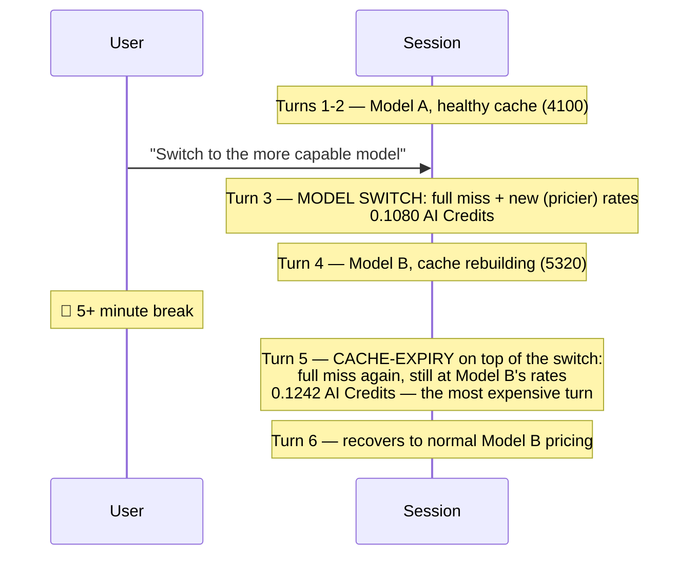

Turn 5 (**0.1242 AI Credits**) is the most expensive turn in the session —
more expensive even than the model-switch turn itself — because it pays both
the "no warm cache" tax *and* the "expensive model" tax at once. A
single-trigger session pays for exactly one of these; this session pays for
both, back to back, purely because the second trigger landed on top of state
the first one had already changed. The practical lesson (Section 17.4):
batching configuration decisions (model, tools, instructions) at the *start*
of a session and structuring long breaks around a single, deliberate
`/clear` or a fresh session avoids not just one invalidation, but the
compounding of several.

---

## Scenario 15: An Image Attachment Invalidates the Cache

> Extracted from [docs/agentic-coding-explained.md](../agentic-coding-explained.md#173-what-to-avoid-behaviors-and-technologies-that-invalidate-the-cache), Section 17.3.

Section 17.3 of the main doc flags "images appearing/disappearing anywhere in
the conversation" as one of several things "explicitly documented (by
Anthropic) as invalidating triggers, even though none of them feel like
'changing the setup.'" [Scenario 1](#scenario-1) already
shows a screenshot adding **vision tokens** to a turn — but that's only half
the story. Attaching (or removing) an image also changes the *shape* of the
message content at the point it's inserted, which breaks the prefix match
there, independent of how many vision tokens the image itself costs.

| Turn | What happens | Cache write | Cache read | Cache size after | Uncached input | Vision | Reasoning | Output text | **Turn total** | **Turn AI Credits** |
|---|---|---:|---:|---:|---:|---:|---:|---:|---:|---:|
| 1 | Normal turn; writes static prefix + own content. No image yet | 3500 | 0 | 3500 | 500 | 0 | 150 | 150 | **4300** | **0.0289 AI Credits** |
| 2 | Normal turn; reads/extends the cache | 600 | 3500 | 4100 | 200 | 0 | 120 | 180 | **4600** | **0.0110 AI Credits** |
| 3 | **First screenshot attached**: invalidates the prefix at the point of insertion, on top of its own 700 vision tokens | 4700 | 0 | 4700 | 4200 | 700 | 180 | 190 | **9970** | **0.0594 AI Credits** |
| 4 | Normal turn; the image is now baked into the cache like any other content | 220 | 4700 | 4920 | 70 | 0 | 60 | 90 | **5140** | **0.0063 AI Credits** |
| 5 | **Second screenshot attached, later in the session**: the same invalidation happens again — per-occurrence, not one-time | 5300 | 0 | 5300 | 5000 | 650 | 160 | 170 | **11280** | **0.0663 AI Credits** |

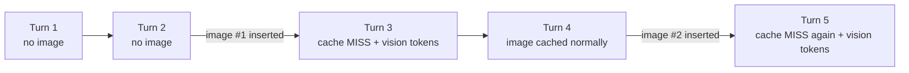

Both invalidating turns (3 and 5) cost roughly 5-6x a normal turn — not
because either screenshot is especially large, but because each one resets
the prefix match at the point it lands. A session that goes back and forth
attaching several screenshots over its lifetime (a common pattern when
iterating on UI bugs) pays this tax **every time**, not just on the first
attachment — worth knowing before assuming that only the first image in a
session is expensive.

---

## Scenario 16: Toggling Extended Thinking Mid-Session

> Extracted from [docs/agentic-coding-explained.md](../agentic-coding-explained.md#173-what-to-avoid-behaviors-and-technologies-that-invalidate-the-cache), Section 17.3.

Alongside images, Section 17.3 of the main doc lists "reasoning
effort/thinking-budget changes, web-search or citation toggles, `tool_choice`
changes" as settings that invalidate the cache purely by being rendered into
the request shape — even though flipping one mid-task doesn't feel like
reconfiguring anything. This scenario shows the extended-thinking budget being
turned on, used, and turned back off within a single session.

| Turn | What happens | Cache write | Cache read | Cache size after | Uncached input | Tool | Reasoning | Output text | **Turn total** | **Turn AI Credits** |
|---|---|---:|---:|---:|---:|---:|---:|---:|---:|---:|
| 1 | Normal turn; extended thinking off, reasoning at baseline | 3500 | 0 | 3500 | 500 | 0 | 150 | 150 | **4300** | **0.0289 AI Credits** |
| 2 | Normal turn; reads/extends the cache | 600 | 3500 | 4100 | 200 | 0 | 120 | 180 | **4600** | **0.0110 AI Credits** |
| 3 | **Extended thinking turned on**: the thinking-budget parameter changes the request shape, invalidating the cache; reasoning tokens jump sharply | 4650 | 0 | 4650 | 4150 | 0 | 900 | 250 | **9950** | **0.0671 AI Credits** |
| 4 | Normal turn under the new (elevated) reasoning budget | 700 | 4650 | 5350 | 130 | 200 | 400 | 220 | **6300** | **0.0177 AI Credits** |
| 5 | **Extended thinking turned back off**: the same invalidation happens again, in the other direction | 5800 | 0 | 5800 | 5420 | 0 | 100 | 120 | **11440** | **0.0667 AI Credits** |

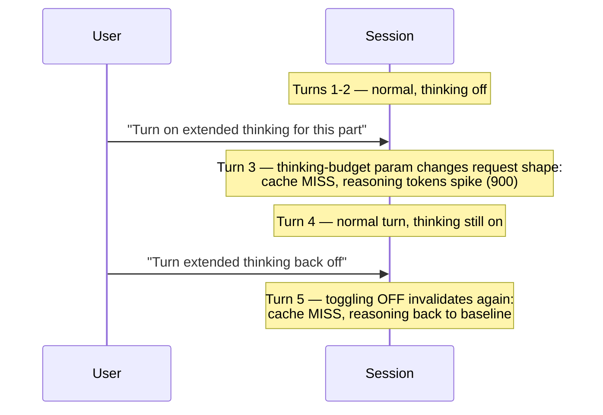

Both toggle turns (3 and 5) cost roughly 6x a normal turn — the setting
invalidates the cache in **either direction**, so switching it on and then off
again within one session pays the full-miss tax twice for what is, in terms
of net task complexity, a single "use more reasoning for the hard part" ask.
Per Section 17.4 of the main doc, this is squarely a "decide up front" setting
— enabling it before the session starts (or accepting the elevated reasoning
cost for the whole session) avoids paying the switch cost at all.

---

## Scenario 17: Forking Twice — A Nested Branch from Within a Branch

> Extracted from [docs/agentic-coding-explained.md](../agentic-coding-explained.md#16-how-session-forking-affects-tokens-cache-and-ai-credits), Section 16.

[Scenario 8](#scenario-8) shows a single fork producing two branches
from one trunk. Nothing about forking is limited to happening once, or to
happening only at the original trunk: **a branch can fork again**, and the
new fork point becomes its own shared trunk — the original trunk plus
everything that branch had already added — for a fresh pair of sub-branches.

| Turn | What happens | Cache write | Cache read | Cache size after | Uncached input | Tool | Reasoning | Output text | **Turn total** | **Turn AI Credits** |
|---|---|---:|---:|---:|---:|---:|---:|---:|---:|---:|
| 1 | Normal turn; writes static prefix + own content — the start of the shared trunk | 3500 | 0 | 3500 | 500 | 0 | 150 | 150 | **4300** | **0.0289 AI Credits** |
| 2 | Normal turn, still on the trunk | 600 | 3500 | 4100 | 200 | 100 | 120 | 180 | **4700** | **0.0115 AI Credits** |
| 3 | **First fork**: Branch A (Redis) and Branch B (in-memory LRU, not detailed here) both start from this 4620-token prefix | 520 | 4100 | 4620 | 220 | 0 | 140 | 160 | **5140** | **0.0109 AI Credits** |
| A · 4 | Branch A implements the Redis-based strategy, reading the shared trunk as a cache hit | 1000 | 4620 | 5620 | 150 | 500 | 160 | 190 | **6620** | **0.0171 AI Credits** |
| A · 5 | **Second fork, nested inside Branch A**: Branch A.1 (write-through) and A.2 (write-back, not detailed here) both start from this 6100-token prefix — the original trunk *plus* Branch A's own work | 480 | 5620 | 6100 | 140 | 0 | 130 | 150 | **6520** | **0.0107 AI Credits** |
| A.1 · 6 | Branch A.1 implements the write-through variant, reading the full nested trunk as a cache hit | 350 | 6100 | 6450 | 90 | 300 | 100 | 140 | **7080** | **0.0108 AI Credits** |

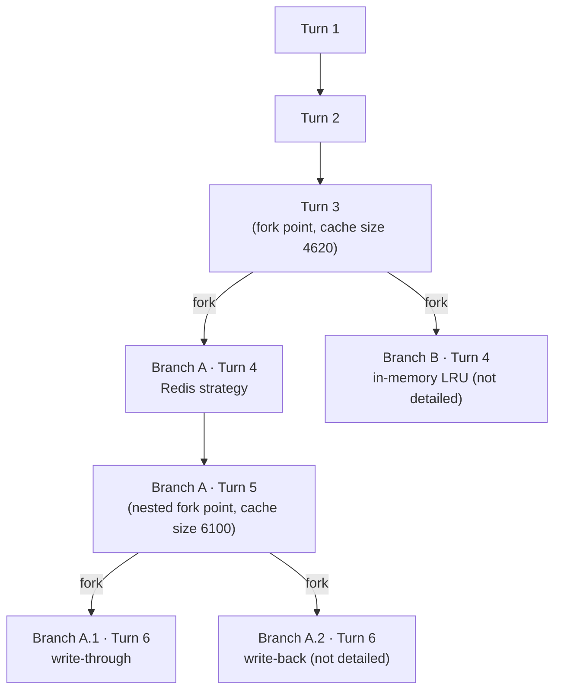

Branch A.1's full session cost through turn 6 is **0.0289 + 0.0115 + 0.0109 +
0.0171 + 0.0107 + 0.0108 = 0.0899 AI Credits** — it reuses the original trunk
once (paid at turns 1-3) *and* Branch A's own pre-fork work once (paid at turn
4), rather than paying for either a second time. Running three entirely
separate sessions from scratch for Branch B, Branch A.1, and Branch A.2 would
instead rebuild the original trunk three times and Branch A's own work twice.
Nesting a fork inside a fork compounds the saving [Scenario 8](#scenario-8)
already demonstrates at one level — it isn't a one-time discount, it's a
discount that applies again at every level a session chooses to branch
further.

---

## Scenario 18: A Subagent Running a Cheaper Model

> Extracted from [docs/agentic-coding-explained.md](../agentic-coding-explained.md#7-how-subagents-work-and-how-they-reduce-ai-credits-spend), Section 7.

Section 7 of the main doc notes that "subagents can also run with a
**different, cheaper model** suited to the narrower task... while the parent
session keeps using a more capable (and expensive) model only for the tasks
that truly need it." [Scenario 2](#scenario-2) shows a
subagent's isolation savings but keeps the same model as the parent
throughout. This scenario makes the model difference explicit: the parent
runs `model-b` (capable, expensive); a narrow, mechanical search-and-summarize
subagent task runs on `model-a` (cheaper, faster) instead.

| Subagent turn | What it does | Cache write | Cache read | Cache size after | Uncached input | Tool | Reasoning | Output text | **Turn total** | **Turn AI Credits** |
|---|---|---:|---:|---:|---:|---:|---:|---:|---:|---:|
| 1 | Searches the codebase (`grep_search`) for every call site of a deprecated helper, on `model-a` | 1200 | 0 | 1200 | 250 | 500 | 150 | 110 | **2210** | **0.0152 AI Credits** |
| 2 | Reads the matched files in full to check each call site's arguments | 300 | 1200 | 1500 | 100 | 700 | 120 | 90 | **2510** | **0.0094 AI Credits** |
| 3 | Synthesizes the compact summary returned to the parent | 150 | 1500 | 1650 | 50 | 0 | 80 | 160 | **1940** | **0.0055 AI Credits** |
| **Subagent session total** | | **1650** | **2700** | — | **400** | **1200** | **350** | **360** | **6660** | **0.0301 AI Credits** |

This subagent's total (**0.0301 AI Credits**) is cheap for two independent
reasons that compound: it's isolated (per Section 7, none of its 6,660
internal tokens ever touch the parent's cache — the parent only pays for the
~100-token compact summary), *and* it runs on a model priced for a narrow,
mechanical task rather than the parent's more capable, pricier `model-b`. If
this same exploration had instead run inline in the parent session under
`model-b`'s rates — the counterfactual [Scenario 12](#scenario-12)
computes directly — the equivalent work would cost several times more, on top
of permanently bloating the parent's cache. Choosing a subagent's model
independently of the parent's is a lever [Scenario 2](#scenario-2)
doesn't exercise but Section 7 explicitly calls out as available.

---

Source material: [agentic-coding-explained.md](../agentic-coding-explained.md).
Scenario index: [README.md](README.md). These scenarios also back the JSON
fixtures the app actually serves, in
[`packages/server/fixtures/learn-scenarios/`](../../packages/server/fixtures/learn-scenarios/).
