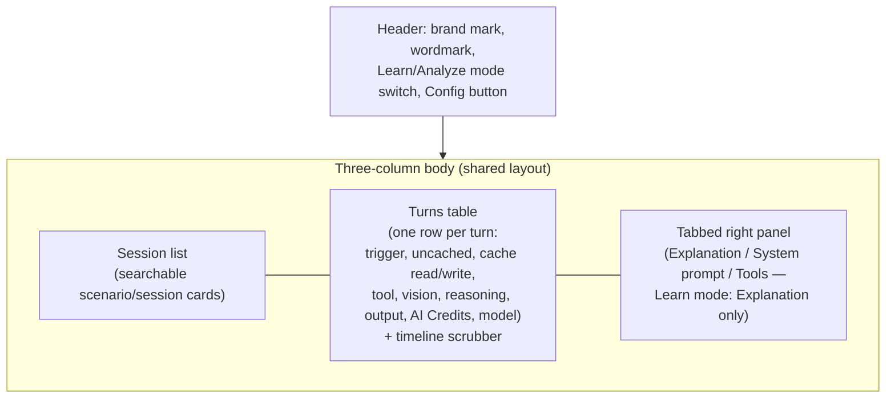

# Vision: GitHub Copilot Chat Session Analyser

## 1. Problem

Agentic coding sessions (VS Code GitHub Copilot Chat, Claude Code, and similar
tools) hide their cost mechanics behind the scenes: prompt caching, token
accounting, tool calls, and context management all happen invisibly while you
work. Developers using these tools rarely see *why* a session got expensive,
*which* turn caused a cache miss, or *how* their system prompt and tool
definitions are actually spent as tokens. Without that visibility, it's hard
to build the intuition needed to use agentic coding tools efficiently.

## 2. Goal

Build an app that visualizes coding-agent sessions — turns, tool calls, cache
behavior, and token/AI Credits accounting — so users can:

- **Learn** the underlying concepts (sessions, turns, caching, token types)
  through guided, interactive scenarios.
- **Analyze** their own real coding-agent logs, including VS Code Copilot Chat
  sessions and mitmproxy captures of LLM-provider traffic, to see exactly
  where tokens and AI Credits went, turn by turn.

The end goal is to help developers use agentic coding tools more effectively
and reduce the cost of AI-assisted development.

## 3. Product concept: two modes, one interface

The app has two modes that share the same visual language, so skills learned
in one transfer directly to the other.

### 3.1 Learn mode (educational)

An interactive walkthrough of session/turn scenarios covering the concepts in
[agentic-coding-explained.md](agentic-coding-explained.md) (prompt caching,
token types, subagents, compaction, model/tool switching, `/clear`,
`/rewind`, forking, cache TTLs, etc.). The document is only the **starting
point**: its worked examples seed the first set of scenarios, but Learn mode
isn't limited to reproducing them verbatim — it can add more advanced or
realistic scenarios (longer sessions, combined triggers, edge cases the doc
doesn't cover) as long as they stay consistent with the same underlying
mechanics.

- **Turns table (left panel)**: one row per turn, in chronological order,
  matching the tables in the reference document (cache write/read, uncached
  input, tool, vision, reasoning, output tokens, and AI Credits per turn).
- **Explanation panel (right panel)**: for the turn currently selected,
  explains in plain language what happened and why — e.g. "this turn switched
  models, so the prior 4,100-token cache became worthless and was resent as
  uncached input."
- **Timeline scrubber (bottom)**: a horizontal slider to move back and forth
  through the turns of the scenario, updating both panels in sync. Useful for
  comparing "before" and "after" a triggering event (a model switch, a
  compaction, an idle-time cache miss, etc.).

### 3.2 Analyze mode (real sessions)

The same left/right/scrubber layout, but backed by a real session instead of
a scripted scenario — select an available log provider, load one of its
sessions, and see the same breakdown for what actually happened. The Analyze
header lists available providers and lets the user set the active one; the
session list, endpoints, and rendering stay provider-neutral.

In addition to the shared layout, Analyze mode adds:

- **System prompt breakdown**: what makes up the system prompt for the
  loaded session (built-in agent instructions, repo custom instructions,
  active `.instructions.md` files, skill manifests, tool/MCP definitions) and
  how many tokens each component contributes.
- **Tools: loaded vs. used**: the full list of tools available to the
  session, cross-referenced against which ones were actually invoked, so
  unused tool definitions (pure token overhead) are easy to spot.
- **Per-turn detail**: for the selected turn, which tools were called, and
  which files (or file ranges) were added to the prompt — each with its own
  token count — so it's clear exactly what made that turn expensive.

### 3.3 Shared layout

Applies to both modes identically; Analyze mode additionally tabs the right
panel between Explanation, System prompt breakdown, and Tool inventory.
Visual treatment (the "Industry" design system — hairline-bordered
"blueprint" cards, steel-blue mono accent, square corners) is specified in
`docs/implementation-plan.md`'s Phase 8.

## 4. Data sources for Analyze mode

**Decision**: the app only reads data already stored on the local machine.
Its initial providers are the VS Code local SQLite/debug-log pair and local
mitmproxy captures. It never depends on the cloud-synced store, so it works
fully offline and requires no `chat.sessionSync.enabled` opt-in.

Per [agentic-coding-explained.md §18](agentic-coding-explained.md#18-where-to-find-the-logs-data-sources-for-token-cache-and-ai-credits-analysis),
the in-scope sources are:

| Source | Gives us | Caveat |
|---|---|---|
| Local SQLite session store | Turns, files touched, checkpoints (compaction events), session metadata; fast, structured, easy to query | No per-request token counts |
| Raw per-session debug logs (`main.jsonl` text files under `workspaceStorage/.../debug-logs/<session-id>/`) | Ground-truth append-only event stream the SQLite store is derived from — request/response spans carry the actual token-usage `attrs` that the local SQLite indexer doesn't persist | Verbose; undocumented `attrs` shape per event `type`, so parsing needs to be defensive/version-tolerant |
| Local mitmproxy capture | Request/response exchanges between VS Code and LLM providers, including token/usage fields exposed by the provider | Capture format and payload shape vary by provider SDK; separate vendor decoders are required for Anthropic, OpenAI, and later vendors |

Each source is a log provider that converts its records into the same
normalized session/turn model before the API returns them. A provider's
capture discovery, parsing, and vendor decoder details are isolated behind
that boundary: adding a provider or decoder must not require a source-specific
API endpoint or UI panel. mitmproxy uses a decoder registry because Anthropic
and OpenAI SDK traffic have distinct wire formats. The UI receives a generic
list of available providers and can set the active provider; it continues to
render the selected provider's sessions through the shared Analyze layout.

Since §18.3 notes the SQLite store and the cloud store are *both* built from
`main.jsonl`, real per-turn token/cache numbers (Section 6 of the reference
doc: cache write/read, uncached input, tool, vision, reasoning, output) should
be obtainable by parsing `main.jsonl` directly — the same ground truth the
cloud indexer uses — without ever syncing anything off the machine. Analyze
mode should treat local SQLite as the primary index for turn/session
structure and enrich each turn by joining in the matching `main.jsonl` spans
for token/AI Credit detail. If a session's `attrs` don't carry usage data (older
log format, incomplete session, or detailed logging wasn't enabled when the
session ran — see below), fall back to the behavioral proxies already
available in SQLite (turn counts, duration, repeated file reads, checkpoint
timing) and say explicitly that per-token figures are unavailable rather than
showing zeros or estimates.

**Verified prerequisite (checked directly against this machine's logs):**
by default, `main.jsonl` only ever contains a single `session_start` event —
no request/tool/usage spans at all — regardless of how many turns a session
had. Writing the richer spans requires an off-by-default, advanced VS Code
setting, `github.copilot.chat.agentDebugLog.fileLogging.enabled`, which also
requires a window reload to take effect once toggled. Practically, this
means the rich-data path isn't a rare edge case to fall back away from — for
any session recorded before a user enables that setting, it *is* the only
case. Analyze mode should therefore detect this directly (does this
session's `main.jsonl` contain anything beyond `session_start`?) and, when
it doesn't, tell the user explicitly how to enable
`github.copilot.chat.agentDebugLog.fileLogging.enabled` (and reload VS Code)
so *future* sessions carry real token/cache data — rather than only ever
showing the behavioral-proxy fallback silently.

## 5. Technical notes

- **Delivery**: a web app, run locally on a single developer's own machine —
  not a hosted or multi-tenant service. Since the data sources in Section 4
  are local files (SQLite database, `main.jsonl` text logs), the app needs a
  small local process to read them and serve their contents to the UI; the
  browser layer itself can't reach arbitrary local files directly.
- **Visualization**: the turns table, timeline scrubber, and token/AI Credits
  charts can be built with JS visualization libraries such as D3.js or
  similar — no specific library is mandated yet.
- **Future path**: the app may later be repackaged as a shared VS Code
  extension (e.g. a webview). To keep that option open cheaply, the
  visualization layer should stay decoupled from the local data-loading layer
  (SQLite/`main.jsonl` access) so it can be swapped for the extension's own
  data access without rewriting the UI.

## 6. Non-goals

- Not a replacement for the `/chronicle` skill's standup/search features —
  this app is about visual, turn-by-turn exploration of cache/token/AI Credits
  mechanics, not activity reporting.
- Not scoped to editing or replaying sessions (no `/rewind`-style mutation of
  real logs) — it's a read-only viewer/analyzer.
- No dependency on the cloud-synced (DuckDB) store — the app only reads local
  sources through configured log providers (initially VS Code SQLite/
  `main.jsonl` and mitmproxy captures), by design.
- Not a hosted/multi-user product for now — scoped to a single developer's
  own machine and own local logs.

## 7. Open questions

- `main.jsonl`'s `attrs` schema is undocumented and varies by event `type` —
  what's the most robust way to locate and parse the token-usage fields
  within it across model/provider versions?
- Beyond the scenarios seeded from
  [agentic-coding-explained.md](agentic-coding-explained.md), which additional
  advanced scenarios are most valuable to build (e.g. combined/cascading
  triggers, multi-hour sessions, provider-specific cache quirks), and how do
  we keep the seeded ones from drifting out of sync with the document as it
  evolves?

